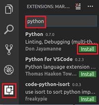
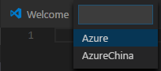
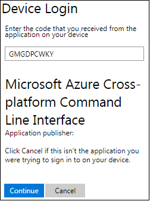
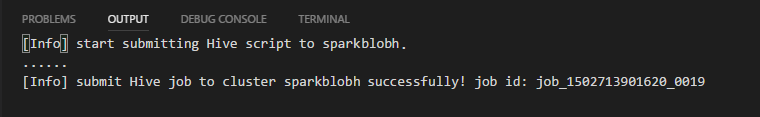

# Use the Azure Data Lake Tools for Visual Studio Code

Learn how to use the Azure HDInsight Tools for Visual Studio Code (VSCode) to create, submit hive scripts or Python scripts.

## Prerequisites

The Azure HDInsight Tools can be installed on the platforms supported by VSCode that include Windows, Linux, and MacOS. You can find the prerequisites for different platforms

- Windows

    - [Visual Studio Code]( https://www.visualstudio.com/products/code-vs.aspx).
    
- Linux (We recommend Ubuntu 14.04 LTS)

    - [Visual Studio Code]( https://www.visualstudio.com/products/code-vs.aspx). Use the following command to install:

        sudo dpkg -i code_<version_number>_amd64.deb

    - [Mono 4.2.x](http://www.mono-project.com/docs/getting-started/install/linux/). 

        - Update the deb package source by executing following commands:

                sudo apt-key adv --keyserver hkp://keyserver.ubuntu.com:80 --recv-keys 3FA7E0328081BFF6A14DA29AA6A19B38D3D831EF
                echo "deb http://download.mono-project.com/repo/debian wheezy/snapshots 4.2.4.4/main" | sudo tee /etc/apt/sources.list.d/mono-xamarin.list
                sudo apt-get update

        - Install mono by running the command:

                sudo apt-get install mono-complete

		    > [!NOTE] 
            > Mono 4.6 is not supported.  You need to uninstall version 4.6 entirely before installing 4.2.x.  

- MacOS

    - [Visual Studio Code]( https://www.visualstudio.com/products/code-vs.aspx).
    - [Mono 4.2.4](http://download.mono-project.com/archive/4.2.4/macos-10-x86/).

## Install the HDInsight Tools

After you have installed the prerequisites, you can install the Python and Azure HDInsight Tools for VSCode.

**To install the Python and HDInsight Tools**

Install **Azure HDInsight tools**

1. Open **Visual Studio Code**.
2. Click **Extensions** in the left pane. Enter **Azure HDInsight tools** in the search box. You can see Azure HDInsight tools listed.
3. Click **Install** next to **Azure HDInsight tools**. After a few seconds, the **Install** button will be changed to **Reload**.
4. Click **Reload** to activate the **Azure HDInsight tools** extension.
5. Click **Reload Window** to confirm. You can see **Azure HDInsight tools** in the Extensions pane.

   

Install **Python 0.7.0**

1. Open **Visual Studio Code**.
2. Click **Extensions** in the left pane. Enter **python** in the search box. You can see a list of python extensions. One of them is **Python 0.7.0**.
3. Click **Install** next to **Python 0.7.0**. After a few seconds, the **Install** button will be changed to **Reload**.
4. Click **Reload** to activate the **Python 0.7.0** extension.
5. Click **Reload Window** to confirm. You can see **Python 0.7.0** in the Extensions pane.

     

## Activate Azure Data Lake Tools
Create a new .hql, .hive, .py file or open an existing .hql, .hive, .py file to activate the extension. 

## Connect to Azure

Before you can submit scripts to cluster, you must connect to your Azure account.

**To connect to Azure**

1.	Open the command palette by pressing **CTRL+SHIFT+P**. 
2.  Enter **HDInsight: Login**. There are two options to Login. The Login info is shown in the output pane.

    
    
    - Azure:
    
    - AzureChina:
    
     
3. CTRL-click login URL: https://aka.ms/devicelogin or https://aka.ms/deviceloginchina  to open the login web page. Copy and paste the corresponding code  into the text box below, click Continue.

      
4.  Follow the instructions to sign in from the web page. Once connected, your Azure account name is shown on the status bar at the left-bottom of the VSCode window. 

    > [!NOTE] 
    > If your account has two factors enabled, it is recommended to use phone authentication instead of Pin.

To sign off, use the command **HDInsight: Logout**
 
## Work with HDInsight project

You need open either a Hive file, a PySpark file, or a folder to work with project.

**To open a folder for your HDInsight project**

1. From Visual Studio Code, Click the **File** menu, and then click **Open Folder**.
2. Specify or Create a new folder, and then click **Select Folder**.
3. Click the **File** menu, and then click **New File**. An **Untilted-1** file is shown in the right pane.
4. Save the file as .hql or .py in the opened folder. Notice an **XXXX_hdi_settings.json** configuration file is also added to the project.
5. Open **XXXX_hdi_settings.json** from **EXPLORER**, or right-click on script editor to select **Set Configuration**. You can configure login entry, default cluster, and job submission parameters, according to the sample in the file. You also can leave the remaining parameters empty.

**To submit Hive Script**
1. New a file in your current folder and named **xxx.hql**.
2. Copy and paste the following code into **xxx.hql**, then save it.

        SELECT * FROM hivesampletable;

3. Open the command palette by pressing **CTRL+SHIFT+P**. 
4. Enter **HDInsight: Submit Hive Script**.  You can also right-click a hive script editor, and then click **HDInsight: Submit Hive Script** to submit a hive job.
5. Select a cluster to submit your Hive Script. And Make sure the hivesampletable is already existed in your cluster.  

After submitting a hive job, the submission success info and jobid is shown in **OUTPUT** panel. And it opens **WEB BROWSER** which the job real-time logs and status shown in.

**To submit PySpark Job**
1. New a file in your current folder and named **xxx.py**.
2. Copy and paste the following code into **xxx.py**, then save it.

        from __future__ import print_function
        import sys
        from operator import add
        from pyspark.sql import SparkSession
        if __name__ == "__main__":
            spark = SparkSession\
                .builder\
                .appName("PythonWordCount")\
                .getOrCreate()

            lines = spark.read.text('test.csv').rdd.map(lambda r: r[0])
            counts = lines.flatMap(lambda x: x.split(' '))\
                        .map(lambda x: (x, 1))\
                        .reduceByKey(add)
            output = counts.collect()
            for (word, count) in output:
                print("%s: %i" % (word, count))
            spark.stop()

Make sure the test.csv is already existed in your container.

3. Open the command palette by pressing **CTRL+SHIFT+P**. 
4. Enter **HDInsight: Submit PySpark Job**. You can also right-click a python script editor, and then click **HDInsight: Submit PySpark Job** to submit a PySpark job.
5. Select a cluster to submit your PySpark job. 

 

After submitting a python job, submission logs is shown in **OUTPUT** window in VSCode. The **Spark UI URL** and **Yarn UI URL** are shown as well. You can open the URL in a web browser to track real-time job status.

## List HDInsight clusters

To test the connection, you can list your HDInsight clusters:

**To list HDInsight cluster under your Azure subscription**

1. Open the command palette by pressing **CTRL+SHIFT+P**.
2. Enter **HDInsight: List Cluster**, or right-click on script editor to select **List Cluster**. The hive and spark clusters appear in the **Output** pane.

    

## Set Default Cluster
1. Open the command palette by pressing **CTRL+SHIFT+P**.
2. Enter **HDInsight: Set Default Cluster**, or right-click on script editor to select **Set Default Cluster**.
3. Select a cluster as default cluster for the current script file. 
4. Meanwhile, our tool already saved what you selected default clusters into **XXXX_hdi_settings.json**. Of course, You also directly update it in this configuration file. 
   
   

## Set Azure Environment 
1. Open the command palette by pressing **CTRL+SHIFT+P**.
2. Enter **HDInsight: Set Azure Environment**.
3. Select one way from Azure and AzureChina as your default login entry.
4. Meanwhile, our tool already saved what you selected default login entry into **XXXX_hdi_settings.json**. Of course, You also directly update it in this configuration file. 

   

## Additional features

The Data Lake Tools for VSCode supports the following features:

-	IntelliSense auto-complete. Suggestions are popped up around keyword, method, variables, etc. Different icons represent different types of the objects:

-	IntelliSense error marker. The Data Lake Tools underline the editing errors for hive script.     
-	Syntax highlights. The Data Lake Tools use different color to differentiate variables, keywords, data type, functions, etc. 

## See also
* [Overview: Apache Spark on Azure HDInsight](hdinsight-apache-spark-overview.md)

### Demo
* Create Scala Project (Video): [Create Spark Scala Applications](https://channel9.msdn.com/Series/AzureDataLake/Create-Spark-Applications-with-the-Azure-Toolkit-for-IntelliJ)
* Remote Debug (Video): [Use Azure Toolkit for IntelliJ to debug Spark applications remotely on HDInsight Cluster](https://channel9.msdn.com/Series/AzureDataLake/Debug-HDInsight-Spark-Applications-with-Azure-Toolkit-for-IntelliJ)

### Scenarios
* [Spark with BI: Perform interactive data analysis using Spark in HDInsight with BI tools](hdinsight-apache-spark-use-bi-tools.md)
* [Spark with Machine Learning: Use Spark in HDInsight for analyzing building temperature using HVAC data](hdinsight-apache-spark-ipython-notebook-machine-learning.md)
* [Spark with Machine Learning: Use Spark in HDInsight to predict food inspection results](hdinsight-apache-spark-machine-learning-mllib-ipython.md)
* [Spark Streaming: Use Spark in HDInsight for building real-time streaming applications](hdinsight-apache-spark-eventhub-streaming.md)
* [Website log analysis using Spark in HDInsight](hdinsight-apache-spark-custom-library-website-log-analysis.md)

### Creating and running applications
* [Create a standalone application using Scala](hdinsight-apache-spark-create-standalone-application.md)
* [Run jobs remotely on a Spark cluster using Livy](hdinsight-apache-spark-livy-rest-interface.md)

### Tools and extensions
* [Use Azure Toolkit for IntelliJ to debug Spark applications remotely through VPN](hdinsight-apache-spark-intellij-tool-plugin-debug-jobs-remotely.md)
* [Use Azure Toolkit for IntelliJ to debug Spark applications remotely through SSH](hdinsight-apache-spark-intellij-tool-debug-remotely-through-ssh.md)
* [Use HDInsight Tools for IntelliJ with Hortonworks Sandbox](hdinsight-tools-for-intellij-with-hortonworks-sandbox.md)
* [Use HDInsight Tools in Azure Toolkit for Eclipse to create Spark applications](hdinsight-apache-spark-eclipse-tool-plugin.md)
* [Use Zeppelin notebooks with a Spark cluster on HDInsight](hdinsight-apache-spark-zeppelin-notebook.md)
* [Kernels available for Jupyter notebook in Spark cluster for HDInsight](hdinsight-apache-spark-jupyter-notebook-kernels.md)
* [Use external packages with Jupyter notebooks](hdinsight-apache-spark-jupyter-notebook-use-external-packages.md)
* [Install Jupyter on your computer and connect to an HDInsight Spark cluster](hdinsight-apache-spark-jupyter-notebook-install-locally.md)

### Managing resources
* [Manage resources for the Apache Spark cluster in Azure HDInsight](hdinsight-apache-spark-resource-manager.md)
* [Track and debug jobs running on an Apache Spark cluster in HDInsight](hdinsight-apache-spark-job-debugging.md)

