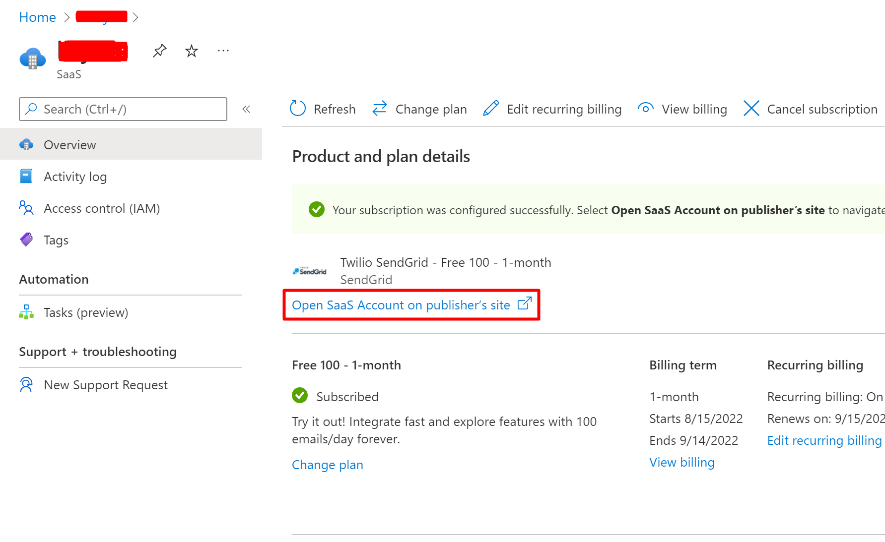
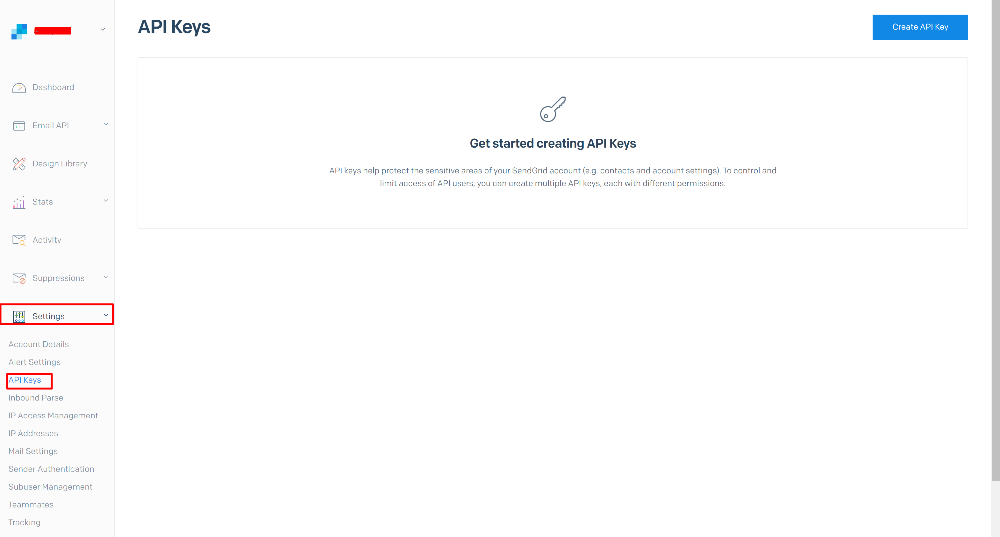
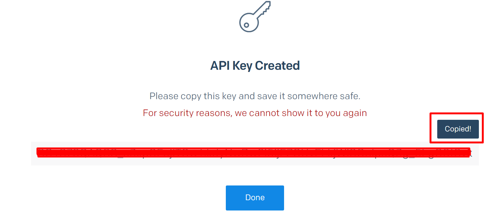
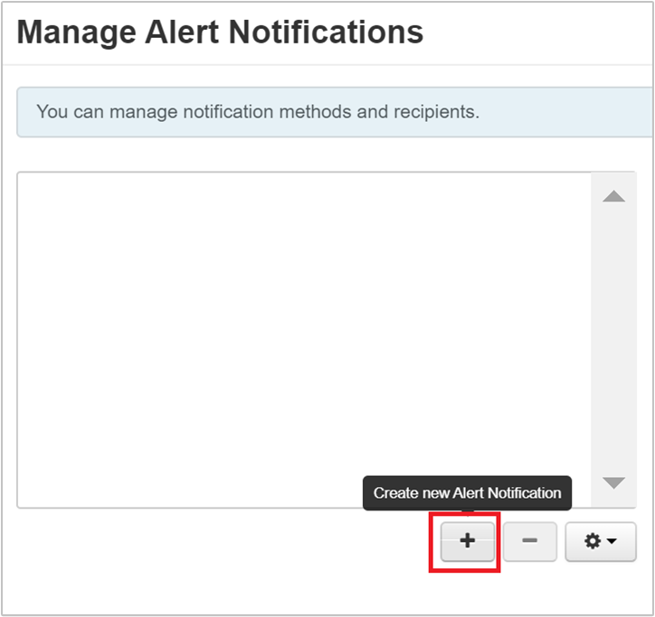
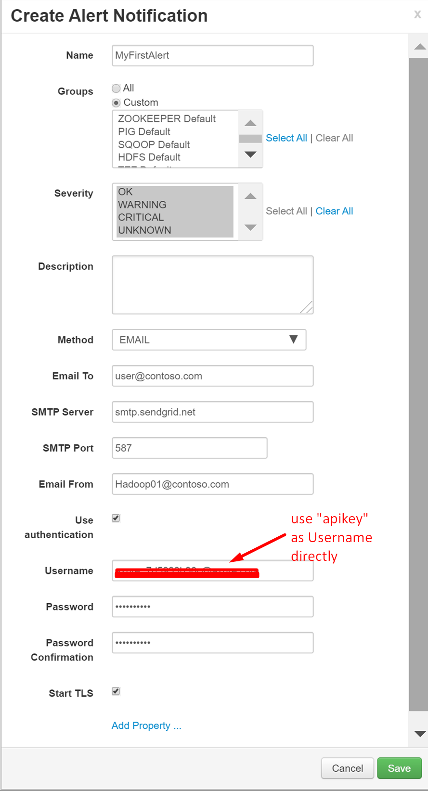

# Tutorial: Configure Apache Ambari email notifications in Azure HDInsight

In this tutorial, you'll configure Apache Ambari email notifications using SendGrid. [Apache Ambari](./hdinsight-hadoop-manage-ambari.md) simplifies the management and monitoring of an HDInsight cluster by providing an easy to use web UI and REST API. Ambari is included on HDInsight clusters, and is used to monitor the cluster and make configuration changes. [SendGrid](https://sendgrid.com/solutions/) is a free cloud-based email service that provides reliable transactional email delivery, scalability, and real-time analytics along with flexible APIs that make custom integration easy. Azure customers can unlock 25,000 free emails each month.

In this tutorial, you learn how to:

> [!div class="checklist"]
> * Obtain Sendgrid Username
> * Configure Apache Ambari email notifications

## Prerequisites

* A SendGrid email account. See [How to Send Email Using SendGrid with Azure](https://docs.microsoft.com/azure/sendgrid-dotnet-how-to-send-email) for instructions.

* An HDInsight cluster. See [Create Apache Hadoop clusters using the Azure portal](./hdinsight-hadoop-create-linux-clusters-portal.md).

## Obtain SendGrid Username

1. From the [Azure portal](https://portal.azure.com), navigate to your SendGrid resource.

1. From the Overview page, select **Manage**, to go the SendGrid webpage for your account.

    

1. From the left menu, navigate to your account name and then **Account Details**.

    

1. From the **Account Details** page, record the **Username**.

    

## Configure Ambari e-mail notification

1. From a web browser, navigate to `https://CLUSTERNAME.azurehdinsight.net/#/main/alerts`, where `CLUSTERNAME` is the name of your cluster.

1. From the **Actions** drop-down list, select **Manage Notifications**.

1. From the **Manage Alert Notifications** window, select the **+** icon.

    

1. From the **Create Alert Notification** dialog, provide the following information:

    |Property |Description |
    |---|---|
    |Name|Provide a name for the notification.|
    |Groups|Configure as desired.|
    |Severity|Configure as desired.|
    |Description|Optional.|
    |Method|Leave at **EMAIL**.|
    |Email To|Provide e-mail(s) to receive notifications, separated by a comma.|
    |SMTP Server|`smtp.sendgrid.net`|
    |SMTP Port|25 or 587 (for unencrypted/TLS connections).|
    |Email From|Provide an email address. The address doesn't need to be authentic.|
    |Use authentication|Select this check box.|
    |Username|Provide the SendGrid username.|
    |Password|Provide the password you used when you created the SendGrid resource in Azure.|
    |Password Confirmation|Reenter password.|
    |Start TLS|Select this check box|

    

    Select **Save**. You'll return to the **Manage Alert Notifications** window.

1. From the **Manage Alert Notifications** window, select **Close**.

## Next steps

In this tutorial, you learned how to configure Apache Ambari email notifications using SendGrid. Use the following to learn more about Apache Ambari:

* [Manage HDInsight clusters by using the Apache Ambari Web UI](./hdinsight-hadoop-manage-ambari.md)

* [Create an alert notification](https://docs.cloudera.com/HDPDocuments/Ambari-latest/managing-and-monitoring-ambari/content/amb_create_an_alert_notification.html)
