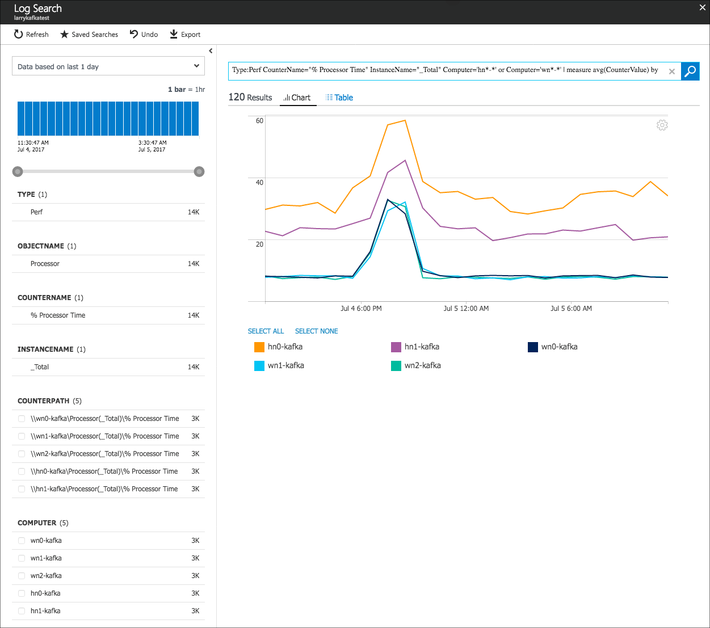

# Analyze logs for Apache Kafka (preview) on HDInsight

Learn how to use Microsoft Operations Management Suite to analyze logs generated by Apache Kafka on HDInsight.

## Enable OMS for Kafka

The steps to enable Log Analytics for HDInsight are the same for all HDInsight clusters. Use the following links to understand how to create and configure the required services:

1. Create a Log Analytics workspace. For more information, see the [Get started with a Log Analytics workspace](../log-analytics/log-analytics-get-started.md) document.

2. Create a Kafka on HDInsight cluster. For more information, see the [Start with Apache Kafka on HDInsight](hdinsight-apache-kafka-get-started.md) document.

3. Configure the Kafka cluster to use log analytics. For more information, see the [Use Log Analytics to monitor HDInsight](hdinsight-hadoop-oms-log-analytics-tutorial.md) document.

    > [!NOTE]
    > You can also configure the cluster to use log analytics by using the `Enable-AzureRmHDInsightOperationsManagementSuite` cmdlet. This cmdlet requires the following information:
    >
    > * The HDInsight cluster name.
    > * The workspace ID for log analytics. You can find the workspace ID in the OMS workspace for your log analytics workspace.
    > * The primary key for the OMS connection. To find the primary key, select your log analytics instance and then __OMS Portal__. From the OMS Portal, select __Settings__, __Connected Sources__, and then __Linux Servers__.

> [!IMPORTANT]
> it may take around 20 minutes before data is available for log analytics.

## Query logs

1. From the [Azure portal](https://portal.azure.com), select your log analytics workspace.

2. Select __Log Search__. From here, you can search the data collected from Kafka. The following are some example searches:

    * Disk usage: `Type=Perf ObjectName="Logical Disk" (CounterName="Free Megabytes")  InstanceName="_Total" Computer='hn*-*' or Computer='wn*-*' | measure avg(CounterValue) by   Computer interval 1HOUR`
    * CPU usage: `Type:Perf CounterName="% Processor Time" InstanceName="_Total" Computer='hn*-*' or Computer='wn*-*' | measure avg(CounterValue) by Computer interval 1HOUR`
    * Incoming messages per second: `Type=metrics_kafka_CL ClusterName_s="your_kafka_cluster_name" InstanceName_s="kafka-BrokerTopicMetrics-MessagesInPerSec-Count" | measure avg(kafka_BrokerTopicMetrics_MessagesInPerSec_Count_value_d) by HostName_s interval 1HOUR`
    * Incoming bytes per second: `Type=metrics_kafka_CL HostName_s="wn0-kafka" InstanceName_s="kafka-BrokerTopicMetrics-BytesInPerSec-Count" | measure avg(kafka_BrokerTopicMetrics_BytesInPerSec_Count_value_d) interval 1HOUR`
    * Outgoing bytes per second: `Type=metrics_kafka_CL ClusterName_s="your_kafka_cluster_name" InstanceName_s="kafka-BrokerTopicMetrics-BytesOutPerSec-Count" |  measure avg(kafka_BrokerTopicMetrics_BytesOutPerSec_Count_value_d) interval 1HOUR`

    > [!IMPORTANT]
    > Replace the query values with your cluster specific information. For example, `ClusterName_s` must be set to the name of your cluster. `HostName_s` must be set to the domain name of a worker node in the cluster.

    You can also enter `*` to search all types logged. Currently the following logs are available for queries:

    | Log type | Description |
    | ---- | ---- |
    | log\_kafkaserver\_CL | Kafka broker server.log |
    | log\_kafkacontroller\_CL | Kafka broker controller.log |
    | metrics\_kafka\_CL | Kafka JMX metrics |

    
 
 ## Next steps

For more information on log analytics, see the [Get started with a Log Analytics workspace](../log-analytics/log-analytics-get-started.md) document.

For more information on working with Kafka, see the following documents:

 * [Mirror Kafka between HDInsight clusters](hdinsight-apache-kafka-mirroring.md)
 * [Increase the scalability of Kafka on HDInsight](hdinsight-apache-kafka-scalability.md)
 * [Use Spark streaming (DStreams) with Kafka](hdinsight-apache-spark-with-kafka.md)
 * [Use Spark structured streaming with Kafka](hdinsight-apache-kafka-spark-structured-streaming.md)