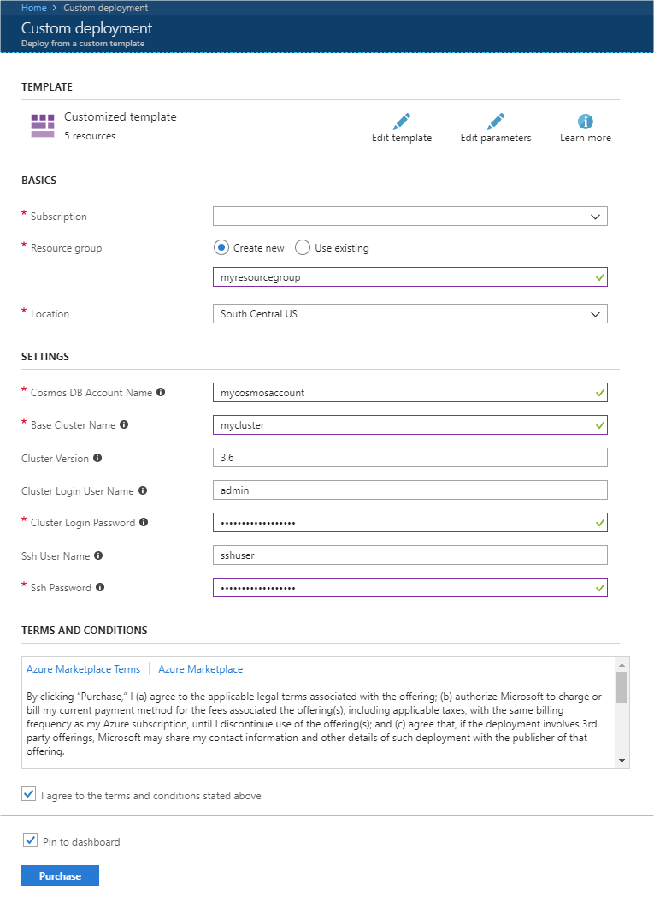

# Use Apache Spark Structured Streaming with Apache Kafka and Azure Cosmos DB

Learn how to use [Apache Spark](https://spark.apache.org/) [Structured Streaming](https://spark.apache.org/docs/latest/structured-streaming-programming-guide.html) to read data from [Apache Kafka](https://kafka.apache.org/) on Azure HDInsight, and then store the data into Azure Cosmos DB.

[Azure Cosmos DB](https://azure.microsoft.com/services/cosmos-db/) is a globally distributed, multi-model database. This example uses a SQL API database model. For more information, see the [Welcome to Azure Cosmos DB](../cosmos-db/introduction.md) document.

Spark structured streaming is a stream processing engine built on Spark SQL. It allows you to express streaming computations the same as batch computation on static data. For more information on Structured Streaming, see the [Structured Streaming Programming Guide](https://spark.apache.org/docs/2.2.0/structured-streaming-programming-guide.html) at Apache.org.

> [!IMPORTANT]  
> This example used Spark 2.2 on HDInsight 3.6.
>
> The steps in this document create an Azure resource group that contains both a Spark on HDInsight and a Kafka on HDInsight cluster. These clusters are both located within an Azure Virtual Network, which allows the Spark cluster to directly communicate with the Kafka cluster.
>
> When you are done with the steps in this document, remember to delete the clusters to avoid excess charges.

## Create the clusters

Apache Kafka on HDInsight does not provide access to the Kafka brokers over the public internet. Anything that talks to Kafka must be in the same Azure virtual network as the nodes in the Kafka cluster. For this example, both the Kafka and Spark clusters are located in an Azure virtual network. The following diagram shows how communication flows between the clusters:


> [!NOTE]  
> The Kafka service is limited to communication within the virtual network. Other services on the cluster, such as SSH and Ambari, can be accessed over the internet. For more information on the public ports available with HDInsight, see [Ports and URIs used by HDInsight](hdinsight-hadoop-port-settings-for-services.md).

While you can create an Azure virtual network, Kafka, and Spark clusters manually, it's easier to use an Azure Resource Manager template. Use the following steps to deploy an Azure virtual network, Kafka, and Spark clusters to your Azure subscription.

1. Use the following button to sign in to Azure and open the template in the Azure portal.
    
    <a href="https://portal.azure.com/#create/Microsoft.Template/uri/https%3A%2F%2Fraw.githubusercontent.com%2FAzure-Samples%2Fhdinsight-spark-scala-kafka-cosmosdb%2Fmaster%2Fazuredeploy.json" target="_blank">
    
    </a>

    The Azure Resource Manager template is located in the GitHub repository for this project ([https://github.com/Azure-Samples/hdinsight-spark-scala-kafka-cosmosdb](https://github.com/Azure-Samples/hdinsight-spark-scala-kafka-cosmosdb)).

    This template creates the following resources:

   * A Kafka on HDInsight 3.6 cluster.

   * A Spark on HDInsight 3.6 cluster.

   * An Azure Virtual Network, which contains the HDInsight clusters.

       > [!NOTE]  
       > The virtual network created by the template uses the 10.0.0.0/16 address space.

   * An Azure Cosmos DB SQL API database.

     > [!IMPORTANT]  
     > The structured streaming notebook used in this example requires Spark on HDInsight 3.6. If you use an earlier version of Spark on HDInsight, you receive errors when using the notebook.

2. Use the following information to populate the entries on the **Custom deployment** section:
   
    

    * **Subscription**: Select your Azure subscription.
   
    * **Resource group**: Create a group or select an existing one. This group contains the HDInsight cluster.

    * **Location**: Select a location geographically close to you.

    * **Cosmos DB Account Name**: This value is used as the name for the Cosmos DB account.

    * **Base Cluster Name**: This value is used as the base name for the Spark and Kafka clusters. For example, entering **myhdi** creates a Spark cluster named __spark-myhdi__ and a Kafka cluster named **kafka-myhdi**.

    * **Cluster Version**: The HDInsight cluster version.

        > [!IMPORTANT]  
        > This example is tested with HDInsight 3.6, and may not work with other cluster types.

    * **Cluster Login User Name**: The admin user name for the Spark and Kafka clusters.

    * **Cluster Login Password**: The admin user password for the Spark and Kafka clusters.

    * **SSH User Name**: The SSH user to create for the Spark and Kafka clusters.

    * **SSH Password**: The password for the SSH user for the Spark and Kafka clusters.

3. Read the **Terms and Conditions**, and then select **I agree to the terms and conditions stated above**.

4. Finally, select **Purchase**. It takes about 20 minutes to create the clusters.

> [!IMPORTANT]  
> It may take up to 45 minutes to create the clusters, virtual network, and Cosmos DB account.

## Create the Cosmos DB database and collection

The project used in this document stores data in Cosmos DB. Before running the code, you must first create a _database_ and _collection_ in your Cosmos DB instance. You must also retrieve the document endpoint and the _key_ used to authenticate requests to Cosmos DB. 

One way to do this is to use the [Azure CLI](https://docs.microsoft.com/cli/azure/?view=azure-cli-latest). The following script will create a database named `kafkadata` and a collection named `kafkacollection`. It then returns the primary key.

```azurecli
#!/bin/bash

# Replace 'myresourcegroup' with the name of your resource group
resourceGroupName='myresourcegroup'
# Replace 'mycosmosaccount' with the name of your Cosmos DB account name
name='mycosmosaccount'

# WARNING: If you change the databaseName or collectionName
#          then you must update the values in the Jupyter notebook
databaseName='kafkadata'
collectionName='kafkacollection'

# Create the database
az cosmosdb database create --name $name --db-name $databaseName --resource-group $resourceGroupName
# Create the collection
az cosmosdb collection create --collection-name $collectionName --name $name --db-name $databaseName --resource-group $resourceGroupName

# Get the endpoint
az cosmosdb show --name $name --resource-group $resourceGroupName --query documentEndpoint

# Get the primary key
az cosmosdb list-keys --name $name --resource-group $resourceGroupName --query primaryMasterKey
```

The document endpoint and primary key information is similar to the following text:

```text
# endpoint
"https://mycosmosaccount.documents.azure.com:443/"
# key
"YqPXw3RP7TsJoBF5imkYR0QNA02IrreNAlkrUMkL8EW94YHs41bktBhIgWq4pqj6HCGYijQKMRkCTsSaKUO2pw=="
```

> [!IMPORTANT]  
> Save the endpoint and key values, as they are needed in the Jupyter Notebooks.

## Get the Apache Kafka brokers

The code in this example connects to Kafka broker hosts in the Kafka cluster. To find the addresses of the two Kafka broker hosts, use the following PowerShell or Bash example:

```powershell
$creds = Get-Credential -UserName "admin" -Message "Enter the HDInsight login"
$clusterName = Read-Host -Prompt "Enter the Kafka cluster name"
$resp = Invoke-WebRequest -Uri "https://$clusterName.azurehdinsight.net/api/v1/clusters/$clusterName/services/KAFKA/components/KAFKA_BROKER" `
    -Credential $creds `
    -UseBasicParsing
$respObj = ConvertFrom-Json $resp.Content
$brokerHosts = $respObj.host_components.HostRoles.host_name[0..1]
($brokerHosts -join ":9092,") + ":9092"
```

> [!NOTE]  
> The Bash example expects `$CLUSTERNAME` to contain the name of the Kafka cluster.
>
> This example uses the [jq](https://stedolan.github.io/jq/) utility to parse data out of the JSON document.

```bash
curl -u admin -G "https://$CLUSTERNAME.azurehdinsight.net/api/v1/clusters/$CLUSTERNAME/services/KAFKA/components/KAFKA_BROKER" | jq -r '["\(.host_components[].HostRoles.host_name):9092"] | join(",")' | cut -d',' -f1,2
```

When prompted, enter the password for the cluster login (admin) account

The output is similar to the following text:

`wn0-kafka.0owcbllr5hze3hxdja3mqlrhhe.ex.internal.cloudapp.net:9092,wn1-kafka.0owcbllr5hze3hxdja3mqlrhhe.ex.internal.cloudapp.net:9092`

Save this information, as it is used in the following sections of this document.

## Get the notebooks

The code for the example described in this document is available at [https://github.com/Azure-Samples/hdinsight-spark-scala-kafka-cosmosdb](https://github.com/Azure-Samples/hdinsight-spark-scala-kafka-cosmosdb).

## Upload the notebooks

Use the following steps to upload the notebooks from the project to your Spark on HDInsight cluster:

1. In your web browser, connect to the Jupyter notebook on your Spark cluster. In the following URL, replace `CLUSTERNAME` with the name of your __Spark__ cluster:

        https://CLUSTERNAME.azurehdinsight.net/jupyter

    When prompted, enter the cluster login (admin) and password used when you created the cluster.

2. From the upper right side of the page, use the __Upload__ button to upload the __Stream-taxi-data-to-kafka.ipynb__ file to the cluster. Select __Open__ to start the upload.

3. Find the __Stream-taxi-data-to-kafka.ipynb__ entry in the list of notebooks, and select __Upload__ button beside it.

4. Repeat steps 1-3 to load the __Stream-data-from-Kafka-to-Cosmos-DB.ipynb__ notebook.

## Load taxi data into Kafka

Once the files have been uploaded, select the __Stream-taxi-data-to-kafka.ipynb__ entry to open the notebook. Follow the steps in the notebook to load data into Kafka.

## Process taxi data using Spark Structured Streaming

From the [Jupyter Notebook](https://jupyter.org/) home page, select the __Stream-data-from-Kafka-to-Cosmos-DB.ipynb__ entry. Follow the steps in the notebook to stream data from Kafka and into Azure Cosmos DB using Spark Structured Streaming.

## Next steps

Now that you have learned how to use Apache Spark Structured Streaming, see the following documents to learn more about working with Apache Spark, Apache Kafka, and Azure Cosmos DB:

* [How to use Apache Spark streaming (DStream) with Apache Kafka](hdinsight-apache-spark-with-kafka.md).
* [Start with Jupyter Notebook and Apache Spark on HDInsight](spark/apache-spark-jupyter-spark-sql.md)
* [Welcome to Azure Cosmos DB](../cosmos-db/introduction.md)
