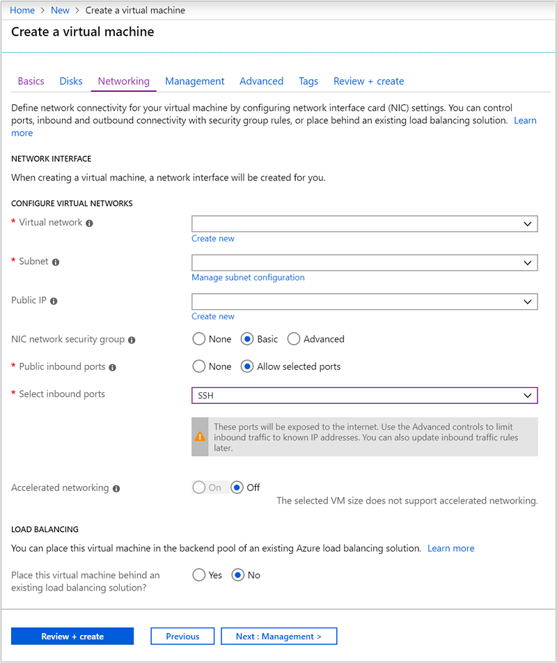

# Connect HDInsight to your on-premises network

Learn how to connect HDInsight to your on-premises network by using Azure Virtual Networks and a VPN gateway. This document provides planning information on:

* Using HDInsight in an Azure Virtual Network that connects to your on-premises network.

* Configuring DNS name resolution between the virtual network and your on-premises network.

* Configuring network security groups to restrict internet access to HDInsight.

* Ports provided by HDInsight on the virtual network.

## Create the Virtual network configuration

Use the following documents to learn how to create an Azure Virtual Network that is connected to your on-premises network:
    
* [Using the Azure portal](../vpn-gateway/vpn-gateway-howto-site-to-site-resource-manager-portal.md)

* [Using Azure PowerShell](../vpn-gateway/vpn-gateway-create-site-to-site-rm-powershell.md)

* [Using Azure CLI](../vpn-gateway/vpn-gateway-howto-site-to-site-resource-manager-cli.md)

## Configure name resolution

To allow HDInsight and resources in the joined network to communicate by name, you must perform the following actions:

* Create a custom DNS server in the Azure Virtual Network.

* Configure the virtual network to use the custom DNS server instead of the default Azure Recursive Resolver.

* Configure forwarding between the custom DNS server and your on-premises DNS server.

This configuration enables the following behavior:

* Requests for fully qualified domain names that have the DNS suffix __for the virtual network__ are forwarded to the custom DNS server. The custom DNS server then forwards these requests to the Azure Recursive Resolver, which returns the IP address.

* All other requests are forwarded to the on-premises DNS server. Even requests for public internet resources such as microsoft.com are forwarded to the on-premises DNS server for name resolution.

In the following diagram, green lines are requests for resources that end in the DNS suffix of the virtual network. Blue lines are requests for resources in the on-premises network or on the public internet.


### Create a custom DNS server

> [!IMPORTANT]
> You must create and configure the DNS server before installing HDInsight into the virtual network.

To create a Linux VM that uses the [Bind](https://www.isc.org/downloads/bind/) DNS software, use the following steps:

> [!NOTE]
> The following steps use the [Azure portal](https://portal.azure.com) to create an Azure Virtual Machine. For other ways to create a virtual machine, see the following documents:
>
> * [Create VM - Azure CLI](../virtual-machines/linux/quick-create-cli.md)
> * [Create VM - Azure PowerShell](../virtual-machines/linux/quick-create-portal.md)

1. From the [Azure portal](https://portal.azure.com), select __+__, __Compute__, and __Ubuntu Server 16.04 LTS__.

    

2. From the __Basics__ section, enter the following information:

    * __Name__: A friendly name that identifies this virtual machine. For example, __DNSProxy__.
    * __User name__: The name of the SSH account.
    * __SSH public key__ or __Password__: The authentication method for the SSH account. We recommend using public keys, as they are more secure. For more information, see the [Create and use SSH keys for Linux VMs](../virtual-machines/linux/mac-create-ssh-keys.md) document.
    * __Resource group__: Select __Use existing__, and then select the resource group that contains the virtual network created earlier.
    * __Location__: Select the same location as the virtual network.

    

    Leave other entries at the default values and then select __OK__.

3. From the __Choose a size__ section, select the VM size. For this tutorial, select the smallest and lowest cost option. To continue, use the __Select__ button.

4. From the __Settings__ section, enter the following information:

    * __Virtual network__: Select the virtual network that you created earlier.

    * __Subnet__: Select the default subnet for the virtual network. Do __not__ select the subnet used by the VPN gateway.

    * __Diagnostics storage account__: Either select an existing storage account or create a new one.

    

    Leave the other entries at the default value, then select __OK__ to continue.

5. From the __Purchase__ section, select the __Purchase__ button to create the virtual machine.

6. Once the virtual machine has been created, its __Overview__ section is displayed. From the list on the left, select __Properties__. Save the __Public IP address__ and __Private IP address__ values. It will be used in the next section.

    

### Install and configure Bind (DNS software)

1. Use SSH to connect to the __public IP address__ of the virtual machine. The following example connects to a virtual machine at 40.68.254.142:

    ```bash
    ssh sshuser@40.68.254.142
    ```

    Replace `sshuser` with the SSH user account you specified when creating the cluster.

    > [!NOTE]
	> There are a variety of ways to obtain the `ssh` utility. On Linux, Unix, and macOS, it is provided as part of the operating system. If you are using Windows, consider one of the following options:
    >
    > * [Azure Cloud Shell](../cloud-shell/quickstart.md)
    > * [Bash on Ubuntu on Windows 10](https://msdn.microsoft.com/commandline/wsl/about)
    > * [Git (https://git-scm.com/)](https://git-scm.com/)
    > * [OpenSSH (https://github.com/PowerShell/Win32-OpenSSH/wiki/Install-Win32-OpenSSH)](https://github.com/PowerShell/Win32-OpenSSH/wiki/Install-Win32-OpenSSH)

2. To install Bind, use the following commands from the SSH session:

    ```bash
	sudo apt-get update -y
	sudo apt-get install bind9 -y
    ```

3. To configure Bind to forward name resolution requests to your on-prem DNS server, use the following text as the contents of the `/etc/bind/named.conf.options` file:

		acl goodclients {
			10.0.0.0/16; # Replace with the IP address range of the virtual network
			10.1.0.0/16; # Replace with the IP address range of the on-premises network
			localhost;
			localnets;
		};

		options {
				directory "/var/cache/bind";

				recursion yes;

				allow-query { goodclients; };

				forwarders {
				192.168.0.1; # Replace with the IP address of the on-premises DNS server
				};

				dnssec-validation auto;

				auth-nxdomain no;    # conform to RFC1035
				listen-on { any; };
		};

    > [!IMPORTANT]
    > Replace the values in the `goodclients` section with the IP address range of the virtual network and on-premises network. This section defines the addresses that this DNS server accepts requests from.
    >
    > Replace the `192.168.0.1` entry in the `forwarders` section with the IP address of your on-premises DNS server. This entry routes DNS requests to your on-premises DNS server for resolution.

    To edit this file, use the following command:

    ```bash
    sudo nano /etc/bind/named.conf.options
    ```

    To save the file, use __Ctrl+X__, __Y__, and then __Enter__.

4. From the SSH session, use the following command:

    ```bash
    hostname -f
    ```

    This command returns a value similar to the following text:

        dnsproxy.icb0d0thtw0ebifqt0g1jycdxd.ex.internal.cloudapp.net

    The `icb0d0thtw0ebifqt0g1jycdxd.ex.internal.cloudapp.net` text is the __DNS suffix__ for this virtual network. Save this value, as it is used later.

5. To configure Bind to resolve DNS names for resources within the virtual network, use the following text as the contents of the `/etc/bind/named.conf.local` file:

        // Replace the following with the DNS suffix for your virtual network
		zone "icb0d0thtw0ebifqt0g1jycdxd.ex.internal.cloudapp.net" {
			type forward;
			forwarders {168.63.129.16;}; # The Azure recursive resolver
		};

    > [!IMPORTANT]
    > You must replace the `icb0d0thtw0ebifqt0g1jycdxd.ex.internal.cloudapp.net` with the DNS suffix you retrieved earlier.

    To edit this file, use the following command:

    ```bash
    sudo nano /etc/bind/named.conf.local
    ```

    To save the file, use __Ctrl+X__, __Y__, and then __Enter__.

6. To start Bind, use the following command:

    ```bash
    sudo service bind9 restart
    ```

7. To verify that bind can resolve the names of resources in your on-premises network, use the following commands:

    ```bash
    sudo apt install dnsutils
    nslookup dns.mynetwork.net 10.0.0.4
    ```

    > [!IMPORTANT]
    > Replace `dns.mynetwork.net` with the fully qualified domain name (FQDN) of a resource in your on-premises network.
    >
    > Replace `10.0.0.4` with the __internal IP address__ of your custom DNS server in the virtual network.

    The response appears similar to the following text:

        Server:         10.0.0.4
		Address:        10.0.0.4#53

		Non-authoritative answer:
		Name:   dns.mynetwork.net
		Address: 192.168.0.4

### Configure the virtual network to use the custom DNS server

To configure the virtual network to use the custom DNS server instead of the Azure recursive resolver, use the following steps:

1. In the [Azure portal](https://portal.azure.com), select the virtual network, and then select __DNS Servers__.

2. Select __Custom__, and enter the __internal IP address__ of the custom DNS server. Finally, select __Save__.

    

### Configure the on-premises DNS server

In the previous section, you configured the custom DNS server to forward requests to the on-premises DNS server. Next, you must configure the on-premises DNS server to forward requests to the custom DNS server.

For specific steps on how to configure your DNS server, consult the documentation for your DNS server software. Look for the steps on how to configure a __conditional forwarder__.

A conditional forward only forwards requests for a specific DNS suffix. In this case, you must configure a forwarder for the DNS suffix of the virtual network. Requests for this suffix should be forwarded to the IP address of the custom DNS server. 

The following text is an example of a conditional forwarder configuration for the **Bind** DNS software:

    zone "icb0d0thtw0ebifqt0g1jycdxd.ex.internal.cloudapp.net" {
		type forward;
		forwarders {10.0.0.4;}; # The custom DNS server's internal IP address
	};

For information on using DNS on **Windows Server 2016**, see the [Add-DnsServerConditionalForwarderZone](https://technet.microsoft.com/itpro/powershell/windows/dnsserver/add-dnsserverconditionalforwarderzone) documentation...

Once you have configured the on-premises DNS server, you can use `nslookup` from the on-premises network to verify that you can resolve names in the virtual network. The following example 

```bash
nslookup dnsproxy.icb0d0thtw0ebifqt0g1jycdxd.ex.internal.cloudapp.net 196.168.0.4
```

This example uses the on-premises DNS server at 196.168.0.4 to resolve the name of the custom DNS server. Replace the IP address with the one for the on-premises DNS server. Replace the `dnsproxy` address with the fully qualified domain name of the custom DNS server.

## Optional: Control network traffic

You can use network security groups (NSG) or user-defined routes (UDR) to control network traffic. NSGs allow you to filter inbound and outbound traffic, and allow or deny the traffic. UDRs allow you to control how traffic flows between resources in the virtual network, the internet, and the on-premises network.

> [!WARNING]
> HDInsight requires inbound access from specific IP addresses in the Azure cloud, and unrestricted outbound access. When using NSGs or UDRs to control traffic, you must perform the following steps:

1. Find the IP addresses for the location that contains your virtual network. For a list of required IPs by location, see [Required IP addresses](./hdinsight-extend-hadoop-virtual-network.md#hdinsight-ip).

2. For the IP addresses identified in step 1, allow inbound traffic from that IP addresses.

   * If you are using __NSG__: Allow __inbound__ traffic on port __443__ for the IP addresses.
   * If you are using __UDR__: Set the __Next Hop__ type of the route to __Internet__ for the IP addresses.

For an example of using Azure PowerShell or the Azure CLI to create NSGs, see the [Extend HDInsight with Azure Virtual Networks](./hdinsight-extend-hadoop-virtual-network.md#hdinsight-nsg) document.

## Create the HDInsight cluster

> [!WARNING]
> You must configure the custom DNS server before installing HDInsight in the virtual network.

Use the steps in the [Create an HDInsight cluster using the Azure portal](./hdinsight-hadoop-create-linux-clusters-portal.md) document to create an HDInsight cluster.

> [!WARNING]
> * During cluster creation, you must choose the location that contains your virtual network.
>
> * In the __Advanced settings__ part of configuration, you must select the virtual network and subnet that you created earlier.

## Connecting to HDInsight

Most documentation on HDInsight assumes that you have access to the cluster over the internet. For example, that you can connect to the cluster at https://CLUSTERNAME.azurehdinsight.net. This address uses the public gateway, which is not available if you have used NSGs or UDRs to restrict access from the internet.

Some documentation also references `headnodehost` when connecting to the cluster from an SSH session. This address is only available from nodes within a cluster, and is not usable on clients connected over the virtual network.

To directly connect to HDInsight through the virtual network, use the following steps:

1. To discover the internal fully qualified domain names of the HDInsight cluster nodes, use one of the following methods:

	```powershell
	$resourceGroupName = "The resource group that contains the virtual network used with HDInsight"

	$clusterNICs = Get-AzureRmNetworkInterface -ResourceGroupName $resourceGroupName | where-object {$_.Name -like "*node*"}

	$nodes = @()
	foreach($nic in $clusterNICs) {
		$node = new-object System.Object
		$node | add-member -MemberType NoteProperty -name "Type" -value $nic.Name.Split('-')[1]
		$node | add-member -MemberType NoteProperty -name "InternalIP" -value $nic.IpConfigurations.PrivateIpAddress
		$node | add-member -MemberType NoteProperty -name "InternalFQDN" -value $nic.DnsSettings.InternalFqdn
		$nodes += $node
	}
	$nodes | sort-object Type
	```

	```azurecli
	az network nic list --resource-group <resourcegroupname> --output table --query "[?contains(name,'node')].{NICname:name,InternalIP:ipConfigurations[0].privateIpAddress,InternalFQDN:dnsSettings.internalFqdn}"
	```

2. To determine the port that a service is available on, see the [Ports used by Hadoop services on HDInsight](./hdinsight-hadoop-port-settings-for-services.md) document.

    > [!IMPORTANT]
    > Some services hosted on the head nodes are only active on one node at a time. If you try accessing a service on one head node and it fails, switch to the other head node.
    >
    > For example, Ambari is only active on one head node at a time. If you try accessing Ambari on one head node and it returns a 404 error, then it is running on the other head node.

## Next steps

* For more information on using HDInsight in a virtual network, see [Extend HDInsight by using Azure Virtual Networks](./hdinsight-extend-hadoop-virtual-network.md).

* For more information on Azure virtual networks, see the [Azure Virtual Network overview](../virtual-network/virtual-networks-overview.md).

* For more information on network security groups, see [Network security groups](../virtual-network/security-overview.md).

* For more information on user-defined routes, see [User-defined routes and IP forwarding](../virtual-network/virtual-networks-udr-overview.md).
