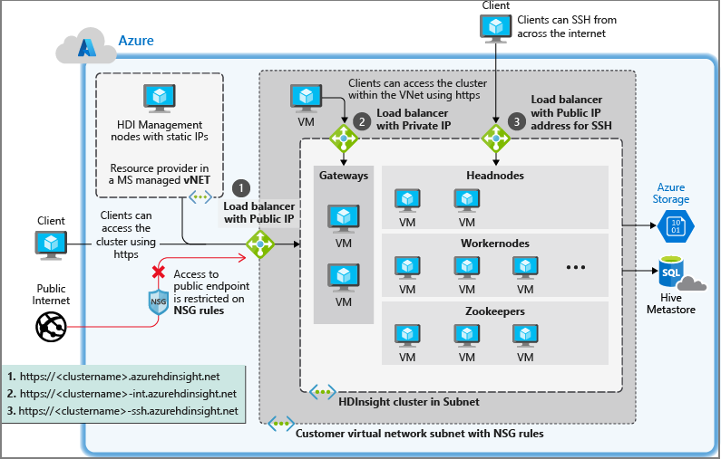

# Control network traffic in Azure HDInsight

Network traffic in an Azure Virtual Networks can be controlled using the following methods:

* **Network security groups** (NSG) allow you to filter inbound and outbound traffic to the network. For more information, see the [Filter network traffic with network security groups](../virtual-network/security-overview.md) document.

* **Network virtual appliances** (NVA) can be used with outbound traffic only. NVAs replicate the functionality of devices such as firewalls and routers. For more information, see the [Network Appliances](https://azure.microsoft.com/solutions/network-appliances) document.

As a managed service, HDInsight requires unrestricted access to the HDInsight health and management services both for incoming and outgoing traffic from the VNET. When using NSGs, you must ensure that these services can still communicate with HDInsight cluster.

## HDInsight with network security groups

If you plan on using **network security groups** to control network traffic, perform the following actions before installing HDInsight:

1. Identify the Azure region that you plan to use for HDInsight.

2. Identify the service tags required by HDInsight for your region. For more information, see [Network security group (NSG) service tags for Azure HDInsight](hdinsight-service-tags.md).

3. Create or modify the network security groups for the subnet that you plan to install HDInsight into.

    * __Network security groups__: allow __inbound__ traffic on port __443__ from the IP addresses. This will ensure that HDInsight management services can reach the cluster from outside the virtual network. For __Kafka REST proxy__ enabled clusters, allow __inbound__ traffic on port __9400__ as well. This will ensure that Kafka REST proxy server is reachable.

For more information on network security groups, see the [overview of network security groups](../virtual-network/security-overview.md).

## Controlling outbound traffic from HDInsight clusters

For more information on controlling outbound traffic from HDInsight clusters, see [Configure outbound network traffic restriction for Azure HDInsight clusters](hdinsight-restrict-outbound-traffic.md).

### Forced tunneling to on-premises

Forced tunneling is a user-defined routing configuration where all traffic from a subnet is forced to a specific network or location, such as your on-premises network or Firewall. Forced tunneling of all data transfer back to on-premise is _not_ recommended due to large volumes of data transfer and potential performance impact.

Customers who are interested to setup forced tunneling, should use [custom metastores](./hdinsight-use-external-metadata-stores.md) and setup the appropriate connectivity from the cluster subnet or on-premise network to these custom metastores.

To see an example of the UDR setup with Azure Firewall, see [Configure outbound network traffic restriction for Azure HDInsight clusters](hdinsight-restrict-outbound-traffic.md).

## Required IP addresses

If you use network security groups or user-defined routes to control traffic, see [HDInsight management IP addresses](hdinsight-management-ip-addresses.md).

## Required ports

If you plan on using a **firewall** and access the cluster from outside on certain ports, you might need to allow traffic on those ports needed for your scenario. By default, no special whitelisting of ports is needed as long as the Azure management traffic explained in the previous section is allowed to reach cluster on port 443.

For a list of ports for specific services, see the [Ports used by Apache Hadoop services on HDInsight](hdinsight-hadoop-port-settings-for-services.md) document.

For more information on firewall rules for virtual appliances, see the [virtual appliance scenario](../virtual-network/virtual-network-scenario-udr-gw-nva.md) document.

## Next steps

* For code samples and examples of creating Azure Virtual Networks, see [Create virtual networks for Azure HDInsight clusters](hdinsight-create-virtual-network.md).
* For an end-to-end example of configuring HDInsight to connect to an on-premises network, see [Connect HDInsight to an on-premises network](./connect-on-premises-network.md).
* For more information on Azure virtual networks, see the [Azure Virtual Network overview](../virtual-network/virtual-networks-overview.md).
* For more information on network security groups, see [Network security groups](../virtual-network/security-overview.md).
* For more information on user-defined routes, see [User-defined routes and IP forwarding](../virtual-network/virtual-networks-udr-overview.md).
* For more information on virtual networks, see [Plan VNETs for HDInsight](./hdinsight-plan-virtual-network-deployment.md).
