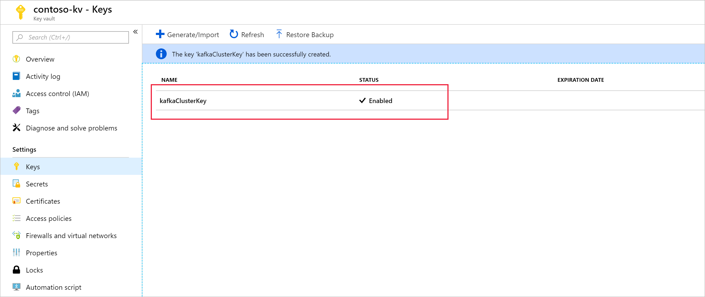
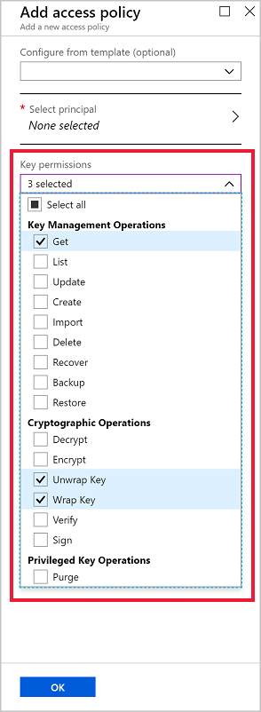
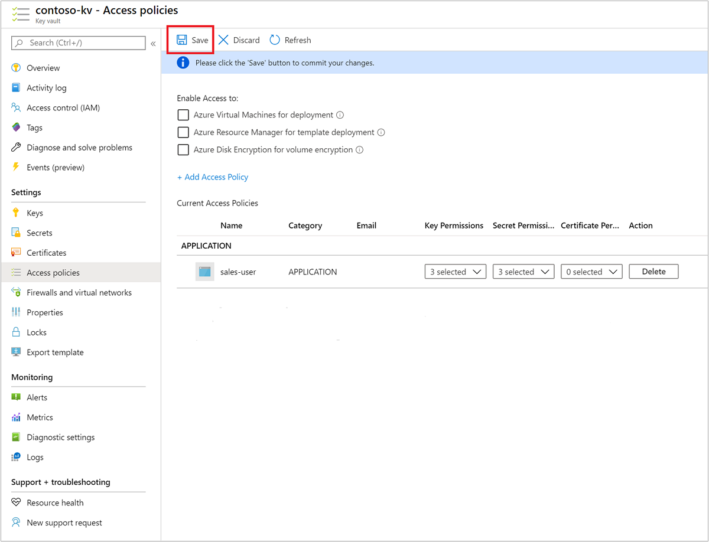
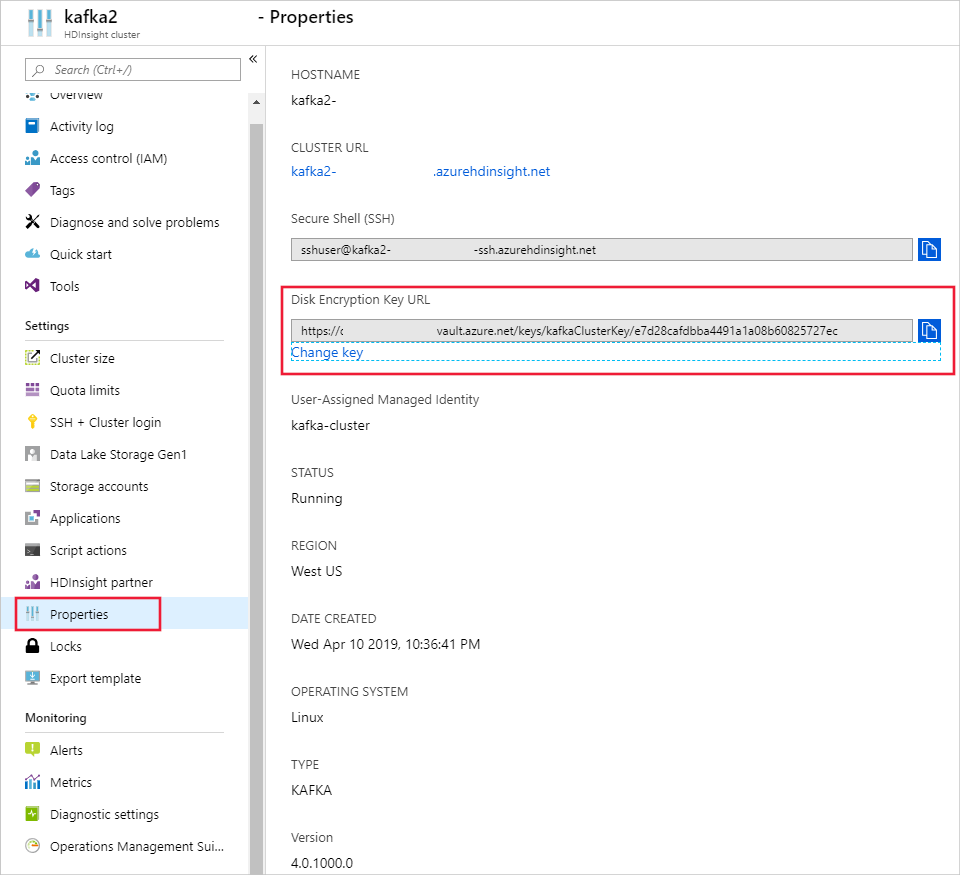
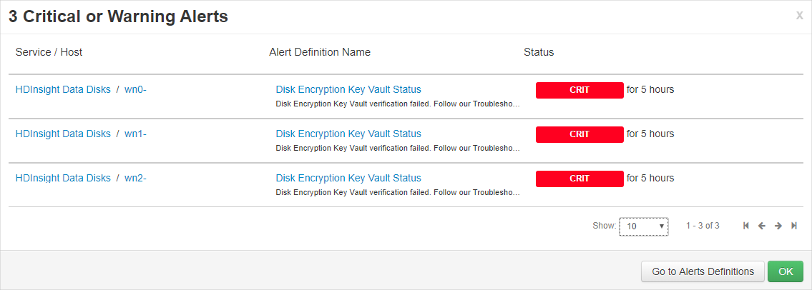

# Customer-managed key disk encryption

Azure HDInsight supports customer-managed keys, also known as Bring Your Own Key (BYOK) encryption for data on managed disks and resource disks attached to HDInsight cluster VMs. This feature allows you to use Azure Key Vault to manage the encryption keys that secure data at rest on your HDInsight clusters. Your clusters may have one or more attached Azure Storage accounts where the encryption keys could also be Microsoft-managed or customer-managed, but the encryption service is different.

This document does not address data stored in your Azure Storage account. For more information about ASE, please see [Azure Storage encryption for data at rest](../storage/common/storage-service-encryption.md).

All managed disks in HDInsight are protected with Azure Storage Service Encryption (SSE). By default, the data on those disks is encrypted using Microsoft-managed keys. If you enable customer-managed keys for HDInsight, you provide the encryption keys for HDInsight to use and manage those keys using Azure Key Vault.

Customer-managed key encryption is a one-step process handled during cluster creation at no additional cost. All you need to do is register HDInsight as a managed identity with Azure Key Vault and add the encryption key when you create your cluster.

Both resource disk and managed disks on each node of the cluster are encrypted with a symmetric Data Encryption Key (DEK). The DEK is protected using the Key Encryption Key (KEK) from your key vault. The encryption and decryption processes are handled entirely by Azure HDInsight.

You can use the Azure portal or Azure CLI to safely rotate the keys in the key vault. When a key rotates, the HDInsight cluster starts using the new key within minutes. Enable the "Soft Delete" key protection features to protect against ransomware scenarios and accidental deletion. Key vaults without this protection feature aren't supported.

## Get started with customer-managed keys

To create a customer-managed key enabled HDInsight cluster, we'll go through the following steps:

1. Create managed identities for Azure resources
2. Setup Azure Key Vault and keys
3. Create HDInsight cluster with customer-managed key enabled
4. Rotating the encryption key

## Create managed identities for Azure resources

To authenticate to Key Vault, create a user-assigned managed identity using the [Azure portal](../active-directory/managed-identities-azure-resources/how-to-manage-ua-identity-portal.md), [Azure PowerShell](../active-directory/managed-identities-azure-resources/how-to-manage-ua-identity-powershell.md), [Azure Resource Manager](../active-directory/managed-identities-azure-resources/how-to-manage-ua-identity-arm.md), or [Azure CLI](../active-directory/managed-identities-azure-resources/how-to-manage-ua-identity-cli.md). For more information on how managed identities work in Azure HDInsight, see [Managed identities in Azure HDInsight](hdinsight-managed-identities.md). Be sure to save the managed identity resource ID for when you add it to the Key Vault access policy.

## Set up the Key Vault and keys

HDInsight only supports Azure Key Vault. If you have your own key vault, you can import your keys into Azure Key Vault. Remember that the keys must have "Soft Delete". The "Soft Delete" feature is available through the REST, .NET/C#, PowerShell, and Azure CLI interfaces.

1. To create a new key vault, follow the [Azure Key Vault](../key-vault/key-vault-overview.md) quickstart. For more information about importing existing keys, visit [About keys, secrets, and certificates](../key-vault/about-keys-secrets-and-certificates.md).

1. Enable "soft-delete" on the key-vault by using the [az keyvault update](/cli/azure/keyvault?view=azure-cli-latest#az-keyvault-update) CLI command.

    ```azurecli
    az keyvault update --name <Key Vault Name> --enable-soft-delete
    ```

1. Create keys.

    a. To create a new key, select **Generate/Import** from the **Keys** menu under **Settings**.

    

    b. Set **Options** to **Generate** and give the key a name.

    

    c. Select the key you created from the list of keys.

    

    d. When you use your own key for HDInsight cluster encryption, you need to provide the key URI. Copy the **Key identifier** and save it somewhere until you're ready to create your cluster.

    

1. Add managed identity to the key vault access policy.

    a. Create a new Azure Key Vault access policy.

    

    b. Under **Select Principal**, choose the user-assigned managed identity you created.

    

    c. Set **Key Permissions** to **Get**, **Unwrap Key**, and **Wrap Key**.

    

    d. Set **Secret Permissions** to **Get**, **Set**, and **Delete**.

    

    e. Select **Save**.

    

## Create cluster with customer-managed key disk encryption

You're now ready to create a new HDInsight cluster. Customer-managed key can only be applied to new clusters during cluster creation. Encryption can't be removed from customer-managed key clusters, and customer-managed key can't be added to existing clusters.

### Using the Azure portal

During cluster creation, provide the full key URL, including the key version. For example, `https://contoso-kv.vault.azure.net/keys/myClusterKey/46ab702136bc4b229f8b10e8c2997fa4`. You also need to assign the managed identity to the cluster and provide the key URI.

### Using Azure CLI

The following example shows how to use Azure CLI to create a new Apache Spark cluster with disk encryption enabled. See the [Azure CLI az hdinsight create](https://docs.microsoft.com/cli/azure/hdinsight?view=azure-cli-latest#az-hdinsight-create) documentation for more information.

```azurecli
az hdinsight create -t spark -g MyResourceGroup -n MyCluster \
-p "HttpPassword1234!" --workernode-data-disks-per-node 2 \
--storage-account MyStorageAccount \
--encryption-key-name SparkClusterKey \
--encryption-key-version 00000000000000000000000000000000 \
--encryption-vault-uri https://MyKeyVault.vault.azure.net \
--assign-identity MyMSI
```

## Rotating the encryption key

There might be scenarios where you might want to change the encryption keys used by the HDInsight cluster after it has been created. This can be easily via the portal. For this operation, the cluster must have access to both the current key and the intended new key, otherwise the rotate key operation will fail.

### Using the Azure portal

To rotate the key, you must have the full url of the new key (See Step 3 of [Setup the Key Vault and Keys](#set-up-the-key-vault-and-keys)). Once you've done that, go to the HDInsight cluster properties section in the portal and click on **Change Key** under **Disk Encryption Key URL**. Enter in the new key url and submit to rotate the key.



### Using Azure CLI

The following example shows how to rotate the disk encryption key for an existing HDInsight cluster. See [Azure CLI az hdinsight rotate-disk-encryption-key](https://docs.microsoft.com/cli/azure/hdinsight?view=azure-cli-latest#az-hdinsight-rotate-disk-encryption-key) for more details.

```azurecli
az hdinsight rotate-disk-encryption-key \
--encryption-key-name SparkClusterKey \
--encryption-key-version 00000000000000000000000000000000 \
--encryption-vault-uri https://MyKeyVault.vault.azure.net \
--name MyCluster \
--resource-group MyResourceGroup
```

## FAQ for customer-managed key encryption

**How does the HDInsight cluster access my key vault?**

HDInsight accesses your Azure Key Vault instance using the managed identity that you associate with the HDInsight cluster. This managed identity can be created before or during cluster creation. You also need to grant the managed identity access to the key vault where the key is stored.

**Is this feature available for all clusters on HDInsight?**

Customer-managed key encryption is available for all cluster types except Spark 2.1 and 2.2.

**Can I use multiple keys to encrypt different disks or folders?**

No, all managed disks and resource disks are encrypted by the same key.

**What happens if the cluster loses access to the key vault or the key?**

If the cluster loses access to the key, warnings will be shown in the Apache Ambari portal. In this state, the **Change Key** operation will fail. Once key access is restored, Ambari warnings will go away and operations such as key rotation can be successfully performed.



**How can I recover the cluster if the keys are deleted?**

Since only “Soft Delete” enabled keys are supported, if the keys are recovered in the key vault, the cluster should regain access to the keys. To recover an Azure Key Vault key, see [Undo-AzKeyVaultKeyRemoval](/powershell/module/az.keyvault/Undo-AzKeyVaultKeyRemoval) or [az-keyvault-key-recover](/cli/azure/keyvault/key?view=azure-cli-latest#az-keyvault-key-recover).

**Which disk types are encrypted? Are OS disks/resource disks also encrypted?**

Resource disks and data/managed disks are encrypted. OS disks are not encrypted.

**If a cluster is scaled up, will the new nodes support customer-managed keys seamlessly?**

Yes. The cluster needs access to the key in the key vault during scale up. The same key is used to encrypt both managed disks and resource disks in the cluster.

**Are customer-managed keys available in my location?**

HDInsight customer-managed keys is available in all public clouds and national clouds.

## Next steps

* [Overview of enterprise security in Azure HDInsight](./domain-joined/hdinsight-security-overview.md)
