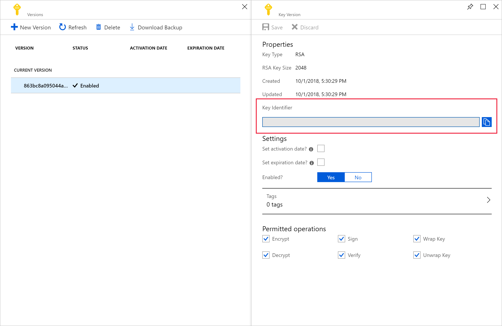

# Customer-managed key disk encryption

Azure HDInsight supports customer-managed key encryption for data on managed disks and resource disks attached to HDInsight cluster virtual machines. This feature allows you to use Azure Key Vault to manage the encryption keys that secure data at rest on your HDInsight clusters.

All managed disks in HDInsight are protected with Azure Storage Service Encryption (SSE). By default, the data on those disks is encrypted using Microsoft-managed keys. If you enable customer-managed keys for HDInsight, you provide the encryption keys for HDInsight to use and manage those keys using Azure Key Vault.

This document doesn't address data stored in your Azure Storage account. For more information about Azure Storage encryption, see [Azure Storage encryption for data at rest](../storage/common/storage-service-encryption.md). Your clusters may have one or more attached Azure Storage accounts where the encryption keys could also be Microsoft-managed or customer-managed, but the encryption service is different.

## Introduction

Customer-managed key encryption is a one-step process handled during cluster creation at no additional cost. All you need to do is register HDInsight as a managed identity with Azure Key Vault and add the encryption key when you create your cluster.

Both resource disk and managed disks on each node of the cluster are encrypted with a symmetric Data Encryption Key (DEK). The DEK is protected using the Key Encryption Key (KEK) from your key vault. The encryption and decryption processes are handled entirely by Azure HDInsight.

If the key vault firewall is enabled on the key vault where the disk encryption key is stored, the HDInsight regional Resource Provider IP addresses for the region where the cluster will be deployed must be added to the key vault firewall configuration. This is necessary because HDInsight is not a trusted Azure key vault service.

You can use the Azure portal or Azure CLI to safely rotate the keys in the key vault. When a key rotates, the HDInsight cluster starts using the new key within minutes. Enable the [Soft Delete](../key-vault/key-vault-ovw-soft-delete.md) key protection features to protect against ransomware scenarios and accidental deletion. Key vaults without this protection feature aren't supported.

|Cluster type |OS Disk (Managed disk) |Data disk (Managed disk) |Temp data disk (Local SSD) |
|---|---|---|---|
|Kafka, HBase with Accelerated writes|[SSE Encryption](https://docs.microsoft.com/azure/virtual-machines/windows/managed-disks-overview#encryption)|SSE Encryption + Optional CMK encryption|Optional CMK encryption|
|All other clusters (Spark, Interactive, Hadoop, HBase without Accelerated writes)|SSE Encryption|N/A|Optional CMK encryption|

## Get started with customer-managed keys

To create a customer-managed key enabled HDInsight cluster, we'll go through the following steps:

1. Create managed identities for Azure resources
1. Create Azure Key Vault
1. Create key
1. Create access policy
1. Create HDInsight cluster with customer-managed key enabled
1. Rotating the encryption key

## Create managed identities for Azure resources

Create a user-assigned managed identity to authenticate to Key Vault.

See [Create a user-assigned managed identity](../active-directory/managed-identities-azure-resources/how-to-manage-ua-identity-portal.md) for specific steps. For more information on how managed identities work in Azure HDInsight, see [Managed identities in Azure HDInsight](hdinsight-managed-identities.md). Be sure to save the managed identity resource ID for when you add it to the Key Vault access policy.

## Create Azure Key Vault

Create a key vault. See [Create Azure Key Vault](../key-vault/quick-create-portal.md) for specific steps.

HDInsight only supports Azure Key Vault. If you have your own key vault, you can import your keys into Azure Key Vault. Remember that the key vault must have **Soft delete** enabled. For more information about importing existing keys, visit [About keys, secrets, and certificates](../key-vault/about-keys-secrets-and-certificates.md).

## Create key

1. From your new key vault, navigate to **Settings** > **Keys** > **+ Generate/Import**.

    

1. Provide a name, then select **Create**. Maintain the default **Key Type** of **RSA**.

    

1. When you return to the **Keys** page, select the key you created.

    

1. Select the version to open the **Key Version** page. When you use your own key for HDInsight cluster encryption, you need to provide the key URI. Copy the **Key identifier** and save it somewhere until you're ready to create your cluster.

    

## Create access policy

1. From your new key vault, navigate to **Settings** > **Access policies** > **+ Add Access Policy**.

    

1. From the **Add access policy** page, provide the following information:

    |Property |Description|
    |---|---|
    |Key Permissions|Select **Get**, **Unwrap Key**, and **Wrap Key**.|
    |Secret Permissions|Select **Get**, **Set**, and **Delete**.|
    |Select principal|Select the user-assigned managed identity you created earlier.|

    

1. Select **Add**.

1. Select **Save**.

    

## Create cluster with customer-managed key disk encryption

You're now ready to create a new HDInsight cluster. Customer-managed key can only be applied to new clusters during cluster creation. Encryption can't be removed from customer-managed key clusters, and customer-managed key can't be added to existing clusters.

### Using the Azure portal

During cluster creation, provide the full **Key identifier**, including the key version. For example, `https://contoso-kv.vault.azure.net/keys/myClusterKey/46ab702136bc4b229f8b10e8c2997fa4`. You also need to assign the managed identity to the cluster and provide the key URI.


### Using Azure CLI

The following example shows how to use Azure CLI to create a new Apache Spark cluster with disk encryption enabled. For more information, see [Azure CLI az hdinsight create](https://docs.microsoft.com/cli/azure/hdinsight?view=azure-cli-latest#az-hdinsight-create).

```azurecli
az hdinsight create -t spark -g MyResourceGroup -n MyCluster \
-p "HttpPassword1234!" --workernode-data-disks-per-node 2 \
--storage-account MyStorageAccount \
--encryption-key-name SparkClusterKey \
--encryption-key-version 00000000000000000000000000000000 \
--encryption-vault-uri https://MyKeyVault.vault.azure.net \
--assign-identity MyMSI
```

## Rotating the encryption key

There might be scenarios where you might want to change the encryption keys used by the HDInsight cluster after it has been created. This can be easily via the portal. For this operation, the cluster must have access to both the current key and the intended new key, otherwise the rotate key operation will fail.

### Using the Azure portal

To rotate the key, you need the base key vault URI. Once you've done that, go to the HDInsight cluster properties section in the portal and click on **Change Key** under **Disk Encryption Key URL**. Enter in the new key url and submit to rotate the key.


### Using Azure CLI

The following example shows how to rotate the disk encryption key for an existing HDInsight cluster. For more information, see [Azure CLI az hdinsight rotate-disk-encryption-key](https://docs.microsoft.com/cli/azure/hdinsight?view=azure-cli-latest#az-hdinsight-rotate-disk-encryption-key).

```azurecli
az hdinsight rotate-disk-encryption-key \
--encryption-key-name SparkClusterKey \
--encryption-key-version 00000000000000000000000000000000 \
--encryption-vault-uri https://MyKeyVault.vault.azure.net \
--name MyCluster \
--resource-group MyResourceGroup
```

## Azure Resource Manager templates

To use customer managed keys by using a Resource Manager template, update your template with the following changes:

1. In the **azuredeploy.json** file, add the following property to the resources" object:

    ```json
       "diskEncryptionProperties":
         {
                 "vaultUri": "[parameters('diskEncryptionVaultUri')]",
                  "keyName": "[parameters('diskEncryptionKeyName')]",
                  "keyVersion": "[parameters('diskEncryptionKeyVersion')]",
                   "msiResourceId": "[parameters('diskEncryptionMsiResourceId')]"
         }

1. In the **azuredeploy.parameters.json** file, add the following parameters. You can get the values of these parameters from the Key Vault URI and the managed Identity. For example, if you have the following URI and identity values,
    * Sample key vault URI: https://<KeyVault_Name>.vault.azure.net/keys/clusterkey/<Cluster_Key_Value>
    * Sample user-assigned managed identity: "/subscriptions/<subscriptionID>/resourcegroups/<ResourceGroup_Name>/providers/Microsoft.ManagedIdentity/userAssignedIdentities/<MSI_Name>

    The parameters in the **azuredeploy.parameters.json** file are:

    ```json
   "diskEncryptionVaultUri": {
            "value": "https://<KeyVault_Name>.vault.azure.net"
        },
        "diskEncryptionKeyName": {
            "value": "clusterkey"
        },
        "diskEncryptionKeyVersion": {
            "value": "<Cluster_Key_Value>"
        },
        "diskEncryptionMsiResourceId": {
            "value": "/subscriptions/<subscriptionID>/resourcegroups/<ResourceGroup_Name>/providers/Microsoft.ManagedIdentity/userAssignedIdentities/<MSI_Name>"
        }
    ```

## FAQ for customer-managed key encryption

**How does the HDInsight cluster access my key vault?**

HDInsight accesses your Azure Key Vault instance using the managed identity that you associate with the HDInsight cluster. This managed identity can be created before or during cluster creation. You also need to grant the managed identity access to the key vault where the key is stored.

**Is this feature available for all clusters on HDInsight?**

Customer-managed key encryption is available for all cluster types except Spark 2.1 and 2.2.

**Can I use multiple keys to encrypt different disks or folders?**

No, all managed disks and resource disks are encrypted by the same key.

**What happens if the cluster loses access to the key vault or the key?**

If the cluster loses access to the key, warnings will be shown in the Apache Ambari portal. In this state, the **Change Key** operation will fail. Once key access is restored, Ambari warnings will go away and operations such as key rotation can be successfully performed.


**How can I recover the cluster if the keys are deleted?**

Since only "Soft Delete" enabled keys are supported, if the keys are recovered in the key vault, the cluster should regain access to the keys. To recover an Azure Key Vault key, see [Undo-AzKeyVaultKeyRemoval](/powershell/module/az.keyvault/Undo-AzKeyVaultKeyRemoval) or [az-keyvault-key-recover](/cli/azure/keyvault/key?view=azure-cli-latest#az-keyvault-key-recover).

**Which disk types are encrypted? Are OS disks/resource disks also encrypted?**

Resource disks and data/managed disks are encrypted. OS disks aren't encrypted.

**If a cluster is scaled up, will the new nodes support customer-managed keys seamlessly?**

Yes. The cluster needs access to the key in the key vault during scale up. The same key is used to encrypt both managed disks and resource disks in the cluster.

**Are customer-managed keys available in my location?**

HDInsight customer-managed keys are available in all public clouds and national clouds.

## Next steps

* For more information about Azure Key Vault, see [What is Azure Key Vault](../key-vault/key-vault-overview.md).
* [Overview of enterprise security in Azure HDInsight](./domain-joined/hdinsight-security-overview.md).
