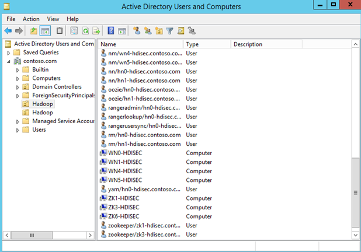

# Use Enterprise Security Package in HDInsight

The standard Azure HDInsight cluster is a single-user cluster. It's suitable for most companies that have smaller application teams building large data workloads. Each user can create a dedicated cluster on demand and destroy it when it's not needed anymore. 

Many enterprises have moved toward a model in which clusters are managed by IT teams, and multiple application teams share clusters. These larger enterprises need multiuser access to each cluster in Azure HDInsight.

HDInsight relies on a popular identity provider--Active Directory--in a managed way. By integrating HDInsight with [Azure Active Directory Domain Services (Azure AD DS)](../../active-directory-domain-services/active-directory-ds-overview.md), you can access the clusters by using your domain credentials. 

The virtual machines (VMs) in HDInsight are domain joined to your provided domain. So, all the services running on HDInsight (Ambari, Hive server, Ranger, Spark thrift server, and others) work seamlessly for the authenticated user. Administrators can then create strong authorization policies by using Apache Ranger to provide role-based access control for resources in the cluster.

## Integrate HDInsight with Active Directory

Open-source Hadoop relies on Kerberos for authentication and security. Therefore, HDInsight cluster nodes with Enterprise Security Package (ESP) are joined to a domain that's managed by Azure AD DS. Kerberos security is configured for the Hadoop components on the cluster. 

For each Hadoop component, a service principal is created automatically. A corresponding machine principal is also created for each machine that's joined to the domain. To store these service and machine principals, you must provide an organizational unit (OU) within the domain controller (Azure AD DS), where these principals are placed. 

To summarize, you need to set up an environment with:

- An Active Directory domain (managed by Azure AD DS).
- Secure LDAP (LDAPS) enabled in Azure AD DS.
- Proper networking connectivity from the HDInsight virtual network to the Azure AD DS virtual network, if you choose separate virtual networks for them. A VM inside the HDInsight virtual network should have a line of sight to Azure AD DS through virtual network peering. If HDInsight and Azure AD DS are deployed in the same virtual network, the connectivity is automatically provided and no further action is needed.
- An OU [created on Azure AD DS](../../active-directory-domain-services/active-directory-ds-admin-guide-create-ou.md).
- A service account that has permissions to:
    - Create service principals in the OU.
    - Join machines to the domain and create machine principals in the OU.

The following screenshot shows an OU created in contoso.com. It also shows some of the service principals and machine principals.

.

## Set up different domain controllers
HDInsight currently supports only Azure AD DS as the main domain controller that the cluster uses for Kerberos communication. But other complex Active Directory setups are possible, as long as such a setup leads to enabling Azure AD DS for HDInsight access.

### Azure Active Directory Domain Services
[Azure AD DS](../../active-directory-domain-services/active-directory-ds-overview.md) provides a managed domain that's fully compatible with Windows Server Active Directory. Microsoft takes care of managing, patching, and monitoring the domain in a highly available (HA) setup. You can deploy your cluster without worrying about maintaining domain controllers. 

Users, groups, and passwords are synchronized from Azure Active Directory (Azure AD). The one-way sync from your Azure AD instance to Azure AD DS enables users to sign in to the cluster by using the same corporate credentials. 

For more information, see [Configure HDInsight clusters with ESP using Azure AD DS](./apache-domain-joined-configure-using-azure-adds.md).

### On-premises Active Directory or Active Directory on IaaS VMs

If you have an on-premises Active Directory instance or more complex Active Directory setups for your domain, you can sync those identities to Azure AD by using Azure AD Connect. You can then enable Azure AD DS on that Active Directory tenant. 

Because Kerberos relies on password hashes, you'll need to [enable password hash sync on Azure AD DS](../../active-directory-domain-services/active-directory-ds-getting-started-password-sync.md). If you're using federation with Active Directory Federation Services (AD FS), you can optionally set up password hash sync as a backup in case your AD FS infrastructure fails. For more information, see [Enable password hash sync with Azure AD Connect sync](../../active-directory/hybrid/how-to-connect-password-hash-synchronization.md). 

Using on-premises Active Directory or Active Directory on IaaS VMs alone, without Azure AD and Azure AD DS, is not a supported configuration for HDInsight clusters with ESP.

## Next steps

* [Configure HDInsight clusters with ESP](apache-domain-joined-configure-using-azure-adds.md)
* [Configure Hive policies for HDInsight clusters with ESP](apache-domain-joined-run-hive.md)
* [Manage HDInsight  clusters with ESP](apache-domain-joined-manage.md) 
