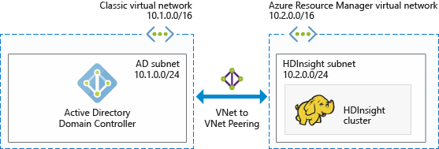

# Plan Azure domain-joined Hadoop clusters in HDInsight

The traditional Hadoop is a single-user cluster. It is suitable for most companies that have smaller application teams building large data workloads. As Hadoop gains popularity, many enterprises are moving toward a model in which clusters are managed by IT teams and multiple application teams share clusters. Thus, functionalities involving multiuser clusters are among the most requested functionalities in Azure HDInsight.

Instead of building its own multiuser authentication and authorization, HDInsight relies on the most popular identity provider--Active Directory (AD). The powerful security functionality in AD can be used to manage multiuser authorization in HDInsight. By integrating HDInsight with AD, you can communicate with the clusters by using your AD credentials. HDInsight maps an AD user to a local Hadoop user, so all the services running on HDInsight (Ambari, Hive server, Ranger, Spark thrift server, and others) work seamlessly for the authenticated user.

## Integrate HDInsight with Active Directory

When you integrate HDInsight with Active Directory, the HDInsight cluster nodes are domain-joined to an AD domain. HDInsight creates service principals for the Hadoop services running on the cluster and places them within a specified organizational unit (OU) in the domain. HDInsight also creates reverse DNS mappings in the domain for the IP addresses of the nodes that are joined to the domain.

There are two deployment options for Active Directory:
* **[Azure Active Directory Domain Services](../../active-directory-domain-services/active-directory-ds-overview.md):** This service provides a managed Active Directory domain which is fully compatible with Windows Server Active Directory. Microsoft takes care of managing, patching, and monitoring the AD domain. You can deploy your cluster without worrying about maintaining domain controllers. Users, groups and passwords are synchronized from your Azure Active Directory, enabling users to sign in to the cluster using their corporate credentials.

* **Windows Server Active Directory domain on Azure IaaS VMs:** In this option, you deploy and manage your own Windows Server Active Directory domain on Azure IaaS VMs. 

You can achieve this setup by using multiple architectures. You can choose from the following architectures.

### HDInsight integrated with an Azure AD Domain Services managed AD domain
You can deploy an [Azure Active Directory Domain Services](../../active-directory-domain-services/active-directory-ds-overview.md) (Azure AD DS) managed domain. Azure AD DS provides a managed AD domain in Azure, which is managed, updated and monitored by Microsoft. It creates two domain controllers for high availability and includes DNS services. You can then integrate the HDInsight cluster with this managed domain. With this deployment option, you do not need to worry about managing, patching, updating and monitoring domain controllers.

Prerequisites for integrating with Azure AD Domain Services:

* [Provision an Azure AD Domain Services managed domain](../../active-directory-domain-services/active-directory-ds-getting-started.md).
* Create an [organizational unit](../../active-directory-domain-services/active-directory-ds-admin-guide-create-ou.md), within which you place the HDInsight cluster VMs and the service principals used by the cluster.
* Setup [LDAPS](../../active-directory-domain-services/active-directory-ds-admin-guide-configure-secure-ldap.md), when you configure Azure AD DS. The certificate used to set up LDAPS must be issued by a public certificate authority (not a self-signed certificate).
* Create reverse DNS zones on the managed domain for the IP address range of the HDInsight subnet (for example, 10.2.0.0/24 in the previous picture).
* Configure [synchronization of password hashes required for NTLM and Kerberos authentication](../../active-directory-domain-services/active-directory-ds-getting-started-password-sync.md) from Azure AD to the Azure AD DS managed domain.
* A service account or a user account is needed. Use this account to create the HDInsight cluster. This account must have the following permissions:

    - Permissions to create service principal objects and machine objects within the organizational unit
    - Permissions to create reverse DNS proxy rules
    - Permissions to join machines to the Azure AD domain

### HDInsight integrated with Windows Server AD running on Azure IaaS

You can deploy the Windows Server Active Directory Domain Services role on one (or multiple) virtual machines (VMs) in Azure and promote them to be domain controllers. These domain controller VMs can be deployed using the resource manager deployment model into the same virtual network as the HDInsight cluster. If the domain controllers are deployed into a different virtual network, you need to peer these virtual networks by using [VNet-to-VNet peering](../../virtual-network/virtual-network-create-peering.md). 

[More information - deploying Windows Server Active Directory on Azure VMs](../../active-directory/virtual-networks-windows-server-active-directory-virtual-machines.md)

> [!NOTE]
> In this architecture, you cannot use Azure Data Lake Store with the HDInsight cluster.

Prerequisites for integrating with Windows Server Active Directory on Azure VMs:

* An [organizational unit](../../active-directory-domain-services/active-directory-ds-admin-guide-create-ou.md) must be created, within which you place the HDInsight cluster VMs and the service principals used by the cluster.
* [Lightweight Directory Access Protocols](../../active-directory-domain-services/active-directory-ds-admin-guide-configure-secure-ldap.md) (LDAPs) must be set up for communicating with AD. The certificate used to set up LDAPS must be a real certificate (not a self-signed certificate).
* Reverse DNS zones must be created on the domain for the IP address range of the HDInsight subnet (for example, 10.2.0.0/24 in the previous picture).
* A service account or a user account is needed. Use this account to create the HDInsight cluster. This account must have the following permissions:

    - Permissions to create service principal objects and machine objects within the organizational unit
    - Permissions to create reverse DNS proxy rules
    - Permissions to join machines to the Active Directory domain

## Next steps
* To configure a domain-joined HDInsight cluster, see [Configure domain-joined HDInsight clusters](apache-domain-joined-configure.md).
* To manage domain-joined HDInsight clusters, see [Manage domain-joined HDInsight clusters](apache-domain-joined-manage.md).
* To configure Hive policies and run Hive queries, see [Configure Hive policies for domain-joined HDInsight clusters](apache-domain-joined-run-hive.md).
* To run Hive queries by using SSH on domain-joined HDInsight clusters, see [Use SSH with HDInsight](../hdinsight-hadoop-linux-use-ssh-unix.md).
