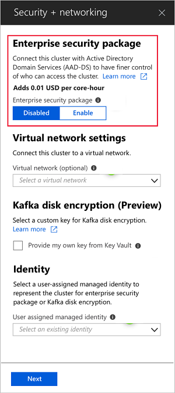

# Configure a HDInsight cluster with Enterprise Security Package by using Azure Active Directory Domain Services

Enterprise Security Package (ESP) clusters provide multi-user access on Azure HDInsight clusters. HDInsight clusters with ESP are connected to a domain so that domain users can use their domain credentials to authenticate with the clusters and run big data jobs. 

In this article, you learn how to configure a HDInsight cluster with ESP by using Azure Active Directory Domain Services (Azure AD-DS).

>[!NOTE]
>ESP is GA in HDI 3.6 for Spark, Interactive, and Hadoop. ESP for HBase and Kafka cluster types is in preview.

## Enable Azure AD-DS

> [!NOTE]
> Only tenant administrators have the privileges to create an Azure AD-DS instance. If the cluster storage is Azure Data Lake Store (ADLS) Gen1 or Gen2, disable Multi-Factor Authentication (MFA) only for users who will access the cluster. If the cluster storage is Azure Blob Storage (WASB), do not disable MFA.

Enabling AzureAD-DS is a prerequisite before you can create a HDInsight cluster with ESP. For more information, see [Enable Azure Active Directory Domain Services using the Azure portal](../../active-directory-domain-services/active-directory-ds-getting-started.md). 

When Azure AD-DS is enabled, all users and objects start synchronizing from Azure Active Directory to Azure AD-DS by default. The length of the sync operation depends on the number of objects in Azure AD. The sync could take a few days for hundreds of thousands of objects. 

Customers can choose to sync only the groups that need access to the HDInsight clusters. This option of syncing only certain groups is called *scoped synchronization*. See [Configure Scoped Synchronization from Azure AD to your managed domain](https://docs.microsoft.com/azure/active-directory-domain-services/active-directory-ds-scoped-synchronization) for instructions.

After you enable Azure AD-DS, a local Domain Name Service (DNS) server runs on the AD Virtual Machines (VMs). Configure your Azure AD-DS Virtual Network (VNET) to use these custom DNS servers. To locate the right IP addresses, select **Properties** under the **Manage** category and look at the IP Addresses listed beneath **IP Address on Virtual Network**.

Change the configuration of the DNS servers in the Azure AD-DS VNET to use these custom IPs by selecting **DNS Servers** under the **Settings** category. Then click the radio button next to **Custom**, enter the first IP Address in the text box below, and click **Save**. Add additional IP Addresses using the same steps.

When enabling secure LDAP, put the domain name in the subject name or the subject alternative name in the certificate. For example, if your domain name is *contoso.com*, make sure that exact name exists in your certificate subject name or subject alternative name. For more information, see [Configure secure LDAP for an Azure AD-DS managed domain](../../active-directory-domain-services/active-directory-ds-admin-guide-configure-secure-ldap.md).

## Check Azure AD-DS health status
View the health status of your Azure Active Directory Domain Services by selecting **Health** under the **Manage** category. Make sure the status of Azure AD-DS is green (running) and the synchronization is complete.

You should make sure that all of the [required ports](https://docs.microsoft.com/en-us/previous-versions/windows/it-pro/windows-server-2008-R2-and-2008/dd772723(v=ws.10)#communication-to-domain-controllers) are whitelisted in the AAD-DS subnet NSG rules, if AAD-DS is secured by a Network Security Group. 

## Create and Authorize a managed identity
> [!NOTE]
> Only AAD-DS administrators have the privileges to authorize this managed identity.

A **user-assigned managed identity** is used to simplify domain services operations. When you assign the managed identity to the HDInsight Domain Services Contributor role, it can read, create, modify, and delete domain services operations. Certain domain services operations such as creating OUs and service principles are needed for the HDInsight Enterprise Security Package. Managed identities can be created in any subscription. For more information, see [Managed identities for Azure resources](../../active-directory/managed-identities-azure-resources/overview.md).

To set up a managed identity for use with HDInsight ESP clusters, create a user-assigned managed identity if you don’t have one already. See [Create, list, delete, or assign a role to a user-assigned managed identity using the Azure portal](https://docs.microsoft.com/azure/active-directory/managed-identities-azure-resources/how-to-manage-ua-identity-portal) for instructions. Next, assign the managed identity to the **HDInsight Domain Services Contributor** role in Azure AD-DS Access control (AAD-DS admin privileges are required to make this role assignment).

Assigning a managed identity to the **HDInsight Domain Services Contributor** role ensures that the identity has proper access to perform certain domain services operations on the AAD-DS domain.

Once the managed identity is created and given the correct role, the AAD-DS admin can set up who can use this managed identity. To set up users for the managed identity, the admin should select the managed identity in the portal, then click **Access Control (IAM)** under **Overview**. Then, on the right, assign the “Managed Identity Operator” role to the users or groups that want to create HDInsight ESP clusters. For example, the AAD-DS admin can assign this role to the “MarketingTeam” group for the “sjmsi” managed identity as shown in the picture below.

## Create a HDInsight cluster with ESP

The next step is to create the HDInsight cluster with ESP enabled using Azure AD-DS.

It's easier to place both the Azure AD-DS instance and the HDInsight cluster in the same Azure virtual network. If they are in different virtual networks, you must peer those virtual networks so that HDInsight VMs are visible to the domain controller and can be added to the domain. For more information, see [Virtual network peering](../../virtual-network/virtual-network-peering-overview.md). 

After the VNETs are peered, configure the HDInsight VNET to use a custom DNS server and input the Azure AD-DS private IPs as the DNS server addresses. When both VNETs use the same DNS servers, your custom domain name will resolve to the right IP and will be reachable from HDInsight. For example if your domain name is “contoso.com” then after this step, pinging “contoso.com” should resolve to the right Azure AD-DS IP. To test if peering is done correctly, join a windows VM to the HDInsight VNET/Subnet and ping the domain name or run **ldp.exe** to access Azure AD-DS domain. Then join this windows VM to the domain to confirm that all the required RPC calls succeed between the client and server.

When you create an HDInsight cluster, you can enable Enterprise Security Package in the custom tab.

Once you enable ESP, common misconfigurations related to Azure AD-DS will be automatically detected and validated.

Early detection saves time by allowing you to fix errors before creating the cluster.

When you create a HDInsight cluster with ESP, you must supply the following parameters:

- **Cluster admin user**: Choose an admin for your cluster from your synced Azure AD-DS. This account must be already synced and available in Azure AD-DS.

- **Cluster access groups**: The security groups whose users you want to sync to the cluster should be available in Azure AD-DS. For example, HiveUsers group. For more information, see [Create a group and add members in Azure Active Directory](../../active-directory/fundamentals/active-directory-groups-create-azure-portal.md).

- **LDAPS URL**: An example is ldaps://contoso.com:636.

The following screenshot shows a successful configuration in the Azure portal:

.

The managed identity you created can be chosen in from the user-assigned managed identity dropdown when creating a new cluster.

.

## Next steps
* For configuring Hive policies and running Hive queries, see [Configure Hive policies for HDInsight clusters with ESP](apache-domain-joined-run-hive.md).
* For using SSH to connect to HDInsight clusters with ESP, see [Use SSH with Linux-based Hadoop on HDInsight from Linux, Unix, or OS X](../hdinsight-hadoop-linux-use-ssh-unix.md#domainjoined).
