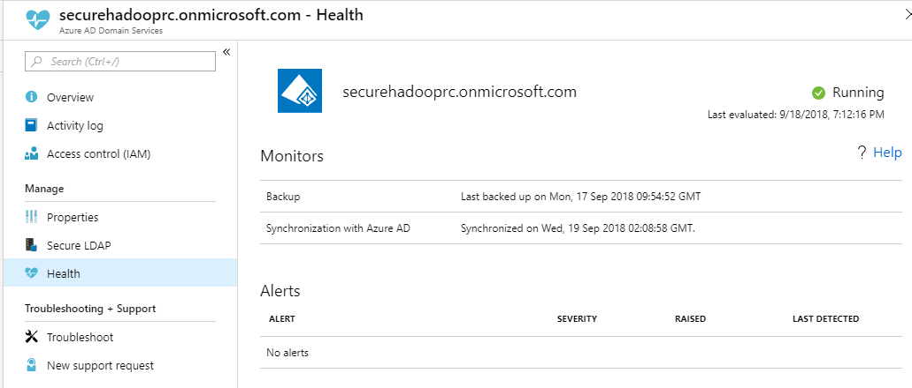
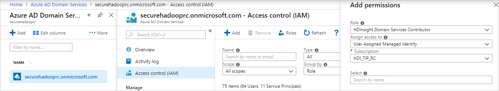
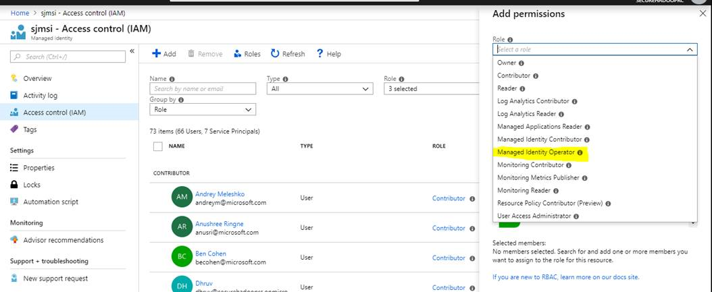
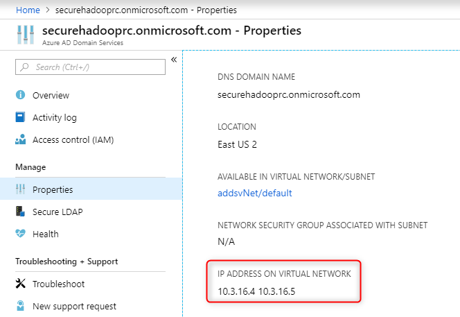
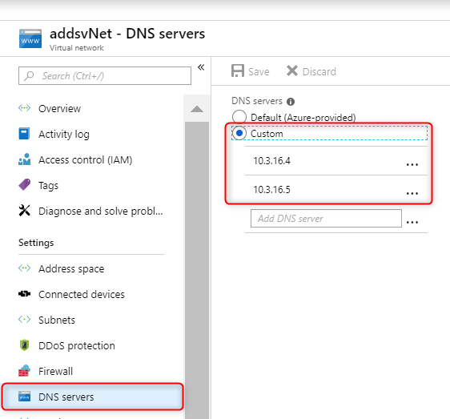
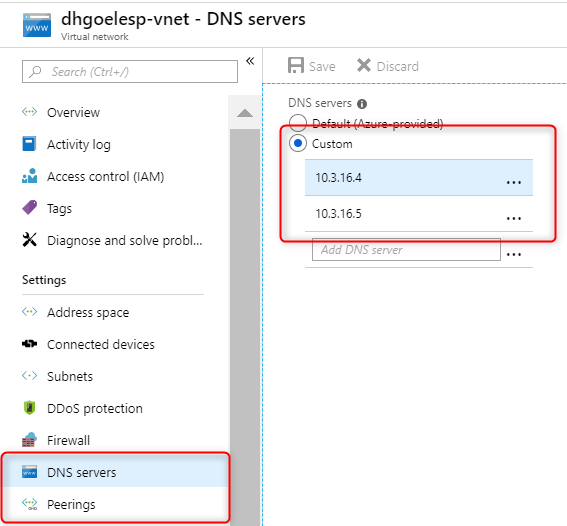
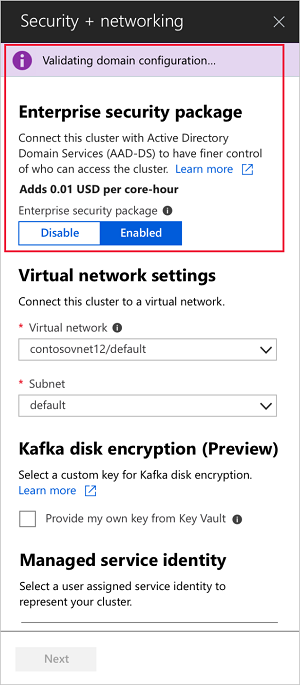
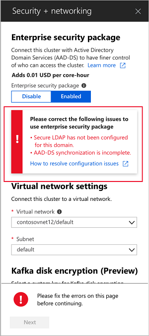
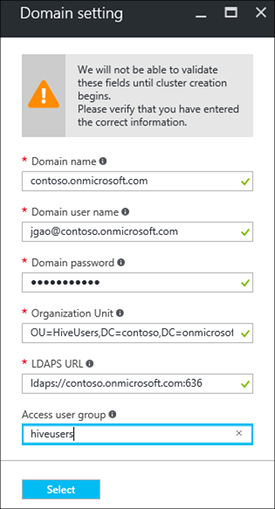
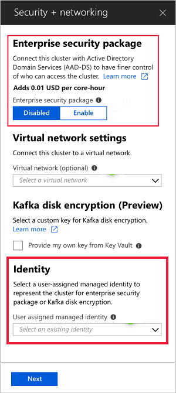

# Configure a HDInsight cluster with Enterprise Security Package by using Azure Active Directory Domain Services

Enterprise Security Package (ESP) clusters provide multi-user access on Azure HDInsight clusters. HDInsight clusters with ESP are connected to a domain so that domain users can use their domain credentials to authenticate with the clusters and run big data jobs.

In this article, you learn how to configure a HDInsight cluster with ESP by using Azure Active Directory Domain Services (Azure AD-DS).

> [!NOTE]  
> ESP is generally available in HDInsight 3.6 and 4.0 for cluster types: Apache Spark, Interactive, Apache Hadoop and HBase. ESP for Apache Kafka cluster type is in preview.

## Enable Azure AD-DS

> [!NOTE]  
> Only tenant administrators have the privileges to enable Azure AD-DS. If the cluster storage is Azure Data Lake Storage (ADLS) Gen1 or Gen2, you must disable Multi-Factor Authentication (MFA) only for users who will need to access the cluster using basic Kerberos authentications. You can use [trusted IPs](../../active-directory/authentication/howto-mfa-mfasettings.md#trusted-ips) or [Conditional Access](../../active-directory/conditional-access/overview.md) to disable MFA for specific users ONLY when they are accessing the HDInsight cluster VNET IP range. If you are using Conditional Access please make sure that AD service endpoint in enabled on the HDInsight VNET.
>
> If the cluster storage is Azure Blob Storage (WASB), do not disable MFA.

Enabling AzureAD-DS is a prerequisite before you can create a HDInsight cluster with ESP. For more information, see [Enable Azure Active Directory Domain Services using the Azure portal](../../active-directory-domain-services/create-instance.md). 

When Azure AD-DS is enabled, all users and objects start synchronizing from Azure Active Directory (AAD) to Azure AD-DS by default. The length of the sync operation depends on the number of objects in Azure AD. The sync could take a few days for hundreds of thousands of objects. 

The domain name that you use with Azure AD-DS must be 39 characters or less, to work with HDInsight.

You can choose to sync only the groups that need access to the HDInsight clusters. This option of syncing only certain groups is called *scoped synchronization*. See [Configure Scoped Synchronization from Azure AD to your managed domain](../../active-directory-domain-services/scoped-synchronization.md) for instructions.

When enabling secure LDAP, put the domain name in the subject name and the subject alternative name in the certificate. For example, if your domain name is *contoso100.onmicrosoft.com*, make sure that exact name exists in your certificate subject name and subject alternative name. For more information, see [Configure secure LDAP for an Azure AD-DS managed domain](../../active-directory-domain-services/configure-ldaps.md). Below is an example of creating a self-signed cert and have the domain name (*contoso100.onmicrosoft.com*) in both Subject name and DnsName (Subject alternate name):

```powershell
$lifetime=Get-Date
New-SelfSignedCertificate -Subject contoso100.onmicrosoft.com `
  -NotAfter $lifetime.AddDays(365) -KeyUsage DigitalSignature, KeyEncipherment `
  -Type SSLServerAuthentication -DnsName *.contoso100.onmicrosoft.com, contoso100.onmicrosoft.com
```

## Check Azure AD-DS health status
View the health status of your Azure Active Directory Domain Services by selecting **Health** under the **Manage** category. Make sure the status of Azure AD-DS is green (running) and the synchronization is complete.



## Create and Authorize a managed identity

A **user-assigned managed identity** is used to simplify and secure domain services operations. When you assign the HDInsight Domain Services Contributor role to the managed identity, it can read, create, modify, and delete domain services operations. Certain domain services operations such as creating OUs and service principals are needed for the HDInsight Enterprise Security Package. Managed identities can be created in any subscription. For more information on managed identities in general, see [Managed identities for Azure resources](../../active-directory/managed-identities-azure-resources/overview.md). For more information on how managed identities work in Azure HDInsight, see [Managed identities in Azure HDInsight](../hdinsight-managed-identities.md).

To set up ESP clusters, create a user-assigned managed identity if you don’t have one already. See [Create, list, delete, or assign a role to a user-assigned managed identity using the Azure portal](../../active-directory/managed-identities-azure-resources/how-to-manage-ua-identity-portal.md) for instructions. Next, assign the **HDInsight Domain Services Contributor** role to the managed identity in Azure AD-DS Access control (AAD-DS admin privileges are required to make this role assignment).



Assigning the **HDInsight Domain Services Contributor** role ensures that this identity has proper (on behalf of) access to perform domain services operations such as creating OUs, deleting OUs, etc. on the AAD-DS domain.

Once the managed identity is created and given the correct role, the AAD-DS admin can set up who can use this managed identity. To set up users for the managed identity, the admin should select the managed identity in the portal, then click **Access Control (IAM)** under **Overview**. Then, on the right, assign the **Managed Identity Operator** role to the users or groups that want to create HDInsight ESP clusters. For example, the AAD-DS admin can assign this role to the **MarketingTeam** group for the **sjmsi** managed identity as shown in the following image. This will ensure that the right people in the organization have access to use this managed identity for the purpose of creating ESP clusters.



## Networking considerations

> [!NOTE]  
> Azure AD-DS must be deployed in an Azure Resource Manager (ARM) based vNET. Classic virtual networks are not supported for Azure AD-DS. Please refer to [Enable Azure Active Directory Domain Services using the Azure portal](../../active-directory-domain-services/active-directory-ds-getting-started-network.md) for more details.

After you enable Azure AD-DS, a local Domain Name Service (DNS) server runs on the AD Virtual Machines (VMs). Configure your Azure AD-DS Virtual Network (VNET) to use these custom DNS servers. To locate the right IP addresses, select **Properties** under the **Manage** category and look at the IP Addresses listed beneath **IP Address on Virtual Network**.



Change the configuration of the DNS servers in the Azure AD-DS VNET to use these custom IPs by selecting **DNS Servers** under the **Settings** category. Then click the radio button next to **Custom**, enter the first IP Address in the text box below, and click **Save**. Add additional IP Addresses using the same steps.



It's easier to place both the Azure AD-DS instance and the HDInsight cluster in the same Azure virtual network. If you plan to use different VNETs, you must peer those virtual networks so that the domain controller is visible to HDI VMs. For more information, see [Virtual network peering](../../virtual-network/virtual-network-peering-overview.md). 

After the VNETs are peered, configure the HDInsight VNET to use a custom DNS server and input the Azure AD-DS private IPs as the DNS server addresses. When both VNETs use the same DNS servers, your custom domain name will resolve to the right IP and will be reachable from HDInsight. For example if your domain name is “contoso.com” then after this step, pinging “contoso.com” should resolve to the right Azure AD-DS IP. 



If you are using Network Security Groups (NSG) rules in your HDInsight subnet, you should allow the [required IPs](../hdinsight-extend-hadoop-virtual-network.md) for both Inbound and Outbound traffic. 

**To test** if your networking is set up correctly, join a windows VM to the HDInsight VNET/Subnet and ping the domain name (it should resolve to an IP), then run **ldp.exe** to access Azure AD-DS domain. Then **join this windows VM to the domain to confirm** that all the required RPC calls succeed between the client and server. You can also use **nslookup** to confirm networking access to your storage account or any external DB you might use (for example, external Hive metastore or Ranger DB).
You should make sure that all of the [required ports](/previous-versions/windows/it-pro/windows-server-2008-R2-and-2008/dd772723(v=ws.10)#communication-to-domain-controllers) are whitelisted in the AAD-DS subnet Network Security Group rules, if AAD-DS is secured by an NSG. If the domain joining of this windows VM is successful, then you can proceed to the next step and create ESP clusters.

## Create a HDInsight cluster with ESP

After setting up the previous steps correctly, the next step is to create the HDInsight cluster with ESP enabled. When you create an HDInsight cluster, you can enable Enterprise Security Package in the **custom** tab. If you prefer to use an Azure Resource Manager template for deployment, use the portal experience once and download the pre-filled template on the last "Summary" page for future reuse.

> [!NOTE]  
> The first six characters of the ESP cluster names must be unique in your environment. For example, if you have multiple ESP clusters in different VNETs, you should choose a naming convension that ensures the first six characters on the cluster names are unique.



Once you enable ESP, common misconfigurations related to Azure AD-DS will be automatically detected and validated. After fixing these errors, you can proceed with the next step: 



When you create a HDInsight cluster with ESP, you must supply the following parameters:

- **Cluster admin user**: Choose an admin for your cluster from your synced Azure AD-DS. This domain account must be already synced and available in Azure AD-DS.

- **Cluster access groups**: The security groups whose users you want to sync and have access to the cluster should be available in Azure AD-DS. For example, HiveUsers group. For more information, see [Create a group and add members in Azure Active Directory](../../active-directory/fundamentals/active-directory-groups-create-azure-portal.md).

- **LDAPS URL**: An example is ldaps://contoso.com:636.

The following screenshot shows a successful configuration in the Azure portal:

.

The managed identity you created can be chosen in from the user-assigned managed identity dropdown when creating a new cluster.

.

## Next steps

* For configuring Hive policies and running Hive queries, see [Configure Apache Hive policies for HDInsight clusters with ESP](apache-domain-joined-run-hive.md).
* For using SSH to connect to HDInsight clusters with ESP, see [Use SSH with Linux-based Apache Hadoop on HDInsight from Linux, Unix, or OS X](../hdinsight-hadoop-linux-use-ssh-unix.md#domainjoined).
