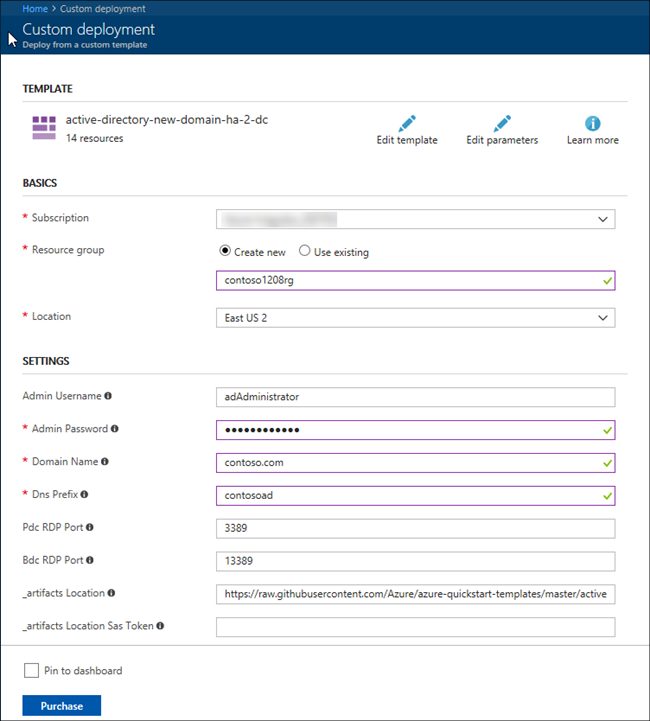
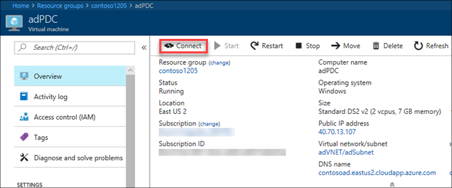
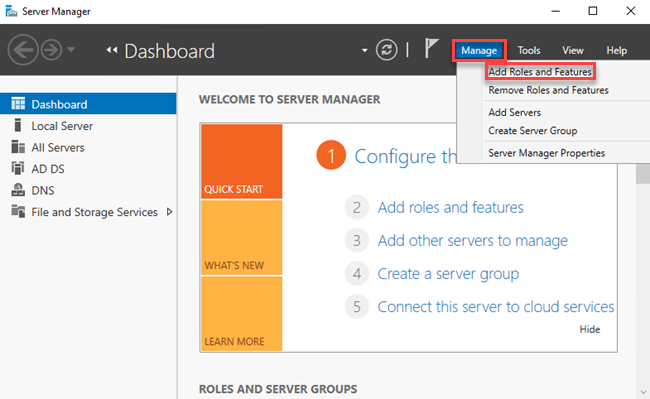
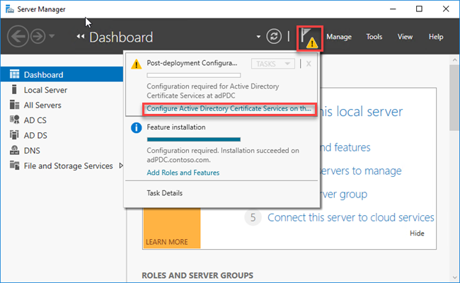
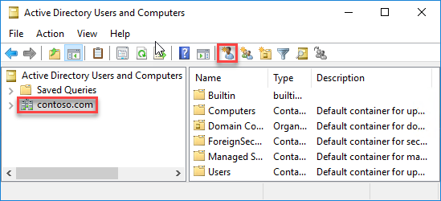
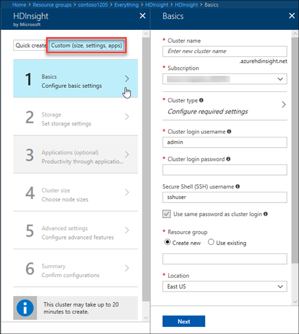
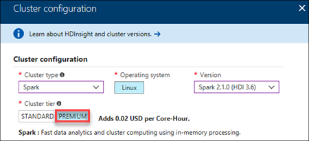
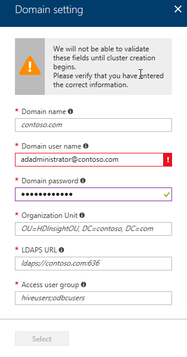

# Configure Domain-joined HDInsight sandbox environment

Learn how to set up an Azure HDInsight cluster with standalone Active Directory and [Apache Ranger](http://hortonworks.com/apache/ranger/) to take advantage of strong authentication and rich role-based access control (RBAC) policies. For more information, see [Introduce Domain-joined HDInsight clusters](apache-domain-joined-introduction.md).

Without domain joined HDInsight cluster, each cluster can only have a Hadoop HTTP users account, and an SSH user account.  The multi-user authentication can be achieved using:

-	A standalone Active Directory running on Azure IaaS
-	Azure Active Directory
-	Active Directory running on the customer on-premises environment.

Using a standalone Active Directory running on Azure IaaS is covered in this article. It is the simplest architecture a customer can follow to get multi-user support on HDInsight. 

> [!IMPORTANT]
> Oozie is not enabled on domain-joined HDInsight.

## Prerequisite
* Azure subscription

## Create an Active Directory

Azure Resource Manager template makes it easier to create Azure resources. In this section, you use an [Azure QuickStart template](https://azure.microsoft.com/resources/templates/active-directory-new-domain-ha-2-dc/) to create a new forest and domain with two virtual machines. The two virtual machines serve as a primary domain controller and a backup domain controller.

**To create a domain with two domain controllers**

1. Click the following image to open the template in the Azure portal.

    

    The template looks like:

    

2. Enter the following values:

    - **Subscription**: Select an Azure subscription.
    - **Resource group name**: Type a resource group name.  A resource group is used to manage your Azure resources that are related to a project.
    - **Location**: Select an Azure location that is close to you.
    - **Admin username**: This is the domain administrator username. This user is not the HTTP user account of your HDInsight cluster. This is the account you use throughout the tutorial.
    - **Admin password**: Enter the password for the domain administrator.
    - **Domain name**: The domain name must be a two-part name. For example: contoso.com, or contoso.local, or hdinsight.test.
    - **DNS prefix**: Type a DNS prefix
    - **PDC RDP Port**: (use the default value for this tutorial)
    - **BDC RDP Port**: (use the default value for this tutorial)
    - **artifacts location**: (use the default value for this tutorial)
    - **artifacts location SAS token**: (Leave it empty for this tutorial.)

It takes about 20 minutes to create the resources.

## Setup LDAPS

The Lightweight Directory Access Protocol (LDAP) is used to read from and write to AD.

**To connect to the PDC using remote desktop**

1. Sign in to the [Azure portal](https://portal.azure.com).
2. Open the resource group, and then open the primary domain controller (PDC) virtual machine. The default PDC name is adPDC. 
3. Click **Connect** to connect to the PDC using remote desktop.

    

**To add the Active Directory Certificate services**

4. Open **Server Manager** if it is not opened.
5. Click **Manage**, and then click **Add Roles and Features**.

    
5. From "Before you begin", click **Next**.
6. Select **Role-based or feature-based installation**, and then click **Next**.
7. Select the PDC, and then click **Next**.  The default PDC name is adPDC.
8. Select **Active Directory Certificate Services**.
9. Click **Add Features** from the popup dialog.
10. Follow the wizard, use the default settings for the rest of the procedure.
11. Click **Close** to close the wizard.

**To configure AD certificate**

1. From Server Manager, click the yellow notification icon, and then click **Configure Active Directory Certificate services**.

    

2. Click **role Services on the left, select **Certification Authority**, and then click **Next**.
3. Follow the wizard, use the default settings for the rest of the procedure (click **Configure** at the last step).
4. Click **Close** to close the wizard.

## (Optional) Create AD users and groups

**To create users and groups in the AD**
1. Connect to the PDC using remote desktop
1. Open **Active Directory Users and Computers**.
2. Select your domain name in the left pane.
3. Click the **Create a new user in the current container** icon on the top menu.

    
4. Follow the instructions to create a few users.
5. Click the **Create a new group in the current container** icon on the top menu.
6. Follow the instructions to create a group called **HDInsightUsers**.  This group is used when you create an HDInsight cluster later in this tutorial.

> [!IMPORTANT]
> You must reboot the PDC virtual machine before creating a domain-joined HDInsight cluster.

## Create an HDInsight cluster in the VNet

In this section, you use the Azure portal to add an HDInsight cluster into the virtual network you created using the Resource Manager template earlier in the tutorial. This article only covers the specific information for domain-joined cluster configuration.  For the general information, see [Create Linux-based clusters in HDInsight using the Azure portal](../hdinsight-hadoop-create-linux-clusters-portal.md).  

**To create a domain-joined HDInsight cluster**

1. Sign on to the [Azure portal](https://portal.azure.com).
2. Open the resource group you created using the Resource Manager template earlier in the tutorial.
3. Add an HDInsight cluster to the resource group.
4. Select **Custom** option:

    

    There are six sections using the custom configuration option: Basics, Storage, Application, Cluster size, Advanced settings, and Summary.
5. In the **Basics** section:

    - Cluster type: Choose **PREMIUM**. Currently you can only create premium cluster with the following cluster types: Hadoop, Interactive Query, and Spark.

        
    - Cluster login username: This is the Hadoop HTTP user. This account is different from the domain administrator account.
    - Resource group: Select the resource group you created earlier using the Resource Manager template.
    - Location:  The location must be the same as the one you used when you create the vnet and the DCs using the Resource Manager template.

6. In the **Advanced settings** section:

    - Domain settings:

        
        
        - Domain name: Enter the domain name you used in [Create an Active Directory](#create-an-active-directory).
        - Domain user name: Enter the AD administrator user name you used in [Create an Active Directory](#create-an-active-directory).
        - Organization Unit: See the screenshot for an example.
        - LDAPS URL: See the screenshot for an example
        - Access user group: Enter the user group name you created in [Create AD users and groups](#optionally-createad-users-and-groups)
    - Virtual network: Select the virtual network you created in [Create an Active Directory](#create-an-active-directory). The default name used in the template is **adVNET**.
    - Subnet: The default name used in the template is **adSubnet**.

After you complete the tutorial, you might want to delete the cluster. With HDInsight, your data is stored in Azure Storage, so you can safely delete a cluster when it is not in use. You are also charged for an HDInsight cluster, even when it is not in use. Since the charges for the cluster are many times more than the charges for storage, it makes economic sense to delete clusters when they are not in use. For the instructions of deleting a cluster, see [Manage Hadoop clusters in HDInsight by using the Azure portal](../hdinsight-administer-use-management-portal.md#delete-clusters).

## Next steps
* For configuring Hive policies and run Hive queries, see [Configure Hive policies for Domain-joined HDInsight clusters](apache-domain-joined-run-hive.md).
* For using SSH to connect to Domain-joined HDInsight clusters, see [Use SSH with Linux-based Hadoop on HDInsight from Linux, Unix, or OS X](../hdinsight-hadoop-linux-use-ssh-unix.md#domainjoined).

