# Create and configure Enterprise Security Package clusters in Azure HDInsight

The Enterprise Security Package for Azure HDInsight gives you access to Active Directory-based authentication, multi-user support, and role-based access control for your Apache Hadoop clusters in Azure. HDInsight ESP clusters enable organizations, which adhere to strict corporate security policies, to process sensitive data securely.

The goal of this guide is to correctly configure the necessary resources so that on-premises users can sign in to an ESP enabled HDInsight cluster. This article walks through the steps needed to create an Enterprise Security Package enabled Azure HDInsight Cluster. The steps will cover creating a Windows IaaS VM with Active Directory & Domain Name Services (DNS) enabled. This server will act as a replacement for your **actual** on-premises environment and will enable you to proceed through the setup and configuration steps so that you can repeat them later in your own environment. This guide will also help you create a hybrid identity environment using password hash sync with Azure Active Directory.

This guide is meant to complement [Use Enterprise Security Package in HDInsight](apache-domain-joined-architecture.md)

Before using this process in your own environment, setup Active Directory and Domain Name Services (DNS). Also, enable Azure Active Directory and sync on-premises user accounts to Azure Active Directory.


## Create on-premises environment

Overview: In this section, you will use an Azure Quick Deployment template to create new VMs, configure Domain Name Services (DNS), and a new AD Forest.

1. Go to [Create an Azure VM with a new AD Forest](https://azure.microsoft.com/resources/templates/active-directory-new-domain/), to view the quick deployment template.

1. Click on **Deploy to Azure**.
1. Sign in to your Azure subscription.
1. On the **Create an Azure VM with a new AD Forest** screen, complete the following steps:
    1. Select the subscription where you want the resources deployed from the **Subscription** dropdown.
    1. Select **Create new** next to **Resource group** and enter the name **OnPremADVRG**
    1. Enter the following details for the rest of the template fields:

        * **Location**: Central US
        * **Admin Username**: HDIFabrikamAdmin
        * **Admin Password**: <YOUR_PASSWORD>
        * **Domain**: HDIFabrikam.com
        * **Dns Prefix**: hdifabrikam

        

    1. Click **Purchase**
    1. Monitor the deployment and wait for it to complete.
    1. Confirm the resources are created under the correct resource group `OnPremADVRG`.

## Configure users and groups for cluster access

Overview: In this section, you will create the users that will have access to the HDInsight cluster by the end of this guide.

1. Connect to the domain controller using Remote Desktop.
    1. If you used the template mentioned at the beginning, the domain controller is a VM called **adVM** in the `OnPremADVRG` resource group.
    1. Go to the Azure portal > **Resource groups** > **OnPremADVRG** > **adVM** > **Connect**.
    1. Click the **RDP** tab and then click **Download RDP File**.
    1. Save the file to your computer and open it.
    1. When prompted for credentials, use `HDIFabrikam\HDIFabrikamAdmin` as the username and then enter the password that you chose for the admin account.

1. Once your Remote Desktop session opens on the domain controller VM, launch **Active Directory Users and Computers** from the **Server Manager** dashboard. Click **Tools** in the upper right and then **Active Directory Users and Computers** from the dropdown.

    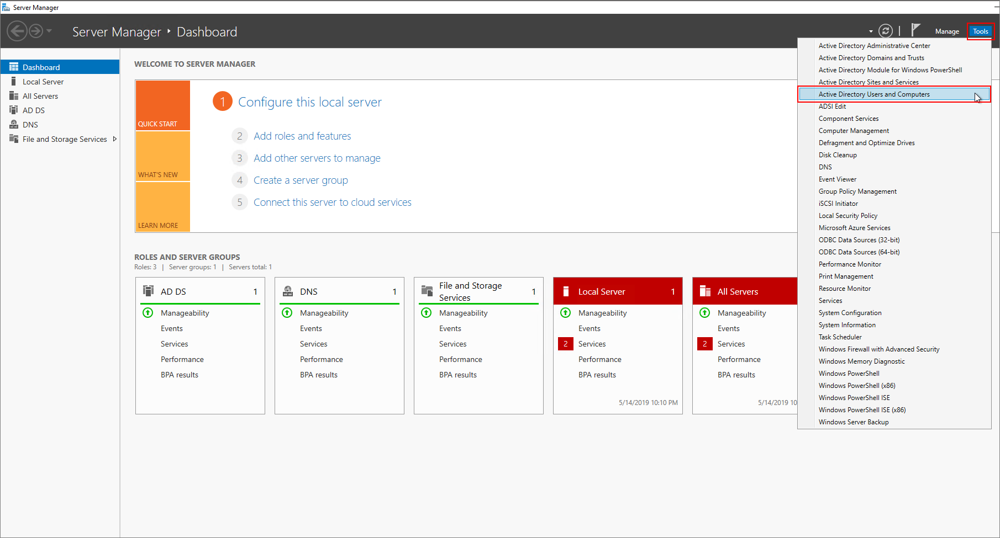

1. Create two new users, **HDIAdmin**, **HDIUser**. These two users will be used to sign in to HDInsight clusters.

    1. In the **Active Directory Users and Computers** screen, click **Action** > **New** > **User**.

        

    1. In the **New Object - User** screen, enter `HDIUser` as the **User logon name** and click **Next**.

        

    1. In the popup that appears, enter the desired password for the new account. Check the box that says **Password never expires**. HDIClick **OK**.
    1. Click **Finish** to create the new account.
    1. Create another user `HDIAdmin`.

        

1. In the **Active Directory Users and Computers** screen, click **Action** > **New** > **Group**. Create `HDIUserGroup` as a new Group.

    

    

1. Add the **HDIUser** created in the previous step to the **HDIUserGroup** as a member.

    1. Right click on the **HDIUserGroup** and click **Properties**.
    1. Go to **Members** tab and click **Add**.
    1. Enter `HDIUser` in the box labeled **Enter the object names to select** and click **OK**.
    1. Repeat the previous steps for the other account `HDIAdmin`

        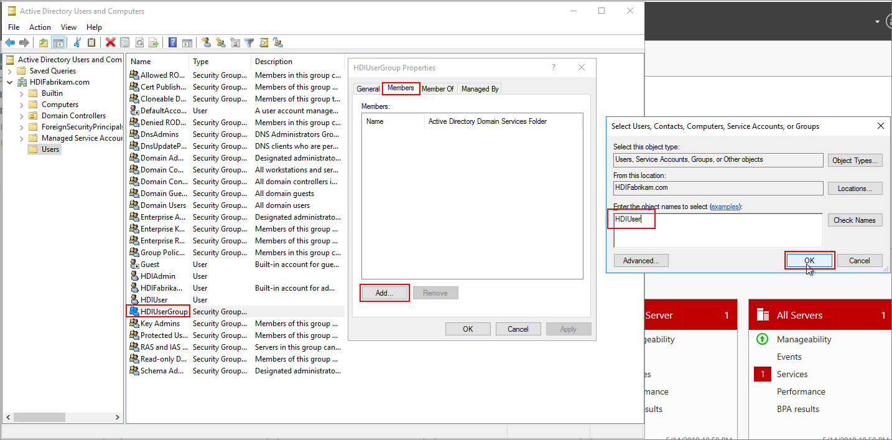

You have now created your Active Directory environment, along with two users and a user group for accessing the HDInsight cluster.

These users will be synchronized with Azure AD.

### Create a new Azure Active Directory

1. Sign in to the Azure portal.
1. Click **Create a resource** and type **directory**. Select **Azure Active Directory** > **Create**.
1. Enter **HDIFabrikam** under **Organization name**.
1. Enter **HDIFabrikamoutlook** under **Initial domain name**.
1. Click **Create**.
1. On the left in the Azure portal, click **Azure Active Directory**.
1. If necessary, click **Switch directory** to change to the new directory that you created **HDIFabrikamoutlook**.
1. Under **Manage** click **Custom domain names** > **Add custom domain**.
1. Enter **HDIFabrikam.com** under **Custom domain name** and click **Add domain**.

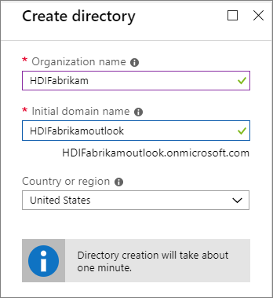

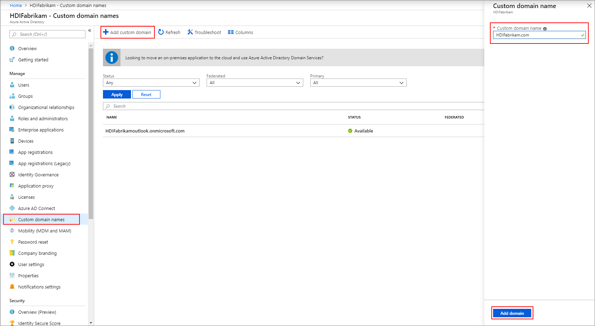

## Configure your Azure AD tenant

Overview: Now you will configure your Azure AD tenant so that you can synchronize users and groups from on-premises AD to the cloud.

1. Create an AD tenant administrator.
    1. Sign in to the Azure portal and select your Azure AD tenant **HDIFabrikam**
    1. Select **Users** under **Manage** and then **New user**.
    1. Enter the following details for the new user:

        * Name: fabrikamazureadmin
        * User name: fabrikamazureadmin@hdifabrikam.com
        * Password: a secure password of your choice

    1. Click on the **Groups** section, search for **AAD DC Administrators**, and click **Select**.

        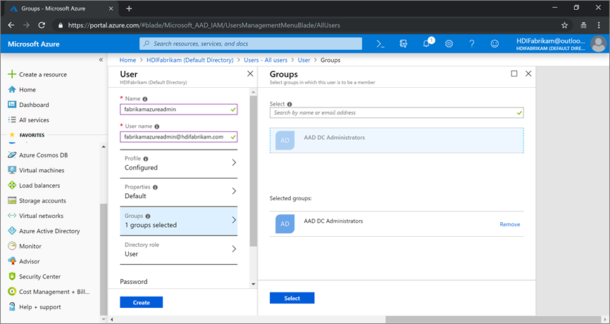

    1. Click on the **Directory role** section and select **Global administrator** in the right side. Click **Ok**.

        

    1. Enter a password for the user. Click **Create**.

1. If you want to change the password for the newly created user <fabrikamazureadmin@hdifabrikam.com>. Sign in to the Azure portal using the identity and then you will prompted to change the password.

## Sync on-premises users to Azure AD

### Download and install Microsoft Azure Active Directory connect

1. [Download Azure AD Connect](https://www.microsoft.com/download/details.aspx?id=47594).

1. Install Microsoft Azure Active Directory connect on the Domain Controller.
    1. Open the executable that you downloaded in the previous step and agree to the license terms. Click **Continue**.

        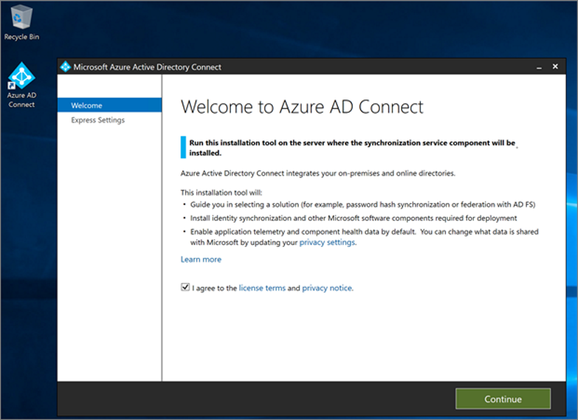

    1. Click **Use express settings** and complete the installation.

        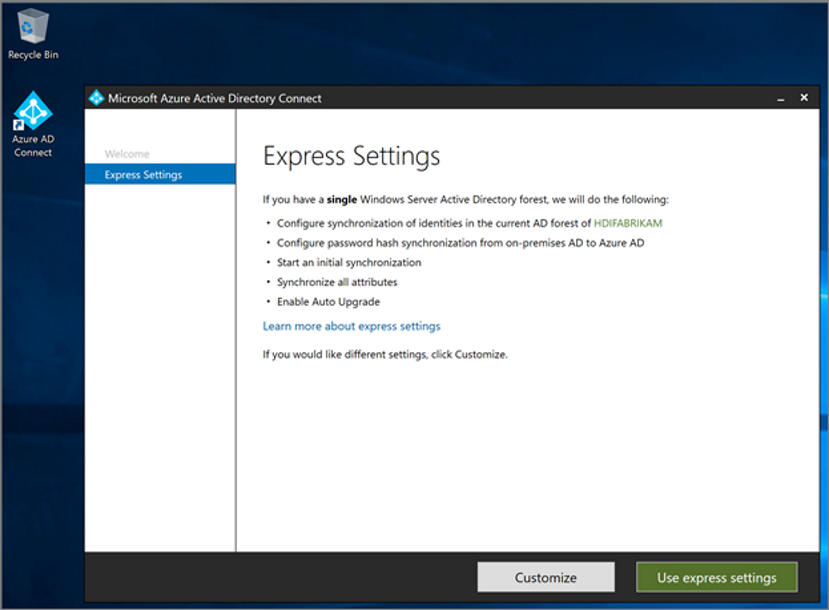

### Configure sync with on-premises domain controller

1. On the **Connect to Azure AD** screen, enter the username and password of the global administrator for Azure AD. Click **Next**. This is the username `fabrikamazureadmin@hdifabrikam.com` that you created when configuring your AD tenant.
    
1. On the **Connect to Active Directory Domain Services** screen, enter the username and password for an enterprise admin account. Click **Next**. This is the username `HDIFabrikam\HDIFabrikamAdmin` and its matching password that you created earlier.

   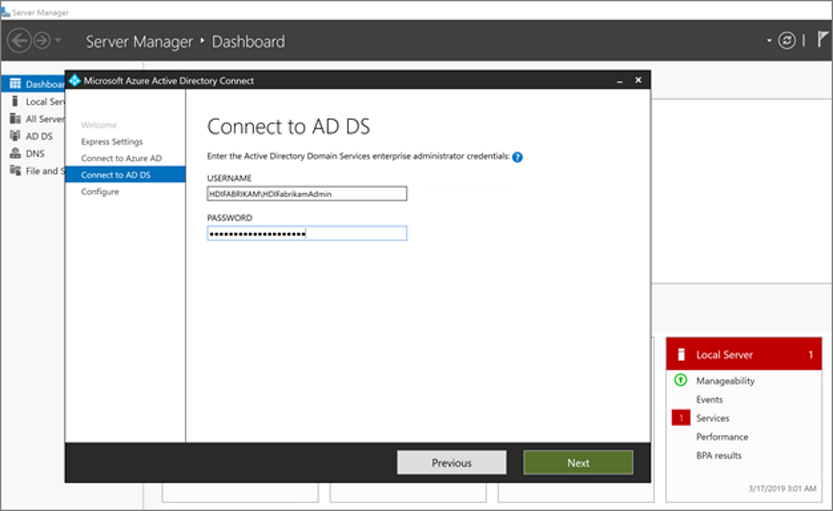
1. On the **Azure AD sign-in configuration** page, click **Next**.
    
1. On the Ready to configure screen, click **Install**.
    
1. When the **Configuration complete** screen is displayed, click **Exit**.
    

1. After the sync is complete confirm if the users that you created on the IAAS Active Directory are Synced to Azure Active Directory.
    1. Sign in to the Azure portal.
    1. Select **Azure Active Directory** > **HDIFabrikam** > **Users**.

### Create an user-assigned managed identity

Create an user-assigned managed identity that will be used to configure Azure Active Directory Domain Services (Azure AD-DS). For more information on creating a user-assigned managed identity, see [Create, list, delete or assign a role to a user-assigned managed identity using the Azure portal](../../active-directory/managed-identities-azure-resources/how-to-manage-ua-identity-portal.md).

1. Sign in to the Azure portal.
1. Click **Create a resource** and type **managed identity**. Select **User Assigned Managed Identity** > **Create**.
1. Enter **HDIFabrikamManagedIdentity** as the **Resource Name**.
1. Select your subscription.
1. Under **Resource group** click **Create new** and enter **HDIFabrikam-CentralUS**.
1. Select **Central US** under **Location**.
1. Click **Create**.


### Enable Azure Active Directory Domain Services

For more information, see [Enable Azure Active Directory Domain Services using the Azure portal](https://docs.microsoft.com/azure/active-directory-domain-services/active-directory-ds-getting-started).

1. Create the Virtual Network to host Azure AD-DS. Run the following powershell code.

    ```powershell
    Connect-AzAccount
    Get-AzSubscription
    Set-AzContext -Subscription 'SUBSCRIPTION_ID'
    $virtualNetwork = New-AzVirtualNetwork -ResourceGroupName 'HDIFabrikam-CentralUS' -Location 'Central US' -Name 'HDIFabrikam-AADDSVNET' -AddressPrefix 10.1.0.0/16
    $subnetConfig = Add-AzVirtualNetworkSubnetConfig -Name 'AADDS-subnet' -AddressPrefix 10.1.0.0/24 -VirtualNetwork $virtualNetwork
    $virtualNetwork | Set-AzVirtualNetwork
    ```

1. Sign in to the Azure portal.
1. Click **Create resource**, enter **Domain services** and select **Azure AD Domain Services**.
1. On the **Basics** screen complete the following steps:
    1. Under **Directory name** select the Azure Active Directory created for this article, **HDIFabrikam**.
    1. Enter a **DNS domain name** of **HDIFabrikam.com**.
    1. Select your subscription.
    1. Specify the resource group **HDIFabrikam-CentralUS** and the **Location** of **Central US**.

        

1. On the **Network** screen complete, select the network (**HDIFabrikam-VNET**) and the subnet (**AADDS-subnet**) that you created with the previous powershell script. Or you can use the **Create new** option to create a virtual network now.

    

1. On the **Administrator group** screen, you should see a notification that a group named **AAD DC Administrators** has already been created to administer this group. You can optionally modify membership of this group, but it is not required for the steps of this article. Click **OK**.

    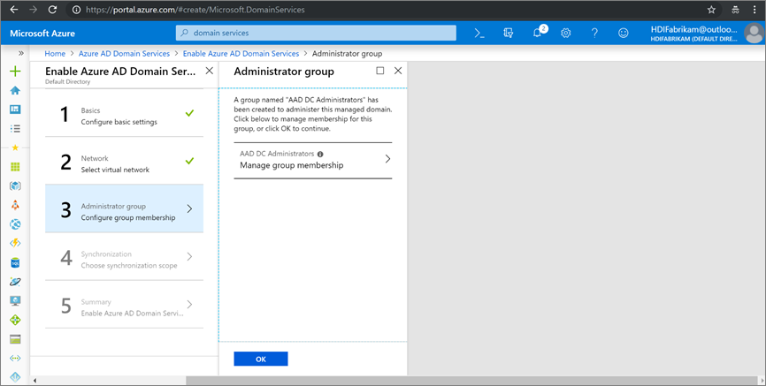

1. On the **Synchronization** screen, enable complete synchronization by selecting **All** and then click **OK**.

    

1. On the **Summary** screen, verify the details for the Azure AD-DS and click **Ok**.

    

1. After you enable Azure AD-DS, a local Domain Name Service (DNS) server runs on the AD Virtual Machines (VMs).

### Configure your Azure AD-DS virtual network

The steps in this section will help you configure your Azure AD-DS virtual network (**HDIFabrikam-AADDSVNET**) to use your custom DNS servers.

1. Locate the IP addresses of your custom DNS servers. Click on the **HDIFabrikam.com** AD-DS resource, click **Properties** under **Manage**  and look at the IP Addresses listed under **IP Address on Virtual Network**.

    

1. Configure **HDIFabrikam-AADDSVNET** to custom IPs `10.0.0.4` and `10.0.0.5`.

    1. Select **DNS Servers** under the **Settings** category. then click the radio button next to **Custom**, enter the first IP Address (10.0.0.4) in the text box below, and click **Save**.
    1. Add additional IP Addresses (10.0.0.5) using the same steps.

1. In our scenario Azure AD-DS was configured to use IP Addresses 10.0.0.4 and 10.0.0.5, setting the same IP address on AADDS VNet as show in the image below.

    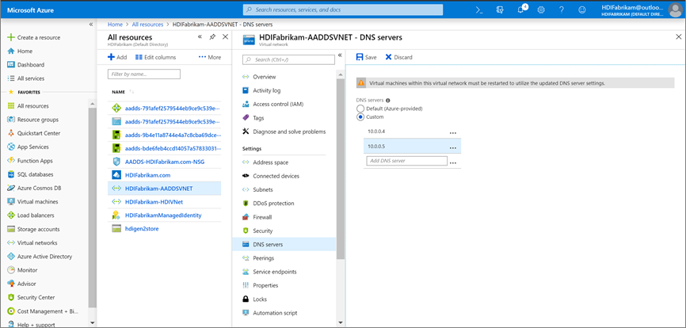

## Securing LDAP traffic

Lightweight Directory Access Protocol (LDAP) is used to read from and write to Active Directory. You can make LDAP traffic confidential and secure by using Secure Sockets Layer (SSL) / Transport Layer Security (TLS) technology. You can enable LDAP over SSL (LDAPS) by installing a properly formatted certificate.

For more information on secure LDAP, see [Configure secure LDAP (LDAPS) for an Azure AD Domain Services managed domain](https://docs.microsoft.com/azure/active-directory-domain-services/active-directory-ds-admin-guide-configure-secure-ldap).

In this section, you create a self-signed certificate, download the certificate and configure secure LDAP (LDAPS) for the **hdifabrikam** Azure AD-DS managed domain.

The following script creates a certificate for hdifabrikam. The certificate is saved under the path "LocalMachine".

> [!Note] 
> Any utility or application that creates a valid PKCS \#10 request can be used to form the SSL certificate request.

```powershell
$lifetime = Get-Date
New-SelfSignedCertificate -Subject hdifabrikam.com `
-NotAfter $lifetime.AddDays(365) -KeyUsage DigitalSignature, KeyEncipherment `
-Type SSLServerAuthentication -DnsName *.hdifabrikam.com, hdifabrikam.com
```

Verify that the certificate is installed in the computer\'s Personal store. Complete the following steps:

1. Start Microsoft Management Console (MMC).
1. Add the Certificates snap-in that manages certificates on the local computer.
1. Expand **Certificates (Local Computer)**, expand **Personal**, and then expand **Certificates**. A new certificate should exist in the Personal store. This certificate is issued to the fully qualified host name.

    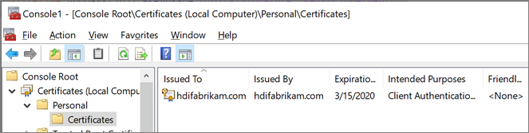

1. In the right pane, right-click the certificate that you created in the previous step, point to **All Tasks**, and then click **Export**.

1. On the **Export Private Key** page, click **Yes, export the private, key**. The private key is required for the encrypted messages to be read from the computer where the key will be imported.

    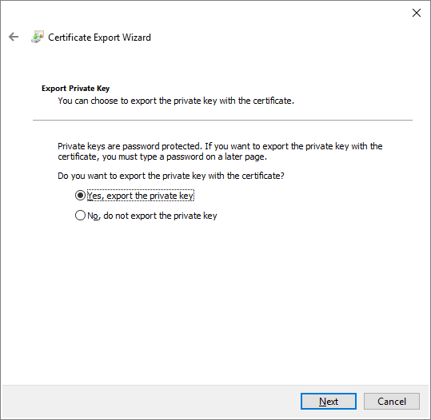

1. On the **Export File Format** page, leave the default settings, and then click **Next**. 
1. On the **Password** page, type a password for the private key, select **TripleDES-SHA1** for **Encryption** and click **Next**.
1. On the **File to Export** page, type the path and the name for the exported certificate file, and then
click **Next**.
1. The file name has to be .pfx extension, this file is configured on Azure portal to establish secure connection.
1. Enable secure LDAP (LDAPS) for an Azure AD Domain Services managed domain.
    1. Select the domain **HDIFabrikam.com** from the Azure portal.
    1. Click **Secure LDAP** under **Manage**.
    1. On the **Secure LDAP** screen, click **Enable** under **Secure LDAP**.
    1. Browse for the .pfx certificate file that you exported on your computer.
    1. Enter the certificate password.

    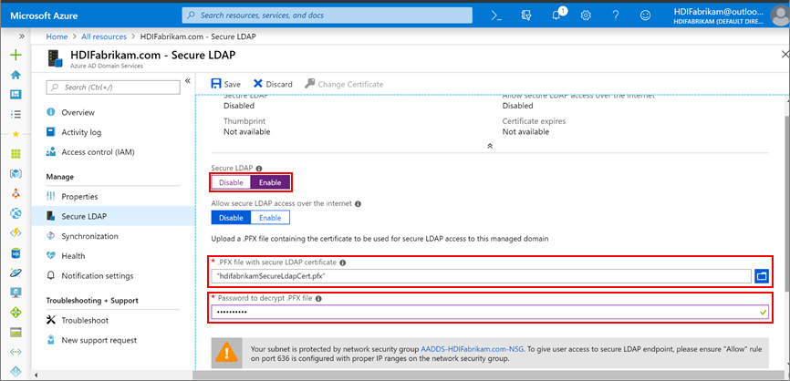

1. Now that you enabled Secure LDAP, make sure it is reachable by enabling port 636.
    1. Click the network security group **AADDS-HDIFabrikam.com-NSG** in the **HDIFabrikam-CentralUS** resource group.
    1. Under **Settings** click **Inbound security rules** > **Add**.
    1. On the **Add inbound security rule** screen, enter the following properties and click **Add**:

        | Property | Value |
        |---|---|
        | Source | Any |
        | Source port ranges | * |
        | Destination | Any |
        | Destination port range | 636 |
        | Protocol | Any |
        | Action | Allow |
        | Priority | \<Desired Number\> |
        | Name | Port_LDAP_636 |

    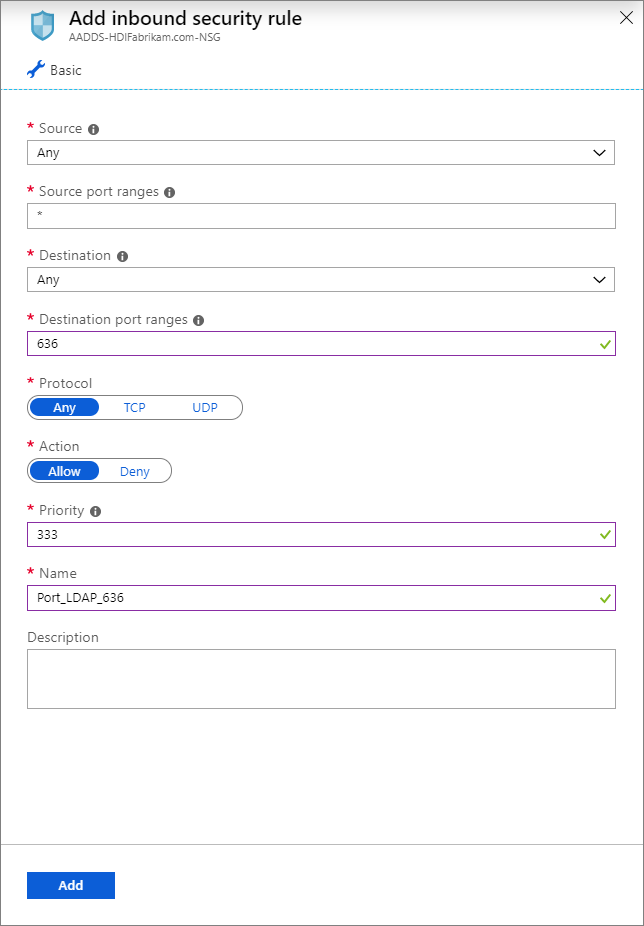

1. `HDIFabrikamManagedIdentity` is the user-assigned managed identity, the HDInsight Domain Services Contributor role is enabled to the managed identity that will enable this Identity to read, create, modify, and delete domain services operations.

    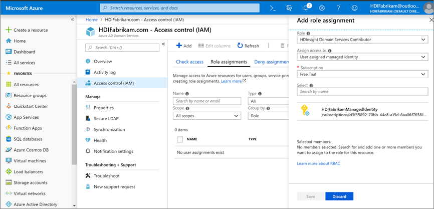

## Creating Enterprise Security Package enabled HDInsight cluster

This step requires the following pre-requisites:

1. Create a new resource group `HDIFabrikam-WestUS` in the location `West US`.
1. Create a virtual network that will host ESP enabled HDInsight cluster.

    ```powershell
    $virtualNetwork = New-AzVirtualNetwork -ResourceGroupName 'HDIFabrikam-WestUS' -Location 'West US' -Name 'HDIFabrikam-HDIVNet' -AddressPrefix 10.1.0.0/16
    $subnetConfig = Add-AzVirtualNetworkSubnetConfig -Name 'SparkSubnet' -AddressPrefix 10.1.0.0/24 -VirtualNetwork $virtualNetwork
    $virtualNetwork | Set-AzVirtualNetwork
    ```

1. Create a peer relationship between the Virtual Network that is hosting AADDS (`HDIFabrikam-AADDSVNET`) and the Virtual Network that will host the ESP enabled HDInsight cluster (`HDIFabrikam-HDIVNet`). Use the following powershell code to peer these two virtual networks.

    ```powershell
    Add-AzVirtualNetworkPeering -Name 'HDIVNet-AADDSVNet' -RemoteVirtualNetworkId (Get-AzVirtualNetwork -ResourceGroupName 'HDIFabrikam-CentralUS').Id -VirtualNetwork (Get-AzVirtualNetwork -ResourceGroupName 'HDIFabrikam-WestUS')

    Add-AzVirtualNetworkPeering -Name 'AADDSVNet-HDIVNet' -RemoteVirtualNetworkId (Get-AzVirtualNetwork -ResourceGroupName 'HDIFabrikam-WestUS').Id -VirtualNetwork (Get-AzVirtualNetwork -ResourceGroupName 'HDIFabrikam-CentralUS')
    ```

1. Create a new Azure Data Lake Storage Gen2 account, **Hdigen2store**, that is configured with the user managed identity **HDIFabrikamManagedIdentity**. For more information on creating Data Lake Storage Gen2 accounts enabled with user managed identities, see [Use Azure Data Lake Storage Gen2 with Azure HDInsight clusters](../hdinsight-hadoop-use-data-lake-storage-gen2.md).

1. Setup custom DNS on the **HDIFabrikam-AADDSVNET** virtual network.
    1. Go to the Azure portal > **Resource groups** > **OnPremADVRG** > **HDIFabrikam-AADDSVNET** > **DNS servers**.
    1. Select **Custom** and enter `10.0.0.4` and `10.0.0.5`.
    1. Click **Save**.

        

1. Create a new ESP-enabled HDInsight Spark cluster.
    1. Click **Custom (size, settings, apps)**.
    2. Enter the desired details for section 1 **Basics**. Ensure that the **Cluster type** is **Spark 2.3 (HDI 3.6)** and the **Resource group** is **HDIFabrikam-CentralUS**

    1. Under section 2 **Security + Networking**, complete the following steps:
        1. Click **Enabled** under **Enterprise Security Package**.
        1. Click **Cluster admin user** and select the **HDIAdmin** account that you created earlier as the on-premises admin user. Click **Select**.

        1. Click **Cluster access group** and then select **HDIUserGroup**. Any user that you add to this group in the future will be able to access HDInsight clusters.

            

    1. Complete the other steps of the cluster configuration and verify the details on the **Cluster summary**. Click **Create**.

1. Sign in to the Ambari UI for the newly created cluster at `https://CLUSTERNAME.azurehdinsight.net` by using your admin user name `hdiadmin@hdifabrikam.com` and password.

    

1. Click **Roles** from the cluster dashboard.
1. On the **Roles** page, enter the group **hdiusergroup** to assign it to the **Cluster Administrator** role under **Assign roles to these**.

    

1. Open your SSH client and login to the cluster using the **hdiuser** that you created previously in the on-premises Active Directory.

    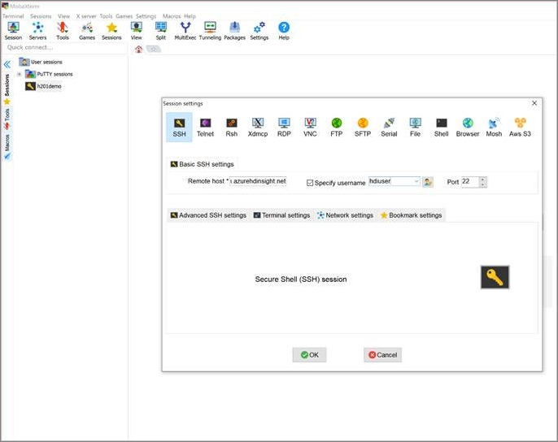

If you are able to login with this account, then you have configured your ESP cluster correctly to sync with your on-premises active directory.

## Next steps

* [An introduction to Apache Hadoop security with Enterprise Security Package](apache-domain-joined-introduction.md)
