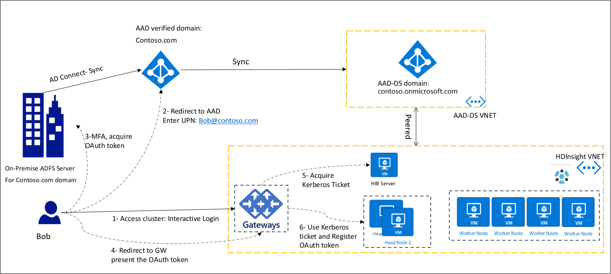

# HDInsight Identity Broker (HIB) - Preview

HDInsight Identity Broker (HIB) lets users sign in to Ambari using MFA and get the required Kerberos tickets without needing password hashes in Azure Active Directory Domain Services (AAD-DS). This article describes HIB, and explains how to enable and test HIB.

## Overview

Different enterprise organizations use different Azure AD setups. Some organizations use Azure AD only with cloud-only accounts to access cloud assets. They have the easiest path to configure Hadoop enterprise security with HDInsight.

Other organizations rely on federation to provide authentication to their end users. To use ESP clusters, these organizations had to enable password hash sync from their on-premises environment to Azure AD. However, some enterprises don't always enable on-premises password hash synchronization to Azure AD.

Apache Hadoop relies on Kerberos for authentication, and components like Apache Ranger use Kerberos tickets to validate user identity. However, cloud technologies like Azure Data Lake Storage (ADLS) use modern authentication protocols like OAuth. The challenge is to provide a unified authentication model that works end-to-end across these different Azure AD setups.

The HDInsight ID Broker (HIB) simplifies complex authentication setups, and removes the requirement to have password hashes available in AAD. Organizations that use HIB in Enterprise Security Package (ESP) clusters can login to cluster using MFA and without providing any passwords. Alternatively, if the end user has already loged in to other Azure services such as Azure Portal, they can now seamlessly login to the cluster with a Single Sign-On (SSO) experience.

HIB consists of components running on a Windows Server VM (HIB Server), and cluster gateway nodes. After enabling HIB, the authentication flow for all users including federated users looks like the following diagram:

## Enable HDInsight ID Broker

During the cluster creation, after enabling ESP, you have the option to enable HIB as well. This will add one extra VM to the cluster which includes HIB server components. HIB server will also be domain joined to the AAD-DS domain.

### Tools Integration

HDInsight IntelliJ plugin is updated to support OAuth. End users can use this plugin to connect to the cluster.

## FAQs

### Can I SSH to the cluster if the password hash is not available in AAD-DS?

- No, To SSH to a domain joiend VM (or to run `kinit` command), you need to provide password and therefore the hash should be availabble in the domain (i.e. AAD-DS). If you would like to use ssh for administrative scenarios, you have the option to create one cloud only account and use that to SSH and other users use Ambari or HDInsight tools (such as IntelliJ plugin) to access the cluster.
  

## Next steps

[Configure a HDInsight cluster with Enterprise Security Package by using Azure Active Directory Domain Services](apache-domain-joined-configure-using-azure-adds.md)

[Synchronize Azure Active Directory users to an HDInsight cluster](../hdinsight-sync-aad-users-to-cluster.md)

[Monitor cluster performance](../hdinsight-key-scenarios-to-monitor.md)
