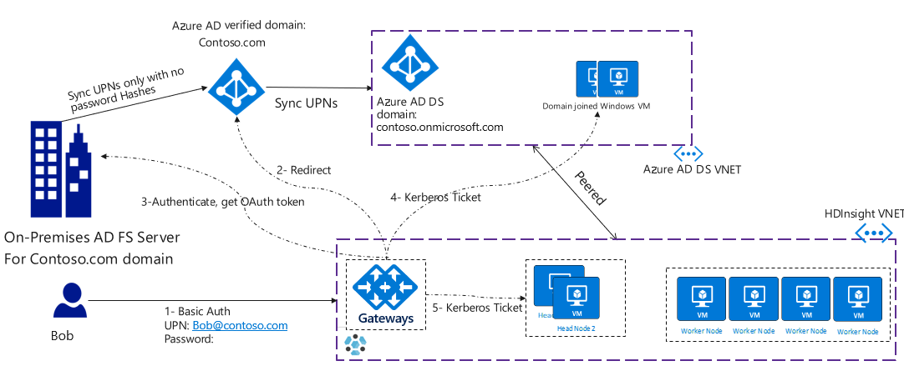

# HDInsight ID Broker (HIB)

HDInsight ID Broker (HIB) lets federated users sign in to Hadoop components and get required Kerberos tickets without using their on-premises Active Directory or needing password hashes in Azure Active Directory (Azure AD). This article describes HIB, and explains how to enable and test HIB with a private build. 

## Overview

Different enterprise organizations use different Azure AD setups. Some organizations use Azure AD only with cloud-only accounts to access cloud assets. They have the easiest path to configure Hadoop enterprise security with HDInsight.

Other organizations rely on federation to provide authentication to their end users. Organizations that use Active Directory Federation Services (AD FS) federation with Azure AD should enable NTLM password hash sync from their on-premises environment to Azure AD. Password hash sync helps with disaster recovery if the AD FS infrastructure fails, and helps protect against leaked credentials. For more information about password hash sync, see [this video](https://youtu.be/qQruArbu2Ew). However, enterprises don't always enable on-premises password hash synchronization to Azure AD.

Apache Hadoop relies on Kerberos for authentication, and components like Apache Ranger use Kerberos tickets to validate user identity. However, cloud technologies like Azure Data Lake Storage use modern authentication protocols like OAuth. The challenge is to provide a unified authentication model that works end-to-end across these different Azure AD setups.

The new HDInsight ID Broker (HIB) feature facilitates complex AD FS authentication setups, and removes the requirement to have password hashes available in Azure AD. Organizations that use HIB in Enterprise Security Package (ESP) clusters benefit from one unified authentication model that works for both OAuth and Kerberos. Because HIB doesn't require password hashes to be available in Azure AD, these enterprises no longer need to sync password hashes from their on-premises environments.

HIB consists of components running on a Windows Server VM, and cluster gateway nodes. After enabling HIB, the authentication flow for federated users looks like the following diagram:

## Enable HDInsight ID Broker 

To whitelist the HIB feature, email your subscription ID and Azure region to [omidm@microsoft.com](mailto:omidm@microsoft.com). This subscription will get a private build that won't be kept up-to-date for other HDInsight cases. Don't run any production HDInsight cluster or workloads in this subscription. Use the private build only for HIB testing.

### Prerequisites 

- A cloud-only (non-federated) user account available in Azure AD and synchronized to Azure AD Domain Services (Azure AD DS)
  
- Federated users' UPNs synced and available to Azure AD DS 
  
- Multi-factor authentication (MFA) disabled for federated users who access the cluster
  
  You can use [trusted IPs](../../active-directory/authentication/howto-mfa-mfasettings.md#trusted-ips) or [conditional access](../../active-directory/conditional-access/overview.md) to disable MFA for specific users when they're accessing the HDInsight cluster virtual network (VNET) IP range only. If you're using conditional access, make sure the Active Directory service endpoint is enabled on the HDInsight VNET.
  
- Connectivity from the HDInsight VNET to the AD FS server endpoint
  
  To check connectivity, go to the unauthenticated endpoint *https:\//login.microsoftonline.com/common/userrealm/\<contoso.com>?api-version=1.0*, replacing \<contoso.com> with your federated domain name. The response should be similar to the following snippet. Pay particular attention to the **federation_protocol** and the **federation_metadata_url**. Make sure virtual machines (VMs) inside the HDInsight VNET or subnet have network access to the **federation_metadata_url**.
  
  { 
    "ver":"1.0", 
    "account_type":"Federated", 
    "domain_name":"contoso.com", 
    **"federation_protocol":"WSTrust"**, 
    **"federation_metadata_url":"https:\//fam.contoso.com/pf/sts_mex.ping?PartnerSpId=urn:federation:MicrosoftOnline"**, 
    "federation_active_auth_url":"https:\//fam.contoso.com/idp/sts.wst", 
    "cloud_instance_name":"microsoftonline.com", 
    "cloud_audience_urn":"urn:federation:MicrosoftOnline" 
   } 

### Deploy a VM and install the HIB service

1. Deploy one Windows Server 2016 D4S_V3 SKU VM in the Azure AD DS VNET.
   
1. Domain join the Windows VM to the Azure AD DS domain with your cloud-only user credentials.
   
1. Sign in with the cloud-only user account and download the contents of the folder at [https://hibinstaller.blob.core.windows.net/download/HIBInstaller.zip](https://hibinstaller.blob.core.windows.net/download/HIBInstaller.zip).

1.  Run *InstallKCDService.ps1* in an administrator PowerShell prompt. Pass the [Azure AD tenant ID](https://stackoverflow.com/questions/26384034/how-to-get-the-azure-account-tenant-id) as the input parameter to the script.

### Deploy an ESP cluster

You can now deploy an ESP cluster with the private build. In the ESP settings, choose the domain admin account (either the cloud-only user or a federated user), and an access group consisting of federated users.

- If you choose the cloud-only user as the domain admin, this user can secure shell (SSH) connect to the cluster after creation.
  
- If you choose a federated user as the domain admin, this user won't be able to SSH or kinit to the cluster after creation.

### Enable or disable HIB

After successfully deploying the ESP cluster, to enable HIB: 

1. Go to *https:\//\<clusterdnsname>.azurehdinsight.net/resourcekcd/enable*.
   
1. When prompted for credentials, use the cluster domain administrator. The gateway will attempt to get an OAuth token for this user through direct auth or federation.
   
1. If the enable was successful, wait for five minutes. 

To disable HIB, go to *https:\//\<clusterdnsname>.azurehdinsight.net/resourcekcd/disable*. 

## Known limitations of the private build

- SSH access for domain users and kinit will only work for cloud-only accounts that have password hashes available in Azure AD DS. You can create a cluster with the cloud-only user as the admin to get SSH access.
  
- Any custom apps that use SPNEGO (without Keytabs) won't work.
  
- Zeppelin SSO won't work, because it needs to use SPNEGO instead of basic auth.
  
- ESP clusters with WASB aren't tested yet.
  
- There's no monitoring on the Windows VMs in the Azure AD DS VNET. You should manage availability, and since this machine is highly privileged, use strict authentication policies.

