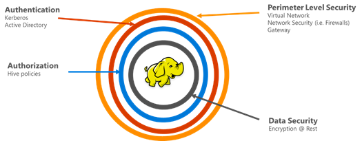

# An introduction to Hadoop security with Enterprise Security Package

In the past, Azure HDInsight supported only a single user: local admin. This worked great for smaller application teams or departments. As Hadoop-based workloads gained more popularity in the enterprise sector, the need for enterprise-grade capabilities like Active Directory-based authentication, multi-user support, and role-based access control became increasingly important. 

You can create an HDInsight cluster with Enterprise Security Package (ESP) that's joined to an Active Directory domain. You can then configure a list of employees from the enterprise who can authenticate through Azure Active Directory to log on to the HDInsight cluster. No one from outside the enterprise can log on or access the HDInsight cluster. 

The enterprise admin can configure role-based access control (RBAC) for Hive security by using [Apache Ranger](http://hortonworks.com/apache/ranger/). Configuring RBAC restricts data access to only what's needed. Finally, the admin can audit the data access by employees and any changes done to access control policies. The admin can then achieve a high degree of governance of their corporate resources.

> [!NOTE]
> The new features described in this article are available in preview only on the following cluster types: Hadoop, Spark, and Interactive Query. Oozie is now enabled on ESP clusters. To access the Oozie web UI, users should enable [tunneling](../hdinsight-linux-ambari-ssh-tunnel.md).

Enterprise security contains four major pillars: perimeter security, authentication, authorization, and encryption.

.

## Perimeter security
Perimeter security in HDInsight is achieved through virtual networks and the Azure VPN Gateway service. An enterprise admin can create an ESP cluster inside a virtual network and use network security groups (firewall rules) to restrict access to the virtual network. Only the IP addresses defined in the inbound firewall rules will be able to communicate with the HDInsight cluster. This configuration provides perimeter security.

Another layer of perimeter security is achieved through the VPN Gateway service. The gateway acts as first line of defense for any incoming request to the HDInsight cluster. It accepts the request, validates it, and only then allows the request to pass to the other nodes in cluster. In this way, the gateway provides perimeter security to other name and data nodes in the cluster.

## Authentication
An enterprise admin can create a HDInsight cluster with ESP in a [virtual network](https://azure.microsoft.com/services/virtual-network/). All the nodes of the HDInsight cluster are joined to the domain that the enterprise manages. This is achieved through the use of [Azure Active Directory Domain Services](../../active-directory-domain-services/active-directory-ds-overview.md). 

With this setup, enterprise employees can log on to the cluster nodes by using their domain credentials. They can also use their domain credentials to authenticate with other approved endpoints like Ambari Views, ODBC, JDBC, PowerShell, and REST APIs to interact with the cluster. The admin has full control over limiting the number of users who interact with the cluster via these endpoints.

## Authorization
A best practice that most enterprises follow is making sure that not every employee has access to all enterprise resources. Likewise, the admin can define role-based access control policies for the cluster resources. 

For example, the admin can configure [Apache Ranger](http://hortonworks.com/apache/ranger/) to set access control policies for Hive. This functionality ensures that employees can access only as much data as they need to be successful in their jobs. SSH access to the cluster is also restricted to only the administrator.

## Auditing
Auditing of all access to the cluster resources, and the data, is necessary to track unauthorized or unintentional access of the resources. It's as important as protecting the HDInsight cluster resources from unauthorized users and securing the data. 

The admin can view and report all access to the HDInsight cluster resources and data. The admin can also view and report all changes to the access control policies created in Apache Ranger supported endpoints. 

A HDInsight cluster with ESP uses the familiar Apache Ranger UI to search audit logs. On the back end, Ranger uses [Apache Solr](http://hortonworks.com/apache/solr/) for storing and searching the logs.

## Encryption
Protecting data is important for meeting organizational security and compliance requirements. Along with restricting access to data from unauthorized employees, you should encrypt it. 

Both data stores for HDInsight clusters--Azure Blob storage and Azure Data Lake Storage Gen1--support transparent server-side [encryption of data](../../storage/common/storage-service-encryption.md) at rest. Secure HDInsight clusters will seamlessly work with this capability of server-side encryption of data at rest.

## Next steps

* [Plan for HDInsight clusters with ESP](apache-domain-joined-architecture.md)
* [Configure HDInsight clusters with ESP](apache-domain-joined-configure.md)
* [Manage HDInsight clusters with ESP](apache-domain-joined-manage.md)
* [Configure Hive policies for HDInsight clusters with ESP](apache-domain-joined-run-hive.md)
* [Use SSH with HDInsight](../hdinsight-hadoop-linux-use-ssh-unix.md#domainjoined)

