# Manage HDInsight clusters with Enterprise Security Package
Learn the users and the roles in HDInsight Enterprise Security Package (ESP), and how to manage ESP clusters.

## Use VSCode to link to domain joined cluster

You can link a normal cluster by using Ambari managed username, also link a security hadoop cluster by using domain username (such as: user1@contoso.com).
1. Open the command palette by selecting **CTRL+SHIFT+P**, and then enter **HDInsight: Link a cluster**.

   

2. Enter HDInsight cluster URL -> input Username -> input Password -> select cluster type -> it shows success info if verification passed.
   
   

   > [!NOTE]
   > The linked username and password are used if the cluster both logged in Azure subscription and Linked a cluster. 
   
3. You can see a Linked cluster by using command **List cluster**. Now you can submit a script to this linked cluster.

   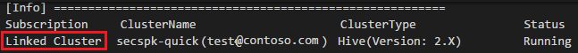

4. You also can unlink a cluster by inputting **HDInsight: Unlink a cluster** from command palette.

## Use IntelliJ to link to domain joined cluster

You can link a normal cluster by using Ambari managed username, also link a security hadoop cluster by using domain username (such as: user1@contoso.com). 
1. Click **Link a cluster** from **Azure Explorer**.

   

2. Enter **Cluster Name**, **User Name** and **Password**. You need to check the username and password if got the authentication failure. Optionally, add Storage Account, Storage Key, then select a container from Storage Container. Storage information is for storage explorer in the left tree
   
   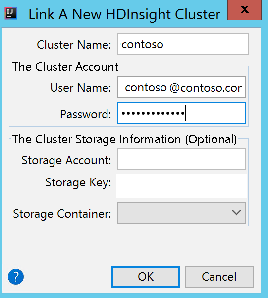

   > [!NOTE]
   > We use the linked storage key, username and password if the cluster both logged in Azure subscription and Linked a cluster.
   > 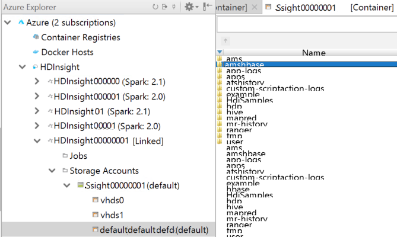

   
3. You can see a Linked cluster in **HDInsight** node if the input information are right. Now you can submit an application to this linked cluster.

   

4. You also can unlink a cluster from **Azure Explorer**.
   
   

## Use Eclipse to link to domain joined cluster

You can link a normal cluster by using Ambari managed username, also link a security hadoop cluster by using domain username (such as: user1@contoso.com).
1. Click **Link a cluster** from **Azure Explorer**.

   

2. Enter **Cluster Name**, **User Name** and **Password**, then click OK button to link cluster. Optionally, enter Storage Account, Storage Key and then select Storage Container for storage explorer to work in the left tree view
   
   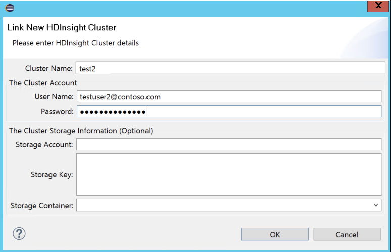
   
   > [!NOTE]
   > We use the linked storage key, username and password if the cluster both logged in Azure subscription and Linked a cluster.
   > 

3. You can see a Linked cluster in **HDInsight** node after clicking OK button, if the input information are right. Now you can submit an application to this linked cluster.

   

4. You also can unlink a cluster from **Azure Explorer**.
   
   

## Access the clusters with Enterprise Security Package.

Enterprise Security Package (previously known as HDInsight Premium) provides multi-user access to the cluster, where authentication is done by Active Directory and authorization by Apache Ranger and Storage ACLs (ADLS ACLs). Authorization provides secure boundaries among multiple users and allows only privileged users to have access to the data based on the authorization policies.

Security and user isolation are important for a HDInsight cluster with Enterprise Security Package. To meet these requirements, SSH access to the cluster with Enterprise Security Package is blocked. The following table shows the recommended access methods for each cluster type:

|Workload|Scenario|Access Method|
|--------|--------|-------------|
|Hadoop|Hive – Interactive Jobs/Queries	|<ul><li>[Beeline](#beeline)</li><li>[Hive View](../hadoop/apache-hadoop-use-hive-ambari-view.md)</li><li>[ODBC/JDBC – Power BI](../hadoop/apache-hadoop-connect-hive-power-bi.md)</li><li>[Visual Studio Tools](../hadoop/apache-hadoop-visual-studio-tools-get-started.md)</li></ul>|
|Spark|Interactive Jobs/Queries, PySpark interactive|<ul><li>[Beeline](#beeline)</li><li>[Zeppelin with Livy](../spark/apache-spark-zeppelin-notebook.md)</li><li>[Hive View](../hadoop/apache-hadoop-use-hive-ambari-view.md)</li><li>[ODBC/JDBC – Power BI](../hadoop/apache-hadoop-connect-hive-power-bi.md)</li><li>[Visual Studio Tools](../hadoop/apache-hadoop-visual-studio-tools-get-started.md)</li></ul>|
|Spark|Batch Scenarios – Spark submit, PySpark|<ul><li>[Livy](../spark/apache-spark-livy-rest-interface.md)</li></ul>|
|Interactive Query (LLAP)|Interactive|<ul><li>[Beeline](#beeline)</li><li>[Hive View](../hadoop/apache-hadoop-use-hive-ambari-view.md)</li><li>[ODBC/JDBC – Power BI](../hadoop/apache-hadoop-connect-hive-power-bi.md)</li><li>[Visual Studio Tools](../hadoop/apache-hadoop-visual-studio-tools-get-started.md)</li></ul>|
|Any|Install Custom Application|<ul><li>[Script Actions](../hdinsight-hadoop-customize-cluster-linux.md)</li></ul>|

   > [!NOTE]
   > Jupyter is not installed/supported in Enterprise Security Package.

Using the standard APIs helps from security perspective. In addition, you get the following benefits:

1.	**Management** – You can manage your code and automate jobs using standard APIs – Livy, HS2 etc.
2.	**Audit** – With SSH, there is no way to audit, which users SSH’d to the cluster. This wouldn’t be the case when jobs are constructed via standard endpoints as they would be executed in context of user. 


### <a name="beeline"></a>Use Beeline 
Install Beeline on your machine, and connect over the public internet, use the following parameters: 

```
- Connection string: -u 'jdbc:hive2://<clustername>.azurehdinsight.net:443/;ssl=true;transportMode=http;httpPath=/hive2'
- Cluster login name: -n admin
- Cluster login password -p 'password'
```

If you have Beeline installed locally, and connect over an Azure Virtual Network, use the following parameters: 

```
- Connection string: -u 'jdbc:hive2://<headnode-FQDN>:10001/;transportMode=http'
```

To find the fully qualified domain name of a headnode, use the information in the Manage HDInsight using the Ambari REST API document.


## Users of HDInsight clusters with ESP
A non-ESP HDInsight cluster has two user accounts that are created during the cluster creation:

* **Ambari admin**: This account is also known as *Hadoop user* or *HTTP user*. This account can be used to log on to Ambari at https://&lt;clustername>.azurehdinsight.net. It can also be used to run queries on Ambari views, execute jobs via external tools (for example, PowerShell, Templeton, Visual Studio), and authenticate with the Hive ODBC driver and BI tools (for example, Excel, PowerBI, or Tableau).

A HDInsight cluster with ESP has three new users in addition to Ambari Admin.

* **Ranger admin**:  This account is the local Apache Ranger admin account. It is not an active directory domain user. This account can be used to setup policies and make other users admins or delegated admins (so that those users can manage policies). By default, the username is *admin* and the password is the same as the Ambari admin password. The password can be updated from the Settings page in Ranger.
* **Cluster admin domain user**: This account is an active directory domain user designated as the Hadoop cluster admin including Ambari and Ranger. You must provide this user’s credentials during cluster creation. This user has the following privileges:

  * Join machines to the domain and place them within the OU that you specify during cluster creation.
  * Create service principals within the OU that you specify during cluster creation.
  * Create reverse DNS entries.

    Note the other AD users also have these privileges.

    There are some end points within the cluster (for example, Templeton) which are not managed by Ranger, and hence are not secure. These end points are locked down for all users except the cluster admin domain user.
* **Regular**: During cluster creation, you can provide multiple active directory groups. The users in these groups are synced to Ranger and Ambari. These users are domain users and have access to only Ranger-managed endpoints (for example, Hiveserver2). All the RBAC policies and auditing will be applicable to these users.

## Roles of HDInsight clusters with ESP
HDInsight Enterprise Security Package has the following roles:

* Cluster Administrator
* Cluster Operator
* Service Administrator
* Service Operator
* Cluster User

**To see the permissions of these roles**

1. Open the Ambari Management UI.  See [Open the Ambari Management UI](#open-the-ambari-management-ui).
2. From the left menu, click **Roles**.
3. Click the blue question mark to see the permissions:

    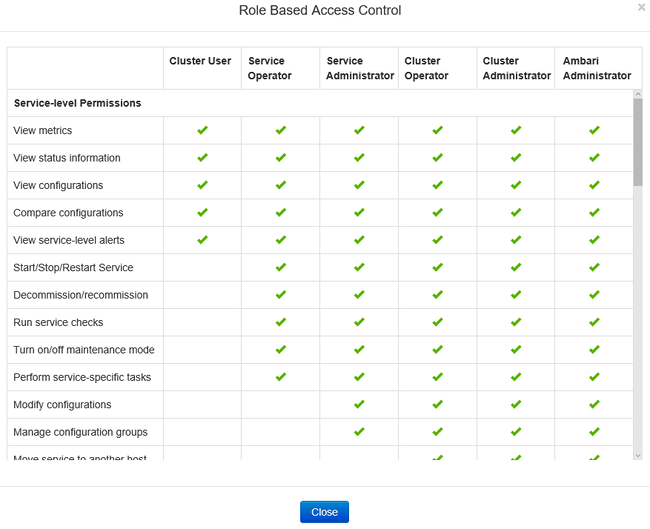

## Open the Ambari Management UI

1. Sign on to the [Azure portal](https://portal.azure.com).
2. Open your HDInsight cluster. See [List and show clusters](../hdinsight-administer-use-management-portal.md#list-and-show-clusters).
3. Click **Dashboard** from the top menu to open Ambari.
4. Log on to Ambari using the cluster administrator domain user name and password.
5. Click the **Admin** dropdown menu from the upper right corner, and then click **Manage Ambari**.

    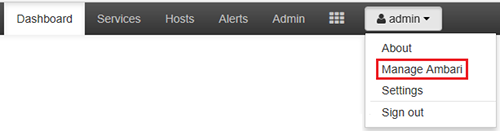

    The UI looks like:

    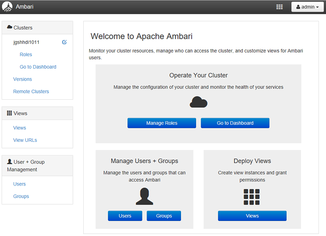

## List the domain users synchronized from your Active Directory
1. Open the Ambari Management UI.  See [Open the Ambari Management UI](#open-the-ambari-management-ui).
2. From the left menu, click **Users**. You shall see all the users synced from your Active Directory to the HDInsight cluster.

    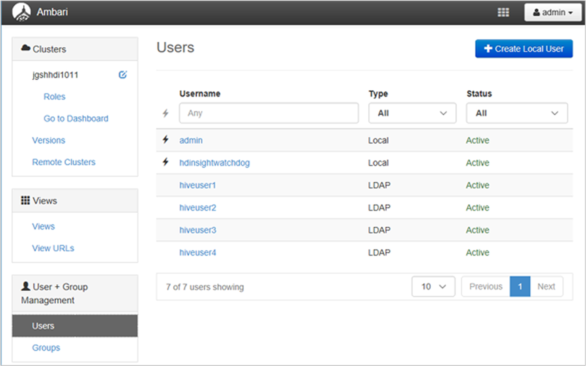

## List the domain groups synchronized from your Active Directory
1. Open the Ambari Management UI.  See [Open the Ambari Management UI](#open-the-ambari-management-ui).
2. From the left menu, click **Groups**. You shall see all the groups synced from your Active Directory to the HDInsight cluster.

    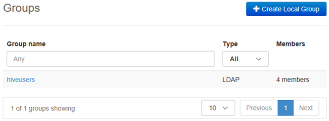

## Configure Hive Views permissions
1. Open the Ambari Management UI.  See [Open the Ambari Management UI](#open-the-ambari-management-ui).
2. From the left menu, click **Views**.
3. Click **HIVE** to show the details.

    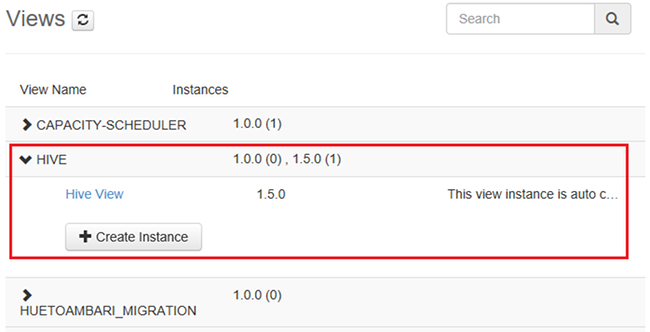
4. Click the **Hive View** link to configure Hive Views.
5. Scroll down to the **Permissions** section.

    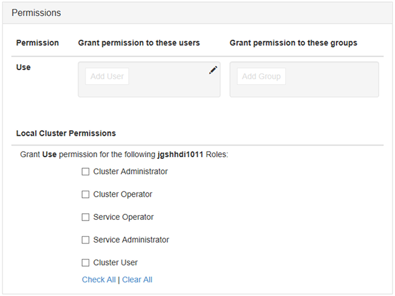
6. Click **Add User** or **Add Group**, and then specify the users or groups that can use Hive Views.

## Configure users for the roles
 To see a list of roles and their permissions, see [Roles of HDInsight clusters with ESP](#roles-of-domain---joined-hdinsight-clusters).

1. Open the Ambari Management UI.  See [Open the Ambari Management UI](#open-the-ambari-management-ui).
2. From the left menu, click **Roles**.
3. Click **Add User** or **Add Group** to assign users and groups to different roles.

## Next steps
* For configuring a HDInsight cluster with Enterprise Security Package, see [Configure HDInsight clusters with ESP](apache-domain-joined-configure.md).
* For configuring Hive policies and run Hive queries, see [Configure Hive policies for HDInsight clusters with ESP](apache-domain-joined-run-hive.md).
