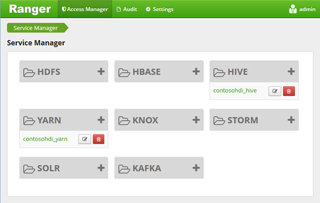
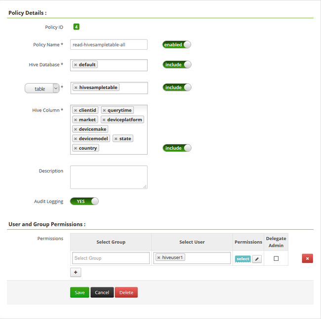

# Configure Hive policies in HDInsight with Enterprise Security Package
Learn how to configure Apache Ranger policies for Hive. In this article, you create two Ranger policies to restrict access to the hivesampletable. The hivesampletable comes with HDInsight clusters. After you have configured the policies, you use Excel and ODBC driver to connect to Hive tables in HDInsight.

## Prerequisites
* A HDInsight cluster with Enterprise Security Package. See [Configure HDInsight clusters with ESP](apache-domain-joined-configure.md).
* A workstation with Office 2016, Office 2013 Professional Plus, Office 365 Pro Plus, Excel 2013 Standalone, or Office 2010 Professional Plus.

## Connect to Apache Ranger Admin UI
**To connect to Ranger Admin UI**

1. From a browser, connect to Ranger Admin UI. The URL is https://&lt;ClusterName>.azurehdinsight.net/Ranger/.

   > [!NOTE]
   > Ranger uses different credentials than Hadoop cluster. To prevent browsers using cached Hadoop credentials, use new InPrivate browser window to connect to the Ranger Admin UI.
   >
   >
2. Log in using the cluster administrator domain user name and password:

    

    Currently, Ranger only works with Yarn and Hive.

## Create Domain users
See [Create a HDInsight cluster with ESP](apache-domain-joined-configure-using-azure-adds.md#create-a-hdinsight-cluster-with-esp), for information on how to create hiveruser1 and hiveuser2. You use the two user accounts in this tutorial.

## Create Ranger policies
In this section, you create two Ranger policies for accessing hivesampletable. You give select permission on different set of columns. Both users were created using [Create a HDInsight cluster with ESP](apache-domain-joined-configure-using-azure-adds.md#create-a-hdinsight-cluster-with-esp). In the next section, you will test the two policies in Excel.

**To create Ranger policies**

1. Open Ranger Admin UI. See [Connect to Apache Ranger Admin UI](#connect-to-apache-ranager-admin-ui).
2. Click **&lt;ClusterName>_hive**, under **Hive**. You shall see two pre-configure policies.
3. Click **Add New Policy**, and then enter the following values:

   * Policy name: read-hivesampletable-all
   * Hive Database: default
   * table: hivesampletable
   * Hive column: *
   * Select User: hiveuser1
   * Permissions: select

     .

     > [!NOTE]
     > If a domain user is not populated in Select User, wait a few moments for Ranger to sync with AAD.
     >
     >
4. Click **Add** to save the policy.
5. Repeat the last two steps to create another policy with the following properties:

   * Policy name: read-hivesampletable-devicemake
   * Hive Database: default
   * table: hivesampletable
   * Hive column: clientid, devicemake
   * Select User: hiveuser2
   * Permissions: select

## Create Hive ODBC data source
The instructions can be found in [Create Hive ODBC data source](../hadoop/apache-hadoop-connect-excel-hive-odbc-driver.md).  

 | Property  |Description |
 | --- | --- |
 | Data Source Name | Give a name to your data source |
 | Host | Enter &lt;HDInsightClusterName>.azurehdinsight.net. For example, myHDICluster.azurehdinsight.net |
 | Port | Use **443**. (This port has been changed from 563 to 443.) |
 | Database | Use **Default**. |
 | Hive Server Type | Select **Hive Server 2** |
 | Mechanism | Select **Azure HDInsight Service** |
 | HTTP Path | Leave it blank. |
 | User Name | Enter hiveuser1@contoso158.onmicrosoft.com. Update the domain name if it is different. |
 | Password | Enter the password for hiveuser1. |

Make sure to click **Test** before saving the data source.

## Import data into Excel from HDInsight
In the last section, you have configured two policies.  hiveuser1 has the select permission on all the columns, and hiveuser2 has the select permission on two columns. In this section, you impersonate the two users to import data into Excel.

1. Open a new or existing workbook in Excel.
2. From the **Data** tab, click **From Other Data Sources**, and then click **From Data Connection Wizard** to launch the **Data Connection Wizard**.

    ![Open data connection wizard][img-hdi-simbahiveodbc.excel.dataconnection]
3. Select **ODBC DSN** as the data source, and then click **Next**.
4. From ODBC data sources, select the data source name that you created in the previous step, and then  click **Next**.
5. Reenter the password for the cluster in the wizard, and then click **OK**. Wait for the **Select Database and Table** dialog to open. This can take a few seconds.
6. Select **hivesampletable**, and then click **Next**.
7. Click **Finish**.
8. In the **Import Data** dialog, you can change or specify the query. To do so, click **Properties**. This can take a few seconds.
9. Click the **Definition** tab. The command text is:

       SELECT * FROM "HIVE"."default"."hivesampletable"

   By the Ranger policies you defined,  hiveuser1 has select permission on all the columns.  So this query works with hiveuser1's credentials, but this query does not work with hiveuser2's credentials.

   ![Connection Properties][img-hdi-simbahiveodbc-excel-connectionproperties]
10. Click **OK** to close the Connection Properties dialog.
11. Click **OK** to close the **Import Data** dialog.  
12. Reenter the password for hiveuser1, and then click **OK**. It takes a few seconds before data gets imported to Excel. When it is done, you shall see 11 columns of data.

To test the second policy (read-hivesampletable-devicemake), you created in the last section

1. Add a new sheet in Excel.
2. Follow the last procedure to import the data.  The only change you make is to use hiveuser2's credentials instead of hiveuser1's. This fails because hiveuser2 only has permission to see two columns. You shall get the following error:

        [Microsoft][HiveODBC] (35) Error from Hive: error code: '40000' error message: 'Error while compiling statement: FAILED: HiveAccessControlException Permission denied: user [hiveuser2] does not have [SELECT] privilege on [default/hivesampletable/clientid,country ...]'.
3. Follow the same procedure to import data. This time, use hiveuser2's credentials, and also modify the select statement from:

        SELECT * FROM "HIVE"."default"."hivesampletable"

    to:

        SELECT clientid, devicemake FROM "HIVE"."default"."hivesampletable"

    When it is done, you shall see two columns of data imported.

## Next steps
* For configuring a HDInsight cluster with Enterprise Security Package, see [Configure HDInsight clusters with ESP](apache-domain-joined-configure.md).
* For managing a HDInsight cluster with ESP, see [Manage HDInsight clusters with ESP](apache-domain-joined-manage.md).
* For running Hive queries using SSH on HDInsight clusters with ESP, see [Use SSH with HDInsight](../hdinsight-hadoop-linux-use-ssh-unix.md#domainjoined).
* For Connecting Hive using Hive JDBC, see [Connect to Hive on Azure HDInsight using the Hive JDBC driver](../hadoop/apache-hadoop-connect-hive-jdbc-driver.md)
* For connecting Excel to Hadoop using Hive ODBC, see [Connect Excel to Hadoop with the Microsoft Hive ODBC drive](../hadoop/apache-hadoop-connect-excel-hive-odbc-driver.md)
* For connecting Excel to Hadoop using Power Query, see [Connect Excel to Hadoop by using Power Query](../hadoop/apache-hadoop-connect-excel-power-query.md)
