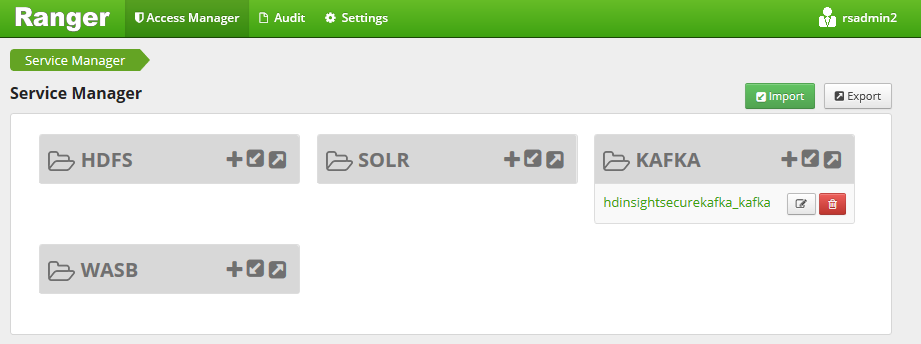
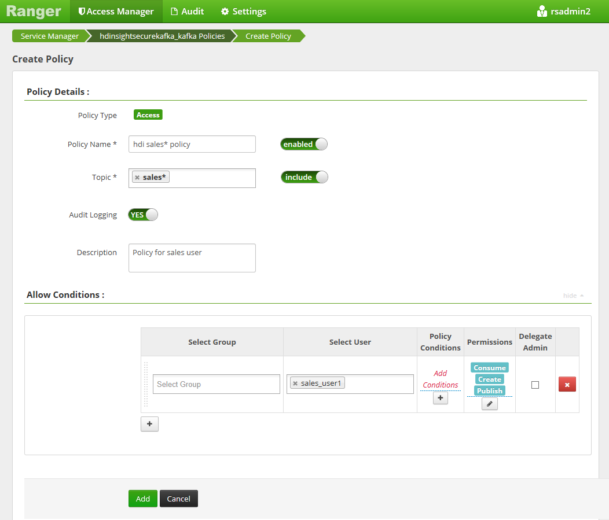
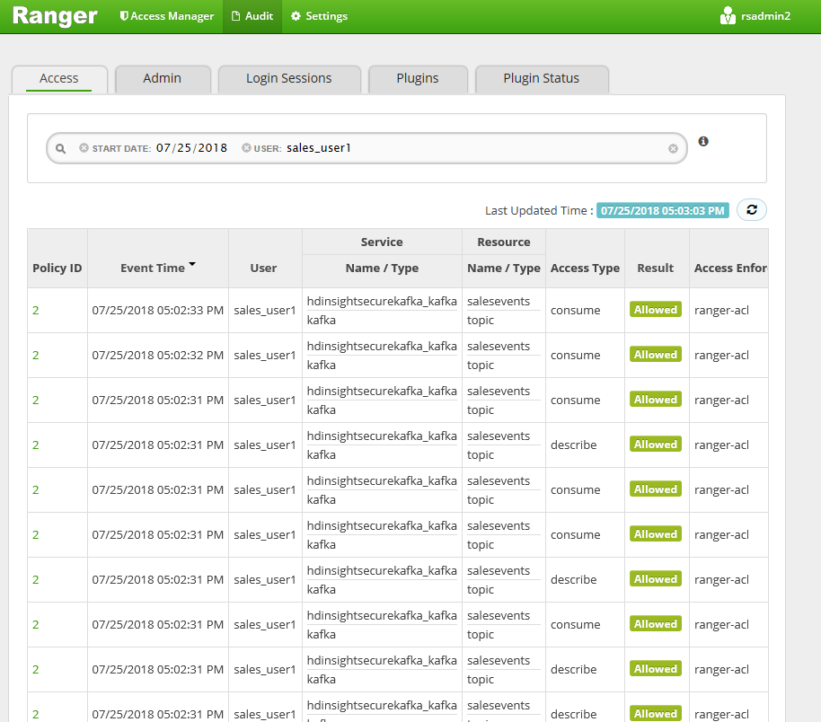

# Tutorial: Configure Kafka policies in HDInsight with Enterprise Security Package (Preview)

Learn how to configure Apache Ranger policies for Enterprise Security Package (ESP) Kafka clusters. ESP clusters are connected to a domain allowing users to authenticate with domain credentials. In this tutorial, you create two Ranger policies to restrict access to `sales*` and `marketingspend` topics.

In this tutorial, you learn how to:

> [!div class="checklist"]
> * Create domain users
> * Create Ranger policies
> * Create topics in a Kafka cluster
> * Test Ranger policies

## Before you begin

* If you don't have an Azure subscription, create a [free account](https://azure.microsoft.com/free/).

* Sign in to the [Azure portal](https://portal.azure.com/).

* Create a [HDInsight Kafka cluster with Enterprise Security Package](https://docs.microsoft.com/azure/hdinsight/domain-joined/apache-domain-joined-run-hive).

## Connect to Apache Ranger Admin UI

1. From a browser, connect to the Ranger Admin user interface using the URL `https://<ClusterName>.azurehdinsight.net/Ranger/`. Remember to change `<ClusterName>` to the name of your Kafka cluster.

    > [!NOTE] 
    > Ranger credentials are not the same as Hadoop cluster credentials. To prevent browsers from using cached Hadoop credentials, use a new InPrivate browser window to connect to the Ranger Admin UI.

2. Sign in using your Azure Active Directory (AD) admin credentials. The Azure AD admin credentials aren't the same as HDInsight cluster credentials or Linux HDInsight node SSH credentials.

   

## Create domain users

Visit [Create a HDInsight cluster with Enterprise Security Package](https://docs.microsoft.com/azure/hdinsight/domain-joined/apache-domain-joined-configure-using-azure-adds#create-a-domain-joined-hdinsight-cluster), to learn how to create the **sales_user** and **marketing_user** domain users. In a production scenario, domain users come from your Active Directory tenant.

## Create Ranger policy 

Create a Ranger policy for **sales_user** and **marketing_user**.

1. Open the **Ranger Admin UI**.

2. Click **\<ClusterName>_kafka** under **Kafka**. One pre-configured policy may be listed.

3. Click **Add New Policy** and enter the following values:

   |**Setting**  |**Suggested value**  |
   |---------|---------|
   |Policy Name  |  hdi sales* policy   |
   |Topic   |  sales* |
   |Select User  |  sales_user1 |
   |Permissions  | publish, consume, create |

   The following wildcards can be included in the topic name:

   * ’*’ indicates zero or more occurrences of characters.
   * ’?‘ indicates single character.

      

   >[!NOTE] 
   >Wait a few moments for Ranger to sync with Azure AD if a domain user is not automatically populated for **Select User**.

4. Click **Add** to save the policy.

5. Click **Add New Policy** and then enter the following values:

   |**Setting**  |**Suggested value**  |
   |---------|---------|
   |Policy Name  |  hdi marketing policy   |
   |Topic   |  marketingspend |
   |Select User  |  marketing_user1 |
   |Permissions  | publish, consume, create |

     

6. Click **Add** to save the policy.

## Create topics in a Kafka cluster with ESP

To create two topics, **salesevents** and **marketingspend**:

1. Use the following command to open an SSH connection to the cluster:

   ```bash
   ssh SSHUSER@CLUSTERNAME-ssh.azurehdinsight.net
   ```

   Replace `SSHUSER` with the SSH user for your cluster, and replace `CLUSTERNAME` with the name of your cluster. If prompted, enter the password for the SSH user account. For more information on using `scp` with HDInsight, see [Use SSH with HDInsight](https://docs.microsoft.com/azure/hdinsight/hdinsight-hadoop-linux-use-ssh-unix).

   In a production scenario, domain users configured during the cluster creation can SSH into the cluster.

2. Use the following commands to save the cluster name to a variable and install a JSON parsing utility `jq`. When prompted, enter the Kafka cluster name.

   ```bash
   sudo apt -y install jq
   read -p 'Enter your Kafka cluster name:' CLUSTERNAME
   ```

3. Use the following commands to get the Kafka broker hosts and the Zookeeper hosts. When prompted, enter the password for the cluster admin account.

   ```bash
   export KAFKAZKHOSTS=`curl -sS -u admin -G https://$CLUSTERNAME.azurehdinsight.net/api/v1/clusters/$CLUSTERNAME/services/ZOOKEEPER/components/ZOOKEEPER_SERVER | jq -r '["\(.host_components[].HostRoles.host_name):2181"] | join(",")' | cut -d',' -f1,2`; \
   
   export KAFKABROKERS=`curl -sS -u admin -G https://$CLUSTERNAME.azurehdinsight.net/api/v1/clusters/$CLUSTERNAME/services/KAFKA/components/KAFKA_BROKER | jq -r '["\(.host_components[].HostRoles.host_name):9092"] | join(",")' | cut -d',' -f1,2`; \
   ```

4. Run the following commands: 

   ```bash
   java -jar -Djava.security.auth.login.config=/usr/hdp/current/kafka-broker/config/kafka_client_jaas.conf kafka-producer-consumer.jar create salesevents $KAFKABROKERS
   
   java -jar -Djava.security.auth.login.config=/usr/hdp/current/kafka-broker/config/kafka_client_jaas.conf kafka-producer-consumer.jar create marketingspend $KAFKABROKERS
   ```

   >[!NOTE] 
   >Only the process owner of Kafka service, such as root, can write to Zookeeper znodes `/config/topics`. Ranger policies are not enforced when a non-privileged user creates a topic. This is because the `kafka-topics.sh` script communicates directly with Zookeeper to create the topic. Entries are added to the Zookeeper nodes, while the watchers on the broker side monitor and create topics accordingly. The authorization can't be done through the ranger plugin, and the command above is executed using `sudo` through the Kafka broker.


## Test the Ranger policies

Based on the Ranger policies configured, **sales_user** can produce/consume topic **salesevents** but not topic **marketingspend**. Conversely, **marketing_user** can produce/consume topic **marketingspend** but not topic **salesevents**.

1. Open a new SSH connection to the cluster. Use the following command to sign in as **sales_user1**:

   ```bash
   ssh sales_user1@CLUSTERNAME-ssh.azurehdinsight.net
   ```

2. Execute the following command:

   ```bash
   export KAFKA_OPTS="-Djava.security.auth.login.config=/usr/hdp/current/kafka-broker/config/kafka_client_jaas.conf"
   ```

3. Use the broker and Zookeeper names from the previous section to set the following environment variables:

   ```bash
   export KAFKABROKERS=<brokerlist>:9092 
   ```

   Example: `export KAFKABROKERS=wn0-khdicl.contoso.com:9092,wn1-khdicl.contoso.com:9092`

   ```bash
   export KAFKAZKHOSTS=<zklist>:2181
   ```

   Example: `export KAFKAZKHOSTS=zk1-khdicl.contoso.com:2181,zk2-khdicl.contoso.com:2181`

4. Verify that **sales_user1** can produce to topic **salesevents**.
   
   Execute the following command to start the console-producer for topic **salesevents**:

   ```bash
   /usr/hdp/current/kafka-broker/bin/kafka-console-producer.sh --broker-list $KAFKABROKERS --topic salesevents --security-protocol SASL_PLAINTEXT
   ```

   Then, enter a few messages on the console. Press **Ctrl + C** to quit the console-producer.

5. Execute the following command to consume from topic **salesevents**:

   ```bash
   /usr/hdp/current/kafka-broker/bin/kafka-console-consumer.sh --zookeeper $KAFKAZKHOSTS --topic salesevents --security-protocol PLAINTEXTSASL --from-beginning
   ```
 
6. Verify that the messages you entered in the previous step will appear, and **sales_user1** can't produce to topic **marketingspend**.

   From the same ssh window as above, execute the following command to produce to the topic **marketingspend**:

   ```bash
   /usr/hdp/current/kafka-broker/bin/kafka-console-producer.sh --broker-list $KAFKABROKERS --topic marketingspend --security-protocol SASL_PLAINTEXT
   ```

   An authorization error occurs and can be ignored. 

7. Notice that **marketing_user1** can't consume from topic **salesevents**.

   Repeat steps 1-3 above, but this time as **marketing_user1**.

   Execute the following command to consume from topic **salesevents**:

   ```bash
   /usr/hdp/current/kafka-broker/bin/kafka-console-consumer.sh --zookeeper $KAFKAZKHOSTS --topic marketingspend --security-protocol PLAINTEXTSASL --from-beginning
   ```

   Previous messages can't be seen.

8. View the audit access events from the Ranger UI.

   

## Next steps

* [Bring your own key to Kafka](https://docs.microsoft.com/azure/hdinsight/kafka/apache-kafka-byok)
* [An introduction to Hadoop security with Enterprise Security Package](https://docs.microsoft.com/azure/hdinsight/domain-joined/apache-domain-joined-introduction)
