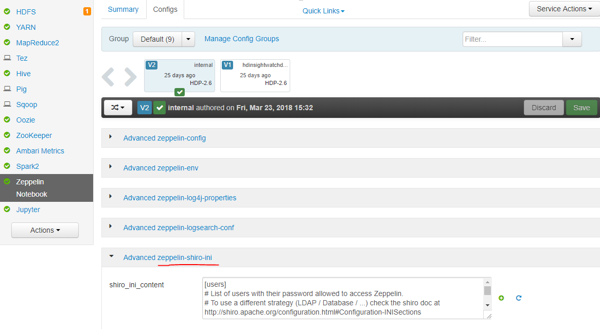

# Scenario: Unable to sign in to Apache Zeppelin in Azure HDInsight

This article describes troubleshooting steps and possible resolutions for issues when interacting with Azure HDInsight clusters.

## Issue

Unable to sign in to Apache Zeppelin after changing the ADDS password in active directory.

## Cause

User mentioned in the `activeDirectoryRealm.systemUsername` of the `shiro_ini` file changed the active directory password.

## Resolution

1. Verify that the changed password is the root cause by including `activeDirectoryRealm.systemPassword = <new password>` in the Zeppelin `shiro_ini` config in Ambari. Remove the `activeDirectoryRealm.hadoopSecurityCredentialPath` setting. Below is location of `shiro ini`.

	

1. If users can now sign in to Zeppelin after step 1, create a new `jceks` file with the new password and replace the `activeDirectoryRealm.hadoopSecurityCredentialPath` with the new file.

## Next steps

If you didn't see your problem or are unable to solve your issue, visit one of the following channels for more support:

* Get answers from Azure experts through [Azure Community Support](https://azure.microsoft.com/support/community/).

* Connect with [@AzureSupport](https://twitter.com/azuresupport) - the official Microsoft Azure account for improving customer experience. Connecting the Azure community to the right resources: answers, support, and experts.

* If you need more help, you can submit a support request from the [Azure portal](https://portal.azure.com/?#blade/Microsoft_Azure_Support/HelpAndSupportBlade/). Select **Support** from the menu bar or open the **Help + support** hub. For more detailed information, review [How to create an Azure support request](https://docs.microsoft.com/azure/azure-supportability/how-to-create-azure-support-request). Access to Subscription Management and billing support is included with your Microsoft Azure subscription, and Technical Support is provided through one of the [Azure Support Plans](https://azure.microsoft.com/support/plans/).
