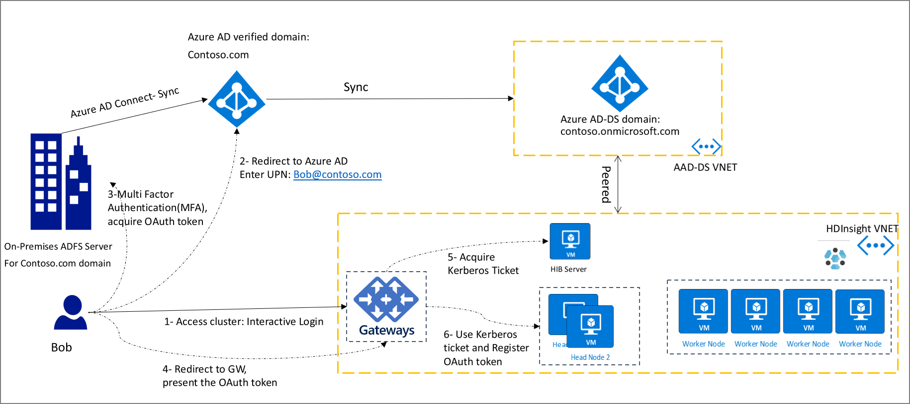

# HDInsight Identity Broker (HIB) - Preview

This article describes how to set up and use the HDInsight Identity Broker (HIB). This feature allows you to sign in to Apache Ambari using Multi-Factor Authentication (MFA) and get the required Kerberos tickets without needing password hashes in Azure Active Directory Domain Services (AAD-DS).

## Overview

HDInsight ID Broker (HIB) is intended to simplify complex authentication setups in the following scenarios:

* Your organization relies on federation to authenticate users for accessing cloud resources. Previously, to use HDInsight ESP clusters, you would have to enable password hash sync from your on-premises environment to Azure AD. This requirement may be difficult or undesirable for some organizations.

* You're building solutions that use technologies which rely on different authentication mechanisms. For example, Apache Hadoop and Apache Ranger rely on Kerberos, while Azure Data Lake Storage (ADLS) relies on OAuth.

HIB provides a unified authentication infrastructure and removes the requirement of providing password hashes to Azure AD. HIB consists of components running on a Windows Server VM (HIB Server), and cluster gateway nodes. After enabling HIB, the authentication flow for all users, including federated users, is shown in the following diagram:

HIB allows you to log in to ESP clusters using MFA, without providing any passwords. If you've already logged in to other Azure services, such as Azure portal, you can log in to your HDInsight cluster with a Single Sign-On (SSO).

## Enable HDInsight ID Broker

To create an ESP cluster with ID Broker enabled, do the following steps:

1. Log in to the [Azure portal](https://portal.azure.com).
1. Follow the basic creation steps for an ESP cluster. For more information, see [Create a HDInsight cluster with ESP](apache-domain-joined-configure-using-azure-adds.md#create-a-hdinsight-cluster-with-esp).
1. Check **Enable HDInsight ID Broker**.

The HIB feature will add one extra VM to the cluster. This VM is the HIB server and includes server components to support authentication. The HIB server is domain-joined to the AAD-DS domain.

## Tools Integration

HDInsight IntelliJ plugin is updated to support OAuth. You can use this plugin to connect to the cluster.

## SSH access without password hash in Azure AD

After HIB is enabled, you'll still need a password hash stored in Azure AD to SSH to the cluster. To SSH to a domain-joined VM, or to run the `kinit` command, you need to provide a password. SSH authentication requires the hash to be available in AAD-DS. If you would like to use ssh for administrative scenarios, you can create one cloud-only account and use that to SSH to the cluster. Other users can still use Ambari or HDInsight tools (such as IntelliJ plugin) to access the cluster.

## Next steps

[Configure a HDInsight cluster with Enterprise Security Package by using Azure Active Directory Domain Services](apache-domain-joined-configure-using-azure-adds.md)

[Synchronize Azure Active Directory users to an HDInsight cluster](../hdinsight-sync-aad-users-to-cluster.md)

[Monitor cluster performance](../hdinsight-key-scenarios-to-monitor.md)
