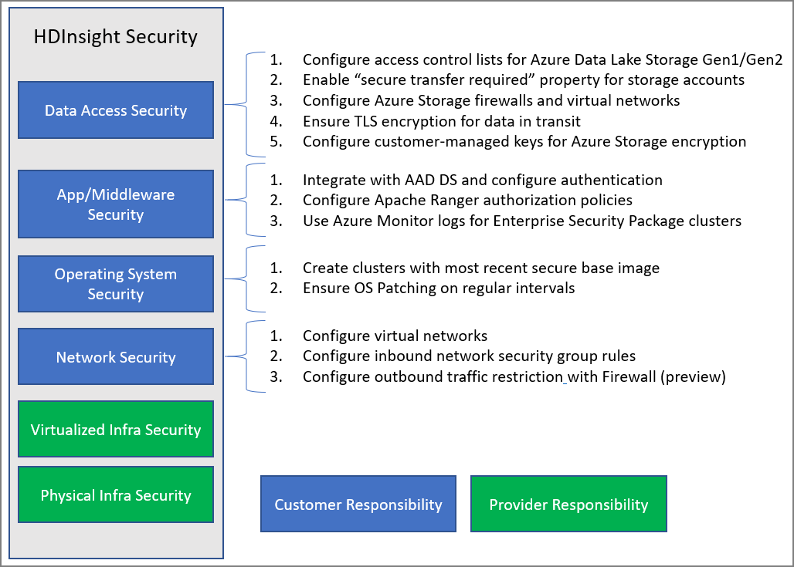

# Overview of enterprise security in Azure HDInsight

Azure HDInsight offers a number of methods to address your enterprise security needs. Most of these solutions are not activated by default. This flexibility allows you to choose the security features that are most important to you, and helps you to avoid paying for features that you don't want. This also means that it is your responsibility to make sure that the correct solutions are enabled for your setup and environment.

This article looks at security solutions by dividing security solutions along the lines of four traditional security pillars: perimeter security, authentication, authorization, and encryption.

This article also introduces the **Azure HDInsight Enterprise Security Package (ESP)**, which provides Active Directory-based authentication, multi-user support, and role-based access control for HDInsight clusters.

## Enterprise security pillars

One way of looking at enterprise security divides security solutions into four main groups based on the type of control. These groups are also called security pillars and are the following: perimeter security, authentication, authorization, and encryption.

### Perimeter security

Perimeter security in HDInsight is achieved through [virtual networks](../hdinsight-plan-virtual-network-deployment.md). An enterprise admin can create a cluster inside a virtual network(VNET) and use network security groups(NSG) to restrict access to the virtual network. Only the allowed IP addresses in the inbound NSG rules will be able to communicate with the HDInsight cluster. This configuration provides perimeter security.

All clusters deployed in a VNET will also have a private endpoint that resolves to a private IP inside the VNET for private HTTP access to the cluster gateways.

### Authentication

The [Enterprise Security Package](apache-domain-joined-architecture.md) from HDInsight provides Active Directory-based authentication, multi-user support, and role-based access control. The Active Directory integration is achieved through the use of [Azure Active Directory Domain Services](../../active-directory-domain-services/overview.md). With these capabilities, you can create an HDInsight cluster that's joined to a managed Active Directory domain. You can then configure a list of employees from the enterprise who can authenticate and sign in to the cluster.

With this setup, enterprise employees can sign in to the cluster nodes by using their domain credentials. They can also use their domain credentials to authenticate with other approved endpoints like Apache Ambari Views, ODBC, JDBC, PowerShell, and REST APIs to interact with the cluster. 

### Authorization

A best practice that most enterprises follow is making sure that not every employee has access to all enterprise resources. Likewise, the admin can define role-based access control policies for the cluster resources. This is only available in the ESP clusters.

The hadoop admin can configure role-based access control (RBAC) to secure Apache [Hive](apache-domain-joined-run-hive.md), [HBase](apache-domain-joined-run-hbase.md) and [Kafka](apache-domain-joined-run-kafka.md) using those plugins in Apache Ranger. Configuring RBAC policies allows you to associate permissions with a role in the organization. This layer of abstraction makes it easier to ensure that people have only the permissions needed to perform their work responsibilities. Ranger also allows you to audit the data access of employees and any changes done to access control policies.

For example, the admin can configure [Apache Ranger](https://ranger.apache.org/) to set access control policies for Hive. This functionality ensures row-level and column-level filtering (data masking) and filters the sensitive data from unauthorized users.

### Auditing

Auditing of all access to the cluster resources, and the data, is necessary to track unauthorized or unintentional access of the resources. It's as important as protecting the HDInsight cluster resources from unauthorized users and securing the data.

The admin can view and report all access to the HDInsight cluster resources and data. The admin can also view and report all changes to the access control policies created in Apache Ranger supported endpoints. 

To access Apache Ranger and Ambari audit logs as well as ssh access logs, [enable Azure Monitor](../hdinsight-hadoop-oms-log-analytics-tutorial.md#cluster-auditing) and view the tables that provide auditing records.

### Encryption

Protecting data is important for meeting organizational security and compliance requirements. Along with restricting access to data from unauthorized employees, you should encrypt it.

Both data stores for HDInsight clusters, Azure Blob storage and Azure Data Lake Storage Gen1/Gen2, support transparent server-side [encryption of data](../../storage/common/storage-service-encryption.md) at rest. Secure HDInsight clusters will seamlessly work with this capability of server-side encryption of data at rest.

### Compliance

Azure compliance offerings are based on various types of assurances, including formal certifications, attestations, validations, authorizations, and assessments produced by independent third-party auditing firms, as well as contractual amendments, self-assessments, and customer guidance documents produced by Microsoft. For HDInsight compliance information, see the [Microsoft Trust Center](https://www.microsoft.com/trust-center) and the [Overview of Microsoft Azure compliance](https://gallery.technet.microsoft.com/Overview-of-Azure-c1be3942).

## Shared responsibility model

The following image summarizes the major system security areas and the security solutions that are available to you in each. It also highlights which security areas are your responsibility as a customer and which areas are the responsibility of HDInsight as the service provider.

The following table provides links to resources for each type of security solution.

| Security area | Solutions available | Responsible party |
|---|---|---|
| Data Access Security | Configure [access control lists ACLs](../../storage/blobs/data-lake-storage-access-control.md) for Azure Data Lake Storage Gen1 and Gen2  | Customer |
|  | Enable the ["Secure transfer required"](../../storage/common/storage-require-secure-transfer.md) property on storage accounts. | Customer |
|  | Configure [Azure Storage firewalls](../../storage/common/storage-network-security.md) and virtual networks | Customer |
|  | Configure [Azure virtual network service endpoints](https://docs.microsoft.com/azure/virtual-network/virtual-network-service-endpoints-overview) for Cosmos DB and [Azure SQL DB](https://docs.microsoft.com/azure/sql-database/sql-database-vnet-service-endpoint-rule-overview) | Customer |
|  | Ensure [TLS encryption](../../storage/common/storage-security-tls.md) is enabled for data in transit. | Customer |
|  | Configure [customer-managed keys](../../storage/common/storage-encryption-keys-portal.md) for Azure Storage encryption | Customer |
| Application and middleware security | Integrate with AAD-DS and [Configure Authentication](apache-domain-joined-configure-using-azure-adds.md) | Customer |
|  | Configure [Apache Ranger Authorization](apache-domain-joined-run-hive.md) policies | Customer |
|  | Use [Azure Monitor logs](../hdinsight-hadoop-oms-log-analytics-tutorial.md) | Customer |
| Operating system security | Create clusters with most recent secure base image | Customer |
|  | Ensure [OS Patching](../hdinsight-os-patching.md) on regular intervals | Customer |
| Network security | Configure a [virtual network](../hdinsight-plan-virtual-network-deployment.md) |
|  | Configure [Inbound network security group (NSG) rules](../hdinsight-plan-virtual-network-deployment.md#networktraffic) | Customer |
|  | Configure [Outbound traffic restriction](../hdinsight-restrict-outbound-traffic.md) with Firewall (preview) | Customer |
| Virtualized infrastructure | N/A | HDInsight (Cloud provider) |
| Physical infrastructure security | N/A | HDInsight (cloud provider) |

## Next steps

* [Plan for HDInsight clusters with ESP](apache-domain-joined-architecture.md)
* [Configure HDInsight clusters with ESP](apache-domain-joined-configure.md)
* [Manage HDInsight clusters with ESP](apache-domain-joined-manage.md)
