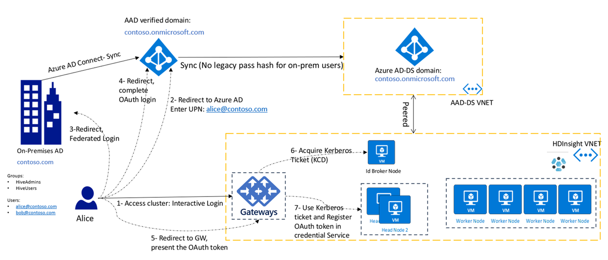
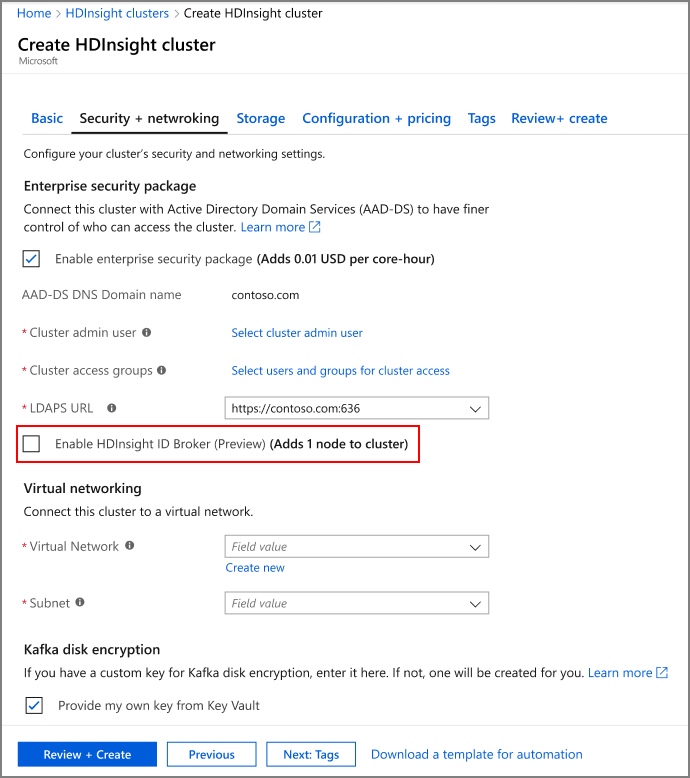

# Use ID Broker (preview) for credential management

This article describes how to set up and use the ID Broker feature in Azure HDInsight. You can use this feature to sign in to Apache Ambari through Azure Multi-Factor Authentication and get the required Kerberos tickets without needing password hashes in Azure Active Directory Domain Services (Azure AD DS).

## Overview

ID Broker simplifies complex authentication setups in the following scenarios:

* Your organization relies on federation to authenticate users for accessing cloud resources. Previously, to use HDInsight Enterprise Security Package (ESP) clusters, you had to enable password hash sync from your on-premises environment to Azure Active Directory. This requirement might be difficult or undesirable for some organizations.

* You're building solutions that use technologies which rely on different authentication mechanisms. For example, Apache Hadoop and Apache Ranger rely on Kerberos, whereas Azure Data Lake Storage relies on OAuth.

ID Broker provides a unified authentication infrastructure and removes the requirement of syncing password hashes to Azure AD DS. ID Broker consists of components running on a Windows Server VM (ID Broker node), along with cluster gateway nodes. 

The following diagram shows the authentication flow for all users, including federated users, after ID Broker is enabled:



ID Broker allows you to sign in to ESP clusters by using Multi-Factor Authentication, without providing any passwords. If you've already signed in to other Azure services, such as the Azure portal, you can sign in to your HDInsight cluster with a single sign-on (SSO) experience.

## Enable HDInsight ID Broker

To create an ESP cluster with ID Broker enabled, take the following steps:

1. Sign in to the [Azure portal](https://portal.azure.com).
1. Follow the basic creation steps for an ESP cluster. For more information, see [Create an HDInsight cluster with ESP](apache-domain-joined-configure-using-azure-adds.md#create-an-hdinsight-cluster-with-esp).
1. Select **Enable HDInsight ID Broker**.

The ID Broker feature will add one extra VM to the cluster. This VM is the ID Broker node and includes server components to support authentication. The ID Broker node is domain joined to the Azure AD DS domain.



### Using Azure Resource Manager templates
If you add a new role called `idbrokernode` with the following attributes to the compute profile of your template, then the cluster will get created with the ID broker node enabled:

```json
.
.
.
"computeProfile": {
    "roles": [
        {
            "autoscale": null,
            "name": "headnode",
           ....
        },
        {
            "autoscale": null,
            "name": "workernode",
            ....
        },
        {
            "autoscale": null,
            "name": "idbrokernode",
            "targetInstanceCount": 1,
            "hardwareProfile": {
                "vmSize": "Standard_A2_V2"
            },
            "virtualNetworkProfile": {
                "id": "string",
                "subnet": "string"
            },
            "scriptActions": [],
            "dataDisksGroups": null
        }
    ]
}
.
.
.
```

## Tool integration

The HDInsight [IntelliJ plug-in](https://docs.microsoft.com/azure/hdinsight/spark/apache-spark-intellij-tool-plugin#integrate-with-hdinsight-identity-broker-hib) is updated to support OAuth. You can use this plug-in to connect to the cluster and submit jobs.

## SSH access without a password hash in Azure AD DS

After ID Broker is enabled, you'll still need a password hash stored in Azure AD DS for SSH scenarios with domain accounts. To SSH to a domain-joined VM, or to run the `kinit` command, you need to provide a password. 

SSH authentication requires the hash to be available in Azure AD DS. If you want to use SSH for administrative scenarios only, you can create one cloud-only account and use that to SSH to the cluster. Other users can still use Ambari or HDInsight tools (such as the IntelliJ plug-in) without having the password hash available in Azure AD DS.

## Clients using OAuth to connect to HDInsight gateway with ID Broker setup

In the ID broker setup, custom apps and clients connecting to the gateway can be updated to acquire the required OAuth token first. You can follow the steps in this [document](https://docs.microsoft.com/azure/storage/common/storage-auth-aad-app) to acquire the token with the following information:

*	OAuth resource uri: `https://hib.azurehdinsight.net` 
* AppId: 7865c1d2-f040-46cc-875f-831a1ef6a28a
*	Permission: (name: Cluster.ReadWrite, id: 8f89faa0-ffef-4007-974d-4989b39ad77d)

## Next steps

* [Configure an HDInsight cluster with Enterprise Security Package by using Azure Active Directory Domain Services](apache-domain-joined-configure-using-azure-adds.md)
* [Synchronize Azure Active Directory users to an HDInsight cluster](../hdinsight-sync-aad-users-to-cluster.md)
* [Monitor cluster performance](../hdinsight-key-scenarios-to-monitor.md)
