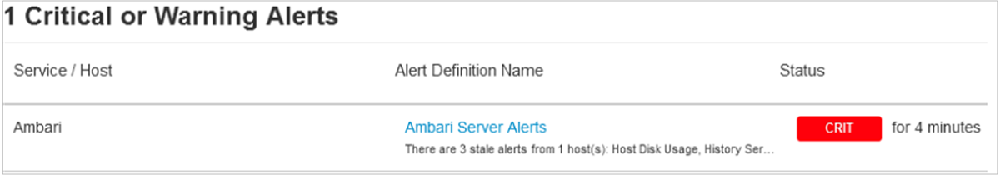

# Scenario: Apache Ambari stale alerts in Azure HDInsight

This article describes troubleshooting steps and possible resolutions for issues when interacting with Azure HDInsight clusters.

## Issue

From the Apache Ambari UI, you may see an alert similar to the following image:

## Cause

Ambari agents continually execute health checks to monitor the health of many resources. Each alert is configured to run at predefined intervals of time. After execution of each alert, Ambari agents report back the status to the Ambari server. At this point if Ambari server detects that any of the alerts weren't run in a timely manner, then it triggers an "Ambari Server Alerts". There are various reasons why a health check might not execute at its defined interval:

* When hosts are under heavy utilization (high CPU), there's a possibility that the Ambari Agent wasn't able get enough system resources to execute the alerts in timely manner.

* The cluster is busy executing many jobs/services during heavy load.

* Few hosts in the cluster may host many components and hence will be required to run many alerts. If the number of components is large, it's possible that alert jobs may miss their scheduled intervals

## Resolution

### Increase alert interval time

You can choose to increase the value of an individual alert interval based on the response time of your cluster and its load.

1. From the Apache Ambari UI, select the **Alerts** tab.
1. Select the desired alert definition name.
1. From the definition, select **Edit**.
1. Modify the **Check Interval** value as desired, and then select **Save**.

### Increase alert interval time for Ambari Server Alerts

1. From the Apache Ambari UI, select the **Alerts** tab.
1. From the **Groups** drop-down list, select **AMBARI Default**.
1. Select alert **Ambari Server Alerts**.
1. From the definition, select **Edit**.
1. Modify the **Check Interval** value as desired.
1. Modify the **Interval Multiplier** value as desired, and then select **Save**.

### Disable and enable the alert

You can disable and then again enable the alert to discard any stale alerts.

1. From the Apache Ambari UI, select the **Alerts** tab.
1. Select the desired alert definition name.
1. From the definition, select **Enabled** located on the far right.
1. From the **Confirmation** pop-up, select **Confirm Disable**.
1. Wait a few seconds for all the alert "Instances" shown on the page are cleared.
1. From the definition, select **Disabled** located on the far right.
1. From the **Confirmation** pop-up, select **Confirm Enable**.

### Increase alert grace time

Before Ambari agent reports that a configured alert missed its schedule, there's a grace time applied. Even if the alert missed its scheduled time but was triggered within the alert grace time, then stale alert isn't fired.

The default `alert_grace_period` value is 5 seconds. This `alert_grace_period` setting is configurable in `/etc/ambari-agent/conf/ambari-agent.ini`. For those hosts from which the stale alerts are fired at regular intervals, try to increase to a value of 10. Then restart the Ambari agent

## Next steps

If you didn't see your problem or are unable to solve your issue, visit one of the following channels for more support:

* Get answers from Azure experts through [Azure Community Support](https://azure.microsoft.com/support/community/).

* Connect with [@AzureSupport](https://twitter.com/azuresupport) - the official Microsoft Azure account for improving customer experience. Connecting the Azure community to the right resources: answers, support, and experts.

* If you need more help, you can submit a support request from the [Azure portal](https://portal.azure.com/?#blade/Microsoft_Azure_Support/HelpAndSupportBlade/). Select **Support** from the menu bar or open the **Help + support** hub. For more detailed information, review [How to create an Azure support request](https://docs.microsoft.com/azure/azure-supportability/how-to-create-azure-support-request). Access to Subscription Management and billing support is included with your Microsoft Azure subscription, and Technical Support is provided through one of the [Azure Support Plans](https://azure.microsoft.com/support/plans/).
