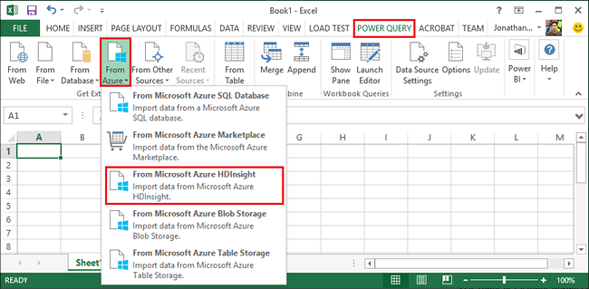
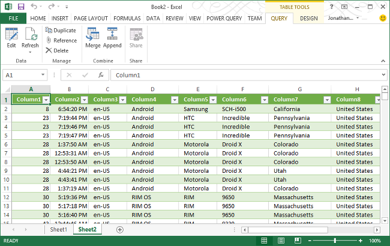

# Connect Excel to Apache Hadoop by using Power Query

One key feature of the Microsoft big-data solution is the integration of Microsoft business intelligence (BI) components with Apache Hadoop clusters in Azure HDInsight. A primary example is the ability to connect Excel to the Azure Storage account that contains the data associated with your Hadoop cluster by using the Microsoft Power Query for Excel add-in. This article walks you through how to set up and use Power Query to query data associated with a Hadoop cluster managed with HDInsight.

## Prerequisites

* An Apache Hadoop cluster on HDInsight. See [Get Started with HDInsight on Linux](./apache-hadoop-linux-tutorial-get-started.md).
* A workstation that is running Windows 10, 7, Windows Server 2008 R2, or a later operating system.
* Office 2016, Office 2013 Professional Plus, Office 365 ProPlus, Excel 2013 Standalone, or Office 2010 Professional Plus.

## Install Microsoft Power Query

Power Query can import data that has been output or that has been generated by a Hadoop job running on an HDInsight cluster.

In Excel 2016, Power Query has been integrated into the Data ribbon under the Get & Transform section. For older Excel versions, download Microsoft Power Query for Excel from the [Microsoft Download Center](https://go.microsoft.com/fwlink/?LinkID=286689) and install it.

## Import HDInsight data into Excel

The Power Query add-in for Excel makes it easy to import data from your HDInsight cluster into Excel, where BI tools such as PowerPivot and Power Map can be used to inspect, analyze, and present the data.

1. Launch Excel.

1. Create a new blank workbook.

1. Perform the following steps based on the Excel version:

   * Excel 2016

     * Select > **Data** > **Get Data** > **From Azure** > **From Azure HDInsight(HDFS)**.

       

   * Excel 2013/2010

     * Select **Power Query** > **From Azure** > **From Microsoft Azure HDInsight**.

       

       **Note:** If you don't see the **Power Query** menu, go to **File** > **Options** > **Add-ins**, and select **COM Add-ins** from the drop-down **Manage** box at the bottom of the page. Select the **Go...** button and verify that the box for the Power Query for Excel add-in has been checked.

       **Note:** Power Query also allows you to import data from HDFS by selecting **From Other Sources**.

1. From the **Azure HDInsight(HDFS)** dialog, in the **Account name or URL** text box, enter the name of the Azure Blob storage account associated with your cluster. Then select **OK**. This account can be the default storage account or a linked storage account.  The format is `https://StorageAccountName.blob.core.windows.net/`.

1. For **Account Key**, enter the key for the Blob storage account, and then select **Connect**. (You need to enter the account information only the first time you access this store.)

1. In the **Navigator** pane on the left of the Query Editor, double-click the Blob storage container name associated with your cluster. By default, the container name is the same name as the cluster name.

1. Locate **HiveSampleData.txt** in the **Name** column (the folder path is **../hive/warehouse/hivesampletable/**), and then select **Binary** on the left of HiveSampleData.txt. HiveSampleData.txt comes with all the cluster. Optionally, you can use your own file.

    

1. If you want, you can rename the column names. When you're ready, select **Close & Load**.  The data has been loaded to your workbook:

    

## Next steps

In this article, you learned how to use Power Query to retrieve data from HDInsight into Excel. Similarly, you can retrieve data from HDInsight into Azure SQL Database. It's also possible to upload data into HDInsight. To learn more, see the following articles:

* [Visualize Apache Hive data with Microsoft Power BI in Azure HDInsight](apache-hadoop-connect-hive-power-bi.md).
* [Visualize Interactive Query Hive data with Power BI in Azure HDInsight](../interactive-query/apache-hadoop-connect-hive-power-bi-directquery.md).
* [Use Apache Zeppelin to run Apache Hive queries in Azure HDInsight](../interactive-query/hdinsight-connect-hive-zeppelin.md).
* [Connect Excel to HDInsight with the Microsoft Hive ODBC Driver](apache-hadoop-connect-excel-hive-odbc-driver.md).
* [Connect to Azure HDInsight and run Apache Hive queries using Data Lake Tools for Visual Studio](apache-hadoop-visual-studio-tools-get-started.md).
* [Use Azure HDInsight Tool for Visual Studio Code](../hdinsight-for-vscode.md).
* [Upload data to HDInsight](./../hdinsight-upload-data.md).
