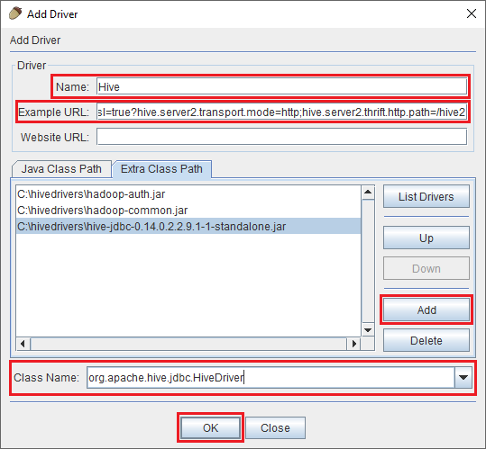
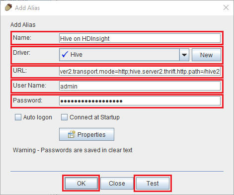
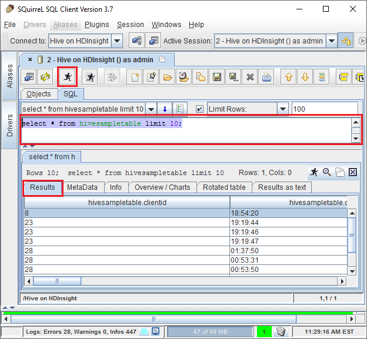

# Query Hive through the JDBC driver in HDInsight

[!INCLUDE [ODBC-JDBC-selector](../../../includes/hdinsight-selector-odbc-jdbc.md)]

Learn how to use the JDBC driver from a Java application to submit Hive queries to Hadoop in Azure HDInsight. The information in this document demonstrates how to connect programmatically and from the SQuirrel SQL client.

For more information on the Hive JDBC Interface, see [HiveJDBCInterface](https://cwiki.apache.org/confluence/display/Hive/HiveJDBCInterface).

## Prerequisites

* A Hadoop on HDInsight cluster.

  > [!IMPORTANT]
  > Linux is the only operating system used on HDInsight version 3.4 or greater. For more information, see [HDInsight 3.3 retirement](../hdinsight-component-versioning.md#hdinsight-windows-retirement).

* [SQuirreL SQL](http://squirrel-sql.sourceforge.net/). SQuirreL is a JDBC client application.

* The [Java Developer Kit (JDK) version 7](https://www.oracle.com/technetwork/java/javase/downloads/jdk7-downloads-1880260.html) or higher.

* [Apache Maven](https://maven.apache.org). Maven is a project build system for Java projects that is used by the project associated with this article.

## JDBC connection string

JDBC connections to an HDInsight cluster on Azure are made over 443, and the traffic is secured using SSL. The public gateway that the clusters sit behind redirects the traffic to the port that HiveServer2 is actually listening on. The following connection string shows the format to use for HDInsight:

    jdbc:hive2://CLUSTERNAME.azurehdinsight.net:443/default;transportMode=http;ssl=true;httpPath=/hive2

Replace `CLUSTERNAME` with the name of your HDInsight cluster.

## Authentication

When establishing the connection, you must use the HDInsight cluster admin name and password to authenticate to the cluster gateway. When connecting from JDBC clients such as SQuirreL SQL, you must enter the admin name and password in client settings.

From a Java application, you must use the name and password when establishing a connection. For example, the following Java code opens a new connection using the connection string, admin name, and password:

```java
DriverManager.getConnection(connectionString,clusterAdmin,clusterPassword);
```

## Connect with SQuirreL SQL client

SQuirreL SQL is a JDBC client that can be used to remotely run Hive queries with your HDInsight cluster. The following steps assume that you have already installed SQuirreL SQL.

1. Create a directory that contains the files. For example, `mkdir hivedriver`.

2. From a command line, use the following commands to copy the files from the HDInsight cluster:

    ```bash
    scp USERNAME@CLUSTERNAME:/usr/hdp/current/hadoop-client/hadoop-common.jar .
    scp USERNAME@CLUSTERNAME:/usr/hdp/current/hadoop-client/hadoop-auth.jar .
    scp USERNAME@CLUSTERNAME:/usr/hdp/current/hadoop-client/lib/log4j-*.jar .
    scp USERNAME@CLUSTERNAME:/usr/hdp/current/hadoop-client/lib/slf4j-*.jar .
    scp USERNAME@CLUSTERNAME:/usr/hdp/current/hive-client/lib/hive-*-1.2*.jar .
    scp USERNAME@CLUSTERNAME:/usr/hdp/current/hive-client/lib/httpclient-*.jar .
    scp USERNAME@CLUSTERNAME:/usr/hdp/current/hive-client/lib/httpcore-*.jar .
    scp USERNAME@CLUSTERNAME:/usr/hdp/current/hive-client/lib/libthrift-*.jar .
    scp USERNAME@CLUSTERNAME:/usr/hdp/current/hive-client/lib/libfb*.jar .
    scp USERNAME@CLUSTERNAME:/usr/hdp/current/hive-client/lib/commons-logging-*.jar .
    ```

    Replace `USERNAME` with the SSH user account name for the cluster. Replace `CLUSTERNAME` with the HDInsight cluster name.

3. Start the SQuirreL SQL application. From the left of the window, select **Drivers**.

    

4. From the icons at the top of the **Drivers** dialog, select the **+** icon to create a driver.

    

5. In the Add Driver dialog, add the following information:

    * **Name**: Hive
    * **Example URL**: `jdbc:hive2://localhost:443/default;transportMode=http;ssl=true;httpPath=/hive2`
    * **Extra Class Path**: Use the Add button to add the all of jar files downloaded earlier
    * **Class Name**: org.apache.hive.jdbc.HiveDriver

   

   Click **OK** to save these settings.

6. On the left of the SQuirreL SQL window, select **Aliases**. Then click the **+** icon to create a connection alias.

    

7. Use the following values for the **Add Alias** dialog.

    * **Name**: Hive on HDInsight

    * **Driver**: Use the dropdown to select the **Hive** driver

    * **URL**: `jdbc:hive2://CLUSTERNAME.azurehdinsight.net:443/default;transportMode=http;ssl=true;httpPath=/hive2`

        Replace **CLUSTERNAME** with the name of your HDInsight cluster.

    * **User Name**: The cluster login account name for your HDInsight cluster. The default is `admin`.

    * **Password**: The password for the cluster login account.

 

    > [!IMPORTANT] 
    > Use the **Test** button to verify that the connection works. When **Connect to: Hive on HDInsight** dialog appears, select **Connect** to perform the test. If the test succeeds, you see a **Connection successful** dialog. If an error occurs, see [Troubleshooting](#troubleshooting).

    To save the connection alias, use the **Ok** button at the bottom of the **Add Alias** dialog.

8. From the **Connect to** dropdown at the top of SQuirreL SQL, select **Hive on HDInsight**. When prompted, select **Connect**.

    

9. Once connected, enter the following query into the SQL query dialog, and then select the **Run** icon. The results area should show the results of the query.

        select * from hivesampletable limit 10;

    

## Connect from an example Java application

An example of using a Java client to query Hive on HDInsight is available at [https://github.com/Azure-Samples/hdinsight-java-hive-jdbc](https://github.com/Azure-Samples/hdinsight-java-hive-jdbc). Follow the instructions in the repository to build and run the sample.

## Troubleshooting

### Unexpected Error occurred attempting to open an SQL connection

**Symptoms**: When connecting to an HDInsight cluster that is version 3.3 or greater, you may receive an error that an unexpected error occurred. The stack trace for this error begins with the following lines:

```java
java.util.concurrent.ExecutionException: java.lang.RuntimeException: java.lang.NoSuchMethodError: org.apache.commons.codec.binary.Base64.<init>(I)V
at java.util.concurrent.FutureTas...(FutureTask.java:122)
at java.util.concurrent.FutureTask.get(FutureTask.java:206)
```

**Cause**: This error is caused by an older version commons-codec.jar file included with SQuirreL.

**Resolution**: To fix this error, use the following steps:

1. Download the commons-codec jar file from your HDInsight cluster.

        scp USERNAME@CLUSTERNAME:/usr/hdp/current/hive-client/lib/commons-codec*.jar ./commons-codec.jar

2. Exit SQuirreL, and then go to the directory where SQuirreL is installed on your system. In the SquirreL directory, under the `lib` directory, replace the existing commons-codec.jar with the one downloaded from the HDInsight cluster.

3. Restart SQuirreL. The error should no longer occur when connecting to Hive on HDInsight.

## Next steps

Now that you have learned how to use JDBC to work with Hive, use the following links to explore other ways to work with Azure HDInsight.

* [Visualize Hive data with Microsoft Power BI in Azure HDInsight](apache-hadoop-connect-hive-power-bi.md).
* [Visualize Interactive Query Hive data with Power BI in Azure HDInsight](../interactive-query/apache-hadoop-connect-hive-power-bi-directquery.md).
* [Use Zeppelin to run Hive queries in Azure HDInsight](./../hdinsight-connect-hive-zeppelin.md).
* [Connect Excel to HDInsight with the Microsoft Hive ODBC Driver](apache-hadoop-connect-excel-hive-odbc-driver.md).
* [Connect Excel to Hadoop by using Power Query](apache-hadoop-connect-excel-power-query.md).
* [Connect to Azure HDInsight and run Hive queries using Data Lake Tools for Visual Studio](apache-hadoop-visual-studio-tools-get-started.md).
* [Use Azure HDInsight Tool for Visual Studio Code](../hdinsight-for-vscode.md).
* [Upload data to HDInsight](../hdinsight-upload-data.md)
* [Use Hive with HDInsight](hdinsight-use-hive.md)
* [Use Pig with HDInsight](hdinsight-use-pig.md)
* [Use MapReduce jobs with HDInsight](hdinsight-use-mapreduce.md)
