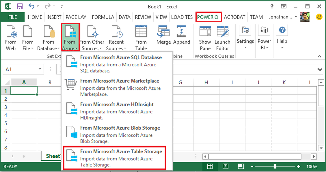
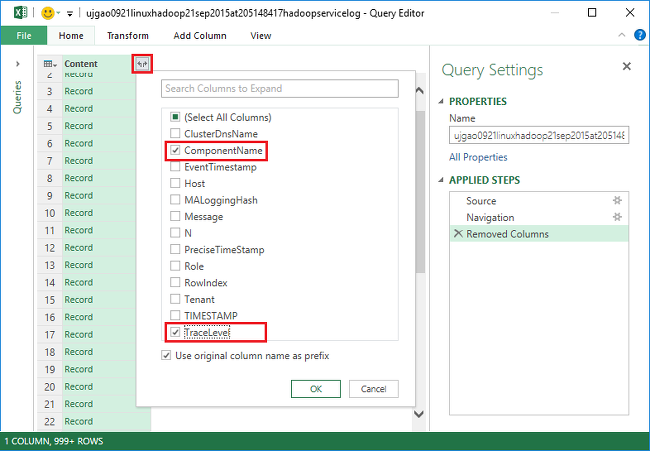
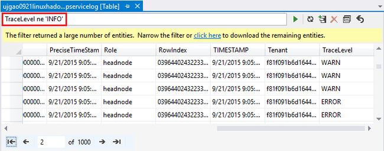
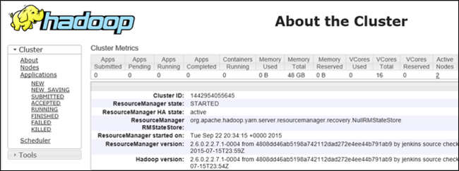

# Analyze Apache Hadoop logs

Each Apache Hadoop cluster in Azure HDInsight has an Azure storage account used as the default file system. The storage account is referred as the default Storage account. Cluster uses the Azure Table storage and the Blob storage on the default Storage account to store its logs.  To find out the default storage account for your cluster, see [Manage Apache Hadoop clusters in HDInsight](../hdinsight-administer-use-portal-linux.md#find-the-storage-accounts). The logs retain in the Storage account even after the cluster is deleted.

## Logs written to Azure Tables

The logs written to Azure Tables provide one level of insight into what is happening with an HDInsight cluster.

When you create an HDInsight cluster, six tables are automatically created for Linux-based clusters in the default Table storage:

* hdinsightagentlog
* syslog
* daemonlog
* hadoopservicelog
* ambariserverlog
* ambariagentlog

The table file names are **u\<ClusterName>DDMonYYYYatHHMMSSsss\<TableName>**.

These tables contain the following fields:

* ClusterDnsName
* ComponentName
* EventTimestamp
* Host
* MALoggingHash
* Message
* N
* PreciseTimeStamp
* Role
* RowIndex
* Tenant
* TIMESTAMP
* TraceLevel

### Tools for accessing the logs
There are many tools available for accessing data in these tables:

* Visual Studio
* Azure Storage Explorer
* Power Query for Excel

#### Use Power Query for Excel
Power Query can be installed from [Microsoft Power Query for Excel](https://www.microsoft.com/en-us/download/details.aspx?id=39379). See the download page for the system requirements.

**Use Power Query to open and analyze the service log**

1. Open **Microsoft Excel**.
2. From the **Power Query** menu, click **From Azure**, and then click **From Microsoft Azure Table storage**.
   
    
3. Enter the storage account name, either the short name or the FQDN.
4. Enter the storage account key. You shall see a list of tables:
   
    
5. Right-click the hadoopservicelog table in the **Navigator** pane and select **Edit**. You shall see four columns. Optionally, delete the **Partition Key**, **Row Key**, and **Timestamp** columns by selecting them, then clicking **Remove Columns** from the options in the ribbon.
6. Click the expand icon on the Content column to choose the columns you want to import into the Excel spreadsheet. For this demonstration, I chose TraceLevel, and ComponentName: It can give me some basic information on which components had issues.
   
    
7. Click **OK** to import the data.
8. Select the **TraceLevel**, Role, and **ComponentName** columns, and then click **Group By** control in the ribbon.
9. Click **OK** in the Group By dialog box
10. Click** Apply & Close**.

You can now use Excel to filter and sort as necessary. You may want to include other columns (such as Message) in order to drill down into issues when they occur, but selecting and grouping the columns described above provides a decent picture of what is happening with Hadoop services. The same idea can be applied to the setuplog and hadoopinstalllog tables.

#### Use Visual Studio
**Use Visual Studio**

1. Open Visual Studio.
2. From the **View** menu, click **Cloud Explorer**. Or simply click **CTRL+\, CTRL+X**.
3. From **Cloud Explorer**, select **Resource Types**.  The other available option is **Resource Groups**.
4. Expand **Storage Accounts**, the default storage account for your cluster, and then **Tables**.
5. Double-click **hadoopservicelog**.
6. Add a filter. For example:
   
        TraceLevel eq 'ERROR'
   
    
   
    For more information about constructing filters, see [Construct Filter Strings for the Table Designer](../../vs-azure-tools-table-designer-construct-filter-strings.md).

## Logs Written to Azure Blob Storage
The logs written to Azure Tables provide one level of insight into what is happening with an HDInsight cluster. However, these tables do not provide task-level logs, which can be helpful in drilling further into issues when they occur. To provide this next level of detail, HDInsight clusters are configured to write task logs to your Blob Storage account for any job that is submitted through Templeton. Practically, this means jobs submitted using the Microsoft Azure PowerShell cmdlets or the .NET Job Submission APIs, not jobs submitted through RDP/command-line access to the cluster. 

To view the logs, see [Access Apache Hadoop YARN application logs on Linux-based HDInsight](../hdinsight-hadoop-access-yarn-app-logs-linux.md).

For more information about application logs, see [Simplifying user-logs management and access in Apache Hadoop YARN](https://hortonworks.com/blog/simplifying-user-logs-management-and-access-in-yarn/).

## View cluster health and job logs
### Access the Ambari UI
From the Azure portal, click an HDInsight cluster name to open the cluster pane. From the cluster pane, click **Dashboard**.

### Access the Yarn UI
From the Azure portal, click an HDInsight cluster name to open the cluster pane. From the cluster pane, click **Dashboard**. When prompted, enter the cluster administrator credentials. In Ambari, select **YARN** from the list of services on the left. On the page that appears, select **Quick Links**, then select the Active head node entry and Resource Manager UI.

You can use the YARN UI to do the following:

* **Get cluster status**. From the left pane, expand **Cluster**, and click **About**. This present cluster status details like total allocated memory, cores used, state of the cluster resource manager, cluster version, and so on.
  
    
* **Get node status**. From the left pane, expand **Cluster**, and click **Nodes**. This lists all the nodes in the cluster, HTTP address of each node, resources allocated to each node, etc.
* **Monitor job status**. From the left pane, expand **Cluster**, and then click **Applications** to list all the jobs in the cluster. If you want to look at jobs in a specific state (such as new, submitted, running, etc.), click the appropriate link under **Applications**. You can further click the job name to find out more about the job such including the output, logs, etc.

### Access the HBase UI
From the Azure portal, click an HDInsight HBase cluster name to open the cluster pane. From the cluster pane, click **Dashboard**. When prompted, enter the cluster administrator credentials. In Ambari, select HBase from the list of services. Select **Quick links** on the top of the page, point to the active Zookeeper node link, and then click HBase Master UI.

## HDInsight error codes
The error messages itemized in this section are provided to help the users of Hadoop in Azure HDInsight understand possible error conditions that they can encounter when administering the service using Azure PowerShell and to advise them on the steps that can be taken to recover from the error.

Some of these error messages could also be seen in the Azure portal when it is used to manage HDInsight clusters. But other error messages you might encounter there are less granular due to the constraints on the remedial actions possible in this context. Other error messages are provided in the contexts where the mitigation is obvious. 

### AtLeastOneSqlMetastoreMustBeProvided
* **Description**: Please provide Azure SQL database details for at least one component in order to use custom settings for Hive and Oozie metastores.
* **Mitigation**: The user needs to supply a valid SQL Azure metastore and retry the request.  

### AzureRegionNotSupported
* **Description**: Could not create cluster in region *nameOfYourRegion*. Use a valid HDInsight region and retry request.
* **Mitigation**: Customer should create the cluster region that currently supports them: Southeast Asia, West Europe, North Europe, East US, or West US.  

### ClusterContainerRecordNotFound
* **Description**: The server could not find the requested cluster record.  
* **Mitigation**: Retry the operation.

### ClusterDnsNameInvalidReservedWord
* **Description**: Cluster DNS name *yourDnsName* is invalid. Please ensure name starts and ends with alphanumeric and can only contain '-' special character  
* **Mitigation**: Make sure that you have used a valid DNS name for your cluster that starts and ends with alphanumeric and contains no special characters other than the dash '-' and then retry the operation.

### ClusterNameUnavailable
* **Description**: Cluster name *yourClusterName* is unavailable. Please pick another name.  
* **Mitigation**: The user should specify a clustername that is unique and does not exist and retry. If the user is using the Portal, the UI will notify them if a cluster name is already being used during the create steps.

### ClusterPasswordInvalid
* **Description**: Cluster password is invalid. Password must be at least 10 characters long and must contain at least one number, uppercase letter, lowercase letter, and special character with no spaces and should not contain the username as part of it.  
* **Mitigation**: Provide a valid cluster password and retry the operation.

### ClusterUserNameInvalid
* **Description**: Cluster username is invalid. Please ensure username doesn't contain special characters or spaces.  
* **Mitigation**: Provide a valid cluster username and retry the operation.

### ClusterUserNameInvalidReservedWord
* **Description**: Cluster DNS name *yourDnsClusterName* is invalid. Please ensure name starts and ends with alphanumeric and can only contain '-' special character  
* **Mitigation**: Provide a valid DNS cluster username and retry the operation.

### ContainerNameMisMatchWithDnsName
* **Description**: Container name in URI *yourcontainerURI* and DNS name *yourDnsName* in request body must be the same.  
* **Mitigation**: Make sure that your container Name and your DNS name are the same and retry the operation.

### DataNodeDefinitionNotFound
* **Description**: Invalid cluster configuration. Unable to find any data node definitions in node size.  
* **Mitigation**: Retry the operation.

### DeploymentDeletionFailure
* **Description**: Deletion of deployment failed for the Cluster  
* **Mitigation**: Retry the delete operation.

### DnsMappingNotFound
* **Description**: Service configuration error. Required DNS mapping information not found.  
* **Mitigation**: Delete cluster and create a new cluster.

### DuplicateClusterContainerRequest
* **Description**: Duplicate cluster container creation attempt. Record exists for *nameOfYourContainer* but Etags do not match.
* **Mitigation**: Provide a unique name for the container and retry the create operation.

### DuplicateClusterInHostedService
* **Description**: Hosted service *nameOfYourHostedService* already contains a cluster. A hosted service cannot contain multiple clusters  
* **Mitigation**: Host the cluster in another hosted service.

### FailureToUpdateDeploymentStatus
* **Description**: The server could not update the state of the cluster deployment.  
* **Mitigation**: Retry the operation. If this happens multiple times, contact CSS.

### HdiRestoreClusterAltered
* **Description**: Cluster *yourClusterName* was deleted as part of maintenance. Please recreate the cluster.
* **Mitigation**: Recreate the cluster.

### HeadNodeConfigNotFound
* **Description**: Invalid cluster configuration. Required head node configuration not found in node sizes.
* **Mitigation**: Retry the operation.

### HostedServiceCreationFailure
* **Description**: Unable to create hosted service *nameOfYourHostedService*. Please retry request.  
* **Mitigation**: Retry the request.

### HostedServiceHasProductionDeployment
* **Description**: Hosted Service *nameOfYourHostedService* already has a production deployment. A hosted service cannot contain multiple production deployments. Retry the request with a different cluster name.
* **Mitigation**: Use a different cluster name and retry the request.

### HostedServiceNotFound
* **Description**: Hosted Service *nameOfYourHostedService* for the cluster could not be found.  
* **Mitigation**: If the cluster is in error state, delete it and then try again.

### HostedServiceWithNoDeployment
* **Description**: Hosted Service *nameOfYourHostedService* has no associated deployment.  
* **Mitigation**: If the cluster is in error state, delete it and then try again.

### InsufficientResourcesCores
* **Description**: The SubscriptionId *yourSubscriptionId* does not have cores left to create cluster *yourClusterName*. Required: *resourcesRequired*, Available: *resourcesAvailable*.  
* **Mitigation**: Free up resources in your subscription or increase the resources available to the subscription and try to create the cluster again.

### InsufficientResourcesHostedServices
* **Description**: Subscription ID *yourSubscriptionId* does not have quota for a new HostedService to create cluster *yourClusterName*.  
* **Mitigation**: Free up resources in your subscription or increase the resources available to the subscription and try to create the cluster again.

### InternalErrorRetryRequest
* **Description**: The server encountered an internal error. Please retry request.  
* **Mitigation**: Retry the request.

### InvalidAzureStorageLocation
* **Description**: Azure Storage location *dataRegionName* is not a valid location. Make sure the region is correct and retry request.
* **Mitigation**: Select a Storage location that supports HDInsight, check that your cluster is co-located and retry the operation.

### InvalidNodeSizeForDataNode
* **Description**: Invalid VM size for data nodes. Only 'Large VM' size is supported for all data nodes.  
* **Mitigation**: Specify the supported node size for the data node and retry the operation.

### InvalidNodeSizeForHeadNode
* **Description**: Invalid VM size for head node. Only 'ExtraLarge VM' size is supported for head node.  
* **Mitigation**: Specify the supported node size for the head node and retry the operation

### InvalidRightsForDeploymentDeletion
* **Description**: Subscription ID *yourSubscriptionId* being used does not have sufficient permissions to execute delete operation for cluster *yourClusterName*.  
* **Mitigation**: If the cluster is in error state, drop it and then try again.  

### InvalidStorageAccountBlobContainerName
* **Description**: External storage account blob container name *yourContainerName* is invalid. Make sure name starts with a letter and contains only lowercase letters, numbers, and dash.  
* **Mitigation**: Specify a valid storage account blob container name and retry the operation.

### InvalidStorageAccountConfigurationSecretKey
* **Description**: Configuration for external storage account *yourStorageAccountName* is required to have secret key details to be set.  
* **Mitigation**: Specify a valid secret key for the storage account and retry the operation.

### InvalidVersionHeaderFormat
* **Description**: Version header *yourVersionHeader* is not in valid format of yyyy-mm-dd.  
* **Mitigation**: Specify a valid format for the version-header and retry the request.

### MoreThanOneHeadNode
* **Description**: Invalid cluster configuration. Found more than one head node configuration.  
* **Mitigation**: Edit the configuration so that only one head node is specified.

### OperationTimedOutRetryRequest
* **Description**: The operation could not be completed within the permitted time or the maximum retry attempts possible. Please retry request.  
* **Mitigation**: Retry the request.

### ParameterNullOrEmpty
* **Description**: Parameter *yourParameterName* cannot be null or empty.  
* **Mitigation**: Specify a valid value for the parameter.

### PreClusterCreationValidationFailure
* **Description**: One or more of the cluster creation request inputs is not valid. Make sure the input values are correct and retry request.  
* **Mitigation**: Make sure the input values are correct and retry request.

### RegionCapabilityNotAvailable
* **Description**: Region capability not available for region *yourRegionName* and Subscription ID *yourSubscriptionId*.  
* **Mitigation**: Specify a region that supports HDInsight clusters. The publicly supported regions are: Southeast Asia, West Europe, North Europe, East US, or West US.

### StorageAccountNotColocated
* **Description**: Storage account *yourStorageAccountName* is in region *currentRegionName*. It should be same as the cluster region *yourClusterRegionName*.  
* **Mitigation**: Either specify a storage account in the same region that your cluster is in or if your data is already in the storage account, create a new cluster in the same region as the existing storage account. If you are using the Portal, the UI will notify them of this issue in advance.

### SubscriptionIdNotActive
* **Description**: Given Subscription ID *yourSubscriptionId* is not active.  
* **Mitigation**: Reactivate your subscription or get a new valid subscription.

### SubscriptionIdNotFound
* **Description**: Subscription ID *yourSubscriptionId* could not be found.  
* **Mitigation**: Check that your subscription ID is valid and retry the operation.

### UnableToResolveDNS
* **Description**: Unable to resolve DNS *yourDnsUrl*. Please ensure the fully qualified URL for the blob endpoint is provided.  
* **Mitigation**: Supply a valid blob URL. The URL MUST be fully valid, including starting with *http://* and ending in *.com*.

### UnableToVerifyLocationOfResource
* **Description**: Unable to verify location of resource *yourDnsUrl*. Please ensure the fully qualified URL for the blob endpoint is provided.  
* **Mitigation**: Supply a valid blob URL. The URL MUST be fully valid, including starting with *http://* and ending in *.com*.

### VersionCapabilityNotAvailable
* **Description**: Version capability not available for version *specifiedVersion* and Subscription ID *yourSubscriptionId*.  
* **Mitigation**: Choose a version that is available and retry the operation.

### VersionNotSupported
* **Description**: Version *specifiedVersion* not supported.
* **Mitigation**: Choose a version that is supported and retry the operation.

### VersionNotSupportedInRegion
* **Description**: Version *specifiedVersion* is not available in Azure region *specifiedRegion*.  
* **Mitigation**: Choose a version that is supported in the region specified and retry the operation.

### WasbAccountConfigNotFound
* **Description**: Invalid cluster configuration. Required WASB account configuration not found in external accounts.  
* **Mitigation**: Verify that the account exists and is properly specified in configuration and retry the operation.

## Next steps

* [Enable heap dumps for Apache Hadoop services on Linux-based HDInsight](../hdinsight-hadoop-collect-debug-heap-dump-linux.md)
* [Manage HDInsight clusters by using the Apache Ambari Web UI](../hdinsight-hadoop-manage-ambari.md)
