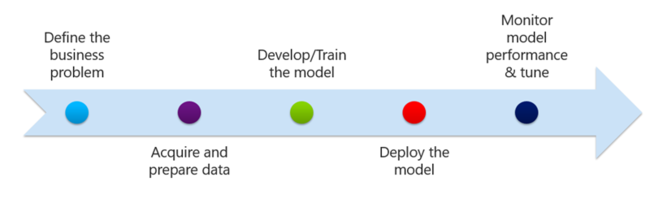
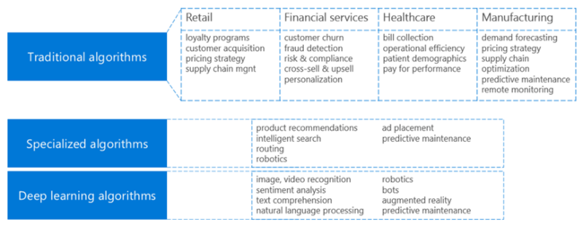
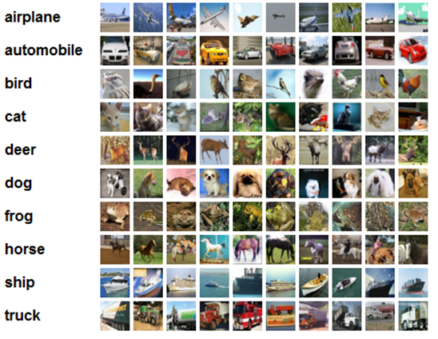
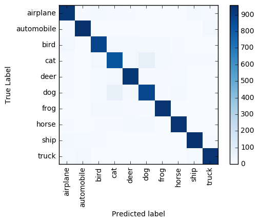

# Deep dive - advanced analytics

## What is advanced analytics for HDInsight?

HDInsight provides the ability to obtain valuable insight from large amounts of structured, unstructured, and fast-moving data. Advanced analytics is the use of highly scalable architectures, statistical and machine learning models, and intelligent dashboards to provide you with meaningful insights. Machine learning, or *predictive analytics*, uses algorithms that identify and learn from relationships in your data to make predictions and guide your decisions.

## Advanced analytics process

After you've identified the business problem and have started collecting and processing your data, you need to create a model that represents the question you wish to predict. Your model will use one or more machine learning algorithms to make the type of prediction that best fits your business needs.  The majority of your data should be used to train your model, with the rest used to test or evaluate it.

After you create, load, test, and evaluate your model, the next step is to deploy your model so that it begins supplying answers to your questions. The last step is to monitor your model's performance and tune it as necessary.

## Common types of algorithms

Advanced analytics solutions provide a set of machine learning algorithms. Here is a summary of the categories of algorithms and associated common business use cases.

Along with selecting the best-fitting algorithm(s), you need to consider whether or not you need to provide data for training. Machine learning algorithms are categorized as follows:

* Supervised - algorithm needs to be trained on a set of labeled data before it can provide results
* Semi-supervised - algorithm can be augmented by extra targets through interactive query by a trainer, which weren't available during initial stage of training
* Unsupervised - algorithm doesn't require training data
* Reinforcement - algorithm uses software agents to determine ideal behavior within a specific context (often used in robotics)

| Algorithm Category| Use | Learning Type | Algorithms |
| --- | --- | --- | -- |
| Classification | Classify people or things into groups | Supervised | Decision trees, Logistic regression, neural networks |
| Clustering | Dividing a set of examples into homogenous groups | Unsupervised | K-means clustering |
| Pattern detection | Identify frequent associations in the data | Unsupervised | Association rules |
| Regression | Predict numerical outcomes | Supervised | Linear regression, neural networks |
| Reinforcement | Determine optimal behavior for robots | Reinforcement | Monte Carlo Simulations, DeepMind |

## Machine learning on HDInsight

HDInsight has several machine learning options for an advanced analytics workflow:

* Machine Learning and Apache Spark
* R and ML Services
* Azure Machine Learning and Apache Hive
* Apache Spark and Deep learning

### Machine Learning and Apache Spark

[HDInsight Spark](../spark/apache-spark-overview.md) is an Azure-hosted offering of [Apache Spark](https://spark.apache.org/), a unified, open source, parallel data processing framework that uses in-memory processing to boost Big Data analytics. The Spark processing engine is built for speed, ease of use, and sophisticated analytics. Spark's in-memory distributed computation capabilities make it a good choice for the iterative algorithms used in machine learning and graph computations.

There are three scalable machine learning libraries that bring algorithmic modeling capabilities to this distributed environment:

* [**MLlib**](https://spark.apache.org/docs/latest/ml-guide.html) - MLlib contains the original API built on top of Spark RDDs.
* [**SparkML**](https://spark.apache.org/docs/1.2.2/ml-guide.html) - SparkML is a newer package that provides a higher-level API built on top of Spark DataFrames for constructing ML pipelines.
* [**MMLSpark**](https://github.com/Azure/mmlspark)  - The Microsoft Machine Learning library for Apache Spark (MMLSpark) is designed to make data scientists more productive on Spark, to increase the rate of experimentation, and to leverage cutting-edge machine learning techniques, including deep learning, on very large datasets. The MMLSpark library simplifies common modeling tasks for building models in PySpark.

### R and ML Services

As part of HDInsight, you can create an HDInsight cluster with [ML Services](../r-server/r-server-overview.md) ready to be used with massive datasets and models. This new capability provides data scientists and statisticians with a familiar R interface that can scale on-demand through HDInsight, without the overhead of cluster setup and maintenance.

### Azure Machine Learning and Apache Hive

[Azure Machine Learning Studio (classic)](https://studio.azureml.net/) provides tools to model predictive analytics, and a fully managed service you can use to deploy your predictive models as ready-to-consume web services. Azure Machine Learning provides tools for creating complete predictive analytics solutions in the cloud to quickly create, test, operationalize, and manage predictive models. Select from a large algorithm library, use a web-based studio for building models, and easily deploy your model as a web service.

### Apache Spark and Deep learning

[Deep learning](https://www.microsoft.com/research/group/dltc/) is a branch of machine learning that uses *deep neural networks* (DNNs), inspired by the biological processes of the human brain. Many researchers see deep learning as a promising approach for  artificial intelligence. Some examples of deep learning are spoken language translators, image recognition systems, and machine reasoning. To help advance its own work in deep learning, Microsoft has developed the free, easy-to-use, open-source [Microsoft Cognitive Toolkit](https://www.microsoft.com/en-us/cognitive-toolkit/). The toolkit is being used extensively by a wide variety of Microsoft products, by companies worldwide with a need to deploy deep learning at scale, and by students interested in the latest algorithms and techniques.

## Scenario - Score Images to Identify Patterns in Urban Development

Let's review an example of an advanced analytics machine learning pipeline using HDInsight.

In this scenario you'll see how DNNs produced in a deep learning framework, Microsoft’s Cognitive Toolkit (CNTK), can be operationalized for scoring large image collections stored in an Azure Blob Storage account using PySpark on an HDInsight Spark cluster. This approach is applied to a common DNN use case, aerial image classification, and can be used to identify recent patterns in urban development.  You'll use a pre-trained image classification model. The model is pre-trained on the [CIFAR-10 dataset](https://www.cs.toronto.edu/~kriz/cifar.html) and has been applied to 10,000 withheld images.

There are three key tasks in this advanced analytics scenario:

1. Create an Azure HDInsight Hadoop cluster with an Apache Spark 2.1.0 distribution.
2. Run a custom script to install Microsoft Cognitive Toolkit on all nodes of an Azure HDInsight Spark cluster.
3. Upload a pre-built Jupyter notebook to your HDInsight Spark cluster to apply a trained Microsoft Cognitive Toolkit deep learning model to files in an Azure Blob Storage Account using the Spark Python API (PySpark).

This example uses the CIFAR-10 image set compiled and distributed by Alex Krizhevsky, Vinod Nair, and Geoffrey Hinton. The CIFAR-10 dataset contains 60,000 32×32 color images belonging to 10 mutually exclusive classes:

For more information on the dataset, see Alex Krizhevsky’s [Learning Multiple Layers of Features from Tiny Images](https://www.cs.toronto.edu/~kriz/learning-features-2009-TR.pdf).

The dataset was partitioned into a training set of 50,000 images and a test set of 10,000 images. The first set was used to train a twenty-layer-deep convolutional residual network (ResNet) model using Microsoft Cognitive Toolkit by following [this tutorial](https://github.com/Microsoft/CNTK/tree/master/Examples/Image/Classification/ResNet) from the Cognitive Toolkit GitHub repository. The remaining 10,000 images were used for testing the model’s accuracy. This is where distributed computing comes into play: the task of pre-processing and scoring the images is highly parallelizable. With the saved trained model in hand, we used:

* PySpark to distribute the images and trained model to the cluster’s worker nodes.
* Python to pre-process the images on each node of the HDInsight Spark cluster.
* Cognitive Toolkit to load the model and score the pre-processed images on each node.
* Jupyter Notebooks to run the PySpark script, aggregate the results, and use [Matplotlib](https://matplotlib.org/) to visualize the model performance.

The entire preprocessing/scoring of the 10,000 images takes less than one minute on a cluster with 4 worker nodes. The model accurately predicts the labels of ~9,100 (91%) images. A confusion matrix illustrates the most common classification errors. For example, the matrix shows that mislabeling dogs as cats and vice versa occurs more frequently than for other label pairs.

### Try it Out!

Follow [this tutorial](../spark/apache-spark-microsoft-cognitive-toolkit.md) to implement this solution end-to-end: set up an HDInsight Spark cluster, install Cognitive Toolkit, and run the Jupyter Notebook that scores 10,000 CIFAR images.

## Next steps

Apache Hive and Azure Machine Learning

* [Apache Hive and Azure Machine Learning end-to-end](../../machine-learning/team-data-science-process/hive-walkthrough.md)
* [Using an Azure HDInsight Hadoop Cluster on a 1-TB dataset](../../machine-learning/team-data-science-process/hive-criteo-walkthrough.md)

Apache Spark and MLLib

* [Machine learning with Apache Spark on HDInsight](../../machine-learning/team-data-science-process/spark-overview.md)
* [Apache Spark with Machine Learning: Use Apache Spark in HDInsight for analyzing building temperature using HVAC data](../spark/apache-spark-ipython-notebook-machine-learning.md)
* [Apache Spark with Machine Learning: Use Apache Spark in HDInsight to predict food inspection results](../spark/apache-spark-machine-learning-mllib-ipython.md)

Deep Learning, Cognitive Toolkit, and others

* [Data Science Azure Virtual Machine](../../machine-learning/data-science-virtual-machine/overview.md)
* [Introducing H2O.ai on Azure HDInsight](https://azure.microsoft.com/blog/introducing-h2o-ai-with-on-azure-hdinsight-to-bring-the-most-robust-ai-platform-for-enterprises/)
