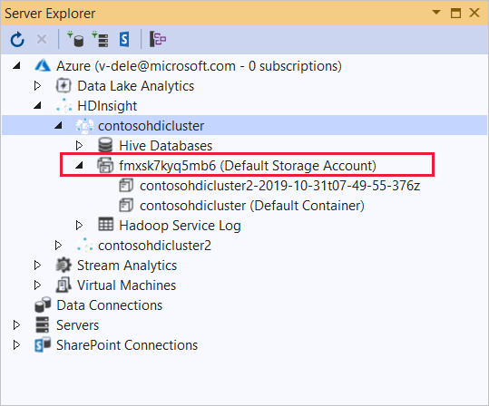

# Use C# with MapReduce streaming on Apache Hadoop in HDInsight

Learn how to use C# to create a MapReduce solution on HDInsight.

Apache Hadoop streaming allows you to run MapReduce jobs using a script or executable. Here, .NET is used to implement the mapper and reducer for a word count solution.

## .NET on HDInsight

HDInsight clusters use [Mono (https://mono-project.com)](https://mono-project.com) to run .NET applications. Mono version 4.2.1 is included with HDInsight version 3.6. For more information on the version of Mono included with HDInsight, see [Apache Hadoop components available with different HDInsight versions](../hdinsight-component-versioning.md#apache-components-available-with-different-hdinsight-versions).

For more information on Mono compatibility with .NET Framework versions, see [Mono compatibility](https://www.mono-project.com/docs/about-mono/compatibility/).

## How Hadoop streaming works

The basic process used for streaming in this document is as follows:

1. Hadoop passes data to the mapper (*mapper.exe* in this example) on STDIN.
2. The mapper processes the data, and emits tab-delimited key/value pairs to STDOUT.
3. The output is read by Hadoop, and then passed to the reducer (*reducer.exe* in this example) on STDIN.
4. The reducer reads the tab-delimited key/value pairs, processes the data, and then emits the result as tab-delimited key/value pairs on STDOUT.
5. The output is read by Hadoop and written to the output directory.

For more information on streaming, see [Hadoop Streaming](https://hadoop.apache.org/docs/r2.7.1/hadoop-streaming/HadoopStreaming.html).

## Prerequisites

* Visual Studio.

* A familiarity with writing and building C# code that targets .NET Framework 4.5.

* A way to upload .exe files to the cluster. The steps in this document use the Data Lake Tools for Visual Studio to upload the files to primary storage for the cluster.

* If using PowerShell, you'll need the [Az Module](https://docs.microsoft.com/powershell/azure/overview).

* An Apache Hadoop cluster on HDInsight. See [Get Started with HDInsight on Linux](../hadoop/apache-hadoop-linux-tutorial-get-started.md).

* The URI scheme for your clusters primary storage. This scheme would be `wasb://` for Azure Storage, `abfs://` for Azure Data Lake Storage Gen2 or `adl://` for Azure Data Lake Storage Gen1. If secure transfer is enabled for Azure Storage or Data Lake Storage Gen2, the URI would be `wasbs://` or `abfss://`, respectively.

## Create the mapper

In Visual Studio, create a new .NET Framework console application named *mapper*. Use the following code for the application:

```csharp
using System;
using System.Text.RegularExpressions;

namespace mapper
{
    class Program
    {
        static void Main(string[] args)
        {
            string line;
            //Hadoop passes data to the mapper on STDIN
            while((line = Console.ReadLine()) != null)
            {
                // We only want words, so strip out punctuation, numbers, etc.
                var onlyText = Regex.Replace(line, @"\.|;|:|,|[0-9]|'", "");
                // Split at whitespace.
                var words = Regex.Matches(onlyText, @"[\w]+");
                // Loop over the words
                foreach(var word in words)
                {
                    //Emit tab-delimited key/value pairs.
                    //In this case, a word and a count of 1.
                    Console.WriteLine("{0}\t1",word);
                }
            }
        }
    }
}
```

After you create the application, build it to produce the */bin/Debug/mapper.exe* file in the project directory.

## Create the reducer

In Visual Studio, create a new .NET Framework console application named *reducer*. Use the following code for the application:

```csharp
using System;
using System.Collections.Generic;

namespace reducer
{
    class Program
    {
        static void Main(string[] args)
        {
            //Dictionary for holding a count of words
            Dictionary<string, int> words = new Dictionary<string, int>();

            string line;
            //Read from STDIN
            while ((line = Console.ReadLine()) != null)
            {
                // Data from Hadoop is tab-delimited key/value pairs
                var sArr = line.Split('\t');
                // Get the word
                string word = sArr[0];
                // Get the count
                int count = Convert.ToInt32(sArr[1]);

                //Do we already have a count for the word?
                if(words.ContainsKey(word))
                {
                    //If so, increment the count
                    words[word] += count;
                } else
                {
                    //Add the key to the collection
                    words.Add(word, count);
                }
            }
            //Finally, emit each word and count
            foreach (var word in words)
            {
                //Emit tab-delimited key/value pairs.
                //In this case, a word and a count of 1.
                Console.WriteLine("{0}\t{1}", word.Key, word.Value);
            }
        }
    }
}
```

After you create the application, build it to produce the */bin/Debug/reducer.exe* file in the project directory.

## Upload to storage

Next, you need to upload the *mapper* and *reducer* applications to HDInsight storage.

1. In Visual Studio, select **View** > **Server Explorer**.

1. Right-click **Azure**, select **Connect to Microsoft Azure Subscription...**, and complete the sign-in process.

1. Expand the HDInsight cluster that you wish to deploy this application to. An entry with the text **(Default Storage Account)** is listed.

   

   * If the **(Default Storage Account)** entry can be expanded, you're using an **Azure Storage Account** as default storage for the cluster. To view the files on the default storage for the cluster, expand the entry and then double-click **(Default Container)**.

   * If the **(Default Storage Account)** entry can't be expanded, you're using **Azure Data Lake Storage** as the default storage for the cluster. To view the files on the default storage for the cluster, double-click the **(Default Storage Account)** entry.

1. To upload the .exe files, use one of the following methods:

    * If you're using an **Azure Storage Account**, select the **Upload Blob** icon.

        

        In the **Upload New File** dialog box, under **File name**, select **Browse**. In the **Upload Blob** dialog box, go to the *bin\debug* folder for the *mapper* project, and then choose the *mapper.exe* file. Finally, select **Open** and then **OK** to complete the upload.

    * For **Azure Data Lake Storage**, right-click an empty area in the file listing, and then select **Upload**. Finally, select the *mapper.exe* file and then select **Open**.

    Once the *mapper.exe* upload has finished, repeat the upload process for the *reducer.exe* file.

## Run a job: Using an SSH session

The following procedure describes how to run a MapReduce job using an SSH session:

1. Use [ssh command](../hdinsight-hadoop-linux-use-ssh-unix.md) to connect to your cluster. Edit the command below by replacing CLUSTERNAME with the name of your cluster, and then enter the command:

    ```cmd
    ssh sshuser@CLUSTERNAME-ssh.azurehdinsight.net
    ```

1. Use one of the following commands to start the MapReduce job:

   * If the default storage is **Azure Storage**:

        ```bash
        yarn jar /usr/hdp/current/hadoop-mapreduce-client/hadoop-streaming.jar \
            -files wasbs:///mapper.exe,wasbs:///reducer.exe \
            -mapper mapper.exe \
            -reducer reducer.exe \
            -input /example/data/gutenberg/davinci.txt \
            -output /example/wordcountout
        ```

    * If the default storage is **Data Lake Storage Gen1**:

        ```bash
        yarn jar /usr/hdp/current/hadoop-mapreduce-client/hadoop-streaming.jar \
            -files adl:///mapper.exe,adl:///reducer.exe \
            -mapper mapper.exe \
            -reducer reducer.exe \
            -input /example/data/gutenberg/davinci.txt \
            -output /example/wordcountout
        ```

   * If the default storage is **Data Lake Storage Gen2**:

        ```bash
        yarn jar /usr/hdp/current/hadoop-mapreduce-client/hadoop-streaming.jar \
            -files abfs:///mapper.exe,abfs:///reducer.exe \
            -mapper mapper.exe \
            -reducer reducer.exe \
            -input /example/data/gutenberg/davinci.txt \
            -output /example/wordcountout
        ```

   The following list describes what each parameter and option represents:

   |Parameter | Description |
   |---|---|
   |hadoop-streaming.jar|Specifies the jar file that contains the streaming MapReduce functionality.|
   |-files|Specifies the *mapper.exe* and *reducer.exe* files for this job. The `wasbs:///`, `adl:///`, or `abfs:///` protocol declaration before each file is the path to the root of default storage for the cluster.|
   |-mapper|Specifies the file that implements the mapper.|
   |-reducer|Specifies the file that implements the reducer.|
   |-input|Specifies the input data.|
   |-output|Specifies the output directory.|

1. Once the MapReduce job completes, use the following command to view the results:

   ```bash
   hdfs dfs -text /example/wordcountout/part-00000
   ```

   The following text is an example of the data returned by this command:

   ```output
   you     1128
   young   38
   younger 1
   youngest        1
   your    338
   yours   4
   yourself        34
   yourselves      3
   youth   17
   ```

## Run a job: Using PowerShell

Use the following PowerShell script to run a MapReduce job and download the results.

[!code-powershell[main](../../../powershell_scripts/hdinsight/use-csharp-mapreduce/use-csharp-mapreduce.ps1?range=5-87)]

This script prompts you for the cluster login account name and password, along with the HDInsight cluster name. Once the job completes, the output is downloaded to a file named *output.txt*. The following text is an example of the data in the `output.txt` file:

```output
you     1128
young   38
younger 1
youngest        1
your    338
yours   4
yourself        34
yourselves      3
youth   17
```

## Next steps

* [Use MapReduce in Apache Hadoop on HDInsight](hdinsight-use-mapreduce.md).
* [Use a C# user-defined function with Apache Hive and Apache Pig](apache-hadoop-hive-pig-udf-dotnet-csharp.md).
* [Develop Java MapReduce programs](apache-hadoop-develop-deploy-java-mapreduce-linux.md)