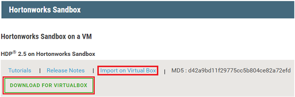

# Get started with a Hadoop sandbox, an emulator on a virtual machine

Learn how to install the Hadoop sandbox from Hortonworks on a virtual machine to learn about the Hadoop ecosystem. The sandbox provides a local development environment to learn about Hadoop, Hadoop Distributed File System (HDFS), and job submission. Once you are familiar with Hadoop, you can start using Hadoop on Azure by creating an HDInsight cluster. For more information on how to get started, see [Get started with Hadoop on HDInsight](apache-hadoop-linux-tutorial-get-started.md).

## Prerequisites
* [Oracle VirtualBox](https://www.virtualbox.org/). Download and install it from [here](https://www.virtualbox.org/wiki/Downloads).

## Download and install the virtual machine
1. Browse to the [Hortonworks downloads](http://hortonworks.com/downloads/#sandbox).

2. Click **DOWNLOAD FOR VIRTUALBOX** to download the latest Hortonworks Sandbox on a VM. You are prompted to register with Hortonworks before the download begins. It takes one to two hours to download depending on your network speed.
   
    
3. From the same web page, click the **Import on Virtual Box** link to download a PDF containing installation instructions for the virtual machine.

To download an older HDP version sandbox, expand the archive:

## Start the virtual machine

1. Open Oracle VM VirtualBox.
2. From the **File** menu, click **Import Appliance**, and then specify the Hortonworks Sandbox image.
1. Select the Hortonworks Sandbox, click **Start**, and then **Normal Start**. Once the virtual machine has finished the boot process, it displays login instructions.
   
    
2. Open a web browser and navigate to the URL displayed (usually http://127.0.0.1:8888).

## Set Sandbox passwords

1. From the **get started** step of the Hortonworks Sandbox page, select **View Advanced Options**. Use the information on this page to log in to the sandbox using SSH. Use the name and password provided.
   
   > [!NOTE]
   > If you do not have an SSH client installed, you can use the web-based SSH provided at by the virtual machine at **http://localhost:4200/**.
   > 
   
    The first time you connect using SSH, you are prompted to change the password for the root account. Enter a new password, which you use when you log in using SSH.

2. Once logged in, enter the following command:
   
        ambari-admin-password-reset
   
    When prompted, provide a password for the Ambari admin account. This is used when you access the Ambari Web UI.

## Use Hive commands

1. From an SSH connection to the sandbox, use the following command to start the Hive shell:
   
        hive
2. Once the shell has started, use the following to view the tables that are provided with the sandbox:
   
        show tables;
3. Use the following to retrieve 10 rows from the `sample_07` table:
   
        select * from sample_07 limit 10;

## Next steps
* [Learn how to use Visual Studio with the Hortonworks Sandbox](../hdinsight-hadoop-emulator-visual-studio.md)
* [Learning the ropes of the Hortonworks Sandbox](http://hortonworks.com/hadoop-tutorial/learning-the-ropes-of-the-hortonworks-sandbox/)
* [Hadoop tutorial - Getting started with HDP](http://hortonworks.com/hadoop-tutorial/hello-world-an-introduction-to-hadoop-hcatalog-hive-and-pig/)

