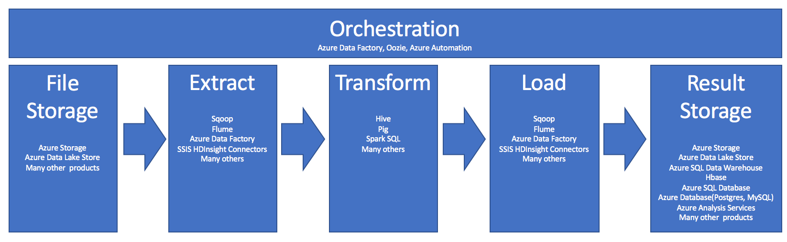

# Extract, transform, and load (ETL) at scale

Extract, transform, and load (ETL) is the process by which data is acquired from various sources, collected in a standard location, cleaned and processed, and ultimately loaded into a datastore from which it can be queried. Legacy ETL processes import data, clean it in place, and then store it in a relational data engine. With HDInsight, a wide variety of Apache Hadoop ecosystem components support performing ETL at scale. 

The use of HDInsight in the ETL process can be summarized by this pipeline:

The following sections explore each of the ETL phases and their associated components.

## Orchestration

Orchestration spans across all phases of the ETL pipeline. ETL jobs in HDInsight often involve several different products working in conjunction with each other.  You might use Hive to clean some portion of the data, while Pig cleans another portion.  You might use Azure Data Factory to load data into Azure SQL Database from Azure Data Lake Store.

Orchestration is needed to run the appropriate job at the appropriate time.

### Apache Oozie

Apache Oozie is a workflow coordination system that manages Hadoop jobs. Oozie runs within an HDInsight cluster and is integrated with the Hadoop stack. Oozie supports Hadoop jobs for Apache Hadoop MapReduce, Apache Pig, Apache Hive, and Apache Sqoop. Oozie can also be used to schedule jobs that are specific to a system, such as Java programs or shell scripts.

For more information, see [Use Apache Oozie with Apache Hadoop to define and run a workflow on HDInsight](../hdinsight-use-oozie-linux-mac.md) For a deep dive showing how to use Oozie to drive an end-to-end pipeline, see [Operationalize the Data Pipeline](../hdinsight-operationalize-data-pipeline.md). 

### Azure Data Factory

Azure Data Factory provides orchestration capabilities in the form of platform-as-a-service. It is a cloud-based data integration service that allows you to create data-driven workflows in the cloud for orchestrating and automating data movement and data transformation. 

Using Azure Data Factory, you can:

1. Create and schedule data-driven workflows (called pipelines) that ingest data from disparate data stores.
2. Process and transform the data using compute services such as Azure HDInsight Hadoop, Spark, Azure Data Lake Analytics, Azure Batch, and Azure Machine Learning.
3. Publish output data to data stores such as Azure SQL Data Warehouse for business intelligence (BI) applications to consume.

For more information on Azure Data Factory, see the [documentation](../../data-factory/introduction.md).

## Ingest file storage and result storage

Source data files are typically loaded into a location in Azure Storage or Azure Data Lake Storage. Files can be in any format, but typically they are flat files like CSVs. 

### Azure Storage 

[Azure Storage](https://azure.microsoft.com/services/storage/blobs/) has [specific scalability targets](../../storage/common/storage-scalability-targets.md).  For most analytic nodes, Azure Storage scales best when dealing with many smaller files.  Azure Storage guarantees the same performance, no matter how many files or how large the files (as long as you are within your limits).  This means that you can store terabytes of data and still get consistent performance, whether you are using a subset of the data or all of the data.

Azure Storage has several different types of blobs.  An *append blob* is a great option for storing web logs or sensor data.  

Multiple blobs can be distributed across many servers to scale out access to them, but a single blob can only be served by a single server. While blobs can be logically grouped in blob containers, there are no partitioning implications from this grouping.

Azure Storage also has a WebHDFS API layer for the blob storage.  All the services in HDInsight can access files in Azure Blob Storage for data cleaning and data processing, similarly to how those services would use Hadoop Distributed Files System (HDFS).

Data is typically ingested into Azure Storage using either PowerShell, the Azure Storage SDK, or AZCopy.

### Azure Data Lake Storage

Azure Data Lake Storage (ADLS) is a managed, hyperscale repository for analytics data that is compatible with HDFS.  ADLS uses a design paradigm that is similar to HDFS, and offers unlimited scalability in terms of total capacity and the size of individual files. ADLS is very good when working with large files, since a large file can be stored across multiple nodes.  Partitioning data in ADLS is done behind the scenes.  You get massive throughput to run analytic jobs with thousands of concurrent executors that efficiently read and write hundreds of terabytes of data.

Data is typically ingested into ADLS using Azure Data Factory, ADLS SDKs, AdlCopy Service, Apache DistCp, or Apache Sqoop.  Which of these services to use largely depends on where the data is.  If the data is currently in an existing Hadoop cluster, you might use Apache DistCp, AdlCopy Service, or Azure Data Factory.  If it's in Azure Blob Storage, you might use Azure Data Lake Storage .NET SDK, Azure PowerShell, or Azure Data Factory.

ADLS is also optimized for event ingestion using Azure Event Hub or Apache Storm.

#### Considerations for both storage options

For uploading datasets in the terabyte range, network latency can be a major problem, particularly if the data is coming from an on-premises location.  In such cases, you can use the options below:

* Azure ExpressRoute:  Azure ExpressRoute lets you create private connections between Azure datacenters and your on-premises infrastructure. These connections provide a reliable option for transferring large amounts of data. For more information, see [Azure ExpressRoute documentation](../../expressroute/expressroute-introduction.md).

* "Offline" upload of data. You can use [Azure Import/Export service](../../storage/common/storage-import-export-service.md) to ship hard disk drives with your data to an Azure data center. Your data is first uploaded to Azure Storage Blobs. You can then use [Azure Data Factory](../../data-factory/connector-azure-data-lake-store.md) or the [AdlCopy](../../data-lake-store/data-lake-store-copy-data-azure-storage-blob.md) tool to copy data from Azure Storage blobs to Data Lake Storage.

### Azure SQL Data Warehouse

Azure SQL DW is a great choice to store cleaned and prepared results for future analytics.  Azure HDInsight can be used to perform those services for Azure SQL DW.

Azure SQL Data Warehouse (SQL DW) is a relational database store optimized for analytic workloads.  Azure SQL DW scales based on partitioned tables.  Tables can be partitioned across multiple nodes.  Azure SQL DW nodes are selected at the time of creation.  They can scale after the fact, but that's an active process that might require data movement. See [SQL Data Warehouse - Manage Compute](../../sql-data-warehouse/sql-data-warehouse-manage-compute-overview.md) for more information.

### Apache HBase

Apache HBase is a key-value store available in Azure HDInsight.  Apache HBase is an open-source, NoSQL database that is built on Hadoop and modeled after Google BigTable. HBase provides performant random access and strong consistency for large amounts of unstructured and semistructured data in a schemaless database organized by column families.

Data is stored in the rows of a table, and data within a row is grouped by column family. HBase is a schemaless database in the sense that neither the columns nor the type of data stored in them need to be defined before using them. The open-source code scales linearly to handle petabytes of data on thousands of nodes. HBase can rely on data redundancy, batch processing, and other features that are provided by distributed applications in the Hadoop ecosystem.   

HBase is an excellent destination for sensor and log data for future analysis.

HBase scalability is dependent on the number of nodes in the HDInsight cluster.

### Azure SQL Database and Azure Database

Azure offers three different relational databases as platform-as-a-service (PAAS).

* [Azure SQL Database](../../sql-database/sql-database-technical-overview.md) is an implementation of Microsoft SQL Server. For more information on performance, see [Tuning Performance in Azure SQL Database](../../sql-database/sql-database-performance-guidance.md).
* [Azure Database for MySQL](../../mysql/overview.md)  is an implementation of Oracle MySQL.
* [Azure Database for PostgreSQL](../../postgresql/quickstart-create-server-database-portal.md) is an implementation of PostgreSQL.

These products scale up, which means that they are scaled by adding more CPU and memory.  You can also choose to use premium disks with the products for better I/O performance.

## Azure Analysis Services 

Azure Analysis Services (AAS) is an analytical data engine used in decision support and business analytics, providing the analytical data for business reports and client applications such as Power BI, Excel, Reporting Services reports, and other data visualization tools.

Analysis cubes can scale by changing tiers for each individual cube.  For more information, see [Azure Analysis Services Pricing](https://azure.microsoft.com/pricing/details/analysis-services/).

## Extract and Load

Once the data exists in Azure, you can use many services to extract and load it into other products.  HDInsight supports Sqoop and Flume. 

### Apache Sqoop

Apache Sqoop is a tool designed for efficiently transferring data between structured, semi-structured, and unstructured data sources. 

Sqoop uses MapReduce to import and export the data, to provide parallel operation and fault tolerance.

### Apache Flume

Apache Flume is a distributed, reliable, and available service for efficiently collecting, aggregating, and moving large amounts of log data. Flume has a simple and flexible architecture based on streaming data flows. Flume is robust and fault-tolerant with tunable reliability mechanisms and many failover and recovery mechanisms. Flume uses a simple extensible data model that allows for online analytic application.

Apache Flume cannot be used with Azure HDInsight.  An on-premises Hadoop installation can use Flume to send data to either Azure Storage Blobs or Azure Data Lake Storage.  For more information, see [Using Apache Flume with HDInsight](https://web.archive.org/web/20190217104751/https://blogs.msdn.microsoft.com/bigdatasupport/2014/03/18/using-apache-flume-with-hdinsight/).

## Transform

Once data exists in the chosen location, you need to clean it, combine it, or prepare it for a specific usage pattern.  Hive, Pig, and Spark SQL are all good choices for that kind of work.  They are all supported on HDInsight. 

## Next steps

* [Use Apache Pig with Apache Hadoop on HDInsight](hdinsight-use-pig.md)
* [Using Apache Hive as an ETL Tool](apache-hadoop-using-apache-hive-as-an-etl-tool.md) 
* [Use Azure Data Lake Storage Gen2 with Azure HDInsight clusters](../hdinsight-hadoop-use-data-lake-storage-gen2.md)
