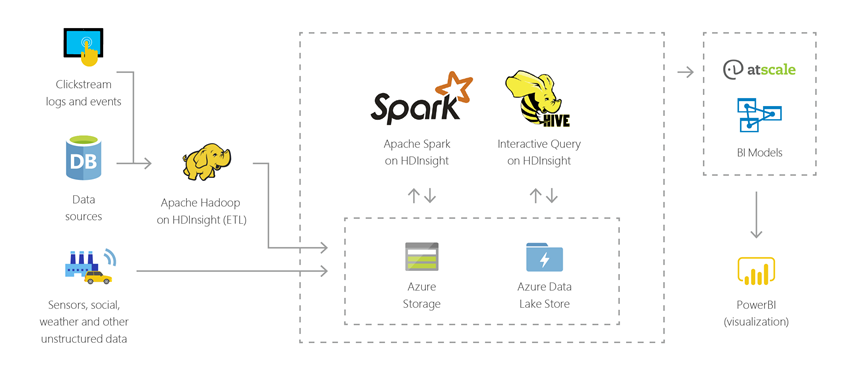
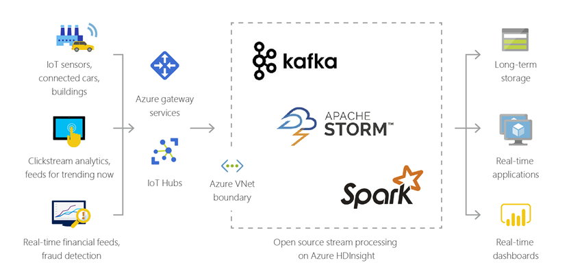
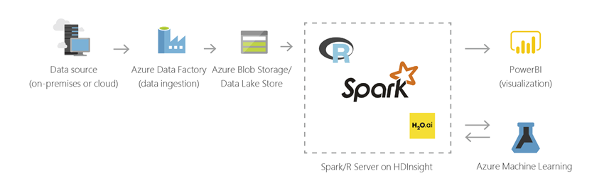
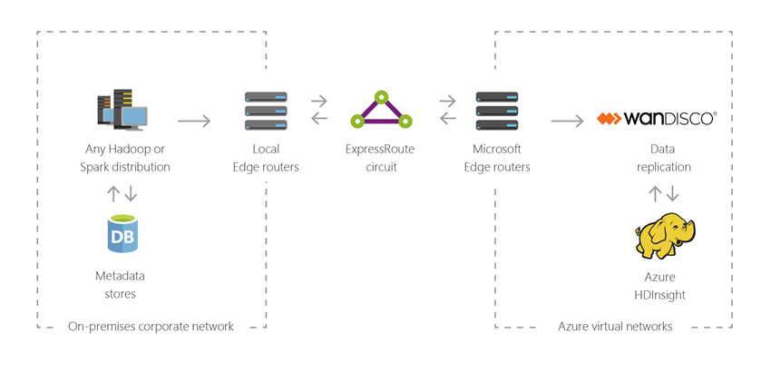

# What is Apache Hadoop in Azure HDInsight?

This article provides an introduction to Apache Hadoop on Azure HDInsight. Azure HDInsight is a fully managed, full-spectrum, open-source analytics service in the cloud for enterprises. You can use open-source frameworks such as Hadoop, Apache Spark, Apache Hive, LLAP, Apache Kafka, Apache Storm, R, and more. 

## What is HDInsight and the Hadoop technology stack?

[Apache Hadoop](https://hadoop.apache.org/) was the original open-source framework for distributed processing and analysis of big data sets on clusters. The Hadoop technology stack includes related software and utilities, including Apache Hive, Apache HBase, Spark, Kafka, and many others.

Azure HDInsight is a cloud distribution of Hadoop components. Azure HDInsight makes it easy, fast, and cost-effective to process massive amounts of data. You can use the most popular open-source frameworks such as Hadoop, Spark, Hive, LLAP, Kafka, Storm, R, and more. With these frameworks, you can enable a broad range of scenarios such as extract, transform, and load (ETL), data warehousing, machine learning, and IoT.

To see available Hadoop technology stack components on HDInsight, see [Components and versions available with HDInsight](../hdinsight-component-versioning.md). To read more about Hadoop in HDInsight, see the [Azure features page for HDInsight](https://azure.microsoft.com/services/hdinsight/).

## What is big data?

Big data is collected in escalating volumes, at higher velocities, and in a greater variety of formats than ever before. It can be historical (meaning stored) or real time (meaning streamed from the source). See [Scenarios for using HDInsight](#scenarios-for-using-hdinsight) to learn about the most common use cases for big data.

## Why should I use Hadoop on HDInsight?

This section lists the capabilities of Azure HDInsight.

|Capability  |Description  |
|---------|---------|
|Cloud native     |     Azure HDInsight enables you to create optimized clusters for [Hadoop](apache-hadoop-linux-tutorial-get-started.md), [Spark](../spark/apache-spark-jupyter-spark-sql.md), [Interactive query (LLAP)](../interactive-query/apache-interactive-query-get-started.md), [Kafka](../kafka/apache-kafka-get-started.md), [Storm](../storm/apache-storm-tutorial-get-started-linux.md), [HBase](../hbase/apache-hbase-tutorial-get-started-linux.md), and [ML Services](../r-server/r-server-overview.md) on Azure. HDInsight also provides an end-to-end SLA on all your production workloads.  |
|Low-cost and scalable     | HDInsight enables you to [scale](../hdinsight-administer-use-portal-linux.md#scale-clusters) workloads up or down. You can reduce costs by [creating clusters on demand](../hdinsight-hadoop-create-linux-clusters-adf.md) and paying only for what you use. You can also build data pipelines to operationalize your jobs. Decoupled compute and storage provide better performance and flexibility. |
|Secure and compliant    | HDInsight enables you to protect your enterprise data assets with [Azure Virtual Network](../hdinsight-extend-hadoop-virtual-network.md), [encryption](../hdinsight-hadoop-create-linux-clusters-with-secure-transfer-storage.md), and integration with [Azure Active Directory](../domain-joined/apache-domain-joined-introduction.md). HDInsight also meets the most popular industry and government [compliance standards](https://azure.microsoft.com/overview/trusted-cloud).        |
|Monitoring    | Azure HDInsight integrates with [Azure Monitor logs](../hdinsight-hadoop-oms-log-analytics-tutorial.md) to provide a single interface with which you can monitor all your clusters.        |
|Global availability | HDInsight is available in more [regions](https://azure.microsoft.com/regions/services/) than any other big data analytics offering. Azure HDInsight is also available in Azure Government, China, and Germany, which allows you to meet your enterprise needs in key sovereign areas. |  
|Productivity     |  Azure HDInsight enables you to use rich productive tools for Hadoop and Spark with your preferred development environments. These development environments include  [Visual Studio](apache-hadoop-visual-studio-tools-get-started.md), [VSCode](../hdinsight-for-vscode.md), [Eclipse](../spark/apache-spark-eclipse-tool-plugin.md), and [IntelliJ](../spark/apache-spark-intellij-tool-plugin.md) for Scala, Python, R, Java, and .NET support. Data scientists can also collaborate using popular notebooks such as [Jupyter](../spark/apache-spark-jupyter-notebook-kernels.md) and [Zeppelin](../spark/apache-spark-zeppelin-notebook.md).    |
|Extensibility     |  You can extend the HDInsight clusters with installed components (Hue, Presto, and so on) by using [script actions](../hdinsight-hadoop-customize-cluster-linux.md), by [adding edge nodes](../hdinsight-apps-use-edge-node.md), or by [integrating with other big data certified applications](../hdinsight-apps-install-applications.md). HDInsight enables seamless integration with the most popular big data solutions with a [one-click](https://azure.microsoft.com/services/hdinsight/partner-ecosystem/) deployment.|

## Scenarios for using HDInsight

Azure HDInsight can be used for a variety of scenarios in big data processing. It can be historical data (data that's already collected and stored) or real-time data (data that's directly streamed from the source). The scenarios for processing such data can be summarized in the following categories: 

### Batch processing (ETL)

Extract, transform, and load (ETL) is a process where unstructured or structured data is extracted from heterogeneous data sources. It's then transformed into a structured format and loaded into a data store. You can use the transformed data for data science or data warehousing.

### Data warehousing

You can use HDInsight to perform interactive queries at petabyte scales over structured or unstructured data in any format. You can also build models connecting them to BI tools. For more information, [read this customer story](https://customers.microsoft.com/story/milliman). 

### Internet of Things (IoT)

You can use HDInsight to process streaming data that's received in real time from a variety of devices. For more information, [read this blog post from Azure that announces the public preview of Apache Kafka on HDInsight with Azure Managed disks](https://azure.microsoft.com/blog/announcing-public-preview-of-apache-kafka-on-hdinsight-with-azure-managed-disks/).

 

### Data science

You can use HDInsight to build applications that extract critical insights from data. You can also use Azure Machine Learning on top of that to predict future trends for your business. For more information, [read this customer story](https://customers.microsoft.com/story/pros).

### Hybrid

You can use HDInsight to extend your existing on-premises big data infrastructure to Azure to leverage the advanced analytics capabilities of the cloud.

## Cluster types in HDInsight

HDInsight includes specific cluster types and cluster customization capabilities, such as the capability to add components, utilities, and languages. HDInsight offers the following cluster types:

|Cluster Type | Description |
|---|---|
|[Apache Hadoop](https://wiki.apache.org/hadoop)|A framework that uses HDFS, YARN resource management, and a simple MapReduce programming model to process and analyze batch data in parallel.|
|[Apache Spark](https://spark.apache.org/)|An open-source, parallel-processing framework that supports in-memory processing to boost the performance of big-data analysis applications. See [What is Apache Spark in HDInsight?](../spark/apache-spark-overview.md).|
|[Apache HBase](https://hbase.apache.org/)|A NoSQL database built on Hadoop that provides random access and strong consistency for large amounts of unstructured and semi-structured data--potentially billions of rows times millions of columns. See [What is HBase on HDInsight?](../hbase/apache-hbase-overview.md)|
|[ML Services](https://docs.microsoft.com/machine-learning-server/rebranding-microsoft-r-server)|A server for hosting and managing parallel, distributed R processes. It provides data scientists, statisticians, and R programmers with on-demand access to scalable, distributed methods of analytics on HDInsight. See [Overview of ML Services on HDInsight](../r-server/r-server-overview.md).|
|[Apache Storm](https://storm.incubator.apache.org/)|A distributed, real-time computation system for processing large streams of data fast. Storm is offered as a managed cluster in HDInsight. See [Analyze real-time sensor data using Storm and Hadoop](../storm/apache-storm-sensor-data-analysis.md).|
|[Apache Interactive Query](https://cwiki.apache.org/confluence/display/Hive/LLAP)|In-memory caching for interactive and faster Hive queries. See [Use Interactive Query in HDInsight](../interactive-query/apache-interactive-query-get-started.md).|
|[Apache Kafka](https://kafka.apache.org/)|An open-source platform that's used for building streaming data pipelines and applications. Kafka also provides message-queue functionality that allows you to publish and subscribe to data streams. See [Introduction to Apache Kafka on HDInsight](../kafka/apache-kafka-introduction.md).|

## Open-source components in HDInsight

Azure HDInsight enables you to create clusters with open-source frameworks such as Hadoop, Spark, Hive, LLAP, Kafka, Storm, HBase, and R. These clusters, by default, come with other open-source components that are included on the cluster such as [Apache Ambari](https://github.com/apache/ambari/blob/trunk/ambari-server/docs/api/v1/index.md), [Avro](https://avro.apache.org/docs/current/spec.html), [Apache Hive](https://hive.apache.org), [HCatalog](https://cwiki.apache.org/confluence/display/Hive/HCatalog/), [Apache Mahout](https://mahout.apache.org/), [Apache Hadoop MapReduce](https://wiki.apache.org/hadoop/MapReduce), [Apache Hadoop YARN](https://hadoop.apache.org/docs/current/hadoop-yarn/hadoop-yarn-site/YARN.html), [Apache Phoenix](https://phoenix.apache.org/), [Apache Pig](https://pig.apache.org/), [Apache Sqoop](https://sqoop.apache.org/), [Apache Tez](https://tez.apache.org/), [Apache Oozie](https://oozie.apache.org/), [Apache ZooKeeper](https://zookeeper.apache.org/).  

## Programming languages in HDInsight

HDInsight clusters, including Spark, HBase, Kafka, Hadoop, and others, support many programming languages. Some programming languages aren't installed by default. For libraries, modules, or packages that are not installed by default, [use a script action to install the component](../hdinsight-hadoop-script-actions-linux.md).

|Programming language  |Information  |
|---------|---------|
|Default programming language support     | By default, HDInsight clusters support:<ul><li>Java</li><li>Python</li><li>.NET</li><li>Go</li></ul>  |
|Java virtual machine (JVM) languages     | Many languages other than Java can run on a Java virtual machine (JVM). However, if you run some of these languages, you might have to install additional components on the cluster. The following JVM-based languages are supported on HDInsight clusters: <ul><li>Clojure</li><li>Jython (Python for Java)</li><li>Scala</li></ul>     |
|Hadoop-specific languages     | HDInsight clusters support the following languages that are specific to the Hadoop technology stack: <ul><li>Pig Latin for Pig jobs</li><li>HiveQL for Hive jobs and SparkSQL</li></ul>        |

## Development tools for HDInsight

You can use HDInsight development tools, including IntelliJ, Eclipse, Visual Studio Code, and Visual Studio, to author and submit HDInsight data query and job with seamless integration with Azure.

* [Azure toolkit for IntelliJ](https://docs.microsoft.com/azure/hdinsight/spark/apache-spark-intellij-tool-plugin)

* [Azure toolkit for Eclipse](https://docs.microsoft.com/azure/hdinsight/spark/apache-spark-eclipse-tool-plugin)

* [Azure HDInsight tools for VS Code](https://docs.microsoft.com/azure/hdinsight/hdinsight-for-vscode?branch=pr-en-us-22999)

* [Azure data lake tools for Visual Studio](https://docs.microsoft.com/azure/hdinsight/hadoop/apache-hadoop-visual-studio-tools-get-started)

## Business intelligence on HDInsight

Familiar business intelligence (BI) tools retrieve, analyze, and report data that is integrated with HDInsight by using either the Power Query add-in or the Microsoft Hive ODBC Driver:

* [Apache Spark BI using data visualization tools with Azure HDInsight](../spark/apache-spark-use-bi-tools.md)

* [Visualize Apache Hive data with Microsoft Power BI in Azure HDInsight](apache-hadoop-connect-hive-power-bi.md)

* [Visualize Interactive Query Hive data with Power BI in Azure HDInsight](../interactive-query/apache-hadoop-connect-hive-power-bi-directquery.md)

* [Connect Excel to Apache Hadoop with Power Query](apache-hadoop-connect-excel-power-query.md) (requires Windows)

* [Connect Excel to Apache Hadoop with the Microsoft Hive ODBC Driver](apache-hadoop-connect-excel-hive-odbc-driver.md) (requires Windows)

* [Use SQL Server Analysis Services with HDInsight](https://docs.microsoft.com/previous-versions/msp-n-p/dn749857(v=pandp.10))

* [Use SQL Server Reporting Services with HDInsight](https://docs.microsoft.com/previous-versions/msp-n-p/dn749856(v=pandp.10))

## Next steps

* [Create Apache Hadoop cluster in HDInsight](apache-hadoop-linux-create-cluster-get-started-portal.md)
