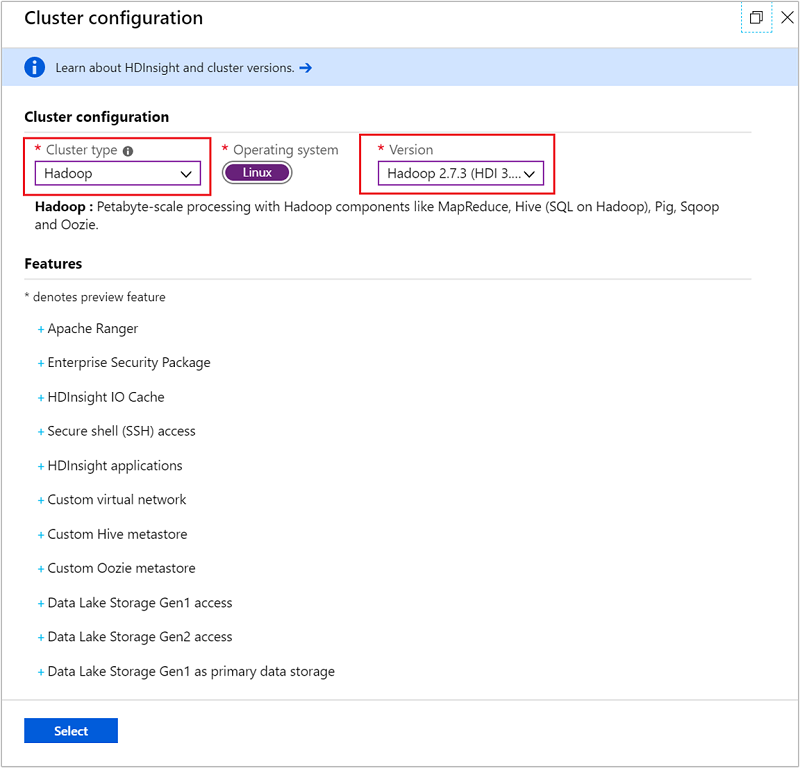
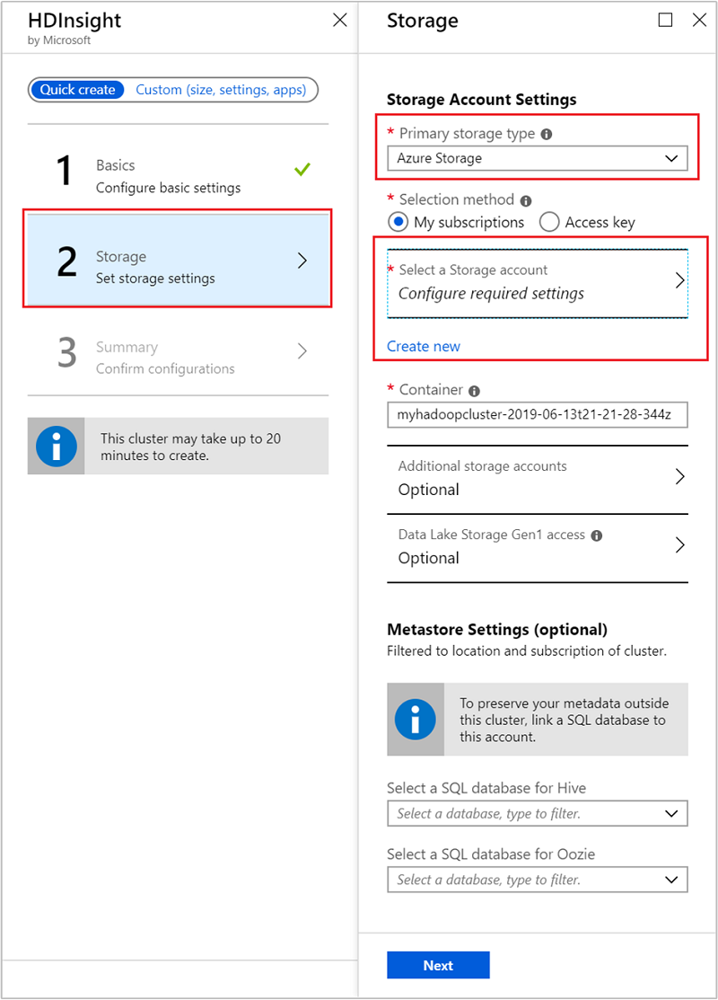
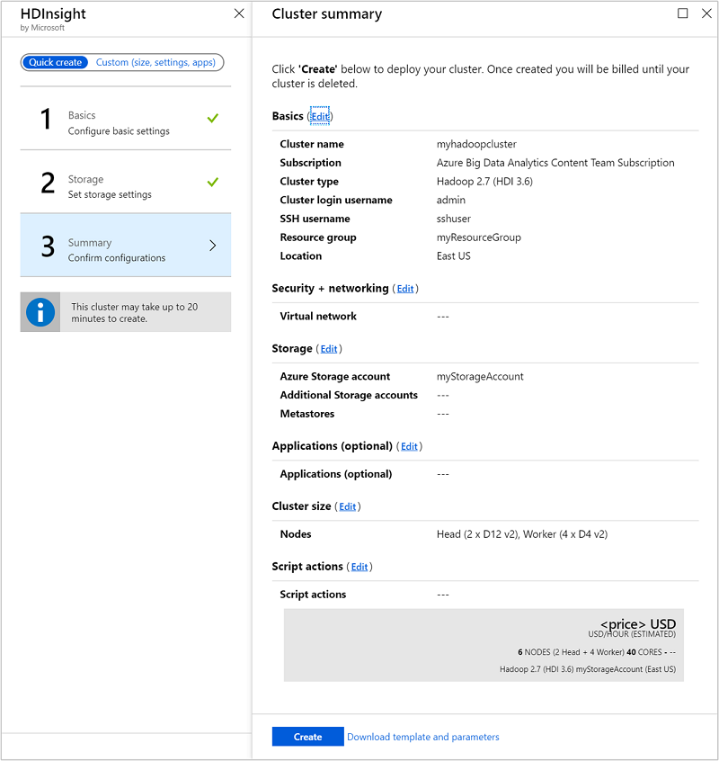
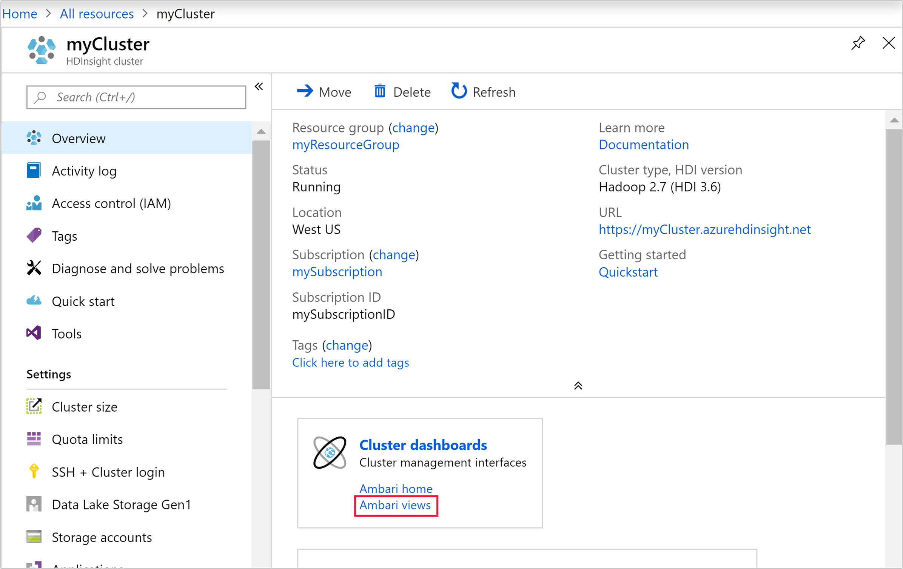
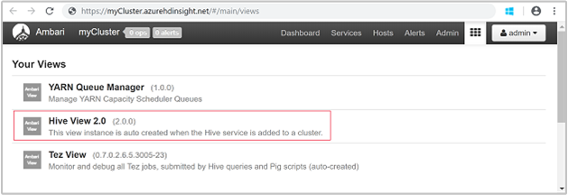
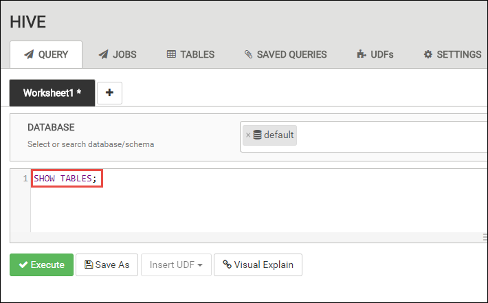
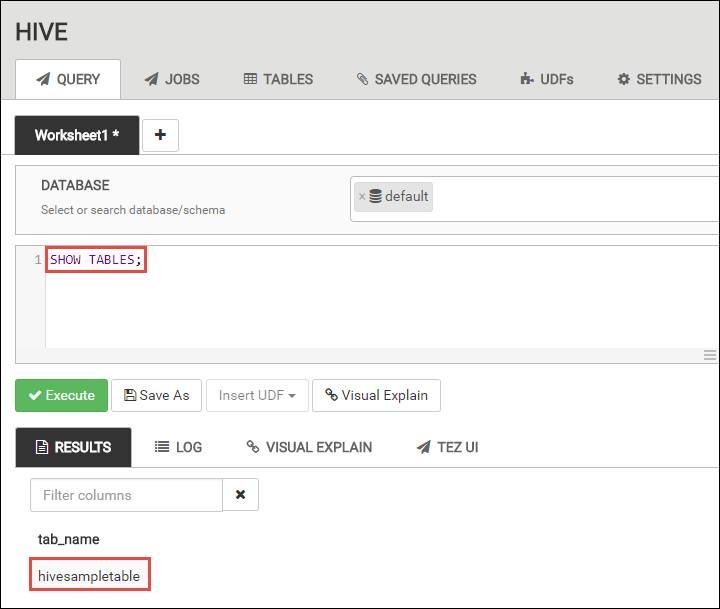
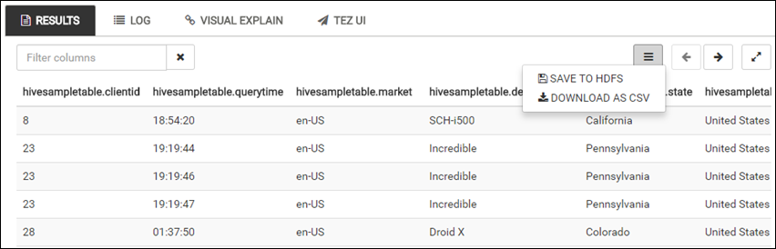
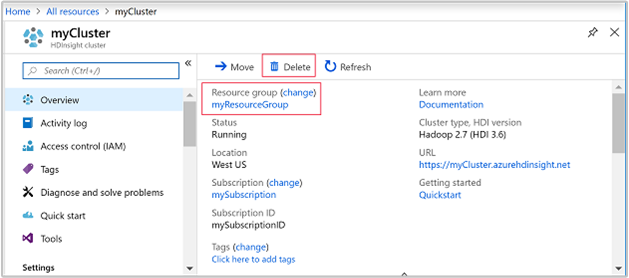

# Quickstart: Create Apache Hadoop cluster in Azure HDInsight using Azure portal

In this article, you learn how to create [Apache Hadoop](https://hadoop.apache.org/) clusters in HDInsight using Azure portal, and then run Apache Hive jobs in HDInsight. Most of Hadoop jobs are batch jobs. You create a cluster, run some jobs, and then delete the cluster. In this article, you perform all the three tasks.

In this quickstart, you use the Azure portal to create an HDInsight Hadoop cluster. You can also create a cluster using the [Azure Resource Manager template](apache-hadoop-linux-tutorial-get-started.md).

Currently HDInsight comes with [seven different cluster types](./apache-hadoop-introduction.md#cluster-types-in-hdinsight). Each cluster type supports a different set of components. All cluster types support Hive. For a list of supported components in HDInsight, see [What's new in the Apache Hadoop cluster versions provided by HDInsight?](../hdinsight-component-versioning.md)  

If you don't have an Azure subscription, [create a free account](https://azure.microsoft.com/free/) before you begin.

## Create an Apache Hadoop cluster

In this section, you create a Hadoop cluster in HDInsight using the Azure portal.

1. Sign in to the [Azure  portal](https://portal.azure.com).

1. From the Azure portal, navigate to **Create a resource** > **Analytics** > **HDInsight**.

    

1. Under **HDInsight** > **Quick create** > **Basics**, enter or select the following values:

    |Property  |Description  |
    |---------|---------|
    |Cluster name   | Enter a name for the Hadoop cluster. Because all clusters in HDInsight share the same DNS namespace this name needs to be unique. The name can consist of up to 59 characters including letters, numbers, and hyphens. The first and last characters of the name cannot be hyphens. |
    |Subscription    |  Select your Azure subscription. |
    |Cluster type     | Skip this for now. You provide this input in the next step of this procedure.|
    |Cluster login username and password    | The default login name is **admin**. The password must be at least 10 characters in length and must contain at least one digit, one uppercase, and one lower case letter, one non-alphanumeric character (except characters ' " ` \). Make sure you **do not provide** common passwords such as "Pass@word1".|
    |Secure Shell (SSH) username | The default username is **sshuser**.  You can provide another name for the SSH username. |
    |Use cluster login password for SSH| Select this checkbox to use the same password for SSH user as the one you provided for the cluster login user.|
    |Resource group     | Create a resource group or select an existing resource group.  A resource group is a container of Azure components.  In this case, the resource group contains the HDInsight cluster and the dependent Azure Storage account. |
    |Location    | Select an Azure location where you want to create your cluster.  Choose a location closer to you for better performance. |

    

1. Select **Cluster type** to open the **Cluster configuration** page, and then provide the following values:

    |Property  |Description  |
    |---------|---------|
    |Cluster type     | Select **Hadoop** |
    |Version     | Select **Hadoop 2.7.3 (HDI 3.6)**|

    

    Select **Select** and then select **Next** to advance to the storage settings.

1. From the **Storage** tab, provide the following values:

    |Property  |Description  |
    |---------|---------|
    |Primary storage type    | For this article, select Azure storage to use Azure Storage Blob as the default storage account. You can also use Azure Data Lake Storage as the default storage. |
    |Selection method     |  For this article, select **My subscriptions** to use a storage account from your Azure subscription. To use storage account from other subscriptions, select **Access key** and then provide the access key for that account. |
    |Select a Storage account   | Select **Select a Storage account** to select an existing storage account, or select **Create new**. If you create a new account, the name must be between 3 and 24 characters in length, and can include numbers and lowercase letters only.|

    Accept all other default values and then select **Next** to advance to the summary page.

    

1. From the **Summary** tab, verify the values you selected in the earlier steps.

    

1. Select **Create**. It takes about 20 minutes to create a cluster.

1. Once the cluster is created, you see the cluster overview page in the Azure portal.

        

    Each cluster has an [Azure Storage account](../hdinsight-hadoop-use-blob-storage.md) or an [Azure Data Lake account](../hdinsight-hadoop-use-data-lake-store.md) dependency. It is referred as the default storage account. HDInsight cluster and its default storage account must be colocated in the same Azure region. Deleting clusters does not delete the storage account.

    > [!NOTE]  
    > For other cluster creation methods and understanding the properties used in this quickstart, see [Create HDInsight clusters](../hdinsight-hadoop-provision-linux-clusters.md).

## Run Apache Hive queries

[Apache Hive](hdinsight-use-hive.md) is the most popular component used in HDInsight. There are many ways to run Hive jobs in HDInsight. In this quickstart, you use the Ambari Hive view from the portal. For other methods for submitting Hive jobs, see [Use Hive in HDInsight](hdinsight-use-hive.md).

1. To open Ambari, from the previous screenshot, select **Cluster Dashboard**.  You can also browse to  `https://ClusterName.azurehdinsight.net`, where `ClusterName` is the cluster you created in the previous section.

    

2. Enter the Hadoop username and password that you specified while creating the cluster. The default username is **admin**.

3. Open **Hive View** as shown in the following screenshot:

    

4. In the **QUERY** tab, paste the following HiveQL statements into the worksheet:

    ```sql
    SHOW TABLES;
    ```

    

5. Select **Execute**. A **RESULTS** tab appears beneath the **QUERY** tab and displays information about the job. 

    Once the query has finished, the **QUERY** tab displays the results of the operation. You shall see one table called **hivesampletable**. This sample Hive table comes with all the HDInsight clusters.

    

6. Repeat step 4 and step 5 to run the following query:

    ```sql
    SELECT * FROM hivesampletable;
    ```

7. You can also save the results of the query. Select the menu button on the right, and specify whether you want to download the results as a CSV file or store it to the storage account associated with the cluster.

    

After you have completed a Hive job, you can [export the results to Azure SQL database or SQL Server database](apache-hadoop-use-sqoop-mac-linux.md), you can also [visualize the results using Excel](apache-hadoop-connect-excel-power-query.md). For more information about using Hive in HDInsight, see [Use Apache Hive and HiveQL with Apache Hadoop in HDInsight to analyze a sample Apache log4j file](hdinsight-use-hive.md).

## Clean up resources

After you complete the quickstart, you may want to delete the cluster. With HDInsight, your data is stored in Azure Storage, so you can safely delete a cluster when it is not in use. You are also charged for an HDInsight cluster, even when it is not in use. Since the charges for the cluster are many times more than the charges for storage, it makes economic sense to delete clusters when they are not in use.

> [!NOTE]  
> If you are *immediately* proceeding to the next article to learn how to run ETL operations using Hadoop on HDInsight, you may want to keep the cluster running. This is because in the tutorial you have to create a Hadoop cluster again. However, if you are not going through the next article right away, you must delete the cluster now.

### To delete the cluster and/or the default storage account

1. Go back to the browser tab where you have the Azure portal. You shall be on the cluster overview page. If you only want to delete the cluster but retain the default storage account, select **Delete**.

    

2. If you want to delete the cluster as well as the default storage account, select the resource group name (highlighted in the previous screenshot) to open the resource group page.

3. Select **Delete resource group** to delete the resource group, which contains the cluster and the default storage account. Note deleting the resource group deletes the storage account. If you want to keep the storage account, choose to delete the cluster only.

## Next steps

In this quickstart, you learned how to create a Linux-based HDInsight cluster using a Resource Manager template, and how to perform basic Hive queries. In the next article, you learn how to perform an extract, transform, and load (ETL) operation using Hadoop on HDInsight.

> [!div class="nextstepaction"]
>[Extract, transform, and load data using Interactive Query on HDInsight](../interactive-query/interactive-query-tutorial-analyze-flight-data.md)
