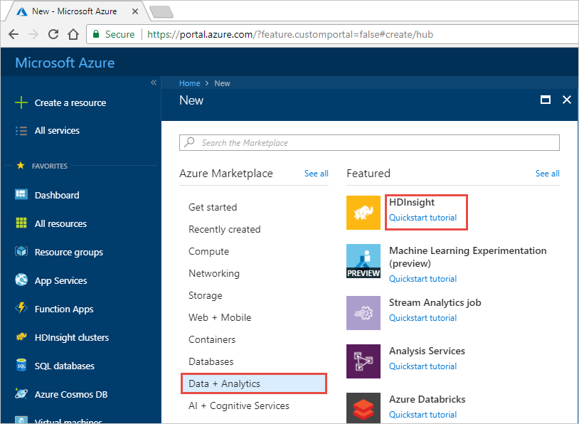
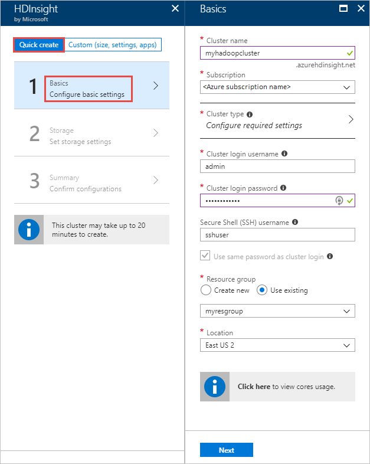
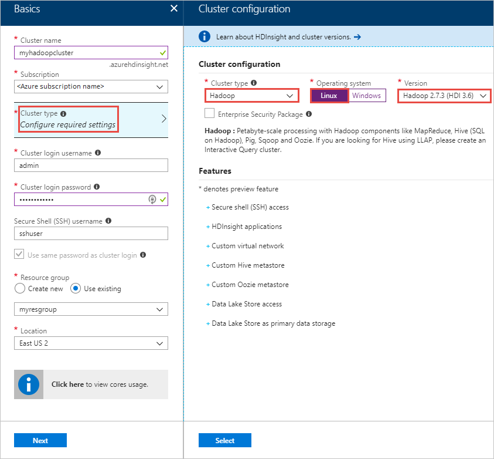
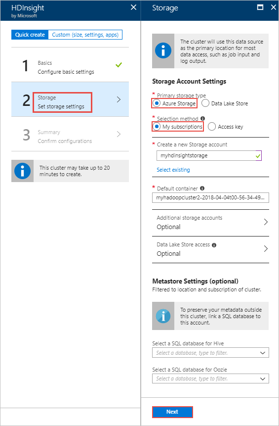
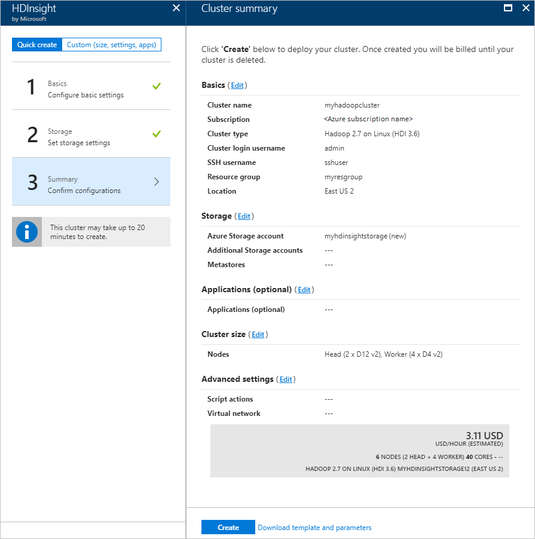
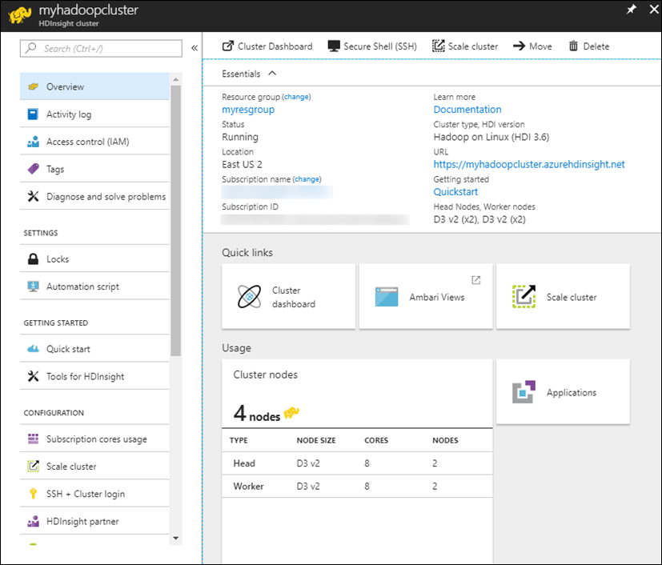

# Quickstart: Get started with Hadoop and Hive in Azure HDInsight using the Azure portal

In this article, you learn how to create [Hadoop](http://hadoop.apache.org/) clusters in HDInsight using Azure portal, and then run Hive jobs in HDInsight. Most of Hadoop jobs are batch jobs. You create a cluster, run some jobs, and then delete the cluster. In this article, you perform all the three tasks.

In this quickstart, you use the Azure portal to create an HDInsight Hadoop cluster. You can also create a cluster using the [Azure Resource Manager template](apache-hadoop-linux-tutorial-get-started.md).

Currently HDInsight comes with [seven different cluster types](./apache-hadoop-introduction.md#cluster-types-in-hdinsight). Each cluster type supports a different set of components. All cluster types support Hive. For a list of supported components in HDInsight, see [What's new in the Hadoop cluster versions provided by HDInsight?](../hdinsight-component-versioning.md)  

If you don't have an Azure subscription, [create a free account](https://azure.microsoft.com/free/) before you begin.

## Create a Hadoop cluster

In this section, you create a Hadoop cluster in HDInsight using the Azure portal. 

1. Log in to the [Azure  portal](https://portal.azure.com).

1. In the Azure portal, select **Create a resource** > **Data + Analytics** > **HDInsight**. 

    

2. Under **HDInsight** > **Quick Create** > **Basics**, provide the values as suggested in the following screenshot:

    

    Enter or select the following values:
    
    |Property  |Description  |
    |---------|---------|
    |**Cluster name**     | Enter a name for the Hadoop cluster. Because all clusters in HDInsight share the same DNS namespace this name needs to be unique. The name can consist of up to 59 characters includings letters, numbers, and hyphens. The first and last characters of the name cannot be hyphens. |
    |**Subscription**     |  Select your Azure subscription. |
    |**Cluster Type**     | Skip this for now. You provide this input in the next step of this procedure.|
    |**Cluster login username and password**     | The default login name is **admin**. The password must be at least 10 characters in length and must contain at least one digit, one uppercase, and one lower case letter, one non-alphanumeric character (except characters ' " ` \). Make sure you **do not provide** common passwords such as "Pass@word1".|
    |**SSH username** | The default username is **sshuser**.  You can provide another name for the SSH username. |
    | **Use same password as cluster login** | Select this checkbox to use the same password for SSH user as the one you provided for the cluster login user.|
    |**Resource group**     | Create a resource group or select an existing resource group.  A resource group is a container of Azure components.  In this case, the resource group contains the HDInsight cluster and the dependent Azure Storage account. |
    |**Location**     | Select an Azure location where you want to create your cluster.  Choose a location closer to you for better performance. |
        
3. Select **Cluster type** and then provide the inputs as shown in the following screenshot:

    

    Select the following values:
    
    |Property  |Description  |
    |---------|---------|
    |**Cluster type**     | Select **Hadoop** |
    |**Operating system**     |  Select your Azure subscription. |
    |**Version**     | Select **Hadoop 2.7.3 (HDI 3.6)**|

    Click **Select** and then click **Next**.

4. In the **Storage** tab, provide the inputs as shown in the following screenshot:

    

    Select the following values:
    
    |Property  |Description  |
    |---------|---------|
    |**Primary storage type**     | For this article, select **Azure storage** to use Azure Storage Blob as the default storage account. You can also use Azure Data Lake Storage as the default storage. |
    |**Selection method**     |  For this article, select **My subscriptions** to use a storage account from your Azure subscription. To use storage account from other subscriptions, select **Access key** and then provide the access key for that account. |
    |**Create a new storage account**     | Provide a name for the storage account.|

    Accept all other default values and then select **Next**.

5. In the **Summary** tab, verify the values you selected in the earlier steps.

    
      
4. Select **Create**. You shall see a new tile titled **Submitting deployment for HDInsight** on the portal dashboard. It takes about 20 minutes to create a cluster.

    

4. Once the cluster is created, you see the cluster overview page in the Azure portal.
   
        
    
    Each cluster has an [Azure Storage account](../hdinsight-hadoop-use-blob-storage.md) or an [Azure Data Lake account](../hdinsight-hadoop-use-data-lake-store.md) dependency. It is referred as the default storage account. HDInsight cluster and its default storage account must be co-located in the same Azure region. Deleting clusters does not delete the storage account.

    > [!NOTE]
    > For other cluster creation methods and understanding the properties used in this tutorial, see [Create HDInsight clusters](../hdinsight-hadoop-provision-linux-clusters.md).       
    > 
    >

## Run Hive queries

[Apache Hive](hdinsight-use-hive.md) is the most popular component used in HDInsight. There are many ways to run Hive jobs in HDInsight. In this tutorial, you use the Ambari Hive view from the portal. For other methods for submitting Hive jobs, see [Use Hive in HDInsight](hdinsight-use-hive.md).

1. To open Ambari, from the previous screenshot, select **Cluster Dashboard**.  You can also browse to  **https://&lt;ClusterName>.azurehdinsight.net**, where &lt;ClusterName> is the cluster you created in the previous section.

    

2. Enter the Hadoop username and password that you specified while creating the cluster. The default username is **admin**.

3. Open **Hive View** as shown in the following screenshot:
   
    

4. In the **QUERY** tab, paste the following HiveQL statements into the worksheet:
   
        SHOW TABLES;

    
   
   > [!NOTE]
   > Semi-colon is required by Hive.       
   > 
   > 

5. Select **Execute**. A **RESULTS** tab appears beneath the **QUERY** tab and displays information about the job. 
   
    Once the query has finished, The **QUERY** tab displays the results of the operation. You shall see one table called **hivesampletable**. This sample Hive table comes with all the HDInsight clusters.
   
    

6. Repeat step 4 and step 5 to run the following query:
   
        SELECT * FROM hivesampletable;
   
7. You can also save the results of the query. Select the menu button on the right, and specify whether you want to download the results as a CSV file or store it to the storage account associated with the cluster.

    

After you have completed a Hive job, you can [export the results to Azure SQL database or SQL Server database](apache-hadoop-use-sqoop-mac-linux.md), you can also [visualize the results using Excel](apache-hadoop-connect-excel-power-query.md). For more information about using Hive in HDInsight, see [Use Hive and HiveQL with Hadoop in HDInsight to analyze a sample Apache log4j file](hdinsight-use-hive.md).

## Troubleshoot

If you run into issues with creating HDInsight clusters, see [access control requirements](../hdinsight-administer-use-portal-linux.md#create-clusters).

## Clean up resources
After you complete the tutorial, you may want to delete the cluster. With HDInsight, your data is stored in Azure Storage, so you can safely delete a cluster when it is not in use. You are also charged for an HDInsight cluster, even when it is not in use. Since the charges for the cluster are many times more than the charges for storage, it makes economic sense to delete clusters when they are not in use. 

> [!NOTE]
> If you are *immediately* proceeding to the next tutorial to learn how to run ETL operations using Hadoop on HDInsight, you may want to keep the cluster running. This is becuase in the tutorial you have to create a Hadoop cluster again. However, if you are not going through the next tutorial right away, you must delete the cluster now.
> 
>  

**To delete the cluster and/or the default storage account**

1. Go back to the browser tab where you have the Azure portal. You shall be on the cluster overview page. If you only want to delete the cluster but retain the default storage account, select **Delete**.

    

2. If you want to delete the cluster as well as the default storage account, select the resource group name (highlighted in the previous screenshot) to open the resource group page.

3. Select **Delete resource group** to delete the resource group, which contains the cluster and the default storage account. Note deleting the resource group deletes the storage account. If you want to keep the storage account, choose to delete the cluster only.

## Next steps
In this tutorial, you learned how to create a Linux-based HDInsight cluster using a Resource Manager template, and how to perform basic Hive queries. In the next article, you learn how to perform an extract, transform, and load (ETL) operation using Hadoop on HDInsight.

> [!div class="nextstepaction"]
>[Extract, transform, and load data using Apache Hive on HDInsight ](../hdinsight-analyze-flight-delay-data-linux.md)

If you're ready to start working with your own data and need to know more about how HDInsight stores data or how to get data into HDInsight, see the following articles:

* For information on how HDInsight uses Azure Storage, see [Use Azure Storage with HDInsight](../hdinsight-hadoop-use-blob-storage.md).
* For information on how to create an HDInsight cluster with Data Lake Storage, see [Quickstart: Set up clusters in HDInsight](../../storage/data-lake-storage/quickstart-create-connect-hdi-cluster.md)
* For information on how to upload data to HDInsight, see [Upload data to HDInsight](../hdinsight-upload-data.md).

To learn more about analyzing data with HDInsight, see the following articles:

* To learn more about using Hive with HDInsight, including how to perform Hive queries from Visual Studio, see [Use Hive with HDInsight](hdinsight-use-hive.md).
* To learn about Pig, a language used to transform data, see [Use Pig with HDInsight](hdinsight-use-pig.md).
* To learn about MapReduce, a way to write programs that process data on Hadoop, see [Use MapReduce with HDInsight](hdinsight-use-mapreduce.md).
* To learn about using the HDInsight Tools for Visual Studio to analyze data on HDInsight, see [Get started using Visual Studio Hadoop tools for HDInsight](apache-hadoop-visual-studio-tools-get-started.md).

If you'd like to learn more about creating or managing an HDInsight cluster, see the following articles:

* To learn about managing your Linux-based HDInsight cluster, see [Manage HDInsight clusters using Ambari](../hdinsight-hadoop-manage-ambari.md).
* To learn more about the options you can select when creating an HDInsight cluster, see [Creating HDInsight on Linux using custom options](../hdinsight-hadoop-provision-linux-clusters.md).

[1]: ../HDInsight/apache-hadoop-visual-studio-tools-get-started.md

[hdinsight-provision]: hdinsight-provision-linux-clusters.md
[hdinsight-upload-data]: hdinsight-upload-data.md
[hdinsight-use-hive]: hdinsight-use-hive.md
[hdinsight-use-pig]: hdinsight-use-pig.md

