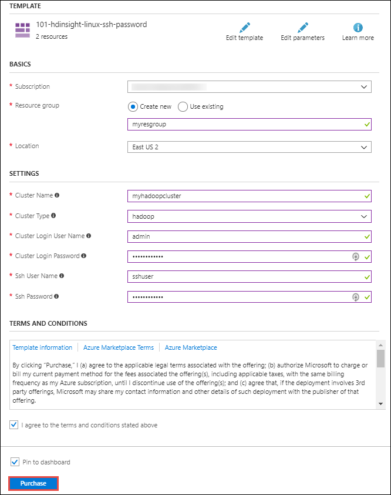
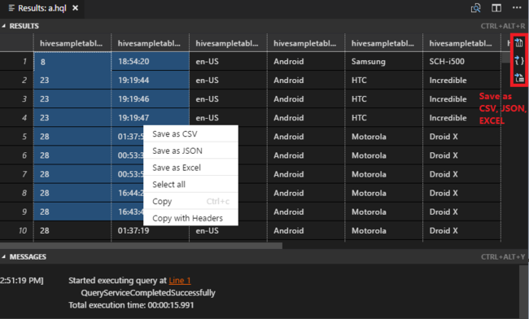
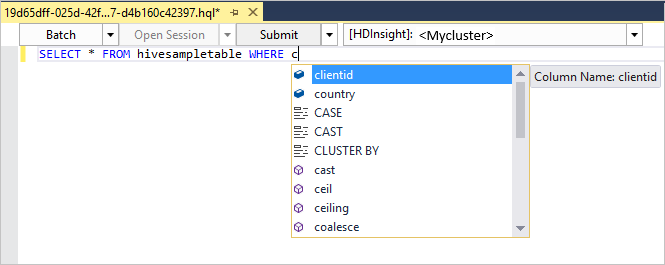

# Quickstart: Get started with Hadoop and Hive in Azure HDInsight using Resource Manager template

In this article, you learn how to create [Hadoop](http://hadoop.apache.org/) clusters in HDInsight using a Resource Manager template, and then run Hive jobs in HDInsight. Most of Hadoop jobs are batch jobs. You create a cluster, run some jobs, and then delete the cluster. In this article, you perform all the three tasks.

In this quickstart, you use a Resource Manager template to create an HDInsight Hadoop cluster. You can also create a cluster using the [Azure Portal](apache-hadoop-linux-create-cluster-get-started-portal.md).

Currently HDInsight comes with [seven different cluster types](./apache-hadoop-introduction.md#cluster-types-in-hdinsight). Each cluster type supports a different set of components. All cluster types support Hive. For a list of supported components in HDInsight, see [What's new in the Hadoop cluster versions provided by HDInsight?](../hdinsight-component-versioning.md)  

If you don't have an Azure subscription, [create a free account](https://azure.microsoft.com/free/) before you begin.

<a name="create-cluster"></a>
## Create a Hadoop cluster

In this section, you create a Hadoop cluster in HDInsight using an Azure Resource Manager template. Resource Manager template experience is not required for following this article. 

1. Click the **Deploy to Azure** button below to sign in to Azure and open the Resource Manager template in the Azure portal. 
   
    <a href="https://portal.azure.com/#create/Microsoft.Template/uri/https%3A%2F%2Fraw.githubusercontent.com%2FAzure%2Fazure-quickstart-templates%2Fmaster%2F101-hdinsight-linux-ssh-password%2Fazuredeploy.json" target="_blank"></a>

2. Enter or select the values as suggested in the following screenshot:

    > [!NOTE]
    > The values you provide must be unique and should follow the naming guidelines. The template does not perform validation checks. If the values you provide are already in use, or do not follow the guidelines, you get an error after you have submitted the template.       
    > 
    >
    
    

    Enter or select the following values:
    
    |Property  |Description  |
    |---------|---------|
    |**Subscription**     |  Select your Azure subscription. |
    |**Resource group**     | Create a resource group or select an existing resource group.  A resource group is a container of Azure components.  In this case, the resource group contains the HDInsight cluster and the dependent Azure Storage account. |
    |**Location**     | Select an Azure location where you want to create your cluster.  Choose a location closer to you for better performance. |
    |**Cluster Type**     | Select **hadoop**. |
    |**Cluster Name**     | Enter a name for the Hadoop cluster. Because all clusters in HDInsight share the same DNS namespace this name needs to be unique. The name can consist of up to 59 characters includings letters, numbers, and hyphens. The first and last characters of the name cannot be hyphens. |
    |**Cluster login name and password**     | The default login name is **admin**. The password must be at least 10 characters in length and must contain at least one digit, one uppercase, and one lower case letter, one non-alphanumeric character (except characters ' " ` \). Make sure you **do not provide** common passwords such as "Pass@word1".|
    |**SSH username and password**     | The default username is **sshuser**.  You can rename the SSH username.  The SSH user password has the same requirements as the cluster login password.|
       
    Some properties have been hardcoded in the template.  You can configure these values from the template. For more explanation of these properties, see [Create Hadoop clusters in HDInsight](../hdinsight-hadoop-provision-linux-clusters.md).

3. Select **I agree to the terms and conditions stated above** and **Pin to dashboard**, and then select **Purchase**. You shall see a new tile titled **Submitting deployment** on the portal dashboard. It takes about 20 minutes to create a cluster.

    

4. Once the cluster is created, the caption of the tile is changed to the resource group name you specified. The tile also lists the HDInsight cluster that is created within the resource group. 
   
    
    
5. The tile also lists the default storage associated with the cluster. Each cluster has an [Azure Storage account](../hdinsight-hadoop-use-blob-storage.md) or an [Azure Data Lake account](../hdinsight-hadoop-use-data-lake-store.md) dependency. It is referred as the default storage account. HDInsight cluster and its default storage account must be co-located in the same Azure region. Deleting clusters does not delete the storage account.
    

> [!NOTE]
> For other cluster creation methods and understanding the properties used in this tutorial, see [Create HDInsight clusters](../hdinsight-hadoop-provision-linux-clusters.md).       
> 
>

## Use VSCode to run Hive queries

How to get HDInsight Tools in VSCode, see [Use Azure HDInsight Tools for Visual Studio Code](../hdinsight-for-vscode.md).

### Submit interactive Hive queries

With HDInsight Tools for VSCode, you can submit interactive Hive queries to HDInsight interactive query clusters.

1. Create a new work folder and a new Hive script file if you don't already have them.

2. Connect to your Azure account, and then configure the default cluster if you haven't already done so.

3. Copy and paste the following code into your Hive file, and then save it.

    ```hiveql
    SELECT * FROM hivesampletable;
    ```
4. Right-click the script editor, and then select **HDInsight: Hive Interactive** to submit the query. The tools also allow you to submit a block of code instead of the whole script file using the context menu. Soon after, the query results appear in a new tab.

   

    - **RESULTS** panel: You can save the whole result as CSV, JSON, or Excel file to local path, or just select multiple lines.

    - **MESSAGES** panel: When you select **Line** number, it jumps to the first line of the running script.

Running the interactive query takes much less time than [running a Hive batch job](#submit-hive-batch-scripts).

### Submit Hive batch scripts

1. Create a new work folder and a new Hive script file if you don't already have them.

2. Connect to your Azure account, and then configure the default cluster if you haven't already done so.

3. Copy and paste the following code into your Hive file, and then save it.

    ```hiveql
    SELECT * FROM hivesampletable;
    ```
4. Right-click the script editor, and then select **HDInsight: Hive Batch** to submit a Hive job. 

5. Select the cluster to which you want to submit.  

    After you submit a Hive job, the submission success info and jobid appears in the **OUTPUT** panel. The Hive job also opens **WEB BROWSER**, which shows the real-time job  logs and status.

   

[Submitting interactive Hive queries](#submit-interactive-hive-queries) takes much less time than submitting a batch job.

## Use VisualStudio to run Hive queries

How to get HDInsight Tools in Visual Studio, see [Use Data Lake Tools for Visual Studio](./apache-hadoop-visual-studio-tools-get-started.md).

### Run Hive queries

You have two options for creating and running Hive queries:

* Create ad-hoc queries
* Create a Hive application

To create and run ad-hoc queries:

1. In **Server Explorer**, select **Azure** > **HDInsight Clusters**.

2. Right-click the cluster where you want to run the query, and then select **Write a Hive Query**.  

3. Enter the Hive queries. 

    The Hive editor supports IntelliSense. Data Lake Tools for Visual Studio supports loading remote metadata when you edit your Hive script. For example, if you type **SELECT * FROM**, IntelliSense lists all the suggested table names. When a table name is specified, IntelliSense lists the column names. The tools support most Hive DML statements, subqueries, and built-in UDFs.
   
    
   
    
   
   > [!NOTE]
   > IntelliSense suggests only the metadata of the cluster that is selected in the HDInsight toolbar.
   > 
   
4. Select **Submit** or **Submit (Advanced)**. 
   
    

   If you select the advanced submit option, configure **Job Name**, **Arguments**, **Additional Configurations**, and **Status Directory** for the script:

    

   Run Interactive Hive queries

   * click on down-arrow to choose **interactive**. 
   
   * Click **Execute**.

   

To create and run a Hive solution:

1. On the **File** menu, select **New**, and then select **Project**.
2. In the left pane, select **HDInsight**. In the middle pane, select **Hive Application**. Enter the properties, and then select **OK**.
   
    
3. In **Solution Explorer**, double-click **Script.hql** to open the script.
4. Enter the Hive queries and submit. (Refer to the step3&4 above)  


## Run Hive queries

[Apache Hive](hdinsight-use-hive.md) is the most popular component used in HDInsight. There are many ways to run Hive jobs in HDInsight. In this tutorial, you use the Ambari Hive view from the portal. For other methods for submitting Hive jobs, see [Use Hive in HDInsight](hdinsight-use-hive.md).

1. To open Ambari, from the previous screenshot, select **Cluster Dashboard**.  You can also browse to  **https://&lt;ClusterName>.azurehdinsight.net**, where &lt;ClusterName> is the cluster you created in the previous section.

    

2. Enter the Hadoop username and password that you specified while creating the cluster. The default username is **admin**.

3. Open **Hive View** as shown in the following screenshot:
   
    

4. In the **QUERY** tab, paste the following HiveQL statements into the worksheet:
   
        SHOW TABLES;

    
   
   > [!NOTE]
   > Semi-colon is required by Hive.       
   > 
   > 

5. Select **Execute**. A **RESULTS** tab appears beneath the **QUERY** tab and displays information about the job. 
   
    Once the query has finished, The **QUERY** tab displays the results of the operation. You shall see one table called **hivesampletable**. This sample Hive table comes with all the HDInsight clusters.
   
    

6. Repeat step 4 and step 5 to run the following query:
   
        SELECT * FROM hivesampletable;
   
7. You can also save the results of the query. Select the menu button on the right, and specify whether you want to download the results as a CSV file or store it to the storage account associated with the cluster.

    

After you have completed a Hive job, you can [export the results to Azure SQL database or SQL Server database](apache-hadoop-use-sqoop-mac-linux.md), you can also [visualize the results using Excel](apache-hadoop-connect-excel-power-query.md). For more information about using Hive in HDInsight, see [Use Hive and HiveQL with Hadoop in HDInsight to analyze a sample Apache log4j file](hdinsight-use-hive.md).

## Troubleshoot

If you run into issues with creating HDInsight clusters, see [access control requirements](../hdinsight-administer-use-portal-linux.md#create-clusters).

## Clean up resources
After you complete the article, you may want to delete the cluster. With HDInsight, your data is stored in Azure Storage, so you can safely delete a cluster when it is not in use. You are also charged for an HDInsight cluster, even when it is not in use. Since the charges for the cluster are many times more than the charges for storage, it makes economic sense to delete clusters when they are not in use. 

> [!NOTE]
> If you are *immediately* proceeding to the next tutorial to learn how to run ETL operations using Hadoop on HDInsight, you may want to keep the cluster running. This is becuase in the tutorial you have to create a Hadoop cluster again. However, if you are not going through the next tutorial right away, you must delete the cluster now.
> 
> 

**To delete the cluster and/or the default storage account**

1. Go back to the browser tab where you have the Azure portal. You shall be on the cluster overview page. If you only want to delete the cluster but retain the default storage account, select **Delete**.

    

2. If you want to delete the cluster as well as the default storage account, select the resource group name (highlighted in the previous screenshot) to open the resource group page.

3. Select **Delete resource group** to delete the resource group, which contains the cluster and the default storage account. Note deleting the resource group deletes the storage account. If you want to keep the storage account, choose to delete the cluster only.

## Next steps
In this article, you learned how to create a Linux-based HDInsight cluster using a Resource Manager template, and how to perform basic Hive queries. In the next article, you learn how to perform an extract, transform, and load (ETL) operation using Hadoop on HDInsight.

> [!div class="nextstepaction"]
>[Extract, transform, and load data using Apache Hive on HDInsight ](../hdinsight-analyze-flight-delay-data-linux.md)

If you're ready to start working with your own data and need to know more about how HDInsight stores data or how to get data into HDInsight, see the following articles:

* For information on how HDInsight uses Azure Storage, see [Use Azure Storage with HDInsight](../hdinsight-hadoop-use-blob-storage.md).
* For information on how to create an HDInsight cluster with Data Lake Storage, see [Quickstart: Set up clusters in HDInsight](../../storage/data-lake-storage/quickstart-create-connect-hdi-cluster.md)
* For information on how to upload data to HDInsight, see [Upload data to HDInsight](../hdinsight-upload-data.md).

To learn more about analyzing data with HDInsight, see the following articles:

* To learn more about using Hive with HDInsight, including how to perform Hive queries from Visual Studio, see [Use Hive with HDInsight](hdinsight-use-hive.md).
* To learn about Pig, a language used to transform data, see [Use Pig with HDInsight](hdinsight-use-pig.md).
* To learn about MapReduce, a way to write programs that process data on Hadoop, see [Use MapReduce with HDInsight](hdinsight-use-mapreduce.md).
* To learn about using the HDInsight Tools for Visual Studio to analyze data on HDInsight, see [Get started using Visual Studio Hadoop tools for HDInsight](apache-hadoop-visual-studio-tools-get-started.md).
* To learn about using the HDInsight Tools for VSCode to analyze data on HDInsight, see [Use Azure HDInsight Tools for Visual Studio Code](../hdinsight-for-vscode.md).


If you'd like to learn more about creating or managing an HDInsight cluster, see the following articles:

* To learn about managing your Linux-based HDInsight cluster, see [Manage HDInsight clusters using Ambari](../hdinsight-hadoop-manage-ambari.md).
* To learn more about the options you can select when creating an HDInsight cluster, see [Creating HDInsight on Linux using custom options](../hdinsight-hadoop-provision-linux-clusters.md).


[1]: ../HDInsight/apache-hadoop-visual-studio-tools-get-started.md

[hdinsight-provision]: hdinsight-provision-linux-clusters.md
[hdinsight-upload-data]: hdinsight-upload-data.md
[hdinsight-use-hive]: hdinsight-use-hive.md
[hdinsight-use-pig]: hdinsight-use-pig.md


