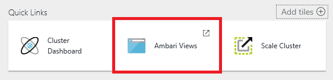
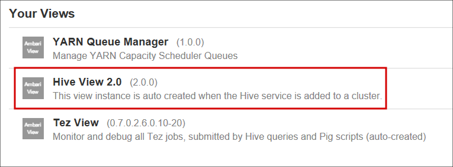
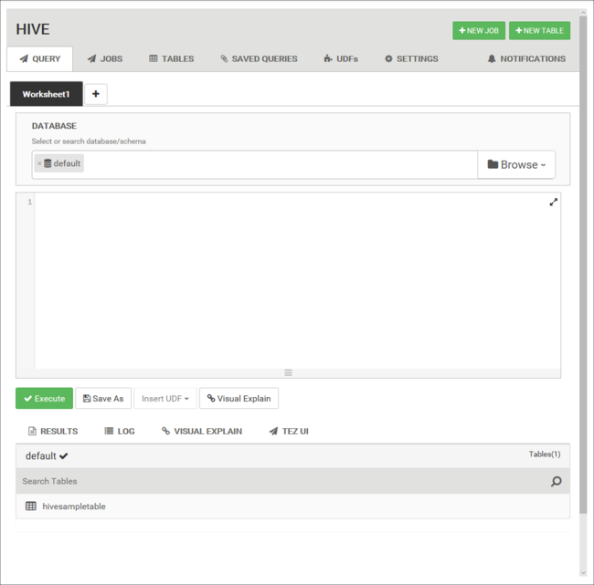
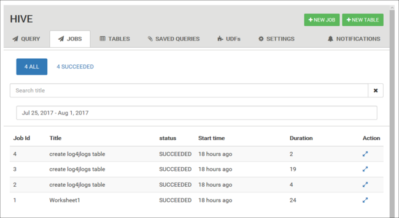
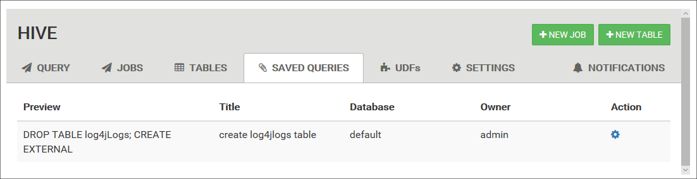

# Use Ambari Hive View with Hadoop in HDInsight

[!INCLUDE [hive-selector](../../../includes/hdinsight-selector-use-hive.md)]

Learn how to run Hive queries by using Ambari Hive View. The Hive View allows you to author, optimize, and run Hive queries from your web browser.

## Prerequisites

* A Linux-based Hadoop on HDInsight cluster version 3.4 or greater.

  > [!IMPORTANT]
  > Linux is the only operating system used on HDInsight version 3.4 or greater. For more information, see [HDInsight retirement on Windows](../hdinsight-component-versioning.md#hdinsight-windows-retirement).

* A web browser

## Run a Hive query

1. Open the [Azure portal](https://portal.azure.com).

2. Select your HDInsight cluster, and then select **Ambari Views** from the **Quick Links** section.

    

    When prompted to authenticate, use the cluster login (default `admin`) account name and password that you provided when you created the cluster.

3. From the list of views, select __Hive View__.

    

    The Hive view page is similar to the following image:

    

4. From the __Query__ tab, paste the following HiveQL statements into the worksheet:

    ```hiveql
    DROP TABLE log4jLogs;
    CREATE EXTERNAL TABLE log4jLogs(
        t1 string,
        t2 string,
        t3 string,
        t4 string,
        t5 string,
        t6 string,
        t7 string)
    ROW FORMAT DELIMITED FIELDS TERMINATED BY ' '
    STORED AS TEXTFILE LOCATION '/example/data/';
    SELECT t4 AS loglevel, COUNT(*) AS count FROM log4jLogs 
        WHERE t4 = '[ERROR]' 
        GROUP BY t4;
    ```

    These statements perform the following actions:

   * `DROP TABLE`: Deletes the table and the data file, in case the table already exists.

   * `CREATE EXTERNAL TABLE`: Creates a new "external" table in Hive.
   External tables store only the table definition in Hive. The data is left in the original location.

   * `ROW FORMAT`: Shows how the data is formatted. In this case, the fields in each log are separated by a space.

   * `STORED AS TEXTFILE LOCATION`: Shows where the data is stored, and that it's stored as text.

   * `SELECT`: Selects a count of all rows where column t4 contains the value [ERROR].

    > [!IMPORTANT]
    > Leave the __Database__ selection at __default__. The examples in this document use the default database included with HDInsight.

5. To start the query, use the **Execute** button below the worksheet. The button turns orange and the text changes to **Stop**.

6. After the query has finished, the **Results** tab displays the results of the operation. The following text is the result of the query:

        loglevel       count
        [ERROR]        3

    You can use the **Logs** tab to view the logging information that the job created.

   > [!TIP]
   > Download or save results from the **Save results** drop-down dialog box in the upper left of the **Query Process Results** section.

### Visual explain

To display a visualization of the query plan, select the **Visual Explain** tab below the worksheet.

The **Visual Explain** view of the query can be helpful in understanding the flow of complex queries. You can see a textual equivalent of this view by using the **Explain** button in the Query Editor.

### Tez UI

To display the Tez UI for the query, select the **Tez** tab below the worksheet.

> [!IMPORTANT]
> Tez is not used to resolve all queries. You can resolve many queries without using Tez. 

If Tez was used to resolve the query, the Directed Acyclic Graph (DAG) is displayed. If you want to view the DAG for queries you've run in the past, or if you want to debug the Tez process, use the [Tez View](../hdinsight-debug-ambari-tez-view.md) instead.

## View job history

The __Jobs__ tab displays a history of Hive queries.



## Database tables

You can use the __Tables__ tab to work with tables within a Hive database.


## Saved queries

From the **Query** tab, you can optionally save queries. After you save a query, you can reuse it from the __Saved Queries__ tab.



> [!TIP]
> Saved queries are stored in the default cluster storage. You can find the saved queries under the path `/user/<username>/hive/scripts`. These are stored as plain-text `.hql` files.
>
> If you delete the cluster, but keep the storage, you can use a utility like [Azure Storage Explorer](https://azure.microsoft.com/features/storage-explorer/) or Data Lake Storage Explorer (from the [Azure Portal](https://portal.azure.com)) to retrieve the queries.

## User-defined functions

You can extend Hive through user-defined functions (UDF). Use a UDF to implement functionality or logic that isn't easily modeled in HiveQL.

Declare and save a set of UDFs by using the **UDF** tab at the top of the Hive View. These UDFs can be used with the **Query Editor**.


After you've added a UDF to the Hive View, an **Insert udfs** button appears at the bottom of the **Query Editor**. Selecting this entry displays a drop-down list of the UDFs defined in the Hive View. Selecting a UDF adds HiveQL statements to your query to enable the UDF.

For example, if you have defined a UDF with the following properties:

* Resource name: myudfs

* Resource path: /myudfs.jar

* UDF name: myawesomeudf

* UDF class name: com.myudfs.Awesome

Using the **Insert udfs** button displays an entry named **myudfs**, with another drop-down list for each UDF defined for that resource. In this case, it is **myawesomeudf**. Selecting this entry adds the following to the beginning of the query:

```hiveql
add jar /myudfs.jar;
create temporary function myawesomeudf as 'com.myudfs.Awesome';
```

You can then use the UDF in your query. For example, `SELECT myawesomeudf(name) FROM people;`.

For more information on using UDFs with Hive on HDInsight, see the following articles:

* [Using Python with Hive and Pig in HDInsight](python-udf-hdinsight.md)
* [How to add a custom Hive UDF to HDInsight](http://blogs.msdn.com/b/bigdatasupport/archive/2014/01/14/how-to-add-custom-hive-udfs-to-hdinsight.aspx)

## Hive settings

You can change various Hive settings, such as changing the execution engine for Hive from Tez (the default) to MapReduce.

## <a id="nextsteps"></a>Next steps

For general information on Hive on HDInsight:

* [Use Hive with Hadoop on HDInsight](hdinsight-use-hive.md)

For information on other ways you can work with Hadoop on HDInsight:

* [Use Pig with Hadoop on HDInsight](hdinsight-use-pig.md)
* [Use MapReduce with Hadoop on HDInsight](hdinsight-use-mapreduce.md)
