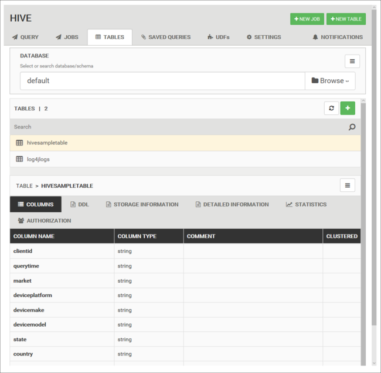
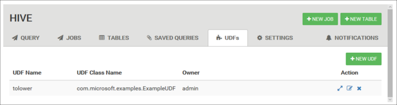

# Use Apache Ambari Hive View with Apache Hadoop in HDInsight

[!INCLUDE [hive-selector](../../../includes/hdinsight-selector-use-hive.md)]

Learn how to run Hive queries by using Apache Ambari Hive View. The Hive View allows you to author, optimize, and run Hive queries from your web browser.

## Prerequisites

A Hadoop cluster on HDInsight. See [Get Started with HDInsight on Linux](./apache-hadoop-linux-tutorial-get-started.md).

## Run a Hive query

1. From the [Azure portal](https://portal.azure.com/), select your cluster.  See [List and show clusters](../hdinsight-administer-use-portal-linux.md#showClusters) for instructions. The cluster is opened in a new portal view.

1. From **Cluster dashboards**, select **Ambari views**. When prompted to authenticate, use the cluster login (default `admin`) account name and password that you provided when you created the cluster. You can also navigate to `https://CLUSTERNAME.azurehdinsight.net/#/main/views` in your browser where `CLUSTERNAME` is the name of your cluster.

1. From the list of views, select __Hive View__.

    

    The Hive view page is similar to the following image:

    

1. From the __Query__ tab, paste the following HiveQL statements into the worksheet:

    ```hiveql
    DROP TABLE log4jLogs;
    CREATE EXTERNAL TABLE log4jLogs(
        t1 string,
        t2 string,
        t3 string,
        t4 string,
        t5 string,
        t6 string,
        t7 string)
    ROW FORMAT DELIMITED FIELDS TERMINATED BY ' '
    STORED AS TEXTFILE LOCATION '/example/data/';
    SELECT t4 AS loglevel, COUNT(*) AS count FROM log4jLogs
        WHERE t4 = '[ERROR]'
        GROUP BY t4;
    ```

    These statements do the following actions:

    |Statement | Description |
    |---|---|
    |DROP TABLE|Deletes the table and the data file, in case the table already exists.|
    |CREATE EXTERNAL TABLE|Creates a new "external" table in Hive. External tables store only the table definition in Hive. The data is left in the original location.|
    |ROW FORMAT|Shows how the data is formatted. In this case, the fields in each log are separated by a space.|
    |STORED AS TEXTFILE LOCATION|Shows where the data is stored, and that it's stored as text.|
    |SELECT|Selects a count of all rows where column t4 contains the value [ERROR].|

   > [!IMPORTANT]  
   > Leave the __Database__ selection at __default__. The examples in this document use the default database included with HDInsight.

1. To start the query, select **Execute** below the worksheet. The button turns orange and the text changes to **Stop**.

1. After the query has finished, the **Results** tab displays the results of the operation. The following text is the result of the query:

        loglevel       count
        [ERROR]        3

    You can use the **LOG** tab to view the logging information that the job created.

   > [!TIP]  
   > Download or save results from the **Actions** drop-down dialog box under the  **Results** tab.

### Visual explain

To display a visualization of the query plan, select the **Visual Explain** tab below the worksheet.

The **Visual Explain** view of the query can be helpful in understanding the flow of complex queries.

### Tez UI

To display the Tez UI for the query, select the **Tez UI** tab below the worksheet.

> [!IMPORTANT]  
> Tez is not used to resolve all queries. You can resolve many queries without using Tez.

## View job history

The __Jobs__ tab displays a history of Hive queries.


## Database tables

You can use the __Tables__ tab to work with tables within a Hive database.



## Saved queries

From the **Query** tab, you can optionally save queries. After you save a query, you can reuse it from the __Saved Queries__ tab.


> [!TIP]  
> Saved queries are stored in the default cluster storage. You can find the saved queries under the path `/user/<username>/hive/scripts`. These are stored as plain-text `.hql` files.
>
> If you delete the cluster, but keep the storage, you can use a utility like [Azure Storage Explorer](https://azure.microsoft.com/features/storage-explorer/) or Data Lake Storage Explorer (from the [Azure Portal](https://portal.azure.com)) to retrieve the queries.

## User-defined functions

You can extend Hive through user-defined functions (UDF). Use a UDF to implement functionality or logic that isn't easily modeled in HiveQL.

Declare and save a set of UDFs by using the **UDF** tab at the top of the Hive View. These UDFs can be used with the **Query Editor**.



An **Insert udfs** button appears at the bottom of the **Query Editor**. This entry displays a drop-down list of the UDFs defined in the Hive View. Selecting a UDF adds HiveQL statements to your query to enable the UDF.

For example, if you've defined a UDF with the following properties:

* Resource name: myudfs

* Resource path: /myudfs.jar

* UDF name: myawesomeudf

* UDF class name: com.myudfs.Awesome

Using the **Insert udfs** button displays an entry named **myudfs**, with another drop-down list for each UDF defined for that resource. In this case, it's **myawesomeudf**. Selecting this entry adds the following to the beginning of the query:

```hiveql
add jar /myudfs.jar;
create temporary function myawesomeudf as 'com.myudfs.Awesome';
```

You can then use the UDF in your query. For example, `SELECT myawesomeudf(name) FROM people;`.

For more information on using UDFs with Hive on HDInsight, see the following articles:

* [Using Python with Apache Hive and Apache Pig in HDInsight](python-udf-hdinsight.md)
* [Use a Java UDF with Apache Hive in HDInsight](./apache-hadoop-hive-java-udf.md)

## Hive settings

You can change various Hive settings, such as changing the execution engine for Hive from Tez (the default) to MapReduce.

## Next steps

For general information on Hive on HDInsight:

* [Use Apache Hive with Apache Hadoop on HDInsight](hdinsight-use-hive.md)
* [Use the Apache Beeline client with Apache Hive](apache-hadoop-use-hive-beeline.md)
