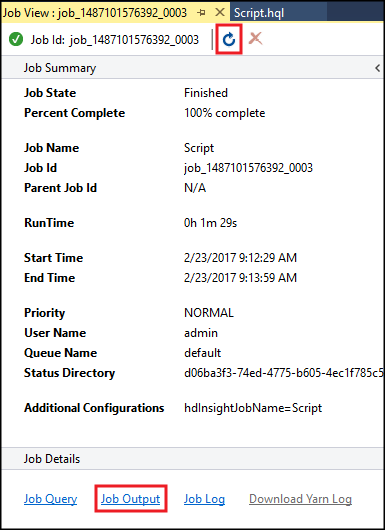

# Run Hive queries using the Data Lake tools for Visual Studio

Learn how to use the Data Lake tools for Visual Studio to query Apache Hive. The Data Lake tools allow you to easily create, submit, and monitor Hive queries to Hadoop on Azure HDInsight.

## <a id="prereq"></a>Prerequisites

* An Azure HDInsight (Hadoop on HDInsight) cluster

  > [!IMPORTANT]
  > Linux is the only operating system used on HDInsight version 3.4 or greater. For more information, see [HDInsight retirement on Windows](../hdinsight-component-versioning.md#hdinsight-windows-retirement).

* Visual Studio (one of the following versions):

    * Visual Studio 2013 Community/Professional/Premium/Ultimate with Update 4

    * Visual Studio 2015 (any edition)

    * Visual Studio 2017 (any edition)

* HDInsight tools for Visual Studio or Azure Data Lake tools for Visual Studio. See [Get started using Visual Studio Hadoop tools for HDInsight](apache-hadoop-visual-studio-tools-get-started.md) for information on installing and configuring the tools.

## <a id="run"></a> Run Hive queries using the Visual Studio

1. Open **Visual Studio** and select **New** > **Project** > **Azure Data Lake** > **HIVE** > **Hive Application**. Provide a name for this project.

2. Open the **Script.hql** file that is created with this project, and paste in the following HiveQL statements:

   ```hiveql
   set hive.execution.engine=tez;
   DROP TABLE log4jLogs;
   CREATE EXTERNAL TABLE log4jLogs (t1 string, t2 string, t3 string, t4 string, t5 string, t6 string, t7 string)
   ROW FORMAT DELIMITED FIELDS TERMINATED BY ' '
   STORED AS TEXTFILE LOCATION '/example/data/';
   SELECT t4 AS sev, COUNT(*) AS count FROM log4jLogs WHERE t4 = '[ERROR]' AND  INPUT__FILE__NAME LIKE '%.log' GROUP BY t4;
   ```

    These statements perform the following actions:

   * `DROP TABLE`: If the table exists, this statement deletes it.

   * `CREATE EXTERNAL TABLE`: Creates a new 'external' table in Hive. External tables only store the table definition in Hive (the data is left in the original location).

     > [!NOTE]
     > External tables should be used when you expect the underlying data to be updated by an external source. For example, a MapReduce job or Azure service.
     >
     > Dropping an external table does **not** delete the data, only the table definition.

   * `ROW FORMAT`: Tells Hive how the data is formatted. In this case, the fields in each log are separated by a space.

   * `STORED AS TEXTFILE LOCATION`: Tells Hive that the data is stored in the example/data directory, and that it is stored as text.

   * `SELECT`: Select a count of all rows where column `t4` contains the value `[ERROR]`. This statement returns a value of `3` because there are three rows that contain this value.

   * `INPUT__FILE__NAME LIKE '%.log'` - Tells Hive that we should only return data from files ending in .log. This clause restricts the search to the sample.log file that contains the data.

3. From the toolbar, select the **HDInsight Cluster** that you want to use for this query. Select **Submit** to run the statements as a Hive job.

   

4. The **Hive Job Summary** appears and displays information about the running job. Use the **Refresh** link to refresh the job information, until the **Job Status** changes to **Completed**.

   

5. Use the **Job Output** link to view the output of this job. It displays `[ERROR] 3`, which is the value returned by this query.

6. You can also run Hive queries without creating a project. Using **Server Explorer**, expand **Azure** > **HDInsight**, right-click your HDInsight server, and then select **Write a Hive Query**.

7. In the **temp.hql** document that appears, add the following HiveQL statements:

   ```hiveql
   set hive.execution.engine=tez;
   CREATE TABLE IF NOT EXISTS errorLogs (t1 string, t2 string, t3 string, t4 string, t5 string, t6 string, t7 string) STORED AS ORC;
   INSERT OVERWRITE TABLE errorLogs SELECT t1, t2, t3, t4, t5, t6, t7 FROM log4jLogs WHERE t4 = '[ERROR]' AND INPUT__FILE__NAME LIKE '%.log';
   ```

    These statements perform the following actions:

   * `CREATE TABLE IF NOT EXISTS`: Creates a table if it does not already exist. Because the `EXTERNAL` keyword is not used, this statement creates an internal table. Internal tables are stored in the Hive data warehouse and are managed by Hive.

     > [!NOTE]
     > Unlike `EXTERNAL` tables, dropping an internal table also deletes the underlying data.

   * `STORED AS ORC`: Stores the data in optimized row columnar (ORC) format. ORC is a highly optimized and efficient format for storing Hive data.

   * `INSERT OVERWRITE ... SELECT`: Selects rows from the `log4jLogs` table that contain `[ERROR]`, then inserts the data into the `errorLogs` table.

8. From the toolbar, select **Submit** to run the job. Use the **Job Status** to determine that the job has completed successfully.

9. To verify that the job created the table, use **Server Explorer** and expand **Azure** > **HDInsight** > your HDInsight cluster > **Hive Databases** > **default**. The **errorLogs** table and the **log4jLogs** table are listed.

## <a id="nextsteps"></a>Next steps

As you can see, the HDInsight tools for Visual Studio provide an easy way to work with Hive queries on HDInsight.

For general information about Hive in HDInsight:

* [Use Hive with Hadoop on HDInsight](hdinsight-use-hive.md)

For information about other ways you can work with Hadoop on HDInsight:

* [Use Pig with Hadoop on HDInsight](hdinsight-use-pig.md)

* [Use MapReduce with Hadoop on HDInsight](hdinsight-use-mapreduce.md)

For more information about the HDInsight tools for Visual Studio:

* [Getting started with HDInsight tools for Visual Studio](apache-hadoop-visual-studio-tools-get-started.md)

[hdinsight-sdk-documentation]: http://msdnstage.redmond.corp.microsoft.com/library/dn479185.aspx

[azure-purchase-options]: http://azure.microsoft.com/pricing/purchase-options/
[azure-member-offers]: http://azure.microsoft.com/pricing/member-offers/
[azure-free-trial]: http://azure.microsoft.com/pricing/free-trial/

[apache-tez]: http://tez.apache.org
[apache-hive]: http://hive.apache.org/
[apache-log4j]: http://en.wikipedia.org/wiki/Log4j
[hive-on-tez-wiki]: https://cwiki.apache.org/confluence/display/Hive/Hive+on+Tez
[import-to-excel]: http://azure.microsoft.com/documentation/articles/hdinsight-connect-excel-power-query/


[hdinsight-use-oozie]: hdinsight-use-oozie.md
[hdinsight-analyze-flight-data]: hdinsight-analyze-flight-delay-data.md


[hdinsight-storage]: hdinsight-hadoop-use-blob-storage.md

[hdinsight-provision]: hdinsight-hadoop-provision-linux-clusters.md
[hdinsight-submit-jobs]:submit-apache-hadoop-jobs-programmatically.md
[hdinsight-upload-data]: hdinsight-upload-data.md
[hdinsight-get-started]:apache-hadoop-linux-tutorial-get-started.md

[powershell-here-strings]: http://technet.microsoft.com/library/ee692792.aspx

[image-hdi-hive-powershell]: ./media/hdinsight-use-hive/HDI.HIVE.PowerShell.png
[img-hdi-hive-powershell-output]: ./media/hdinsight-use-hive/HDI.Hive.PowerShell.Output.png
[image-hdi-hive-architecture]: ./media/hdinsight-use-hive/HDI.Hive.Architecture.png
