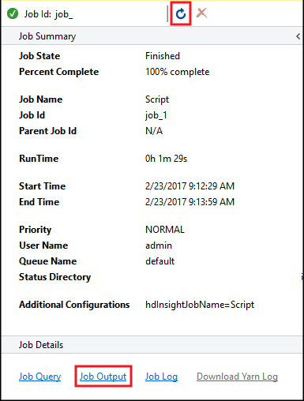

# Run Apache Hive queries using the Data Lake tools for Visual Studio

Learn how to use the Data Lake tools for Visual Studio to query Apache Hive. The Data Lake tools allow you to easily create, submit, and monitor Hive queries to Apache Hadoop on Azure HDInsight.

## Prerequisites

* An Apache Hadoop cluster on HDInsight. For information about creating this item, see [Create Apache Hadoop cluster in Azure HDInsight using Resource Manager template](./apache-hadoop-linux-tutorial-get-started.md).

* [Visual Studio](https://visualstudio.microsoft.com/vs/). The steps in this article use Visual Studio 2019.

* HDInsight tools for Visual Studio or Azure Data Lake tools for Visual Studio. For information on installing and configuring the tools, see [Install Data Lake Tools for Visual Studio](apache-hadoop-visual-studio-tools-get-started.md#install-data-lake-tools-for-visual-studio).

## Run Apache Hive queries using the Visual Studio

You have two options for creating and running Hive queries:

* Create ad-hoc queries.
* Create a Hive application.

### Create an ad-hoc Hive query

Ad hoc queries can be executed in either **Batch** or **Interactive** mode.

1. Launch **Visual Studio** and select **Continue without code**.

2. From **Server Explorer**, right-click **Azure**, select **Connect to Microsoft Azure Subscription...**, and complete the sign in process.

3. Expand **HDInsight**, right-click the cluster where you want to run the query, and then select **Write a Hive Query**.

4. Enter the following hive query:

    ```hql
    SELECT * FROM hivesampletable;
    ```

5. Select **Execute**. The execution mode defaults to **Interactive**.

    

6. To run the same query in **Batch** mode, toggle the drop-down list from **Interactive** to **Batch**. The execution button changes from **Execute** to **Submit**.

    

    The Hive editor supports IntelliSense. Data Lake Tools for Visual Studio supports loading remote metadata when you edit your Hive script. For example, if you type `SELECT * FROM`, IntelliSense lists all the suggested table names. When a table name is specified, IntelliSense lists the column names. The tools support most Hive DML statements, subqueries, and built-in UDFs. IntelliSense suggests only the metadata of the cluster that is selected in the HDInsight toolbar.

7. In the query toolbar (the area below the query tab and above the query text), either select **Submit**, or select the pulldown arrow next to **Submit** and choose **Advanced** from the pulldown list. If you select the latter option,

8. If you selected the advanced submit option, configure **Job Name**, **Arguments**, **Additional Configurations**, and **Status Directory** in the **Submit Script** dialog box. Then select **Submit**.

    

### Create a Hive application

To run a Hive query by creating a Hive application, follow these steps:

1. Open **Visual Studio**.

2. In the **Start** window, select **Create a new project**.

3. In the **Create a new project** window, in the **Search for templates** box, enter *Hive*. Then choose **Hive Application** and select **Next**.

4. In the **Configure your new project** window, enter a **Project name**, select or create a **Location** for the new project, and then select **Create**.

5. Open the **Script.hql** file that is created with this project, and paste in the following HiveQL statements:

    ```hql
    set hive.execution.engine=tez;
    DROP TABLE log4jLogs;
    CREATE EXTERNAL TABLE log4jLogs (t1 string, t2 string, t3 string, t4 string, t5 string, t6 string, t7 string)
    ROW FORMAT DELIMITED FIELDS TERMINATED BY ' '
    STORED AS TEXTFILE LOCATION '/example/data/';
    SELECT t4 AS sev, COUNT(*) AS count FROM log4jLogs WHERE t4 = '[ERROR]' AND  INPUT__FILE__NAME LIKE '%.log' GROUP BY t4;
    ```

    These statements do the following actions:

    * `DROP TABLE`: Deletes the table if it exists.

    * `CREATE EXTERNAL TABLE`: Creates a new 'external' table in Hive. External tables only store the table definition in Hive. (The data is left in the original location.)

        > [!NOTE]  
        > External tables should be used when you expect the underlying data to be updated by an external source, such as a MapReduce job or an Azure service.
        >
        > Dropping an external table does **not** delete the data, only the table definition.

    * `ROW FORMAT`: Tells Hive how the data is formatted. In this case, the fields in each log are separated by a space.

    * `STORED AS TEXTFILE LOCATION`: Tells Hive that the data is stored in the *example/data* directory, and that it's stored as text.

    * `SELECT`: Selects a count of all rows where column `t4` contains the value `[ERROR]`. This statement returns a value of `3`, because three rows contain this value.

    * `INPUT__FILE__NAME LIKE '%.log'`: Tells Hive to only return data from files ending in .log. This clause restricts the search to the *sample.log* file that contains the data.

6. From the query file toolbar (which has a similar appearance to the ad-hoc query toolbar), select the HDInsight cluster that you want to use for this query. Then change **Interactive** to **Batch** (if necessary) and select **Submit** to run the statements as a Hive job.

   The **Hive Job Summary** appears and displays information about the running job. Use the **Refresh** link to refresh the job information, until the **Job Status** changes to **Completed**.

   

7. Select **Job Output** to view the output of this job. It displays `[ERROR] 3`, which is the value returned by this query.

### Additional example

The following example relies on the `log4jLogs` table created in the previous procedure, [Create a Hive application](#create-a-hive-application).

1. From **Server Explorer**, right-click your cluster and select **Write a Hive Query**.

2. Enter the following hive query:

    ```hql
    set hive.execution.engine=tez;
    CREATE TABLE IF NOT EXISTS errorLogs (t1 string, t2 string, t3 string, t4 string, t5 string, t6 string, t7 string) STORED AS ORC;
    INSERT OVERWRITE TABLE errorLogs SELECT t1, t2, t3, t4, t5, t6, t7 FROM log4jLogs WHERE t4 = '[ERROR]' AND INPUT__FILE__NAME LIKE '%.log';
    ```

    These statements do the following actions:

    * `CREATE TABLE IF NOT EXISTS`: Creates a table if it doesn't already exist. Because the `EXTERNAL` keyword isn't used, this statement creates an internal table. Internal tables are stored in the Hive data warehouse and are managed by Hive.

        > [!NOTE]  
        > Unlike `EXTERNAL` tables, dropping an internal table also deletes the underlying data.

    * `STORED AS ORC`: Stores the data in *optimized row columnar* (ORC) format. ORC is a highly optimized and efficient format for storing Hive data.

    * `INSERT OVERWRITE ... SELECT`: Selects rows from the `log4jLogs` table that contain `[ERROR]`, then inserts the data into the `errorLogs` table.

3. Change **Interactive** to **Batch** if necessary, then select **Submit**.

4. To verify that the job created the table, go to **Server Explorer** and expand **Azure** > **HDInsight**. Expand your HDInsight cluster, and then expand **Hive Databases** > **default**. The **errorLogs** table and the **log4jLogs** table are listed.

## Next steps

As you can see, the HDInsight tools for Visual Studio provide an easy way to work with Hive queries on HDInsight.

* For general information about Hive in HDInsight, see [What is Apache Hive and HiveQL on Azure HDInsight?](hdinsight-use-hive.md)

* For information about other ways you can work with Hadoop on HDInsight, see [Use MapReduce in Apache Hadoop on HDInsight](hdinsight-use-mapreduce.md)

* For more information about the HDInsight tools for Visual Studio, see[Use Data Lake Tools for Visual Studio to connect to Azure HDInsight and run Apache Hive queries](apache-hadoop-visual-studio-tools-get-started.md)
