# Use Data Lake Tools for Visual Studio to connect to Azure HDInsight and run Apache Hive queries

Learn how to use [Microsoft Azure Data Lake and Stream Analytics Tools for Visual Studio](https://www.microsoft.com/download/details.aspx?id=49504) (also called Data Lake Tools) to connect to Apache Hadoop clusters in [Azure HDInsight](../hdinsight-hadoop-introduction.md) and submit Hive queries.  

For more information about using HDInsight, see [Introduction to HDInsight](../hdinsight-hadoop-introduction.md) and [Get started with HDInsight](apache-hadoop-linux-tutorial-get-started.md).  

For more information about connecting to an Apache Storm cluster, see [Develop C# topologies for Apache Storm on HDInsight by using Visual Studio](../storm/apache-storm-develop-csharp-visual-studio-topology.md).

You can use Data Lake Tools for Visual Studio to access Azure Data Lake Analytics and HDInsight. For information about Data Lake Tools, see [Develop U-SQL scripts by using Data Lake Tools for Visual Studio](../../data-lake-analytics/data-lake-analytics-data-lake-tools-get-started.md).

## Prerequisites

To complete this article and use Data Lake Tools for Visual Studio, you need the following items:

* An Azure HDInsight cluster. To create an HDInsight cluster, see [Get started by using Apache Hadoop in Azure HDInsight](apache-hadoop-linux-tutorial-get-started.md). To run interactive Apache Hive queries, you need an [HDInsight Interactive Query](../interactive-query/apache-interactive-query-get-started.md) cluster.  

* [Visual Studio](https://visualstudio.microsoft.com/downloads/) (2013 or newer).  The [Visual Studio Community edition](https://visualstudio.microsoft.com/vs/community/) is free.  See also, [Install Visual Studio 2017](https://docs.microsoft.com/visualstudio/install/install-visual-studio) and [Visual Studio 2019](https://visualstudio.microsoft.com/downloads/). There are slight interface variations with Visual Studio 2019.

  > [!IMPORTANT]  
  > Data Lake Tools is no longer supported for Visual Studio 2013.

## Install Data Lake Tools for Visual Studio  
<a name="install-or-update-data-lake-tools-for-visual-studio"></a>

* Visual Studio 2017 or Visual Studio 2019  
  During installation, ensure you include at least Workloads **Azure development** or **Data storage and processing**.  

  For existing installations, from the menu bar, navigate to **Tools** > **Get Tools and Features...** to open Visual Studio Installer.  Then select at least Workloads **Azure development** or **Data storage and processing**.

  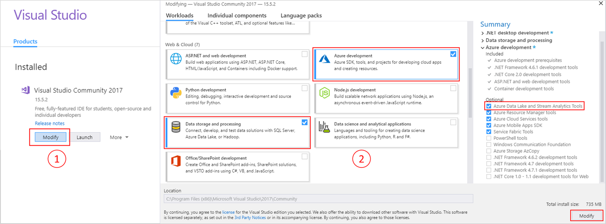

* Visual Studio 2013 and 2015  
  [Download Data Lake Tools](https://www.microsoft.com/download/details.aspx?id=49504). Choose the version of Data Lake Tools that matches your version of Visual Studio.  

> [!NOTE]  
> Currently, only the English version of Data Lake Tools for Visual Studio is available.

## Update Data Lake Tools for Visual Studio  

1. Open Visual Studio.

2. From the menu bar, navigate to **Tools** > **Extensions and Updates...**.

3. From the **Extensions and Updates** window, expand **Updates** on the left.

4. If an update is available, **Azure Data Lake and Stream Analytic Tools** will appear in the main window.  Select **Update**.

> [!NOTE]  
> You can use only Data Lake Tools version 2.3.0.0 or later to connect to Interactive Query clusters and run interactive Hive queries.

## Connect to Azure subscriptions
You can use Data Lake Tools for Visual Studio to connect to your HDInsight clusters, perform some basic management operations, and run Hive queries.

> [!NOTE]  
> For information about connecting to a generic Hadoop cluster, see [Write and submit Hive queries by using Visual Studio](https://blogs.msdn.com/b/xiaoyong/archive/2015/05/04/how-to-write-and-submit-hive-queries-using-visual-studio.aspx).

To connect to your Azure subscription:

1. Open Visual Studio.

2. From the menu bar, navigate to **View** > **Server Explorer**.

3. From Server Explorer, right-click **Azure**, select   **Connect to Microsoft Azure Subscription...**, and complete the sign in process.

4. From Server Explorer, a list of existing HDInsight clusters appears. If you don't have any clusters, you can create one by using the Azure portal, Azure PowerShell, or the HDInsight SDK. For more information, see [Create HDInsight clusters](../hdinsight-hadoop-provision-linux-clusters.md).

   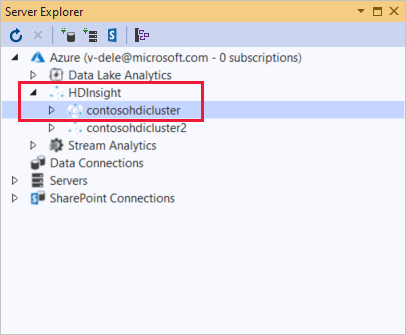

5. Expand an HDInsight cluster. **Hive Databases**, a default storage account, linked storage accounts, and **Hadoop Service Log** appear. You can further expand the entities.

After you've connected to your Azure subscription, you can perform the following tasks.

To connect to the Azure portal from Visual Studio:

1. From Server Explorer, navigate to **Azure** > **HDInsight** and select your cluster.

2. Right-click an HDInsight cluster, and select **Manage Cluster in Azure portal[sic]**.

To ask questions and/or provide feedback from Visual Studio:

1. From Server Explorer, navigate to **Azure** > **HDInsight**.

2. Right-click **HDInsight** and select either **MSDN Forum** to ask questions, or **Give Feedback** to give feedback.

## Link a cluster
You could link a cluster by right-clicking on **HDInsight** then select **Link a HDInsight Cluster**. Enter **Connection Url**, **user name** and **password**, click **Next** then **Finish**, the cluster should be listed under HDInsight node successful.

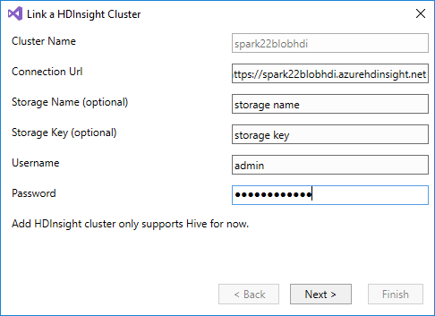

Right click on the linked cluster, select **Edit**, user could update the cluster information. Adding an HDInsight cluster only supports Hive for now.

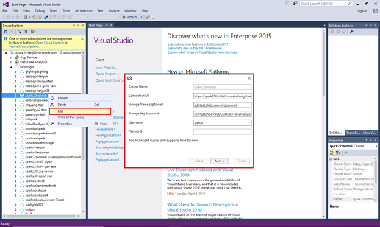

## Explore linked resources
From Server Explorer, you can see the default storage account and any linked storage accounts. If you expand the default storage account, you can see the containers on the storage account. The default storage account and the default container are marked. Right-click any of the containers to view the container contents.

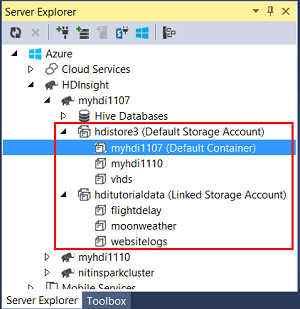

After opening a container, you can use the following buttons to upload, delete, and download blobs:

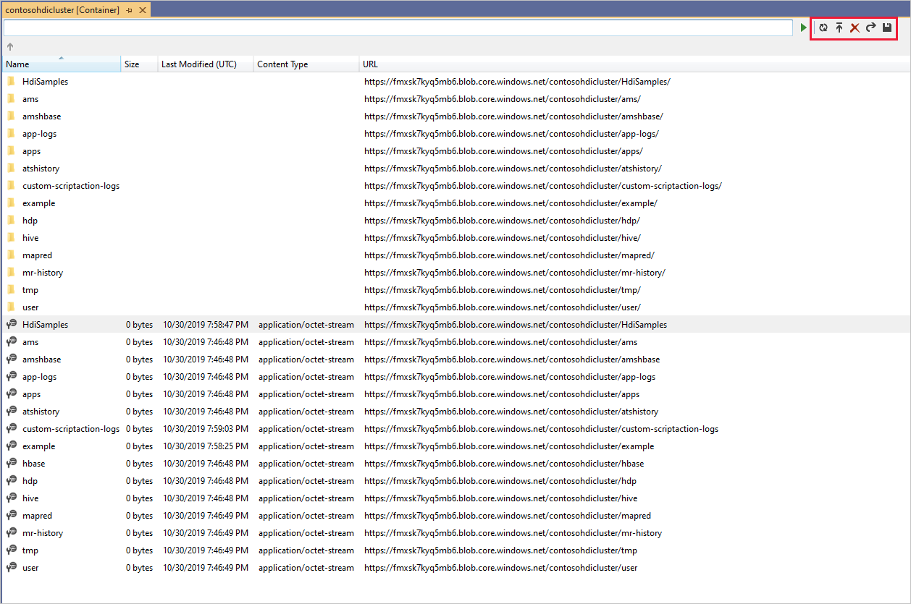

## Run interactive Apache Hive queries
[Apache Hive](https://hive.apache.org) is a data warehouse infrastructure that's built on Hadoop. Hive is used for data summarization, queries, and analysis. You can use Data Lake Tools for Visual Studio to run Hive queries from Visual Studio. For more information about Hive, see [Use Apache Hive with HDInsight](hdinsight-use-hive.md).

[Interactive Query](../interactive-query/apache-interactive-query-get-started.md) uses [Hive on LLAP](https://cwiki.apache.org/confluence/display/Hive/LLAP) in Apache Hive 2.1. Interactive Query brings interactivity to complex data warehouse-style queries on large, stored datasets. Running Hive queries on Interactive Query is much faster compared to traditional Hive batch jobs. 

> [!NOTE]  
> You can run interactive Hive queries only when you connect to an [HDInsight Interactive Query](../interactive-query/apache-interactive-query-get-started.md) cluster.

You can also use Data Lake Tools for Visual Studio to see what’s inside a Hive job. Data Lake Tools for Visual Studio collects and surfaces the Yarn logs of certain Hive jobs.

From Server Explorer, navigate to **Azure** > **HDInsight** and select your cluster.  This will be the starting point in Server Explorer for the sections to follow.

### View hivesampletable
All HDInsight clusters have a default sample Hive table called `hivesampletable`.  

From your cluster, navigate to **Hive Databases** > **default** > **hivesampletable**.

* To view `hivesampletable` schema:  
Expand **hivesampletable**.

* To view `hivesampletable` data:  
Right-click **hivesampletable**, and select **View Top 100 Rows**.  This is equivalent to running the following Hive query by using the Hive ODBC driver:

   `SELECT * FROM hivesampletable LIMIT 100`

  You can customize the row count.

  

### Create Hive tables
To create a Hive table, you can use the GUI or you can use Hive queries. For information about using Hive queries, see [Run Apache Hive queries](#run.queries).

1. From your cluster, navigate to **Hive Databases** > **default**.

2. Right-click **default**, and select **Create Table**.

3. Configure the table as desired.  

4. Select **Create Table** to submit the job to create the new Hive table.

    

### <a name="run.queries"></a>Create and run Hive queries
You have two options for creating and running Hive queries:

* Create ad-hoc queries
* Create a Hive application

To create, and run ad-hoc queries:

1. Right-click the cluster where you want to run the query, and select **Write a Hive Query**.  

2. Enter the following Hive query:

    ```sql
    SELECT devicemodel, COUNT(devicemodel) AS deviceCount
    FROM hivesampletable
    GROUP BY devicemodel
    ORDER BY devicemodel
    ```

    The Hive editor supports IntelliSense. Data Lake Tools for Visual Studio supports loading remote metadata when you edit your Hive script. For example, if you type `SELECT * FROM`, IntelliSense lists all the suggested table names. When a table name is specified, IntelliSense lists the column names. The tools support most Hive DML statements, subqueries, and built-in UDFs.

    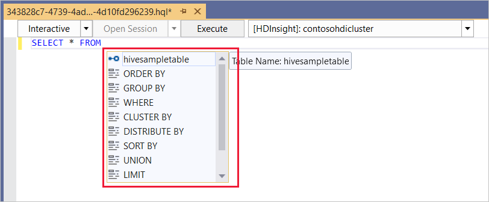

    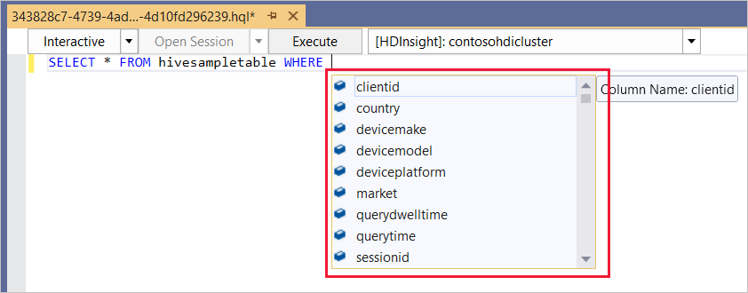

   > [!NOTE]  
   > IntelliSense suggests only the metadata of the cluster that is selected in the HDInsight toolbar.

3. Choose execution mode:

    * **Interactive**  

      Ensure **Interactive** is selected and then select **Execute**.

        

    * **Batch**  

      Ensure **Batch** is selected and then select **Submit**.  If you select the advanced submit option, configure **Job Name**, **Arguments**, **Additional Configurations**, and **Status Directory** for the script.

        

      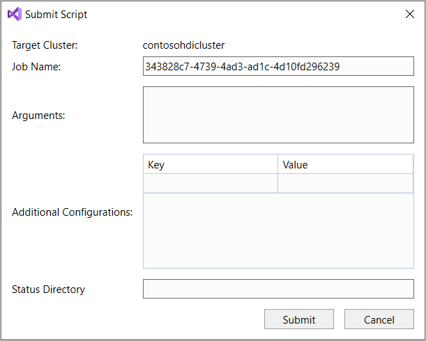

      > [!NOTE]  
      > You can not submit batches to Interactive Query clusters.  You must use interactive mode.

To create and run a Hive solution:

1. From the menu bar, navigate to **File** > **New** > **Project...**.

2. In the left pane, navigate to **Installed** > **Azure Data Lake** > **HIVE (HDInsight)**.  

3. In the middle pane, select **Hive Application**. Enter the properties, and then select **OK**.

    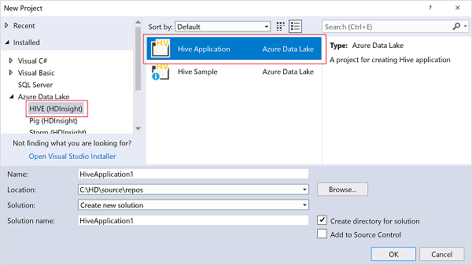

4. In **Solution Explorer**, double-click **Script.hql** to open the script.

### View job summary and output

The job summary varies slightly between **Batch** and **Interactive** mode.


Use the **Refresh** button to update the status until the job status changes to **Finished**.  

* For the job details from **Batch** mode, select the links at the bottom to see **Job Query**, **Job Output**, **Job log**, or **Yarn log**.

* For the job details from **Interactive** mode, see tabs **Output** and **HiveServer2 Output**.

  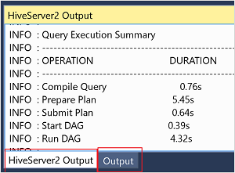

### View job graph

Currently, job graphs are only shown for Hive jobs that use Tez as the execution engine.  For information about enabling Tez, see [Use Apache Hive in HDInsight](hdinsight-use-hive.md).  See also, [Use Apache Tez instead of Map Reduce](../hdinsight-hadoop-optimize-hive-query.md#use-apache-tez-instead-of-map-reduce).  

To view all the operators inside the vertex, double-click on the vertices of the job graph. You can also point to a specific operator to see more details about the operator.

The job graph may not appear even if Tez is specified as the execution engine if no Tez application is launched.  This might happen because the job does not contain DML statements, or the DML statements can return without launching a Tez application. For example, `SELECT * FROM table1` will not launch the Tez application.

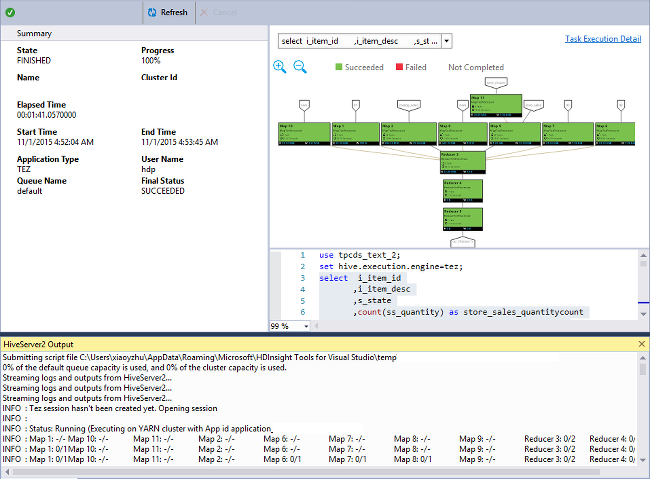


### Task Execution Detail

From the job graph, you can select **Task Execution Detail** to get structured and visualized information for Hive jobs. You can also get more job details. If performance issues occur, you can use the view to get more details about the issue. For example, you can get information about how each task operates, and detailed information about each task
(data read/write, schedule/start/end time, and so on). Use the information to tune job configurations or system architecture based on the visualized information.

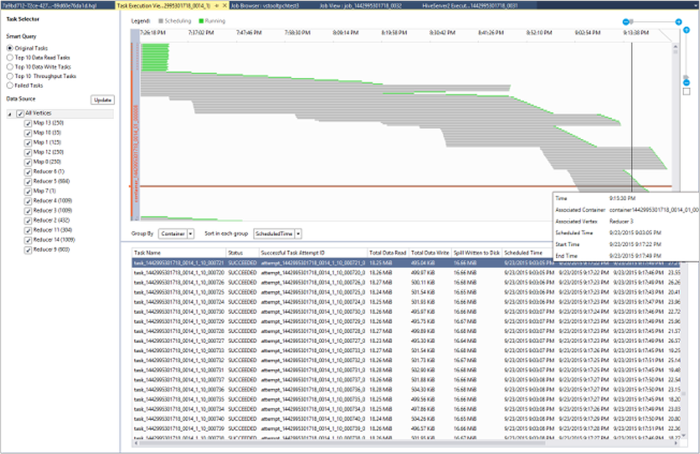


### View Hive jobs
You can view job queries, job output, job logs, and Yarn logs for Hive jobs.

In the most recent release of the tools, you can see what’s inside your Hive jobs by collecting and surfacing Yarn logs. A Yarn log can help you investigating performance issues. For more information about how HDInsight collects Yarn logs, see [Access HDInsight application logs programmatically](../hdinsight-hadoop-access-yarn-app-logs.md).

To view Hive jobs:

1. Right-click an HDInsight cluster, and select **View Jobs**. A list of the Hive jobs that ran on the cluster appears.  

2. Select a job. In the **Hive Job Summary** window, select one of the following:
    - **Job Query**
    - **Job Output**
    - **Job Log**  
    - **Yarn log**

    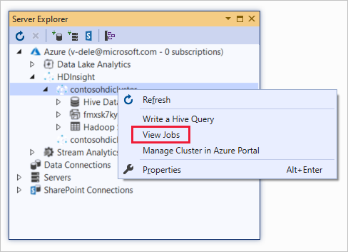


## Run Apache Pig scripts

1. From the menu bar, navigate to **File** > **New** > **Project...**.

2. In the left pane, navigate to **Installed** > **Azure Data Lake** > **Pig (HDInsight)**.  

3. In the middle pane, select **Pig Application**. Enter the properties, and then select **OK**.

4. In **Solution Explorer**, double-click **Script.pig** to open the script.

## Feedback and known issues
* An issue in which results that are started with null values aren't shown has been fixed. If you're blocked on this issue, contact the support team.
* The HQL script that Visual Studio creates is encoded, depending on the user’s local region setting. The script doesn't execute correctly if you upload the script to a cluster as a binary file.

## Next steps
In this article, you learned how to use the Data Lake Tools for Visual Studio package to connect to HDInsight clusters from Visual Studio. You also learned how to run a Hive query. For more information, see these articles:

* [Run Apache Hive queries using the Data Lake tools for Visual Studio](apache-hadoop-use-hive-visual-studio.md)
* [Use Hadoop Hive in HDInsight](hdinsight-use-hive.md)
* [Get started using Apache Hadoop in HDInsight](apache-hadoop-linux-tutorial-get-started.md)
* [Submit Apache Hadoop jobs in HDInsight](submit-apache-hadoop-jobs-programmatically.md)
* [Analyze Twitter data with Apache Hadoop in HDInsight](../hdinsight-analyze-twitter-data.md)

