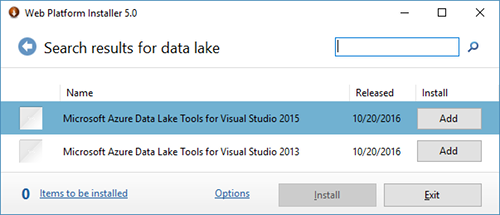
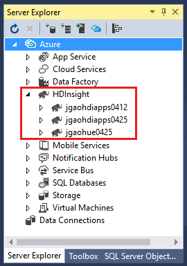
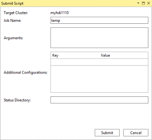
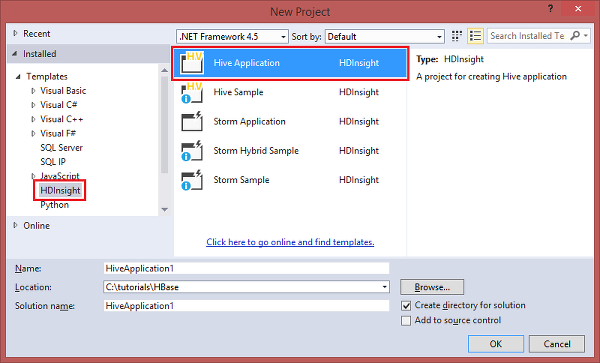
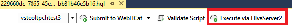
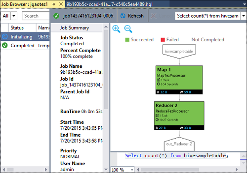

# Use Data Lake Tools for Visual Studio to connect to Azure HDInsight and run Hive queries

Learn how to use Data Lake Tools for Visual Studio (also called Azure Data Lake and Stream Analytics Tools for Visual Studio) to connect to Hadoop clusters in [Azure HDInsight](../hdinsight-hadoop-introduction.md) and submit Hive queries. 

For more information about using HDInsight, see [Introduction to HDInsight](../hdinsight-hadoop-introduction.md) and [Get started with HDInsight](apache-hadoop-linux-tutorial-get-started.md). 

For more information about connecting to a Storm cluster, see [Develop C# topologies for Apache Storm on HDInsight by using Visual Studio](../storm/apache-storm-develop-csharp-visual-studio-topology.md).

You can use Data Lake Tools for Visual Studio to access Azure Data Lake Analytics and HDInsight. For information about Data Lake Tools, see [Develop U-SQL scripts by using Data Lake Tools for Visual Studio](../../data-lake-analytics/data-lake-analytics-data-lake-tools-get-started.md).

## Prerequisites

To complete this tutorial and use Data Lake Tools for Visual Studio, you need the following items:

* An Azure HDInsight cluster. To create an HDInsight cluster, see [Get started by using Hadoop in Azure HDInsight](apache-hadoop-linux-tutorial-get-started.md). To run interactive Hive queries, you need an [HDInsight Interactive Query](../interactive-query/apache-interactive-query-get-started.md) cluster.
* A computer that has Visual Studio 2017, 2015, or 2013 installed.
    
    > [!NOTE]
    > Currently, only the English version of Data Lake Tools for Visual Studio is available.
    > 
    > 

## Install or update Data Lake Tools for Visual Studio

### Install Data Lake Tools

Data Lake Tools is installed by default for Visual Studio 2017. For earlier versions of Visual Studio, you can install Data Lake Tools by using the [Web Platform Installer](https://www.microsoft.com/web/downloads/platform.aspx). Choose the version of Data Lake Tools that matches your version of Visual Studio. 

### Install Visual Studio

If you don't have Visual Studio installed, use the [Web Platform Installer](https://www.microsoft.com/web/downloads/platform.aspx) to install the latest versions of Visual Studio Community and the Azure SDK:

### Update the tools

1. Open Visual Studio.
2. On the **Tools** menu, select **Extensions and updates**.
3. Expand **Updates**, and then select **Azure Data Lake and Stream Analytics Tools** (if it's installed).

> [!NOTE]
>
> You can use only Data Lake Tools version 2.3.0.0 or later to connect to Interactive Query clusters and run interactive Hive queries.

## Connect to Azure subscriptions
You can use Data Lake Tools for Visual Studio to connect to your HDInsight clusters, perform some basic management operations, and run Hive queries.

> [!NOTE]
> For information about connecting to a generic Hadoop cluster, see [Write and submit Hive queries by using Visual Studio](http://blogs.msdn.com/b/xiaoyong/archive/2015/05/04/how-to-write-and-submit-hive-queries-using-visual-studio.aspx).
> 
> 

To connect to your Azure subscription:

1. Open Visual Studio.
2. On the **View** menu, select **Server Explorer**.
3. In Server Explorer, expand **Azure**, and then expand **HDInsight**.
   
   > [!NOTE]
   > The **HDInsight Task List** window should be open. If you don't see the window, on the **View** menu, select **Other Windows**, and then select **HDInsight Task List Window**.  
   > 
   > 
4. Enter your Azure subscription credentials, and then select **Sign In**. Authentication is required only if you have never connected to the Azure subscription from Visual Studio on this computer.
5. In Server Explorer, a list of existing HDInsight clusters appears. If you don't have any clusters, you can create one by using the Azure portal, Azure PowerShell, or the HDInsight SDK. For more information, see [Create HDInsight clusters](../hdinsight-hadoop-provision-linux-clusters.md).
   
   
6. Expand an HDInsight cluster. **Hive Databases**, a default storage account, linked storage accounts, and **Hadoop Service log** appear. You can further expand the entities.

After you've connected to your Azure subscription, you can do the following tasks.

To connect to the Azure portal from Visual Studio:

1. In Server Explorer, select **Azure** > **HDInsight**.
2. Right-click an HDInsight cluster, and then select **Manage Cluster in Azure portal**.

To ask questions and provide feedback from Visual Studio:

1. On the **Tools** menu, select **HDInsight**.
2. To ask questions, select **MSDN Forum**. To give feedback, select **Give Feedback**.

## Explore linked resources
In Server Explorer, you can see the default storage account and any linked storage accounts. If you expand the default storage account, you can see the containers on the storage account. The default storage account and the default container are marked. Right-click any of the containers to view the container contents.

After opening a container, you can use the following buttons to upload, delete, and download blobs:

## Run interactive Hive queries
[Apache Hive](http://hive.apache.org) is a data warehouse infrastructure that's built on Hadoop. Hive is used for data summarization, queries, and analysis. You can use Data Lake Tools for Visual Studio to run Hive queries from Visual Studio. For more information about Hive, see [Use Hive with HDInsight](hdinsight-use-hive.md).

[Interactive Query](../interactive-query/apache-interactive-query-get-started.md) uses [Hive on LLAP](https://cwiki.apache.org/confluence/display/Hive/LLAP) in Apache Hive 2.1. Interactive Query brings interactivity to complex data warehouse-style queries on large, stored datasets. Running Hive queries on Interactive Query is much faster compared to traditional Hive batch jobs. For more information, see [Run Hive batch jobs](#run-hive-batch-jobs).

> [!NOTE]
>
> You can run interactive Hive queries only when you connect to an [HDInsight Interactive Query](../interactive-query/apache-interactive-query-get-started.md) cluster.

You can also use Data Lake Tools for Visual Studio to see what’s inside a Hive job. Data Lake Tools for Visual Studio collects and surfaces the Yarn logs of certain Hive jobs.

### View **hivesampletable**
All HDInsight clusters have a default sample Hive table called hivesampletable. The Hive table defines how to list Hive tables, view table schemas, and list rows in the Hive table.

To list Hive tables and view Hive table schema:

1. To see the table schema, in **Server Explorer**, select **Azure** > **HDInsight**. Select your cluster, and then select **Hive Databases** > **Default** > **hivesampletable**.
2. Right-click **hivesampletable**, and then click **View Top 100 Rows** to list the rows. This is equivalent to running the following Hive query by using the Hive ODBC driver:
   
     `SELECT * FROM hivesampletable LIMIT 100`
   
   You can customize the row count.
   
   

### Create Hive tables
To create a Hive table, you can use the GUI or you can use Hive queries. For information about using Hive queries, see [Run Hive queries](#run.queries).

To create a Hive table:

1. In **Server Explorer**, select **Azure** > **HDInsight Clusters**. Select your HDInsight cluster, and then select **Hive Databases**.
2. Right-click **default**, and then select **Create Table**.
3. Configure the table.  
4. Select **Create Table** to submit the job to create the new Hive table.
   
    

### Validate and run Hive queries
You have two options for creating and running Hive queries:

* Create ad-hoc queries
* Create a Hive application

To create, validate, and run ad-hoc queries:

1. In **Server Explorer**, select **Azure** > **HDInsight Clusters**.
2. Right-click the cluster where you want to run the query, and then select **Write a Hive Query**.  
3. Enter the Hive queries. 

    The Hive editor supports IntelliSense. Data Lake Tools for Visual Studio supports loading remote metadata when you edit your Hive script. For example, if you type **SELECT * FROM**, IntelliSense lists all the suggested table names. When a table name is specified, IntelliSense lists the column names. The tools support most Hive DML statements, subqueries, and built-in UDFs.
   
    
   
    
   
   > [!NOTE]
   > IntelliSense suggests only the metadata of the cluster that is selected in the HDInsight toolbar.
   > 
   
4. (Optional) To check the script syntax errors, select **Validate Script**.
   
    
5. Select **Submit** or **Submit (Advanced)**. If you select the advanced submit option, configure **Job Name**, **Arguments**, **Additional Configurations**, and **Status Directory** for the script:
   
    
   
    After you submit the job, the **Hive Job Summary** window appears.
   
    
6. Use the **Refresh** button to update the status until the job status changes to **Completed**.
7. Select the links at the bottom to see **Job Query**, **Job Output**, **Job log**, or **Yarn log**.

To create and run a Hive solution:

1. On the **File** menu, select **New**, and then select **Project**.
2. In the left pane, select **HDInsight**. In the middle pane, select **Hive Application**. Enter the properties, and then select **OK**.
   
    
3. In **Solution Explorer**, double-click **Script.hql** to open the script.
4. To validate the Hive script, select the **Validate Script** button. Or, you can right-click the script in the Hive editor, and then select **Validate Script** from the context menu.

### View Hive jobs
You can view job queries, job output, job logs, and Yarn logs for Hive jobs. For more information, see the preceding screenshot.

In the most recent release of the tools, you can see what’s inside your Hive jobs by collecting and surfacing Yarn logs. A Yarn log can help you investigating performance issues. For more information about how HDInsight collects Yarn logs, see [Access HDInsight application logs programmatically](../hdinsight-hadoop-access-yarn-app-logs.md).

To view Hive jobs:

1. In **Server Explorer**, expand **Azure**, and then expand **HDInsight**.
2. Right-click an HDInsight cluster, and then select **View Jobs**. A list of the Hive jobs that ran on the cluster appears.  
3. Select a job. In the **Hive Job Summary** window, select one of the following:
    - **Job Query**
    - **Job Output**
    - **Job Log**  
    - **Yarn log**
   
    

### Faster-path Hive execution via HiveServer2
> [!NOTE]
> This feature works only in a cluster in HDInsight version 3.2 or later.
 
Data Lake Tools for Visual Studio used to submit Hive jobs via [WebHCat](https://cwiki.apache.org/confluence/display/Hive/WebHCat) (also known as Templeton). This method for submitting Hive jobs took a long time to return job details and error information.

To solve this performance issue, Data Lake Tools for Visual Studio can bypass RDP/SSH and execute Hive jobs directly in the cluster through HiveServer2.

In addition to better performance, with this method, you can also view Hive on Apache Tez graphs and in the task details.

In a cluster in HDInsight version 3.2 or later, an **Execute via HiveServer2** button appears:

You can also see the logs streamed back in real time. You can also see the job graphs, if the Hive query is executed in Tez.

### Execute queries via HiveServer2 vs. submit queries via WebHCat

Even though you get many performance benefits when you execute queries via HiveServer2, this method has several limitations. Some of the limitations make this method not suitable for production use. 

The following table shows the differences between executing queries via HiveServer2 and submitting queries via WebHCat:

|  | Execute via HiveServer2 | Submit via WebHCat |
| --- | --- | --- |
| Execute queries |Eliminates the overhead in WebHCat (which launches a MapReduce Job named TempletonControllerJob). |If a query is executed via WebHCat, WebHCat launches a MapReduce job, which introduces additional latency. |
| Stream logs back |In near real time. |The job execution logs are available only when the job is finished. |
| View job history |If a query is executed via HiveServer2, its job history (job log, job output) isn't preserved. You can view the application in the Yarn UI with limited information. |If a query is executed via WebHCat, its job history (job log, job output) is preserved. You can view the job history by using Visual Studio, the HDInsight SDK, or PowerShell. |
| Close window |Executing via HiveServer2 is *synchronous*. If the windows are closed, the query execution is canceled. |Submitting via WebHCat is *asynchronous*. You can submit the query via WebHCat, and then close Visual Studio. You can come back and see the results at any time. |

### Tez Hive job performance graph
In Data Lake Tools for Visual Studio, you can see performance graphs for the Hive jobs that the Tez execution engine runs. For information about enabling Tez, see [Use Hive in HDInsight](hdinsight-use-hive.md). 

After you submit a Hive job in Visual Studio, Visual Studio displays the graph when the job is completed. You might need to select the **Refresh** button to view the latest job status.

> [!NOTE]
> This feature is available only for a cluster in HDInsight version 3.2.4.593 or later. The feature works only on completed jobs. You also must submit job through WebHCat to use this feature. The following image appears when you execute your query through HiveServer2: 
> 
> 

To help you better understand your Hive query, the Hive Operator view was added in this release. To view all the operators inside the vertex, double-click on the vertices of the job graph. You can also point to a specific operator to see more details about the operator.

### Task Execution View for Hive on Tez jobs
You can use the Task Execution View for Hive on Tez jobs to get structured and visualized information for Hive jobs. You can also get more job details. If performance issues occur, you can use the view to get more details about the issue. For example, you can get information about how each task operates, and detailed information about each task
(data read/write, schedule/start/end time, and so on). Use the information to tune job configurations or system architecture based on the visualized information.

## Run Hive batch jobs
Testing a Hive script against an HDInsight cluster (with the exception of the Interactive Query cluster) can be time-consuming. The process might take several minutes or more. Data Lake Tools for Visual Studio can validate Hive script locally without connecting to a live cluster. For more information about running interactive queries, see [Run interactive Hive queries](#run-interactive-hive-queries).

You can use Data Lake Tools for Visual Studio to see what’s inside the Hive job by collecting and surfacing the Yarn logs of specific Hive jobs.

To learn more about how to run Hive batch jobs, see [Run interactive Hive queries](#run-interactive-hive-queries). The information in that section applies to running Hive batch jobs that have longer run times.

## Run Pig scripts
You can use Data Lake Tools for Visual Studio to create and submit Pig scripts to HDInsight clusters. First, create a Pig project from a template. Then, submit the script to HDInsight clusters.

## Feedback and known issues
* Currently, HiveServer2 results are displayed in plain text format, which is not ideal. Microsoft is working to fix this.
* An issue in which results that are started with null values aren't shown has been fixed. If you're blocked on this issue, contact the support team.
* The HQL script that Visual Studio creates is encoded, depending on the user’s local region setting. The script doesn't execute correctly if you upload the script to a cluster as a binary file.

## Next steps
In this article, you learned how to use the Data Lake Tools for Visual Studio package to connect to HDInsight clusters from Visual Studio. You also learned how to run a Hive query. For more information, see these articles:

* [Use Hadoop Hive in HDInsight](hdinsight-use-hive.md)
* [Get started using Hadoop in HDInsight](apache-hadoop-linux-tutorial-get-started.md)
* [Submit Hadoop jobs in HDInsight](submit-apache-hadoop-jobs-programmatically.md)
* [Analyze Twitter data with Hadoop in HDInsight](../hdinsight-analyze-twitter-data.md)

