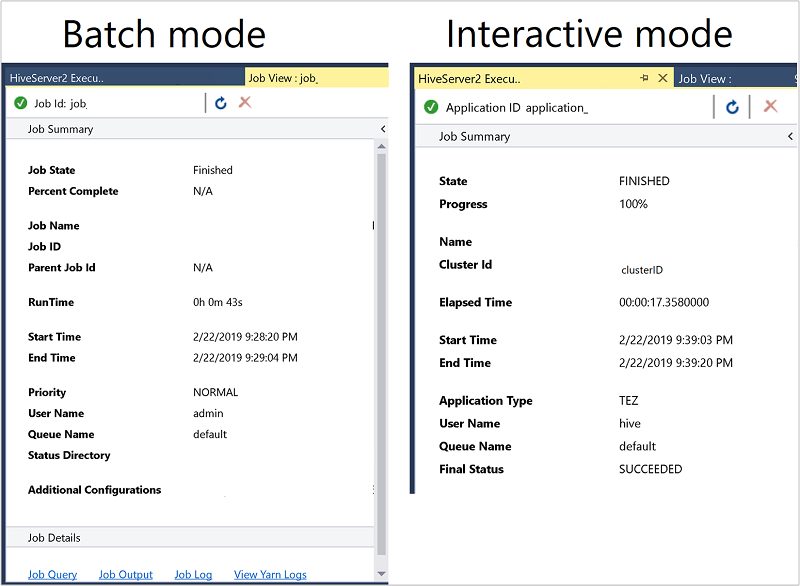

# Use Data Lake Tools for Visual Studio to connect to Azure HDInsight and run Apache Hive queries

Learn how to use Microsoft Azure Data Lake and Stream Analytics Tools for Visual Studio (Data Lake Tools). Use the tool to connect to [Apache Hadoop clusters in Azure HDInsight](apache-hadoop-introduction.md) and submit Hive queries.  

For more information about using HDInsight, see [Get started with HDInsight](apache-hadoop-linux-tutorial-get-started.md).  

For more information on connecting to Apache Storm, see [Develop C# topologies for Apache Storm by using the Data Lake tools](../storm/apache-storm-develop-csharp-visual-studio-topology.md).

You can use Data Lake Tools for Visual Studio to access Azure Data Lake Analytics and HDInsight. For information about Data Lake Tools, see [Develop U-SQL scripts by using Data Lake Tools for Visual Studio](../../data-lake-analytics/data-lake-analytics-data-lake-tools-get-started.md).

## Prerequisites

To complete this article and use Data Lake Tools for Visual Studio, you need the following items:

* An Azure HDInsight cluster. To create an HDInsight cluster, see [Get started by using Apache Hadoop in Azure HDInsight](apache-hadoop-linux-tutorial-get-started.md). To run interactive Apache Hive queries, you need an [HDInsight Interactive Query](../interactive-query/apache-interactive-query-get-started.md) cluster.  

* [Visual Studio](https://visualstudio.microsoft.com/downloads/). The [Visual Studio Community edition](https://visualstudio.microsoft.com/vs/community/) is free. The instructions shown here are for [Visual Studio 2019](https://visualstudio.microsoft.com/downloads/).

## Install Data Lake Tools for Visual Studio  

Follow the appropriate instructions to install Data Lake Tools for your version of Visual Studio:

* For Visual Studio 2017 or Visual Studio 2019:

    During Visual Studio installation, make sure you include the **Azure development** workload or the **Data storage and processing** workload.  

    For existing Visual Studio installations, go to the IDE menu bar, and select **Tools** > **Get Tools and Features** to open Visual Studio Installer. In the **Workloads** tab, select at least the **Azure development** workload (under **Web & Cloud**). Or select the **Data storage and processing** workload (under **Other Toolsets**).

  

* For Visual Studio 2015:

    [Download Data Lake Tools](https://www.microsoft.com/download/details.aspx?id=49504). Choose the version of Data Lake Tools that matches your version of Visual Studio.

## Update Data Lake Tools for Visual Studio  

Next, make sure you update Data Lake Tools to the most recent version.

1. Open Visual Studio.

2. In the **Start** window, select **Continue without code**.

3. In the Visual Studio IDE menu bar, choose **Extensions** > **Manage Extensions**.

4. In the **Manage Extensions** dialog box, expand the **Updates** node.

5. If the list of available updates includes **Azure Data Lake and Stream Analytic Tools**, select it. Then select its **Update** button. After the **Download and Install** dialog box appears and disappears, Visual Studio adds the **Azure Data Lake and Stream Analytic Tools** extension to the update schedule.

6. Close all Visual Studio windows. The **VSIX Installer** dialog box appears.

7. Select **License** to read the license terms, then select **Close** to return to the **VSIX Installer** dialog box.

8. Select **Modify**. Installation of the extension update begins. After a while, the dialog box changes to show that it's done making modifications. Select **Close**, and then restart Visual Studio to complete the installation.

> [!NOTE]  
> You can use only Data Lake Tools version 2.3.0.0 or later to connect to Interactive Query clusters and run interactive Hive queries.

## Connect to Azure subscriptions

You can use Data Lake Tools for Visual Studio to connect to your HDInsight clusters, do some basic management operations, and run Hive queries.

> [!NOTE]  
> For information about connecting to a generic Hadoop cluster, see [How to write and submit Hive queries using Visual Studio](https://blogs.msdn.microsoft.com/xiaoyong/2015/05/04/how-to-write-and-submit-hive-queries-using-visual-studio/).

### Connect to an Azure subscription

To connect to your Azure subscription:

1. Open Visual Studio.

2. In the **Start** window, select **Continue without code**.

3. In the IDE menu bar, choose **View** > **Server Explorer**.

4. In **Server Explorer**, right-click **Azure**, select **Connect to Microsoft Azure Subscription**, and complete the authentication process. From **Server Explorer**, expand **Azure** > **HDInsight** to view a list of existing HDInsight clusters.

5. If you don't have any clusters, create one by using the Azure portal, Azure PowerShell, or the HDInsight SDK. For more information, see [Set up clusters in HDInsight](../hdinsight-hadoop-provision-linux-clusters.md).

   

6. Expand an HDInsight cluster. The cluster contains nodes for **Hive Databases**. Also, a default storage account, any additional linked storage accounts, and **Hadoop Service Log**. You can further expand the entities.

After you've connected to your Azure subscription, you can do the following tasks.

### Connect to Azure from Visual Studio

To connect to the Azure portal from Visual Studio:

1. In **Server Explorer**, expand **Azure** > **HDInsight** and select your cluster.

2. Right-click an HDInsight cluster, and select **Manage Cluster in Azure portal**.

### Offer questions and feedback from Visual Studio

To ask questions and, or provide feedback from Visual Studio:

1. From Server Explorer, choose **Azure** > **HDInsight**.

2. Right-click **HDInsight** and select either **MSDN Forum** to ask questions, or **Give Feedback** to give feedback.

## Link to or edit a cluster

> [!NOTE]
> Currently the only type of HDInsight cluster you can link to is a Hive type.

To link an HDInsight cluster:

1. Right-click **HDInsight**, and then select **Link a HDInsight Cluster** to display the **Link a HDInsight Cluster** dialog box.

2. Enter a **Connection Url** in the form `https://CLUSTERNAME.azurehdinsight.net`. The **Cluster Name** automatically fills in with the cluster name portion of your URL when you go to another field. Then enter a **Username** and **Password**, and select **Next**.

    

3. Select **Finish**. If the cluster linking is successful, the cluster is then listed under the **HDInsight** node.

To update a linked cluster, right-click the cluster and select **Edit**. You can then update the cluster information.


## Explore linked resources

From Server Explorer, you can see the default storage account and any linked storage accounts. If you expand the default storage account, you can see the containers on the storage account. The default storage account and the default container are marked.


Right-click a container and select **View Container** to view the container's contents. After opening a container, you can use the toolbar buttons to **Refresh** the content list, **Upload Blob**, **Delete selected blobs**, **Open Blob**, and download (**Save As**) selected blobs.


## Run interactive Apache Hive queries

[Apache Hive](https://hive.apache.org) is a data warehouse infrastructure that's built on Hadoop. Hive is used for data summarization, queries, and analysis. You can use Data Lake Tools for Visual Studio to run Hive queries from Visual Studio. For more information about Hive, see [What is Apache Hive and HiveQL on Azure HDInsight?](hdinsight-use-hive.md).

[Interactive Query in Azure HDInsight](../interactive-query/apache-interactive-query-get-started.md) uses [Hive on LLAP](https://cwiki.apache.org/confluence/display/Hive/LLAP) in Apache Hive 2.1. Interactive Query brings interactivity to complex, data warehouse-style queries on large, stored datasets. Running Hive queries on Interactive Query is much faster than traditional Hive batch jobs. 

> [!NOTE]  
> You can run interactive Hive queries only when you connect to an [HDInsight Interactive Query](../interactive-query/apache-interactive-query-get-started.md) cluster.

You can also use Data Lake Tools for Visual Studio to see what's inside a Hive job. Data Lake Tools for Visual Studio collects and surfaces the Yarn logs of certain Hive jobs.

From **Server Explorer**, choose **Azure** > **HDInsight** and select your cluster.  This node is the starting point in **Server Explorer** for the sections to follow.

### View hivesampletable

All HDInsight clusters have a default sample Hive table called `hivesampletable`.  

From your cluster, choose **Hive Databases** > **default** > **hivesampletable**.

* To view the `hivesampletable` schema:

    Expand **hivesampletable**. The names and data types of the `hivesampletable` columns are shown.

* To view the `hivesampletable` data:

    Right-click **hivesampletable**, and select **View Top 100 Rows**. The list of 100 results appears in the **Hive Table: hivesampletable** window. This action is equivalent to running the following Hive query by using the Hive ODBC driver:

    `SELECT * FROM hivesampletable LIMIT 100`

    You can customize the row count by changing **Number of rows**; you can choose 50, 100, 200, or 1000 rows from the drop-down list.

### Create Hive tables

To create a Hive table, you can use the GUI or you can use Hive queries. For information about using Hive queries, see [Create and run Hive queries](#create-and-run-hive-queries).

1. From your cluster, choose **Hive Databases** > **default**.

2. Right-click **default**, and select **Create Table**.

3. Configure the table.

4. Select the **Create Table** button to submit the job, which creates the new Hive table.

    

### Create and run Hive queries

You have two options for creating and running Hive queries:

* Create ad-hoc queries
* Create a Hive application

#### Create an ad-hoc query

To create and run an ad-hoc query:

1. Right-click the cluster where you want to run the query, and select **Write a Hive Query**.  

2. Enter a Hive query.

    The Hive editor supports IntelliSense. Data Lake Tools for Visual Studio supports loading remote metadata when you edit your Hive script. For example, if you type `SELECT * FROM`, IntelliSense lists all the suggested table names. When a table name is specified, IntelliSense lists the column names. The tools support most Hive DML statements, subqueries, and built-in UDFs.

    

    

    > [!NOTE]  
    > IntelliSense suggests only the metadata of the cluster that is selected in the HDInsight toolbar.

    Here is a sample query that you can use:

    ```sql
    SELECT devicemodel, COUNT(devicemodel) AS deviceCount
    FROM hivesampletable
    GROUP BY devicemodel
    ORDER BY devicemodel
    ```

3. Choose the execution mode:

    * **Interactive**  

        In the first drop-down list, choose **Interactive**, and then select **Execute**.

          

    * **Batch**  

        In the first drop-down list, choose **Batch**, and then select **Submit**. Or select the drop-down icon next to **Submit** and choose **Advanced**.

        

        If you select the advanced submit option, the **Submit Script** dialog box appears. Configure the **Job Name**, **Arguments**, **Additional Configurations**, and **Status Directory** for the script.

        

      > [!NOTE]  
      > You can't submit batches to Interactive Query clusters.  You must use interactive mode.

#### Create a Hive application

To create and run a Hive solution:

1. From the menu bar, choose **File** > **New** > **Project**.

2. In the **Create a new project** window, select the search box and type **Hive**. Then choose **Hive Application** and select **Next**.

3. In the **Configure your new project** window, enter a **Project name**, select or create the project **Location**, and then select **Create**.

    

4. In **Solution Explorer**, double-click **Script.hql** to open the script.

### View job summary and output

The job summary varies slightly between **Batch** and **Interactive** mode.



Use the **Refresh** icon to update the status until the job status changes to **Finished**.  

* For the job details from **Batch** mode, select the links at the bottom to see the **Job Query**, **Job Output**, or **Job Log**, or to **View Yarn Logs**.

* For the job details from **Interactive** mode, see the **Output** and **HiveServer2 Output** panes.

    

### View job graph

Currently, job graphs are only shown for Hive jobs that use Tez as the execution engine.  For information about enabling Tez, see [What is Apache Hive and HiveQL on Azure HDInsight?](hdinsight-use-hive.md).  See also, [Use Apache Tez instead of Map Reduce](../hdinsight-hadoop-optimize-hive-query.md#use-apache-tez-instead-of-map-reduce).  

To view all the operators inside the vertex, double-click the vertices of the job graph. You can also point to a specific operator to see more details about the operator.

Even if Tez is specified as the execution engine, the job graph may not appear if no Tez application is launched.  This situation might occur because the job doesn't contain DML statements. Or because the DML statements can return without launching a Tez application. For example, `SELECT * FROM table1` won't launch the Tez application.


### View task execution detail

From the job graph, you can select **Task Execution Detail** to get structured and visualized information for Hive jobs. You may also get more job details. If performance issues occur, you can use the view to get more details about the issue. For example, you may retrieve information about how each task operates and detailed information about each task
(data read/write, schedule/start/end time, and more). Use the information to tune job configurations or system architecture based on the visualized information.


### View Hive jobs

You can view job queries, job output, job logs, and Yarn logs for Hive jobs.

In the most recent release of the tools, you can see what's inside your Hive jobs by collecting and surfacing Yarn logs. A Yarn log can help you investigating performance issues. For more information about how HDInsight collects Yarn logs, see [Access Apache Hadoop YARN application logs](../hdinsight-hadoop-access-yarn-app-logs-linux.md).

To view Hive jobs:

1. Right-click an HDInsight cluster, and select **View Jobs**.

    

    A list of the Hive jobs that ran on the cluster appears.  

2. Select a job. In the **Hive Job Summary** window, select one of the following links:
    - **Job Query**
    - **Job Output**
    - **Job Log**  
    - **Yarn Log**

## Run Apache Pig scripts

1. From the menu bar, choose **File** > **New** > **Project**.

2. In the **Start** window, select the search box and enter **Pig**. Then select **Pig Application** and select **Next**.

3. In the **Configure your new project** window, enter a **Project name**, and select or create a **Location** for the project. Then select **Create**.

4. In the IDE **Solution Explorer** pane, double-click **Script.pig** to open the script.

## Feedback and known issues

* An issue in which results that are started with null values aren't shown has been fixed. If you're blocked on this issue, contact the support team.

* The HQL script that Visual Studio creates is encoded, depending on the user's local region setting. The script doesn't execute correctly if you upload the script to a cluster as a binary file.

## Next steps

In this article, you learned how to use the Data Lake Tools for Visual Studio package to connect to HDInsight clusters from Visual Studio. You also learned how to run a Hive query. 

* [Run Apache Hive queries using the Data Lake tools for Visual Studio](apache-hadoop-use-hive-visual-studio.md)
* [What is Apache Hive and HiveQL on Azure HDInsight?](hdinsight-use-hive.md)
* [Create Apache Hadoop cluster - Template](apache-hadoop-linux-tutorial-get-started.md)
* [Submit Apache Hadoop jobs in HDInsight](submit-apache-hadoop-jobs-programmatically.md)
* [Analyze Twitter data using Apache Hive and Apache Hadoop on HDInsight](../hdinsight-analyze-twitter-data-linux.md)
