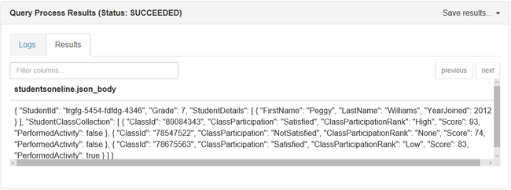
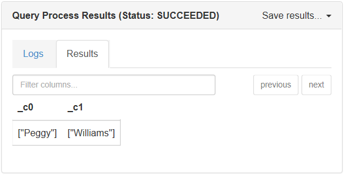
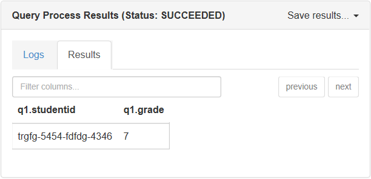

# Process and analyze JSON documents by using Apache Hive in Azure HDInsight

Learn how to process and analyze JavaScript Object Notation (JSON) files by using Apache Hive in Azure HDInsight. This article uses the following JSON document:

```json
{
  "StudentId": "trgfg-5454-fdfdg-4346",
  "Grade": 7,
  "StudentDetails": [
    {
      "FirstName": "Peggy",
      "LastName": "Williams",
      "YearJoined": 2012
    }
  ],
  "StudentClassCollection": [
    {
      "ClassId": "89084343",
      "ClassParticipation": "Satisfied",
      "ClassParticipationRank": "High",
      "Score": 93,
      "PerformedActivity": false
    },
    {
      "ClassId": "78547522",
      "ClassParticipation": "NotSatisfied",
      "ClassParticipationRank": "None",
      "Score": 74,
      "PerformedActivity": false
    },
    {
      "ClassId": "78675563",
      "ClassParticipation": "Satisfied",
      "ClassParticipationRank": "Low",
      "Score": 83,
      "PerformedActivity": true
    }
  ]
}
```

The file can be found at `wasb://processjson@hditutorialdata.blob.core.windows.net/`. For more information on how to use Azure Blob storage with HDInsight, see [Use HDFS-compatible Azure Blob storage with Apache Hadoop in HDInsight](../hdinsight-hadoop-use-blob-storage.md). You can copy the file to the default container of your cluster.

In this article, you use the Apache Hive console. For instructions on how to open the Hive console, see [Use Apache Ambari Hive View with Apache Hadoop in HDInsight](apache-hadoop-use-hive-ambari-view.md).

> [!NOTE]  
> Hive View is no longer available in HDInsight 4.0.

## Flatten JSON documents

The methods listed in the next section require the JSON document to be composed of a single row. So, you must flatten the JSON document to a string. If your JSON document is already flattened, you can skip this step and go straight to the next section on analyzing JSON data. To flatten the JSON document, run the following script:

```sql
DROP TABLE IF EXISTS StudentsRaw;
CREATE EXTERNAL TABLE StudentsRaw (textcol string) STORED AS TEXTFILE LOCATION "wasb://processjson@hditutorialdata.blob.core.windows.net/";

DROP TABLE IF EXISTS StudentsOneLine;
CREATE EXTERNAL TABLE StudentsOneLine
(
  json_body string
)
STORED AS TEXTFILE LOCATION '/json/students';

INSERT OVERWRITE TABLE StudentsOneLine
SELECT CONCAT_WS(' ',COLLECT_LIST(textcol)) AS singlelineJSON
      FROM (SELECT INPUT__FILE__NAME,BLOCK__OFFSET__INSIDE__FILE, textcol FROM StudentsRaw DISTRIBUTE BY INPUT__FILE__NAME SORT BY BLOCK__OFFSET__INSIDE__FILE) x
      GROUP BY INPUT__FILE__NAME;

SELECT * FROM StudentsOneLine
```

The raw JSON file is located at `wasb://processjson@hditutorialdata.blob.core.windows.net/`. The **StudentsRaw** Hive table points to the raw JSON document that isn't flattened.

The **StudentsOneLine** Hive table stores the data in the HDInsight default file system under the **/json/students/** path.

The **INSERT** statement populates the **StudentOneLine** table with the flattened JSON data.

The **SELECT** statement only returns one row.

Here is the output of the **SELECT** statement:



## Analyze JSON documents in Hive

Hive provides three different mechanisms to run queries on JSON documents, or you can write your own:

* Use the get_json_object user-defined function (UDF).
* Use the json_tuple UDF.
* Use the custom Serializer/Deserializer (SerDe).
* Write your own UDF by using Python or other languages. For more information on how to run your own Python code with Hive, see [Python UDF with Apache Hive and Apache Pig](./python-udf-hdinsight.md).

### Use the get_json_object UDF

Hive provides a built-in UDF called [get_json_object](https://cwiki.apache.org/confluence/display/Hive/LanguageManual+UDF#LanguageManualUDF-get_json_object) that queries JSON  during runtime. This method takes two arguments: the table name and method name. The method name has the flattened JSON document and the JSON field that needs to be parsed. Let's look at an example to see how this UDF works.

The following query returns the first name and last name for each student:

```sql
SELECT
  GET_JSON_OBJECT(StudentsOneLine.json_body,'$.StudentDetails.FirstName'),
  GET_JSON_OBJECT(StudentsOneLine.json_body,'$.StudentDetails.LastName')
FROM StudentsOneLine;
```

Here is the output when you run this query in the console window:



There are limitations of the get_json_object UDF:

* Because each field in the query requires reparsing of the query, it affects the performance.
* **GET\_JSON_OBJECT()** returns the string representation of an array. To convert this array to a Hive array, you have to use regular expressions to replace the square brackets "[" and "]", and then you also have to call split to get the array.

This conversion is why the Hive wiki recommends that you use **json_tuple**.  

### Use the json_tuple UDF

Another UDF provided by Hive is called [json_tuple](https://cwiki.apache.org/confluence/display/Hive/LanguageManual+UDF#LanguageManualUDF-json_tuple), which does better than [get_ json _object](https://cwiki.apache.org/confluence/display/Hive/LanguageManual+UDF#LanguageManualUDF-get_json_object). This method takes a set of keys and a JSON string. Then returns a tuple of values. The following query returns the student ID and the grade from the JSON document:

```sql
SELECT q1.StudentId, q1.Grade
FROM StudentsOneLine jt
LATERAL VIEW JSON_TUPLE(jt.json_body, 'StudentId', 'Grade') q1
  AS StudentId, Grade;
```

The output of this script in the Hive console:



The `json_tuple` UDF uses the [lateral view](https://cwiki.apache.org/confluence/display/Hive/LanguageManual+LateralView) syntax in Hive, which enables json\_tuple to create a virtual table by applying the UDT function to each row of the original table. Complex JSONs become too unwieldy because of the repeated use of **LATERAL VIEW**. Furthermore, **JSON_TUPLE** can't handle nested JSONs.

### Use a custom SerDe

SerDe is the best choice for parsing nested JSON documents. It lets you define the JSON schema, and then you can use the schema to parse the documents. For instructions, see [How to use a custom JSON SerDe with Microsoft Azure HDInsight](https://web.archive.org/web/20190217104719/https://blogs.msdn.microsoft.com/bigdatasupport/2014/06/18/how-to-use-a-custom-json-serde-with-microsoft-azure-hdinsight/).

## Summary

The type of JSON operator in Hive that you choose depends on your scenario. With a simple JSON document and one field to look up, choose the Hive UDF **get_json_object**. If you've more than one key to look up on, then you can use **json_tuple**. For nested documents, use the **JSON SerDe**.

## Next steps

For related articles, see:

* [Use Apache Hive and HiveQL with Apache Hadoop in HDInsight to analyze a sample Apache log4j file](../hdinsight-use-hive.md)
* [Analyze flight delay data by using Interactive Query in HDInsight](../interactive-query/interactive-query-tutorial-analyze-flight-data.md)
