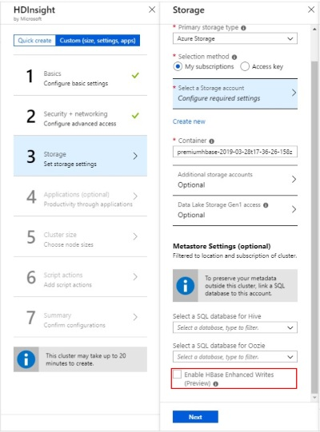

# Azure HDInsight Enhanced Writes for Apache HBase (preview)

This article provides background on the **Enhanced Writes** feature for Apache HBase in Azure HDInsight, and how it can be used effectively to improve write performance. **Enhanced Writes** uses [Azure premium SSD managed disks](../../virtual-machines/linux/disks-types.md#premium-ssd) to improve performance of the Apache HBase Write Ahead Log (WAL). To learn more about Apache HBase, see [What is Apache HBase in HDInsight](apache-hbase-overview.md).

## Overview of HBase architecture

In HBase, a **row** consists of one or more **columns** and is identified by a **row key**. Multiple rows make up a **table**. Columns contain **cells**, which are timestamped versions of the value in that column. Columns are grouped into **column families**, and all columns in a column-family are stored together in storage files called **HFiles**.

**Regions** in HBase are used to balance the data processing load. HBase first stores the rows of a table in a single region and then spreads the rows across multiple regions as the amount of data in the table increases. **Region Servers** can handle requests for multiple regions.

## Write Ahead Log for Apache HBase

Data updates in HBase are first written to a type of commit log called a Write Ahead Log (WAL). After the update is stored in the WAL, it is written to the in-memory **MemStore**. When the data in memory reaches its maximum capacity, it's written to disk as an **HFile**.

If a **RegionServer** crashes or becomes unavailable before the MemStore is flushed, the Write Ahead Log can be used to replay updates. Without the WAL, if a **RegionServer** crashed before flushing updates to an **HFile**, all of those updates being lost.

## Enhanced Writes feature in Azure HDInsight for Apache HBase

The Enhanced Writes feature solves the problem of higher write-latencies caused by using Write Ahead Logs that are in cloud storage.  The Enhanced Writes feature for HDInsight Apache HBase clusters, attaches premium SSD managed disks to every RegionServer (worker node). Write Ahead Logs are then written to the Hadoop File System (HDFS) mounted on these premium managed disks instead of cloud storage.  Premium managed disks use Solid-State Disks (SSDs) and offer excellent I/O performance with fault tolerance.  Unlike unmanaged disks, if one storage unit goes down, it will not affect other storage units in the same availability set.  As a result, managed disks provide low write-latency and better resiliency for your applications. To learn more about Azure managed disks, see [Introduction to Azure managed disks](../../virtual-machines/windows/managed-disks-overview.md). 

## How to enable Enhanced Writes for HBase in HDInsight

To create a new HBase cluster with the Enhanced Writes feature, follow the steps in [Set up clusters in HDInsight](../hdinsight-hadoop-provision-linux-clusters.md) until you reach **Step 3, Storage**. Under **Metastore Settings**, click the checkbox next to **Enable Enhanced Writes (preview)**. Then, continue with the remaining steps for cluster creation.



## Other considerations

To preserve data durability, create a cluster with a minimum of three worker nodes. Once created, you cannot scale down the cluster to less than three worker nodes. 

Flush or disable your HBase tables before deleting the cluster, so that you don't lose Write Ahead Log data.

```
flush 'mytable'
```

```
disable 'mytable'
```

## Next steps

* Official Apache HBase documentation on the [Write Ahead Log feature](https://hbase.apache.org/book.html#wal)
* To upgrade your HDInsight Apache HBase cluster to use Enhanced Writes, see [Migrate an Apache HBase cluster to a new version](apache-hbase-migrate-new-version.md).
