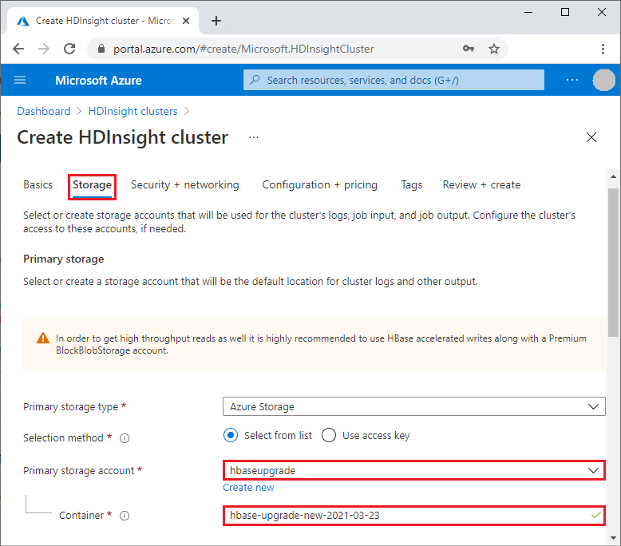
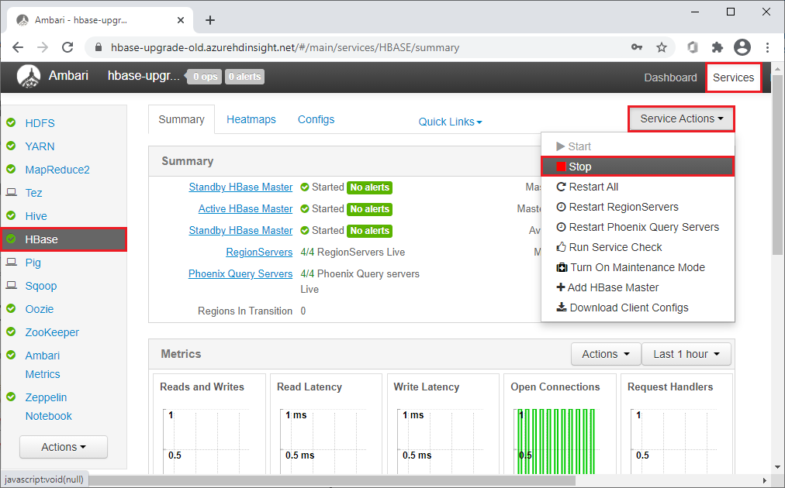
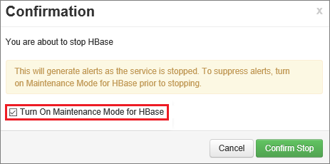
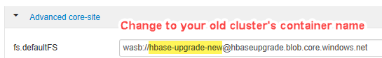

# Migrate an HBase cluster to a new version

Job-based clusters, such as Spark and Hadoop, are straightforward to upgrade - see [Upgrade HDInsight cluster to a newer version](../hdinsight-upgrade-cluster.md):

1. Back up transient (locally stored) data.
2. Delete the existing cluster.
3. Create a new cluster in the same VNET subnet.
4. Import transient data.
5. Start jobs and continue processing on the new cluster.

To upgrade an HBase cluster some additional steps are needed, as described in this article.

> [!NOTE]
> The downtime while upgrading should be minimal, on the order of minutes. This downtime is caused by the steps to flush all in-memory data, then the time to configure and restart the services on the new cluster. Your results will vary, depending on the number of nodes, amount of data, and other variables.

## Review HBase compatibility

Before upgrading HBase, ensure the HBase versions on the source and destination clusters are compatible. For more information, see [Hadoop components and versions available with HDInsight](../hdinsight-component-versioning.md).

> [!NOTE]
> We highly recommend that you review the version compatibility matrix in the [HBase book](https://hbase.apache.org/book.html#upgrading).

Here is an example version compatibility matrix, where Y indicates compatibility and N indicates a potential incompatibility:

| Compatibility type | Major version| Minor version | Patch |
| --- | --- | --- | --- |
| Client-Server wire compatibility | N | Y | Y |
| Server-Server compatibility | N | Y | Y |
| File format compatibility | N | Y | Y |
| Client API compatibility | N | Y | Y |
| Client binary compatibility | N | N | Y |
| **Server-side limited API compatibility** |  |  |  |
| Stable | N | Y | Y |
| Evolving | N | N | Y |
| Unstable | N | N | N |
| Dependency compatibility | N | Y | Y |
| Operational compatibility | N | N | Y |

> [!NOTE]
> Any breaking incompatibilities should be described in the HBase version release notes.

## Upgrade with same HBase major version

The following scenario is for upgrading from HDInsight 3.4 to 3.6 (both come with Apache HBase 1.1.2) with the same HBase major version. Other version upgrades are similar, as long as there are no compatibility issues between source and destination versions.

1. Make sure that your application is compatible with the new version, as shown in the HBase compatibility matrix and release notes. Test your application in a cluster running the target version of HDInsight and HBase.

2. [Set up a new destination HDInsight cluster](../hdinsight-hadoop-provision-linux-clusters.md) using the same storage account, but with a different container name:

	

3. Flush your source HBase cluster. This is the cluster from which you are upgrading. HBase writes incoming data to an in-memory store, called a _memstore_. After the memstore reaches a certain size, the memstore is flushed to disk for long-term storage in the cluster's storage account. When deleting the old cluster, the memstores are recycled, potentially losing data. To manually flush the memstore for each table to disk, run the following script. The latest version of this script is on Azure's [GitHub](https://raw.githubusercontent.com/Azure/hbase-utils/master/scripts/flush_all_tables.sh).

    ```bash
    #!/bin/bash
    
    #-------------------------------------------------------------------------------#
    # SCRIPT TO FLUSH ALL HBASE TABLES.
    #-------------------------------------------------------------------------------#
    
    LIST_OF_TABLES=/tmp/tables.txt
    HBASE_SCRIPT=/tmp/hbase_script.txt
    TARGET_HOST=$1
    
    usage ()
    {
    	if [[ "$1" == "-h" ]] || [[ "$1" == "--help" ]]
    	then
    		cat << ...
    
    Usage: 
    
    $0 [hostname]
    
    Providing hostname is optional and not required when the script is executed within HDInsight cluster with access to 'hbase shell'.
    
    However hostname should be provided when executing the script as a script-action from HDInsight portal.
    
    For Example:
    
    	1.	Executing script inside HDInsight cluster (where 'hbase shell' is 
    		accessible):
    
    		$0 
    
    		[No need to provide hostname]
    
    	2.	Executing script from HDinsight Azure portal:
    
    		Provide Script URL.
    
    		Provide hostname as a parameter (i.e. hn0, hn1 or wn2 etc.).
    ...
    		exit
    	fi
    }
    
    validate_machine ()
    {
    	THIS_HOST=`hostname`
    
    	if [[ ! -z "$TARGET_HOST" ]] && [[ $THIS_HOST  != $TARGET_HOST* ]]
    	then
    		echo "[INFO] This machine '$THIS_HOST' is not the right machine ($TARGET_HOST) to execute the script."
    		exit 0
    	fi
    }
    
    get_tables_list ()
    {
    hbase shell << ... > $LIST_OF_TABLES 2> /dev/null
    	list
    	exit
    ...
    }
    
    add_table_for_flush ()
    {
    	TABLE_NAME=$1
    	echo "[INFO] Adding table '$TABLE_NAME' to flush list..."
    	cat << ... >> $HBASE_SCRIPT
    		flush '$TABLE_NAME'
    ...
    }
    
    clean_up ()
    {
    	rm -f $LIST_OF_TABLES
    	rm -f $HBASE_SCRIPT
    }
    
    ########
    # MAIN #
    ########
    
    usage $1
    
    validate_machine
    
    clean_up
    
    get_tables_list
    
    START=false
    
    while read LINE 
    do 
    	if [[ $LINE == TABLE ]] 
    	then
    		START=true
    		continue
    	elif [[ $LINE == *row*in*seconds ]]
    	then
    		break
    	elif [[ $START == true ]]
    	then
    		add_table_for_flush $LINE
    	fi
    
    done < $LIST_OF_TABLES
    
    cat $HBASE_SCRIPT
    
    hbase shell $HBASE_SCRIPT << ... 2> /dev/null
    exit
    ...
    
    ```
    
4. Stop ingestion to the old HBase cluster.
5. To ensure that any recent data in the memstore is flushed, run the previous script again.
6. Log in to Ambari on the old cluster (https://OLDCLUSTERNAME.azurehdidnsight.net) and stop the HBase services. When you are prompted to confirm that you'd like to stop the services, check the box to turn on maintenance mode for HBase. For more information on connecting to and using Ambari, see [Manage HDInsight clusters by using the Ambari Web UI](../hdinsight-hadoop-manage-ambari.md).

	

	

7. Log in to Ambari on the new HDInsight cluster. Change the `fs.defaultFS` HDFS setting to point to the container name used by the original cluster. This setting is under **HDFS > Configs > Advanced > Advanced core-site**.

	

	

8. Save your changes.
9. Restart all required services as indicated by Ambari.
10. Point your application to the new cluster.

    > [!NOTE]
    > The static DNS for your application changes when upgrading. Rather than hard-coding this DNS, you can configure a CNAME in your domain name's DNS settings that points to the cluster's name. Another option is to use a configuration file for your application that you can update without redeploying.

11. Start the ingestion to see if everything is functioning as expected.
12. If the new cluster is satisfactory, delete the original cluster.

## Next steps

To learn more about HBase and upgrading HDInsight clusters, see the following articles:

* [Upgrade an HDInsight cluster to a newer version](../hdinsight-upgrade-cluster.md)
* [Monitor and manage Azure HDInsight using the Ambari Web UI](../hdinsight-hadoop-manage-ambari.md)
* [Hadoop components and versions](../hdinsight-component-versioning.md)
* [Optimize configurations using Ambari](../hdinsight-changing-configs-via-ambari.md#hbase-optimization-with-the-ambari-web-ui)
