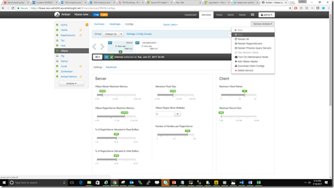
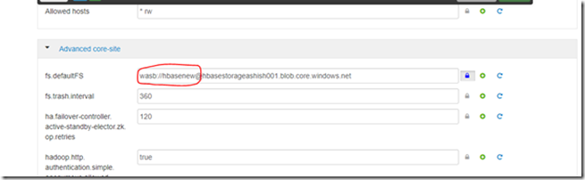
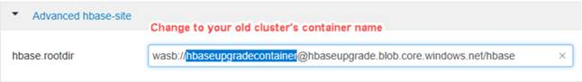
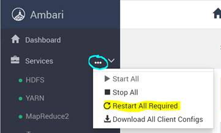

# Migrate Azure HDInsight 3.6 HBase workloads to HDInsight 4.0

This document shows you how to migrate Apache HBase workloads on HDInsight 3.6 to HDInsight 4.0. HDInsight 4.0 provides newer Hive and LLAP features such as materialized views and query result caching. When you migrate your workloads to HDInsight 4.0, you can use many newer features of Hive 3 that aren't available on HDInsight 3.6.

1. Make sure that your application works with the new version.

1. Create HDInsight Cluster on same storage but with different container name.

1. Flush your source HBase cluster, using [this script](https://raw.githubusercontent.com/Azure/hbase-utils/master/scripts/flush\_all\_tables.sh).

1. Stop the ingestion to HBase cluster.

1. Flush the cluster again with [the same script](https://raw.githubusercontent.com/Azure/hbase-utils/master/scripts/flush\_all\_tables.sh). This will ensure that any remaining data in memstore is flushed.

1. Stop HBase services from Ambari.

    

1. Go to new HDInsight cluster Ambari HDFS settings and change the container name to original container. > **Ambari** > **HDFS Advanced** > **Advanced core-site**.

    

1. If you are not using HBase clusters with the Enhanced Writes feature, skip this step. It\'s needed only for HBase clusters with Enhanced Writes feature. Change the `hbase.rootdir` path to point to the container of the original cluster.

    

1. Restart all required services by selecting **Services** > **Restart All Required**

    

1. Stop HBase.

1. SSH to Zookeeper node, and execute zkCli command `rmr /hbase-unsecure` to remove HBase root znode in Zookeeper.

1. Restart HBase.

1. Point your application to the new cluster.

1. Start the ingestion to see if everything is working well.

1. Delete the original cluster after you see everything is working well.

## Next steps