# Monitor HBase with Log Analytics

HDInsight HBase Monitoring uses Azure Log Analytics to collect HDInsight HBase performance metrics from your HDInsight cluster nodes. The Monitor provides HBase-specific visualizations and dashboards, tools to search the metrics, and the ability to create custom monitoring rules and alerts. You can monitor the metrics for multiple HDInsight HBase clusters across multiple Azure subscriptions.

Log Analytics is a service in [Azure](../../operations-management-suite/operations-management-suite-overview.md) that monitors your cloud and on-premises environments to maintain their availability and performance. Log Analytics collects data generated by resources in your cloud and on-premises environments, and from other monitoring tools, to provide analysis across multiple sources.

[Log Analytics Management solutions](../../log-analytics/log-analytics-add-solutions.md) add functionality to Log Analytics, providing additional data and analysis tools. Log Analytics management solutions are a collection of logic, visualization, and data acquisition rules that provide metrics for a particular area. A solution may also define new record types to be collected, and these records can be analyzed with Log Searches or with new user interface features.

[Insight & Analytics](https://azure.microsoft.com/pricing/details/insight-analytics/) is built on the Log Analytics platform. You can choose to use the Log Analytics capabilities and pay per GB ingested into the service, or switch your workspace to the Insight & Analytics tier and pay per node managed by the service. Insight & Analytics offers a superset of the capabilities offered by Log Analytics. The HBase Monitoring solution is available with either Log Analytics or Insight & Analytics.

When you provision an HDInsight HBase Monitoring solution, you create a Log Analytics workspace. Each workspace as a unique Log Analytics environment with its own data repository, data sources, and solutions. You may create multiple workspaces in your subscription to support multiple environments, such as production and test.

## Provision HDInsight HBase Monitoring

1. Sign in to the [Azure portal](https://portal.azure.com) using your Azure subscription.
2. In the **New** pane under **Marketplace**, select **Monitoring + management**.
3. In the **Monitoring + management** pane, select **See all**.

      

4. In the listing, look for the **Management Solutions** band. To the right of **Management Solutions**, select **More**.

    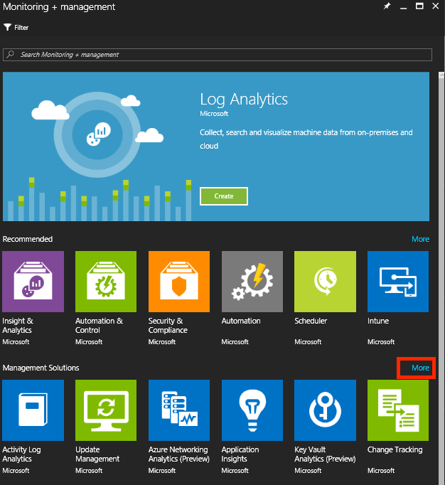 

5. In the **Management Solutions** pane, select the HDInsight HBase Monitoring management solution to add to a workspace.

    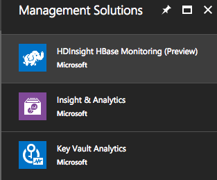  
6. In the management solution pane, review the information about the management solution, and then select **Create**. 
7. In the *management solution name* pane, select an existing workspace to associate with the management solution, or create a new Log Analytics workspace and then select it.
8. Change workspace settings for the Azure subscription, resource group, and location as appropriate. 
      
9. Select **Create**.  
10. To use this new management solution in its workspace, navigate to **Log Analytics** > ***workspace name*** > **Solutions**. An entry for your management solution is displayed in the list. Select the entry to navigate to the solution.

      

11. The pane for your HDInsight HBase monitoring solution appears.

    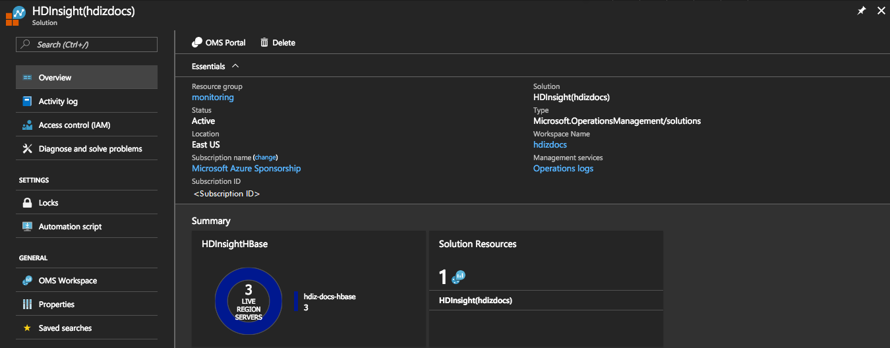 

12. The Summary tiles do not show any data because you have not yet configured your HDInsight HBase cluster to send data to Log Analytics.

## Connect HDInsight HBase cluster to Log Analytics

To use the tools provided by HDInsight HBase Monitoring, you need to configure your cluster so that it transmits the metrics from its region server, head nodes, and ZooKeeper nodes to Log Analytics. This configuration is done by running a Script Action against your HDInsight HBase cluster.

### Get Log Analytics Workspace ID and Workspace Key

You need your Log Analytics Workspace ID and Workspace Key to enable the nodes in your cluster to authenticate with Log Analytics. To get these values:

1. From your HBase Monitoring pane in the Azure portal, select Overview.

     

2. Select OMS Portal to launch the OMS Portal in a new browser tab or window.

    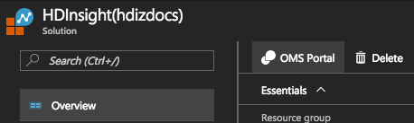 

3. On the OMS Portal Home, select Settings.

    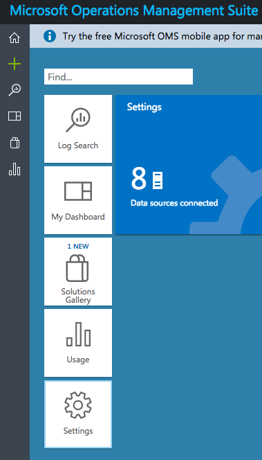 

4. Select Connected Source, Linux Servers.

    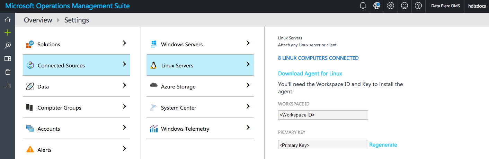 

5. Note the Workspace ID and Primary Key values displayed, as these are the values you need for the Script Action.

### Run the Script Action

To enable data collection from your HDInsight HBase cluster, run a Script Action against all the nodes in the cluster:

1. Navigate to the pane for your HDInsight HBase cluster in the Azure portal.
2. Select **Script actions**.

    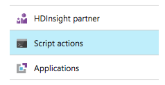 

3. Select **Submit new**.

    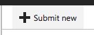  

4. In the **Submit script** action, set the Script type to `"- Custom"`.
5. Provide a name for this script.
6. For the **Bash script URI**, paste in the following URI:

        https://raw.githubusercontent.com/hdinsight/HDInsightOMS/master/monitoring/script2.sh 

7. For the **Node types**, select all three (**Head**, **Region**, **ZooKeeper**).
8. In the **Parameters** text box, enter your Workspace ID and your Workspace Key, enclosing each value in quotes and separated by a space.

        "<Workspace ID>" "<Workspace Key>"

9. Select **Persist this script action** to rerun the action when new nodes are added to the cluster.

    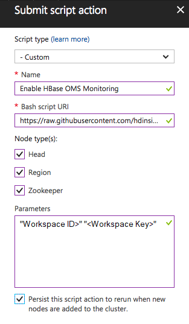  

10. Select **Create**.
11. The script action takes a few minutes to run. You can monitor its status from the Script Actions pane.

    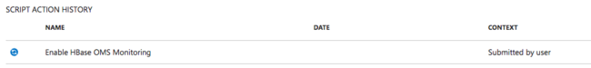  

12. When the Script Action completes, you should see a green checkmark next to the script name in the listing.

    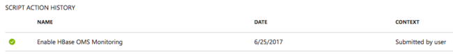  

## View the HDInsight HBase Monitoring solution

After the Script action completes, you should see data in the Monitoring solution within a few minutes.

1. Within the Azure portal, navigate to your HDInsight HBase solution's pane.
2. Select the **Overview** tab.
3. Under **Summary**, you see a tile indicating the number of Region Servers that are being monitored.

    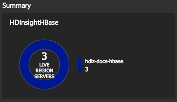  

4. Select the tile with the region server count. The main dashboard is displayed.
5. This dashboard provides access to statistics about the regions, the write-ahead log (WAL) count in use, a collection of Log Analytics searches (such as for region server Logs, Phoenix logs, and exceptions) and a collection of popular charts to visualize relevant metrics. 

    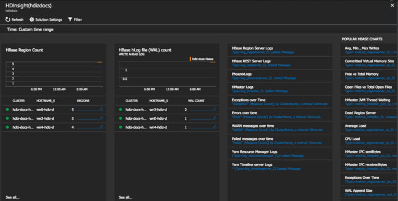  

6. Selecting any one of these will drill down into the Log Search view where you can refine the query and explore the data in more detail.

## Next steps

* [Creating alerts in Log Analytics](../../log-analytics/log-analytics-alerts-creating.md)
* [Find data with log searches in Azure Log Analytics](../../log-analytics/log-analytics-log-searches.md).
