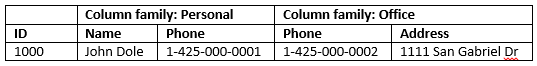
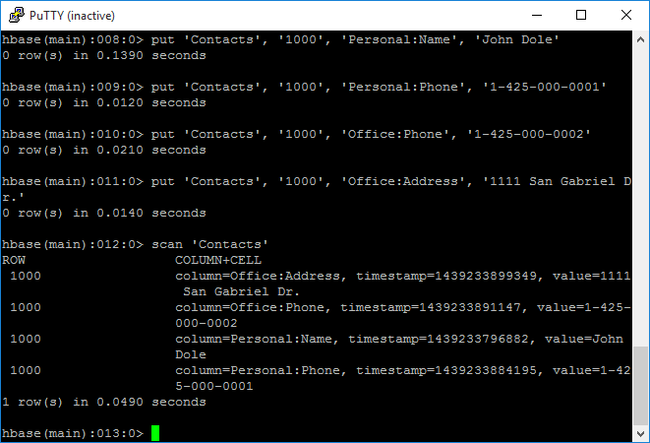

# Tutorial: Use Apache HBase in Azure HDInsight

This tutorial demonstrates how to create an Apache HBase cluster in Azure HDInsight, create HBase tables, and query tables by using Apache Hive.  For general HBase information, see [HDInsight HBase overview](./apache-hbase-overview.md).

In this tutorial, you learn how to:

> [!div class="checklist"]
> * Create Apache HBase cluster
> * Create HBase tables and insert data
> * Use Apache Hive to query Apache HBase
> * Use HBase REST APIs using Curl
> * Check cluster status

## Prerequisites

* An SSH client. For more information, see [Connect to HDInsight (Apache Hadoop) using SSH](../hdinsight-hadoop-linux-use-ssh-unix.md).

* Bash. The examples in this article use the Bash shell on Windows 10 for the curl commands. See [Windows Subsystem for Linux Installation Guide for Windows 10](https://docs.microsoft.com/windows/wsl/install-win10) for installation steps.  Other [Unix shells](https://www.gnu.org/software/bash/) will work as well.  The curl examples, with some slight modifications, can work on a Windows Command prompt.  Alternatively, you can use the Windows PowerShell cmdlet [Invoke-RestMethod](https://docs.microsoft.com/powershell/module/microsoft.powershell.utility/invoke-restmethod).

## Create Apache HBase cluster

The following procedure uses an Azure Resource Manager template to create an HBase cluster and the dependent default Azure Storage account. To understand the parameters used in the procedure and other cluster creation methods, see [Create Linux-based Hadoop clusters in HDInsight](../hdinsight-hadoop-provision-linux-clusters.md).

1. Select the following image to open the template in the Azure portal. The template is located in [Azure quickstart templates](https://azure.microsoft.com/resources/templates/).

    <a href="https://portal.azure.com/#create/Microsoft.Template/uri/https%3A%2F%2Fraw.githubusercontent.com%2FAzure%2Fazure-quickstart-templates%2Fmaster%2F101-hdinsight-hbase-linux%2Fazuredeploy.json" target="_blank"></a>

2. From the **Custom deployment** blade, enter the following values:

    |Property |Description |
    |---|---|
    |Subscription|Select your Azure subscription that is used to create the cluster.|
    |Resource group|Create an Azure Resource management group or use an existing one.|
    |Location|Specify the location of the resource group. |
    |ClusterName|Enter a name for the HBase cluster.|
    |Cluster login name and password|The default login name is **admin**.|
    |SSH username and password|The default username is **sshuser**.|

    Other parameters are optional.  

    Each cluster has an Azure Storage account dependency. After you delete a cluster, the data retains in the storage account. The cluster default storage account name is the cluster name with "store" appended. It is hardcoded in the template variables section.

3. Select **I agree to the terms and conditions stated above**, and then select **Purchase**. It takes about 20 minutes to create a cluster.

After an HBase cluster is deleted, you can create another HBase cluster by using the same default blob container. The new cluster picks up the HBase tables you created in the original cluster. To avoid inconsistencies, we recommend that you disable the HBase tables before you delete the cluster.

## Create tables and insert data

You can use SSH to connect to HBase clusters and then use [Apache HBase Shell](https://hbase.apache.org/0.94/book/shell.html) to create HBase tables, insert data, and query data.

For most people, data appears in the tabular format:


In HBase (an implementation of [Cloud BigTable](https://cloud.google.com/bigtable/)), the same data looks like:



**To use the HBase shell**

1. Use `ssh` command to connect to your HBase cluster. Edit the command below by replacing `CLUSTERNAME` with the name of your cluster, and then enter the command:

    ```cmd
    ssh sshuser@CLUSTERNAME-ssh.azurehdinsight.net
    ```

1. Use `hbase shell` command to start the HBase interactive shell. Enter the following command in your SSH connection:

    ```bash
    hbase shell
    ```

1. Use `create` command to create an HBase table with two-column families. The table and column names are case-sensitive. Enter the following command:

    ```hbaseshell
    create 'Contacts', 'Personal', 'Office'
    ```

1. Use `list` command to list all tables in HBase. Enter the following command:

    ```hbase
    list
    ```

1. Use `put` command to insert values at a specified column in a specified row in a particular table. Enter the following commands:

    ```hbaseshell
    put 'Contacts', '1000', 'Personal:Name', 'John Dole'
    put 'Contacts', '1000', 'Personal:Phone', '1-425-000-0001'
    put 'Contacts', '1000', 'Office:Phone', '1-425-000-0002'
    put 'Contacts', '1000', 'Office:Address', '1111 San Gabriel Dr.'
    ```

1. Use `scan` command to scan and return the `Contacts` table data. Enter the following command:

    ```hbase
    scan 'Contacts'
    ```

    

1. Use `get` command to fetch contents of a row. Enter the following command:

    ```hbaseshell
    get 'Contacts', '1000'
    ```

    You see similar results as using the `scan` command because there is only one row.

    For more information about the HBase table schema, see [Introduction to Apache HBase Schema Design](http://0b4af6cdc2f0c5998459-c0245c5c937c5dedcca3f1764ecc9b2f.r43.cf2.rackcdn.com/9353-login1210_khurana.pdf). For more HBase commands, see [Apache HBase reference guide](https://hbase.apache.org/book.html#quickstart).

1. Use `exit` command to stop the HBase interactive shell. Enter the following command:

    ```hbaseshell
    exit
    ```

**To bulk load data into the contacts HBase table**

HBase includes several methods of loading data into tables.  For more information, see [Bulk loading](https://hbase.apache.org/book.html#arch.bulk.load).

A sample data file can be found in a public blob container, `wasb://hbasecontacts\@hditutorialdata.blob.core.windows.net/contacts.txt`.  The content of the data file is:

    8396    Calvin Raji      230-555-0191    230-555-0191    5415 San Gabriel Dr.
    16600   Karen Wu         646-555-0113    230-555-0192    9265 La Paz
    4324    Karl Xie         508-555-0163    230-555-0193    4912 La Vuelta
    16891   Jonn Jackson     674-555-0110    230-555-0194    40 Ellis St.
    3273    Miguel Miller    397-555-0155    230-555-0195    6696 Anchor Drive
    3588    Osa Agbonile     592-555-0152    230-555-0196    1873 Lion Circle
    10272   Julia Lee        870-555-0110    230-555-0197    3148 Rose Street
    4868    Jose Hayes       599-555-0171    230-555-0198    793 Crawford Street
    4761    Caleb Alexander  670-555-0141    230-555-0199    4775 Kentucky Dr.
    16443   Terry Chander    998-555-0171    230-555-0200    771 Northridge Drive

You can optionally create a text file and upload the file to your own storage account. For the instructions, see [Upload data for Apache Hadoop jobs in HDInsight](../hdinsight-upload-data.md).

This procedure uses the `Contacts` HBase table you created in the last procedure.

1. From your open ssh connection, run the following command to transform the data file to StoreFiles and store at a relative path specified by `Dimporttsv.bulk.output`.

    ```bash
    hbase org.apache.hadoop.hbase.mapreduce.ImportTsv -Dimporttsv.columns="HBASE_ROW_KEY,Personal:Name,Personal:Phone,Office:Phone,Office:Address" -Dimporttsv.bulk.output="/example/data/storeDataFileOutput" Contacts wasb://hbasecontacts@hditutorialdata.blob.core.windows.net/contacts.txt
    ```

2. Run the following command to upload the data from `/example/data/storeDataFileOutput` to the HBase table:

    ```bash
    hbase org.apache.hadoop.hbase.mapreduce.LoadIncrementalHFiles /example/data/storeDataFileOutput Contacts
    ```

3. You can open the HBase shell, and use the `scan` command to list the table contents.

## Use Apache Hive to query Apache HBase

You can query data in HBase tables by using [Apache Hive](https://hive.apache.org/). In this section, you create a Hive table that maps to the HBase table and uses it to query the data in your HBase table.

1. From your open ssh connection, use the following command to start Beeline:

    ```bash
    beeline -u 'jdbc:hive2://localhost:10001/;transportMode=http' -n admin
    ```

    For more information about Beeline, see [Use Hive with Hadoop in HDInsight with Beeline](../hadoop/apache-hadoop-use-hive-beeline.md).

1. Run the following [HiveQL](https://cwiki.apache.org/confluence/display/Hive/LanguageManual) script  to create a Hive table that maps to the HBase table. Make sure that you have created the sample table referenced earlier in this article by using the HBase shell before you run this statement.

    ```hiveql
    CREATE EXTERNAL TABLE hbasecontacts(rowkey STRING, name STRING, homephone STRING, officephone STRING, officeaddress STRING)
    STORED BY 'org.apache.hadoop.hive.hbase.HBaseStorageHandler'
    WITH SERDEPROPERTIES ('hbase.columns.mapping' = ':key,Personal:Name,Personal:Phone,Office:Phone,Office:Address')
    TBLPROPERTIES ('hbase.table.name' = 'Contacts');
    ```

1. Run the following HiveQL script to query the data in the HBase table:

    ```hiveql
    SELECT count(rowkey) AS rk_count FROM hbasecontacts;
    ```

1. To exit Beeline, use `!exit`.

1. To exit your ssh connection, use `exit`.

## Use HBase REST APIs using Curl

The REST API is secured via [basic authentication](https://en.wikipedia.org/wiki/Basic_access_authentication). You shall always make requests by using Secure HTTP (HTTPS) to help ensure that your credentials are securely sent to the server.

1. Initiate environment variable for ease of use. Edit the commands below by replacing `MYPASSWORD` with the cluster login password. Replace `MYCLUSTERNAME` with the name of your HBase cluster. Then enter the commands.

    ```bash
    export password='MYPASSWORD'
    export clustername=MYCLUSTERNAME
    ```

1. Use the following command to list the existing HBase tables:

    ```bash
    curl -u admin:$password \
    -G https://$clustername.azurehdinsight.net/hbaserest/
    ```

1. Use the following command to create a new HBase table with two-column families:

    ```bash
    curl -u admin:$password \
    -X PUT "https://$clustername.azurehdinsight.net/hbaserest/Contacts1/schema" \
    -H "Accept: application/json" \
    -H "Content-Type: application/json" \
    -d "{\"@name\":\"Contact1\",\"ColumnSchema\":[{\"name\":\"Personal\"},{\"name\":\"Office\"}]}" \
    -v
    ```

    The schema is provided in the JSon format.
1. Use the following command to insert some data:

    ```bash
    curl -u admin:$password \
    -X PUT "https://$clustername.azurehdinsight.net/hbaserest/Contacts1/false-row-key" \
    -H "Accept: application/json" \
    -H "Content-Type: application/json" \
    -d "{\"Row\":[{\"key\":\"MTAwMA==\",\"Cell\": [{\"column\":\"UGVyc29uYWw6TmFtZQ==\", \"$\":\"Sm9obiBEb2xl\"}]}]}" \
    -v
    ```

    You must base64 encode the values specified in the -d switch. In the example:

   * MTAwMA==: 1000
   * UGVyc29uYWw6TmFtZQ==: Personal:Name
   * Sm9obiBEb2xl: John Dole

     [false-row-key](https://hbase.apache.org/apidocs/org/apache/hadoop/hbase/rest/package-summary.html#operation_cell_store_single) allows you to insert multiple (batched) values.

1. Use the following command to get a row:

    ```bash
    curl -u admin:$password \
    GET "https://$clustername.azurehdinsight.net/hbaserest/Contacts1/1000" \
    -H "Accept: application/json" \
    -v
    ```

For more information about HBase Rest, see [Apache HBase Reference Guide](https://hbase.apache.org/book.html#_rest).

> [!NOTE]  
> Thrift is not supported by HBase in HDInsight.
>
> When using Curl or any other REST communication with WebHCat, you must authenticate the requests by providing the user name and password for the HDInsight cluster administrator. You must also use the cluster name as part of the Uniform Resource Identifier (URI) used to send the requests to the server:
> 
>   
>        curl -u <UserName>:<Password> \
>        -G https://<ClusterName>.azurehdinsight.net/templeton/v1/status
>   
>    You should receive a response similar to the following response:
>   
>        {"status":"ok","version":"v1"}

## Check cluster status

HBase in HDInsight ships with a Web UI for monitoring clusters. Using the Web UI, you can request statistics or information about regions.

**To access the HBase Master UI**

1. Sign into the Ambari Web UI at `https://CLUSTERNAME.azurehdinsight.net` where `CLUSTERNAME` is the name of your HBase cluster.

1. Select **HBase** from the left menu.

1. Select **Quick links** on the top of the page, point to the active Zookeeper node link, and then select **HBase Master UI**.  The UI is opened in another browser tab:

   

   The HBase Master UI contains the following sections:

   - region servers
   - backup masters
   - tables
   - tasks
   - software attributes

## Clean up resources

To avoid inconsistencies, we recommend that you disable the HBase tables before you delete the cluster. You can use the HBase command `disable 'Contacts'`. If you're not going to continue to use this application, delete the HBase cluster that you created with the following steps:

1. Sign in to the [Azure portal](https://portal.azure.com/).
1. In the **Search** box at the top, type **HDInsight**.
1. Select **HDInsight clusters** under **Services**.
1. In the list of HDInsight clusters that appears, click the **...** next to the cluster that you created for this tutorial.
1. Click **Delete**. Click **Yes**.

## Next steps

In this tutorial, you learned how to create an Apache HBase cluster and how to create tables and view the data in those tables from the HBase shell. You also learned how to use a Hive query on data in HBase tables and how to use the HBase C# REST APIs to create an HBase table and retrieve data from the table. To learn more, see:

> [!div class="nextstepaction"]
> [HDInsight HBase overview](./apache-hbase-overview.md)