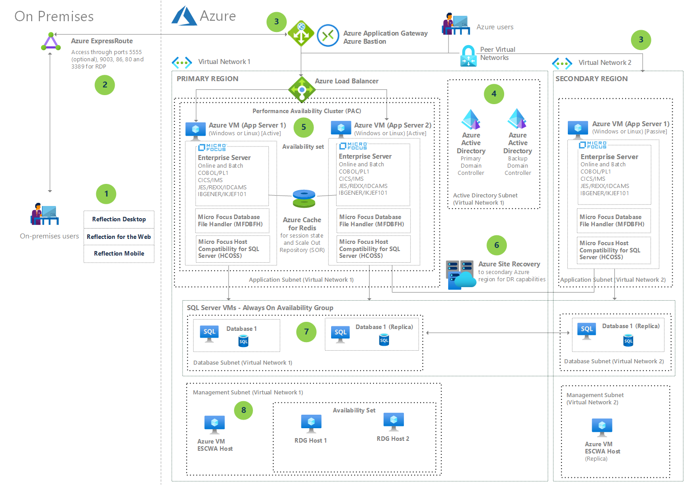

Micro Focus Enterprise Server 6.0 is an application deployment environment for IBM z/OS mainframe applications. Enterprise Server can help you modernize and integrate your mainframe applications with technologies like .NET and Java. Enterprise Server also supports application flexibility across Linux and Windows with containerized or virtual machine (VM) deployments on Azure.

This sample solution is a prescriptive, well-architected example of a Micro Focus Enterprise Server 6.0 VM-based deployment in Azure. The solution implements high availability (HA) and disaster recovery (DR) by using a secondary Azure failover region. The failover region uses Azure Site Recovery for the VMs in the application tier, and a SQL Server Always On configuration for the data tier. A Micro Focus Performance Availability Cluster (PAC) boosts VM performance, availability, and scalability.

<!--For a similar scenario that uses Azure Kubernetes Service (AKS) for containerized applications, see .-->

## Potential use cases

Deploying Enterprise Server on Azure VMs can help businesses:

- Provide a secure, stable host environment for cloud or on-premises access to mission-critical APIs.

- Lower operating and maintenance costs by supporting Linux and Windows platforms, containerized and VM-based deployments, and scale-out flexibility.

- Ensure Always On high availability and regional disaster recovery.

- Modernize applications to improve productivity and collaboration and respond to changing business needs.

- Streamline software deployment with a low-cost distributed environment, boosting developer productivity and paving the way to DevOps.

## Architecture

1. Enterprise Server on-premises users interact with Enterprise Server applications through Micro Focus Reflection Desktop terminal emulator, Reflection for the Web, and Reflection Mobile. IBM 3270 terminal access can use any 3270 emulator.
   
   Reflection Desktop is a secure, manageable, and easy to use Windows-based terminal emulator that connects users to IBM, UNIX, Linux, OpenVMS, HP 3000, and HP NonStop systems. Reflection for the Web provides Reflection features and functionality through a web interface, and Reflection Mobile provides Reflection features and functionality through a mobile interface.
   
1. On-premises users access the system over Azure ExpressRoute. Web-based users use ports 5555 (optional), 9003, 86, and 80. Remote desktop protocol (RDP) access uses port 3389. Port 3270 is open for 3270-based terminals and terminal emulators. For access to the Enterprise Server Common Web Administration (ESCWA) administration tool, 3270 traffic can use any appropriately configured port.
   
1. A secure implementation of Enterprise Server requires a web services front-end and load balancer. This solution uses:
   
   - Azure Application Gateway, for complex instruction set computer (CICS) API access from the web
   - Azure Bastion, for secure access to VM management
   - Azure Load Balancer, to distribute incoming traffic among backend servers
   
   The secondary DR Azure region also needs a web services front end to maintain secure access to the system.
   
1. The solution requires an Azure Active Directory (Azure AD) implementation. Micro Focus Enterprise Server provides RACF and Top Secret identity integration using Azure AD extensions.
   
1. A Performance and Availability Cluster (PAC) configures Enterprise Server instances in a scale-out architecture using VM [availability sets](/azure/virtual-machines/availability#availability-sets). In a PAC, several Enterprise Server instances work together as a single logical entity. A PAC has several advantages over a single scale-up Enterprise Server instance:
   
   - Distributed instances are more resistant to hardware or network issues.
   - Several instances working together perform better, maximize throughput, and provide for future horizontal scaling.
   - The instances share synchronized user and system data, using a data store called a Scale-Out Repository (SOR). The data store uses Azure Cache for Redis to improve performance and scalability.
   
1. For HA, Azure Site Recovery replicates a Production VM and keeps it synced in the failover region. Since the two VMs in the Production region are clones, only one needs to participate in Site Recovery.
   
1. Micro Focus Enterprise Server uses infrastructure-as-a-service (IaaS) SQL Server for deployments with heterogeneous distributed transactions. This solution uses a SQL Server IaaS database in an Always On cluster. With SQL Server Always On, the DR instance of the database is always online in passive, read-only mode. When failover occurs, the DR database instance becomes active.
   
1. As a security best practice, the solution deploys Enterprise Server management tools into a separate virtual network subnet.

## Components

This solution uses the following Azure components:

- [Azure ExpressRoute](/azure/expressroute/expressroute-introduction) extends on-premises networks into the Azure cloud over a private connection that a connectivity provider facilitates.

- [Azure Application Gateway](https://azure.microsoft.com/services/application-gateway/) is a scalable and highly available web front end that acts as a reverse-proxy service and provides a Layer-7 internet load balancer and Web Application Firewall (WAF).

- [Azure Bastion](https://azure.microsoft.com/services/azure-bastion/) provides secure and seamless RDP and SSH access to your VMs by using SSL, without exposing public IP addresses.

- [Azure Load Balancer](/azure/load-balancer/load-balancer-overview) distributes incoming network traffic across backend resources or servers according to configured load-balancing rules and health probes.

- [Azure Virtual Machines](https://azure.microsoft.com/services/virtual-machines/) offers on-demand, scalable computing resources in Azure. Azure Virtual Machines gives you the flexibility of virtualization without having to buy and maintain the physical hardware that runs it.
  
  The Azure VMs that host Enterprise Server use [Azure Managed Disks](/azure/virtual-machines/windows/managed-disks-overview) block-level storage volumes. Available Managed Disk types are Ultra disks, Premium solid-state drives (SSDs), standard SSDs, and standard hard disk drives (HDDs). This solution uses Premium SSDs or Ultra disks.

- [Azure Virtual Network](/azure/virtual-network/virtual-networks-overview) is the fundamental building block for private networks in Azure. An Azure Virtual Network is similar to a traditional network that you operate in your own datacenter, but adds Azure infrastructure benefits like scaling, availability, and isolation. Virtual Network lets Azure resources like VMs securely communicate with each other, the internet, and on-premises networks.
  
  A [virtual network interface card (NIC)](/azure/virtual-network/virtual-network-network-interface) lets an Azure VM communicate with internet, Azure, and on-premises resources over a virtual network. You can add NICs to an Azure VM to give child VMs their own dedicated network interface devices and IP addresses.

- [Azure Cache for Redis](/azure/azure-cache-for-redis/cache-overview) improves performance and scalability for applications that use backend data stores heavily. Azure Cache for Redis keeps frequently accessed data, like session state and SOR, in server memory for fast access and throughput.

- [SQL Server on Azure VMs](/azure/azure-sql/virtual-machines/windows/sql-server-on-azure-vm-iaas-what-is-overview) lets you use full versions of SQL Server in the cloud without having to manage on-premises hardware. Enterprise Server requires the [SQL Server IaaS Agent extension](/azure/azure-sql/virtual-machines/windows/sql-server-iaas-agent-extension-automate-management) for deployments that have heterogeneous distributed transactions.

- [Azure Site Recovery](/azure/site-recovery/site-recovery-overview) keeps applications and workloads running during outages by replicating VMs from a primary site to a secondary location.

## Considerations

The following considerations, based on the [Microsoft Azure Well-Architected Framework](../../framework/index.md), apply to this solution:

### Availability considerations

- PACs and availability sets for Azure VMs ensure enough VMs are available to meet mission-critical batch process needs.

- SQL Server Always On Availability Groups and Azure Site Recovery provide reliability with HA and DR across geographic regions.

### Performance considerations

- The PAC enables horizontal scaling according to application load.

- Azure Cache for Redis and Azure Storage accounts maintain critical component operations. These features provide high performance for data reads and writes, hot storage access, and long-term data storage.

### Scalability considerations

A PAC configures several Enterprise Server instances in a scale-out architecture using [availability sets](/azure/virtual-machines/availability#availability-sets). The PAC supports future horizontal scaling.

### Security considerations

All the components within the Micro Focus Enterprise Server architecture work with Azure security components like Azure AD identity integration, virtual networks, and encryption as needed.

## Pricing

To estimate and calculate costs for your implementation of this solution, use the [Azure pricing calculator](https://azure.microsoft.com/pricing/calculator/).

- Azure services like Application Gateway, Virtual Network, Load Balancer, and Azure Bastion are free with your Azure subscription. You pay for usage and traffic.
- Azure Site Recovery charges per protected instance.
- Most enterprises already have a Microsoft Active Directory implementation, but if you don't, Premium Azure AD is low cost.
- For Premium SSD or Ultra managed storage disks pricing, see [Managed Disks pricing](https://azure.microsoft.com/pricing/details/managed-disks/). Calculate VM needs based on your traffic hours, load, and storage requirements. Micro Focus Enterprise Server in Azure helps you optimize costs by turning off VMs when not in use, and scripting a schedule for known usage patterns.
- [Azure Hybrid Benefit](https://azure.microsoft.com/pricing/hybrid-benefit/) lets you use your on-premises SQL Server licenses on Azure. For more information, see the [Azure Hybrid Benefit FAQ](https://azure.microsoft.com/pricing/hybrid-benefit/faq).

## Next steps

- [Refactor IBM z/OS mainframe Coupling Facility (CF) to Azure](../../reference-architectures/zos/refactor-zos-coupling-facility.yml).
- [Replicate and sync mainframe data in Azure](../../reference-architectures/migration/sync-mainframe-data-with-azure.yml).
- See the [Microsoft Azure Well-Architected Framework](../../framework/index.md) for more information about cost optimization for [VM instances](../../framework/cost/optimize-vm.md).
- For more information, please contact <legacy2azure@microsoft.com>.

## Related resources

- [Windows n-tier application with SQL Server on Azure](../../reference-architectures/n-tier/n-tier-sql-server.yml)
- [Multi-region n-tier application](../../reference-architectures/n-tier/multi-region-sql-server.yml)
- [Multi-tier web application built for HA/DR](../infrastructure/multi-tier-app-disaster-recovery.yml)